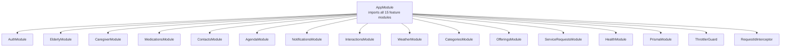
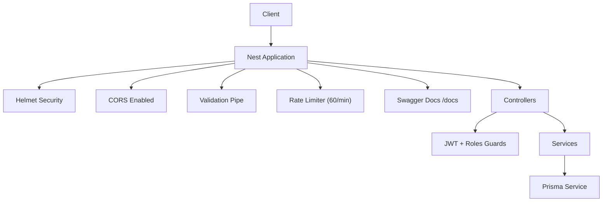
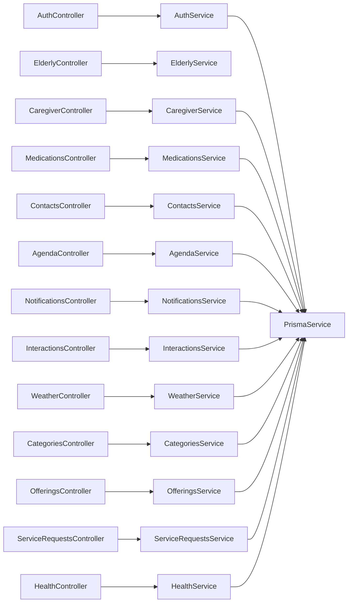

# API Reference

<cite>
**Referenced Files in This Document**
- [main.ts](file://src/main.ts)
- [app.module.ts](file://src/app.module.ts)
- [auth.controller.ts](file://src/auth/auth.controller.ts)
- [auth.service.ts](file://src/auth/auth.service.ts)
- [jwt-auth.guard.ts](file://src/auth/jwt-auth.guard.ts)
- [signup.dto.ts](file://src/auth/dto/signup.dto.ts)
- [login.dto.ts](file://src/auth/dto/login.dto.ts)
- [elderly.controller.ts](file://src/elderly/elderly.controller.ts)
- [update-profile.dto.ts](file://src/elderly/dto/update-profile.dto.ts)
- [medications.controller.ts](file://src/medications/medications.controller.ts)
- [create-medication.dto.ts](file://src/medications/dto/create-medication.dto.ts)
- [contacts.controller.ts](file://src/contacts/contacts.controller.ts)
- [create-contact.dto.ts](file://src/contacts/dto/create-contact.dto.ts)
- [agenda.controller.ts](file://src/agenda/agenda.controller.ts)
- [create-agenda.dto.ts](file://src/agenda/dto/create-agenda.dto.ts)
- [notifications.controller.ts](file://src/notifications/notifications.controller.ts)
- [register-token.dto.ts](file://src/notifications/dto/register-token.dto.ts)
- [interactions.controller.ts](file://src/interactions/interactions.controller.ts)
- [log-interaction.dto.ts](file://src/interactions/dto/log-interaction.dto.ts)
- [weather.controller.ts](file://src/weather/weather.controller.ts)
- [categories.controller.ts](file://src/categories/categories.controller.ts)
- [caregiver.controller.ts](file://src/caregiver/caregiver.controller.ts)
- [link.dto.ts](file://src/caregiver/dto/link.dto.ts)
- [offerings.controller.ts](file://src/offerings/offerings.controller.ts)
- [create-offering.dto.ts](file://src/offerings/dto/create-offering.dto.ts)
- [offering-response.dto.ts](file://src/offerings/dto/offering-response.dto.ts)
- [offering-contact-response.dto.ts](file://src/offerings/dto/offering-contact-response.dto.ts)
- [service-requests.controller.ts](file://src/service-requests/service-requests.controller.ts)
- [create-service-request.dto.ts](file://src/service-requests/dto/create-service-request.dto.ts)
- [health.controller.ts](file://src/health/health.controller.ts)
</cite>

## Update Summary
**Changes Made**
- Added comprehensive documentation for 15 modules as requested
- Expanded authentication section with user management endpoints
- Added Caregiver Management module with linking and elderly user management
- Added Marketplace module with Offerings and Categories management
- Added Service Requests module for marketplace interactions
- Added Health Monitoring module with database health checks
- Updated architecture overview to reflect complete 15-module structure
- Enhanced pagination and filtering documentation across all modules
- Added rate limiting and security considerations

## Table of Contents
1. [Introduction](#introduction)
2. [Project Structure](#project-structure)
3. [Core Components](#core-components)
4. [Architecture Overview](#architecture-overview)
5. [Detailed Component Analysis](#detailed-component-analysis)
6. [Dependency Analysis](#dependency-analysis)
7. [Performance Considerations](#performance-considerations)
8. [Troubleshooting Guide](#troubleshooting-guide)
9. [Conclusion](#conclusion)
10. [Appendices](#appendices)

## Introduction
This document provides a comprehensive API reference for the 99-Pai backend, covering all 15 modules with HTTP methods, URL patterns, request/response schemas, authentication requirements, and validation rules. The API is organized by functional areas: Authentication, Elderly Care, Caregiver Management, Marketplace, Service Requests, and Health Monitoring. The backend is built with NestJS, uses Swagger/OpenAPI for documentation, and enforces global validation, CORS, rate limiting, and security middleware.

Key runtime and configuration highlights:
- Global base path: api
- Swagger UI: /docs
- Versioning: 1.0
- CORS enabled with credentials support
- Global validation pipe enabled
- Rate limiting: 60 requests per minute per IP
- Security: Helmet protection, JWT authentication, role-based authorization

**Section sources**
- [main.ts:1-52](file://src/main.ts#L1-L52)

## Project Structure
The application is modularized by feature into 15 distinct modules. Each module exposes controllers that define endpoints grouped by domain. The main application wires all feature modules with global guards and interceptors.

**Diagram sources**
- [app.module.ts:21-45](file://src/app.module.ts#L21-L45)

**Section sources**
- [app.module.ts:1-46](file://src/app.module.ts#L1-L46)

## Core Components
- Global prefix: api
- CORS: enabled with origin true and credentials true
- Validation: global ValidationPipe with transform, whitelist, forbidNonWhitelisted
- OpenAPI/Swagger: configured with bearer auth and version 1.0
- Rate Limiting: ThrottlerGuard with 60 requests per 60 seconds
- Security: Helmet protection, request ID tracking
- Health Checks: Database connectivity verification

**Section sources**
- [main.ts:11-30](file://src/main.ts#L11-L30)
- [app.module.ts:40-43](file://src/app.module.ts#L40-L43)

## Architecture Overview
High-level flow:
- Bootstrap initializes the app with global prefix, CORS, validation, and security middleware
- Swagger documentation is generated for development environments
- Controllers expose endpoints under /api/<module>/<route>
- Services encapsulate business logic and interact with Prisma
- Guards enforce authentication, role-based access, and rate limiting
- Interceptors add request ID tracking for debugging

**Diagram sources**
- [main.ts:7-30](file://src/main.ts#L7-L30)
- [app.module.ts:40-43](file://src/app.module.ts#L40-L43)

## Detailed Component Analysis

### Authentication
Endpoints
- POST /api/auth/signup
  - Description: Register a new user
  - Auth: None
  - Request body: [SignupDto:12-52](file://src/auth/dto/signup.dto.ts#L12-L52)
  - Responses:
    - 201 Created: User registered and JWT token issued
    - 409 Conflict: Email already registered
- POST /api/auth/login
  - Description: Login user
  - Auth: None
  - Request body: [LoginDto:4-12](file://src/auth/dto/login.dto.ts#L4-L12)
  - Responses:
    - 200 OK: Token and user info returned
    - 401 Unauthorized: Invalid credentials
- GET /api/auth/me
  - Description: Get current user info
  - Auth: Bearer JWT
  - Guards: JwtAuthGuard
  - Responses:
    - 200 OK: User info including onboarding flag
    - 401 Unauthorized: Not authenticated

Request/response schemas
- SignupDto
  - email: string, required, email format
  - password: string, required, min length 6
  - name: string, required
  - role: enum ['elderly','caregiver','provider','admin'], required
  - cellphone: string, optional
  - nickname: string, optional
  - document: string, optional
  - birthday: date-time string, optional
- LoginDto
  - email: string, required, email format
  - password: string, required

Example requests
- curl -X POST http://localhost:3000/api/auth/signup -H "Content-Type: application/json" -d '{"email":"john@example.com","password":"password123","name":"John Doe","role":"elderly"}'
- curl -X POST http://localhost:3000/api/auth/login -H "Content-Type: application/json" -d '{"email":"john@example.com","password":"password123"}'

Example response
- {
  "token": "eyJhbGciOiJIUzI1NiIs...",
  "user": {
    "id": "uuid",
    "email": "john@example.com",
    "name": "John Doe",
    "role": "elderly"
  }
}

Common failures
- 409 Conflict on duplicate email during signup
- 401 Unauthorized on invalid login credentials

**Section sources**
- [auth.controller.ts:19-42](file://src/auth/auth.controller.ts#L19-L42)
- [auth.service.ts:23-100](file://src/auth/auth.service.ts#L23-L100)

### Elderly Profile
Endpoints
- GET /api/elderly/profile
  - Description: Get elderly user profile
  - Auth: Bearer JWT
  - Roles: elderly
  - Guards: JwtAuthGuard, RolesGuard
  - Responses: 200 OK with profile data
- PATCH /api/elderly/profile
  - Description: Update elderly user profile
  - Auth: Bearer JWT
  - Roles: elderly
  - Guards: JwtAuthGuard, RolesGuard
  - Request body: [UpdateElderlyProfileDto:12-43](file://src/elderly/dto/update-profile.dto.ts#L12-L43)
  - Responses: 200 OK with updated profile

Request/response schemas
- UpdateElderlyProfileDto
  - preferredName: string, optional
  - autonomyScore: integer, optional, min 0, max 100
  - interactionTimes: string[], optional, each string time value
  - location: string, optional
  - onboardingComplete: boolean, optional

Example request
- curl -X PATCH http://localhost:3000/api/elderly/profile -H "Authorization: Bearer <token>" -H "Content-Type: application/json" -d '{"preferredName":"Maria","autonomyScore":75,"onboardingComplete":true}'

Common failures
- 401 Unauthorized if not authenticated or missing role elderly
- Validation errors for out-of-range autonomyScore or invalid time formats

**Section sources**
- [elderly.controller.ts:23-40](file://src/elderly/elderly.controller.ts#L23-L40)
- [update-profile.dto.ts:12-43](file://src/elderly/dto/update-profile.dto.ts#L12-L43)

### Caregiver Management
Endpoints
- POST /api/caregiver/link
  - Description: Link caregiver to elderly user using link code
  - Auth: Bearer JWT
  - Roles: caregiver
  - Guards: JwtAuthGuard, RolesGuard
  - Request body: [LinkDto](file://src/caregiver/dto/link.dto.ts)
  - Responses: 201 Created with success message
- GET /api/caregiver/elderly
  - Description: Get all elderly users linked to caregiver
  - Auth: Bearer JWT
  - Roles: caregiver
  - Guards: JwtAuthGuard, RolesGuard
  - Responses: 200 OK with list of elderly users
- GET /api/caregiver/elderly/{elderlyProfileId}
  - Description: Get detailed info about a linked elderly user
  - Auth: Bearer JWT
  - Roles: caregiver
  - Guards: JwtAuthGuard, RolesGuard
  - Path params: elderlyProfileId (string)
  - Responses: 200 OK with elderly user details

Request/response schemas
- LinkDto
  - linkCode: string, required, format: XXX-XXX-XXX

Example request
- curl -X POST http://localhost:3000/api/caregiver/link -H "Authorization: Bearer <token>" -H "Content-Type: application/json" -d '{"linkCode":"ABC-123-XYZ"}'

Common failures
- 401 Unauthorized for missing/invalid token
- 403 Forbidden for non-caregiver users
- 404 Not Found for invalid link codes or elderly profiles

**Section sources**
- [caregiver.controller.ts:23-51](file://src/caregiver/caregiver.controller.ts#L23-L51)

### Medications
Endpoints
- GET /api/elderly/{elderlyProfileId}/medications
  - Description: Get all medications for an elderly user
  - Auth: Bearer JWT
  - Roles: caregiver, provider, admin
  - Path params: elderlyProfileId (string)
  - Responses: 200 OK with list
- POST /api/elderly/{elderlyProfileId}/medications
  - Description: Create a new medication (caregiver/provider/admin)
  - Auth: Bearer JWT
  - Roles: caregiver, provider, admin
  - Path params: elderlyProfileId (string)
  - Request body: [CreateMedicationDto:4-16](file://src/medications/dto/create-medication.dto.ts#L4-L16)
  - Responses: 201 Created
- PATCH /api/elderly/{elderlyProfileId}/medications/{id}
  - Description: Update a medication
  - Auth: Bearer JWT
  - Roles: caregiver, provider, admin
  - Path params: elderlyProfileId (string), id (string)
  - Request body: [UpdateMedicationDto](file://src/medications/dto/update-medication.dto.ts)
  - Responses: 200 OK
- DELETE /api/elderly/{elderlyProfileId}/medications/{id}
  - Description: Delete a medication
  - Auth: Bearer JWT
  - Roles: caregiver, provider, admin
  - Path params: elderlyProfileId (string), id (string)
  - Responses: 200 OK
- GET /api/medications/today
  - Description: Get today's medications for elderly user
  - Auth: Bearer JWT
  - Roles: elderly
  - Responses: 200 OK with today's meds
- POST /api/medications/{id}/confirm
  - Description: Confirm or mark medication as missed
  - Auth: Bearer JWT
  - Roles: elderly
  - Path params: id (string)
  - Request body: [ConfirmMedicationDto](file://src/medications/dto/confirm-medication.dto.ts)
  - Responses: 201 Created
- GET /api/elderly/{elderlyProfileId}/medication-history
  - Description: Get medication history for an elderly user
  - Auth: Bearer JWT
  - Roles: caregiver, provider, admin
  - Path params: elderlyProfileId (string)
  - Query params: from (string, optional), to (string, optional), page (number, optional), limit (number, optional)
  - Responses: 200 OK with paginated history

Request/response schemas
- CreateMedicationDto
  - name: string, required
  - time: string, required (time format)
  - dosage: string, required

Pagination and filtering
- Page defaults to 1, limit defaults to 50 when not provided

Example request
- curl -X POST http://localhost:3000/api/elderly/{elderlyProfileId}/medications -H "Authorization: Bearer <token>" -H "Content-Type: application/json" -d '{"name":"Losartana","time":"08:00","dosage":"50mg"}'

Common failures
- 401 Unauthorized for missing/invalid token
- 403 Forbidden for insufficient roles
- Validation errors for malformed time or missing required fields

**Section sources**
- [medications.controller.ts:36-143](file://src/medications/medications.controller.ts#L36-L143)
- [create-medication.dto.ts:4-16](file://src/medications/dto/create-medication.dto.ts#L4-L16)

### Contacts
Endpoints
- GET /api/elderly/{elderlyProfileId}/contacts
  - Description: Get all contacts for an elderly user
  - Auth: Bearer JWT
  - Roles: caregiver, provider, admin
  - Path params: elderlyProfileId (string)
  - Responses: 200 OK with list
- POST /api/elderly/{elderlyProfileId}/contacts
  - Description: Create a new contact (caregiver/provider/admin)
  - Auth: Bearer JWT
  - Roles: caregiver, provider, admin
  - Path params: elderlyProfileId (string)
  - Request body: [CreateContactDto:4-18](file://src/contacts/dto/create-contact.dto.ts#L4-L18)
  - Responses: 201 Created
- PATCH /api/elderly/{elderlyProfileId}/contacts/{id}
  - Description: Update a contact
  - Auth: Bearer JWT
  - Roles: caregiver, provider, admin
  - Path params: elderlyProfileId (string), id (string)
  - Request body: [UpdateContactDto](file://src/contacts/dto/update-contact.dto.ts)
  - Responses: 200 OK
- DELETE /api/elderly/{elderlyProfileId}/contacts/{id}
  - Description: Delete a contact
  - Auth: Bearer JWT
  - Roles: caregiver, provider, admin
  - Path params: elderlyProfileId (string), id (string)
  - Responses: 200 OK
- GET /api/contacts
  - Description: Get contacts for elderly user with overdue status
  - Auth: Bearer JWT
  - Roles: elderly
  - Responses: 200 OK with status info
- POST /api/contacts/{id}/called
  - Description: Mark that elderly user called this contact
  - Auth: Bearer JWT
  - Roles: elderly
  - Path params: id (string)
  - Responses: 201 Created
- GET /api/elderly/{elderlyProfileId}/call-history
  - Description: Get call history for an elderly user
  - Auth: Bearer JWT
  - Roles: caregiver, provider, admin
  - Path params: elderlyProfileId (string)
  - Query params: page (number, optional), limit (number, optional)
  - Responses: 200 OK with paginated history

Request/response schemas
- CreateContactDto
  - name: string, required
  - phone: string, required
  - thresholdDays: integer, optional, min 1

Pagination and filtering
- Page defaults to 1, limit defaults to 50 when not provided

Example request
- curl -X POST http://localhost:3000/api/elderly/{elderlyProfileId}/contacts -H "Authorization: Bearer <token>" -H "Content-Type: application/json" -d '{"name":"Maria Silva","phone":"+5511999999999","thresholdDays":7}'

Common failures
- 401 Unauthorized for missing/invalid token
- 403 Forbidden for insufficient roles
- Validation errors for phone format or thresholdDays < 1

**Section sources**
- [contacts.controller.ts:35-127](file://src/contacts/contacts.controller.ts#L35-L127)
- [create-contact.dto.ts:4-18](file://src/contacts/dto/create-contact.dto.ts#L4-L18)

### Agenda
Endpoints
- GET /api/elderly/{elderlyProfileId}/agenda
  - Description: Get agenda for an elderly user
  - Auth: Bearer JWT
  - Roles: caregiver, provider, admin
  - Path params: elderlyProfileId (string)
  - Query params: from (string, optional), to (string, optional)
  - Responses: 200 OK with list
- POST /api/elderly/{elderlyProfileId}/agenda
  - Description: Create a new agenda event (caregiver/provider/admin)
  - Auth: Bearer JWT
  - Roles: caregiver, provider, admin
  - Path params: elderlyProfileId (string)
  - Request body: [CreateAgendaDto:4-17](file://src/agenda/dto/create-agenda.dto.ts#L4-L17)
  - Responses: 201 Created
- PATCH /api/elderly/{elderlyProfileId}/agenda/{id}
  - Description: Update an agenda event
  - Auth: Bearer JWT
  - Roles: caregiver, provider, admin
  - Path params: elderlyProfileId (string), id (string)
  - Request body: [UpdateAgendaDto](file://src/agenda/dto/update-agenda.dto.ts)
  - Responses: 200 OK
- DELETE /api/elderly/{elderlyProfileId}/agenda/{id}
  - Description: Delete an agenda event
  - Auth: Bearer JWT
  - Roles: caregiver, provider, admin
  - Path params: elderlyProfileId (string), id (string)
  - Responses: 200 OK
- GET /api/agenda/today
  - Description: Get today's agenda for elderly user
  - Auth: Bearer JWT
  - Roles: elderly
  - Responses: 200 OK with today's events

Request/response schemas
- CreateAgendaDto
  - description: string, required
  - dateTime: string, required (date-time)
  - reminder: boolean, optional

Filtering
- from/to filters supported via query params

Example request
- curl -X POST http://localhost:3000/api/elderly/{elderlyProfileId}/agenda -H "Authorization: Bearer <token>" -H "Content-Type: application/json" -d '{"description":"Consulta médica","dateTime":"2026-03-25T10:00:00Z","reminder":true}'

Common failures
- 401 Unauthorized for missing/invalid token
- 403 Forbidden for insufficient roles
- Validation errors for dateTime format

**Section sources**
- [agenda.controller.ts:35-103](file://src/agenda/agenda.controller.ts#L35-L103)
- [create-agenda.dto.ts:4-17](file://src/agenda/dto/create-agenda.dto.ts#L4-L17)

### Notifications
Endpoints
- POST /api/notifications/register
  - Description: Register push notification token
  - Auth: Bearer JWT
  - Guards: JwtAuthGuard
  - Request body: [RegisterTokenDto:5-13](file://src/notifications/dto/register-token.dto.ts#L5-L13)
  - Responses: 201 Created

Request/response schemas
- RegisterTokenDto
  - pushToken: string, required
  - platform: enum ['ios','android','web'], required

Example request
- curl -X POST http://localhost:3000/api/notifications/register -H "Authorization: Bearer <token>" -H "Content-Type: application/json" -d '{"pushToken":"expo-push-token-xxx","platform":"android"}'

Common failures
- 401 Unauthorized for missing/invalid token

**Section sources**
- [notifications.controller.ts:20-28](file://src/notifications/notifications.controller.ts#L20-L28)
- [register-token.dto.ts:5-13](file://src/notifications/dto/register-token.dto.ts#L5-L13)

### Interactions
Endpoints
- POST /api/interactions/log
  - Description: Log interaction (voice or button)
  - Auth: Bearer JWT
  - Roles: elderly
  - Request body: [LogInteractionDto:5-9](file://src/interactions/dto/log-interaction.dto.ts#L5-L9)
  - Responses: 201 Created

Request/response schemas
- LogInteractionDto
  - type: enum ['voice','button'], required

Example request
- curl -X POST http://localhost:3000/api/interactions/log -H "Authorization: Bearer <token>" -H "Content-Type: application/json" -d '{"type":"voice"}'

Common failures
- 401 Unauthorized for missing/invalid token
- 403 Forbidden for non-elderly users

**Section sources**
- [interactions.controller.ts:23-29](file://src/interactions/interactions.controller.ts#L23-L29)
- [log-interaction.dto.ts:5-9](file://src/interactions/dto/log-interaction.dto.ts#L5-L9)

### Weather
Endpoints
- GET /api/weather
  - Description: Get weather forecast with clothing advice
  - Auth: Bearer JWT
  - Guards: JwtAuthGuard
  - Query params: location (string, optional)
  - Responses: 200 OK with weather data

Example request
- curl "http://localhost:3000/api/weather?location=S%C3%A3o+Paulo"

Common failures
- 401 Unauthorized for missing/invalid token

**Section sources**
- [weather.controller.ts:20-26](file://src/weather/weather.controller.ts#L20-L26)

### Categories
Endpoints
- GET /api/categories
  - Description: List all root categories with subcategories
  - Auth: None
  - Responses: 200 OK with array of categories
- GET /api/categories/{id}
  - Description: Get a category by ID
  - Auth: None
  - Path params: id (UUID)
  - Responses: 200 OK with category, 404 Not Found
- POST /api/categories
  - Description: Create a new category (admin only)
  - Auth: Bearer JWT
  - Roles: admin
  - Guards: JwtAuthGuard, RolesGuard
  - Request body: [CreateCategoryDto](file://src/categories/dto/create-category.dto.ts)
  - Responses: 201 Created, 401 Unauthorized, 403 Forbidden, 404 Not Found
- PATCH /api/categories/{id}
  - Description: Update a category (admin only)
  - Auth: Bearer JWT
  - Roles: admin
  - Guards: JwtAuthGuard, RolesGuard
  - Path params: id (UUID)
  - Request body: [UpdateCategoryDto](file://src/categories/dto/create-category.dto.ts)
  - Responses: 200 OK, 401 Unauthorized, 403 Forbidden, 404 Not Found
- DELETE /api/categories/{id}
  - Description: Delete a category (admin only)
  - Auth: Bearer JWT
  - Roles: admin
  - Guards: JwtAuthGuard, RolesGuard
  - Path params: id (UUID)
  - Responses: 200 OK, 400 Bad Request (cannot delete if has children/offerings), 401 Unauthorized, 403 Forbidden, 404 Not Found

Example request
- curl -X POST http://localhost:3000/api/categories -H "Authorization: Bearer <token>" -H "Content-Type: application/json" -d '{"name":"Healthcare","parentId":null}'

Common failures
- 401 Unauthorized for missing/invalid token
- 403 Forbidden for non-admin users
- 400 Bad Request when attempting to delete a category with subcategories or offerings

**Section sources**
- [categories.controller.ts:35-113](file://src/categories/categories.controller.ts#L35-L113)

### Offerings
Endpoints
- POST /api/offerings
  - Description: Create a new offering (provider or admin only)
  - Auth: Bearer JWT
  - Roles: provider, admin
  - Guards: JwtAuthGuard, RolesGuard
  - Request body: [CreateOfferingDto](file://src/offerings/dto/create-offering.dto.ts)
  - Responses: 201 Created, 401 Unauthorized, 403 Forbidden, 404 Not Found
- GET /api/offerings
  - Description: List all active offerings (public)
  - Auth: None
  - Responses: 200 OK with list of offerings
- GET /api/offerings/category/{categoryId}
  - Description: List offerings by category (public)
  - Auth: None
  - Path params: categoryId (UUID)
  - Responses: 200 OK with list of offerings
- GET /api/offerings/subcategory/{subcategoryId}
  - Description: List offerings by subcategory (public)
  - Auth: None
  - Path params: subcategoryId (UUID)
  - Responses: 200 OK with list of offerings
- GET /api/offerings/{id}
  - Description: Get offering details (public)
  - Auth: None
  - Path params: id (UUID)
  - Responses: 200 OK, 404 Not Found
- PATCH /api/offerings/{id}
  - Description: Update an offering (owner only)
  - Auth: Bearer JWT
  - Guards: JwtAuthGuard
  - Path params: id (UUID)
  - Request body: [UpdateOfferingDto](file://src/offerings/dto/update-offering.dto.ts)
  - Responses: 200 OK, 401 Unauthorized, 403 Forbidden, 404 Not Found
- DELETE /api/offerings/{id}
  - Description: Deactivate an offering (owner only)
  - Auth: Bearer JWT
  - Guards: JwtAuthGuard
  - Path params: id (UUID)
  - Responses: 200 OK, 401 Unauthorized, 403 Forbidden, 404 Not Found
- POST /api/offerings/{id}/contact-data
  - Description: Request contact information for an offering
  - Auth: Bearer JWT
  - Guards: JwtAuthGuard
  - Path params: id (UUID)
  - Responses: 201 OK with contact info, 400 Bad Request (own offering), 401 Unauthorized, 404 Not Found

Request/response schemas
- CreateOfferingDto
  - title: string, required
  - description: string, required
  - price: number, required, min 0
  - categoryId: string, required (UUID)
  - subcategoryId: string, required (UUID)
  - isActive: boolean, optional, default true

Response schemas
- OfferingResponseDto
  - id: string (UUID)
  - title: string
  - description: string
  - price: number
  - categoryId: string (UUID)
  - subcategoryId: string (UUID)
  - isActive: boolean
  - createdAt: string (date-time)
  - updatedAt: string (date-time)
- OfferingContactResponseDto
  - providerName: string
  - providerPhone: string
  - providerEmail: string

Example request
- curl -X POST http://localhost:3000/api/offerings -H "Authorization: Bearer <token>" -H "Content-Type: application/json" -d '{"title":"Diet consultation","description":"Professional nutrition guidance","price":150.00,"categoryId":"123e4567-e89b-12d3-a456-426614174000","subcategoryId":"123e4567-e89b-12d3-a456-426614174001"}'

Common failures
- 401 Unauthorized for missing/invalid token
- 403 Forbidden for insufficient roles or ownership
- 404 Not Found for invalid category/subcategory IDs

**Section sources**
- [offerings.controller.ts:35-171](file://src/offerings/offerings.controller.ts#L35-L171)

### Service Requests
Endpoints
- POST /api/services/request
  - Description: Create a service request
  - Auth: Bearer JWT
  - Roles: elderly
  - Guards: JwtAuthGuard, RolesGuard
  - Request body: [CreateServiceRequestDto](file://src/service-requests/dto/create-service-request.dto.ts)
  - Responses: 201 Created, 400 Bad Request, 404 Not Found
- GET /api/services/my-requests
  - Description: List my service requests
  - Auth: Bearer JWT
  - Roles: elderly
  - Guards: JwtAuthGuard, RolesGuard
  - Responses: 200 OK with list of requests
- PATCH /api/services/requests/{id}/cancel
  - Description: Cancel a service request
  - Auth: Bearer JWT
  - Roles: elderly
  - Guards: JwtAuthGuard, RolesGuard
  - Path params: id (string)
  - Responses: 200 OK, 400 Bad Request, 403 Forbidden, 404 Not Found

Request/response schemas
- CreateServiceRequestDto
  - offeringId: string, required (UUID)
  - requestDate: string, required (date-time)
  - status: enum ['pending','confirmed','completed','cancelled'], optional, default 'pending'

Example request
- curl -X POST http://localhost:3000/api/services/request -H "Authorization: Bearer <token>" -H "Content-Type: application/json" -d '{"offeringId":"123e4567-e89b-12d3-a456-426614174002","requestDate":"2026-03-25T14:30:00Z"}'

Common failures
- 400 Bad Request for invalid offering status or dates
- 403 Forbidden for attempting to cancel other users' requests
- 404 Not Found for invalid offering or request IDs

**Section sources**
- [service-requests.controller.ts:51-93](file://src/service-requests/service-requests.controller.ts#L51-L93)

### Health Monitoring
Endpoints
- GET /api/health
  - Description: Health check for database connectivity
  - Auth: None
  - Responses: 200 OK with health status
  - Note: Health check is performed automatically by Terminus

Example request
- curl http://localhost:3000/api/health

Common failures
- 503 Service Unavailable when database is unreachable

**Section sources**
- [health.controller.ts:12-18](file://src/health/health.controller.ts#L12-L18)

## Dependency Analysis
- Controllers depend on Services for business logic.
- Services depend on PrismaService for database operations.
- Guards (JwtAuthGuard, RolesGuard, ThrottlerGuard) protect routes.
- DTOs define request schemas validated by the global ValidationPipe.
- Interceptors add request ID tracking for debugging.

**Diagram sources**
- [auth.controller.ts:16-43](file://src/auth/auth.controller.ts#L16-L43)
- [caregiver.controller.ts:20-52](file://src/caregiver/caregiver.controller.ts#L20-L52)
- [medications.controller.ts:33-144](file://src/medications/medications.controller.ts#L33-L144)
- [contacts.controller.ts:32-128](file://src/contacts/contacts.controller.ts#L32-L128)
- [agenda.controller.ts:32-104](file://src/agenda/agenda.controller.ts#L32-L104)
- [notifications.controller.ts:17-29](file://src/notifications/notifications.controller.ts#L17-L29)
- [interactions.controller.ts:20-30](file://src/interactions/interactions.controller.ts#L20-L30)
- [weather.controller.ts:17-27](file://src/weather/weather.controller.ts#L17-L27)
- [categories.controller.ts:32-114](file://src/categories/categories.controller.ts#L32-L114)
- [offerings.controller.ts:32-172](file://src/offerings/offerings.controller.ts#L32-L172)
- [service-requests.controller.ts:30-94](file://src/service-requests/service-requests.controller.ts#L30-L94)
- [health.controller.ts:5-19](file://src/health/health.controller.ts#L5-L19)

**Section sources**
- [auth.controller.ts:1-43](file://src/auth/auth.controller.ts#L1-L43)
- [caregiver.controller.ts:1-53](file://src/caregiver/caregiver.controller.ts#L1-L53)
- [medications.controller.ts:1-145](file://src/medications/medications.controller.ts#L1-L145)
- [contacts.controller.ts:1-129](file://src/contacts/contacts.controller.ts#L1-L129)
- [agenda.controller.ts:1-105](file://src/agenda/agenda.controller.ts#L1-L105)
- [notifications.controller.ts:1-30](file://src/notifications/notifications.controller.ts#L1-L30)
- [interactions.controller.ts:1-31](file://src/interactions/interactions.controller.ts#L1-L31)
- [weather.controller.ts:1-28](file://src/weather/weather.controller.ts#L1-L28)
- [categories.controller.ts:1-115](file://src/categories/categories.controller.ts#L1-L115)
- [offerings.controller.ts:1-173](file://src/offerings/offerings.controller.ts#L1-L173)
- [service-requests.controller.ts:1-95](file://src/service-requests/service-requests.controller.ts#L1-L95)
- [health.controller.ts:1-20](file://src/health/health.controller.ts#L1-L20)

## Performance Considerations
- Pagination defaults: page=1, limit=50 for endpoints supporting pagination (medication-history, call-history, offerings, categories)
- ValidationPipe transforms and enforces whitelisting, reducing downstream parsing overhead
- Rate limiting: 60 requests per minute per IP address using ThrottlerGuard
- Use query filters (from/to) for time-bound queries to limit payload sizes
- Prefer bulk operations where feasible; current controllers expose per-item endpoints
- Helmet security middleware provides XSS protection and other security headers

**Section sources**
- [main.ts:21-28](file://src/main.ts#L21-L28)
- [app.module.ts:24](file://src/app.module.ts#L24)
- [medications.controller.ts:120-143](file://src/medications/medications.controller.ts#L120-L143)
- [contacts.controller.ts:110-127](file://src/contacts/contacts.controller.ts#L110-L127)
- [agenda.controller.ts:37-52](file://src/agenda/agenda.controller.ts#L37-L52)

## Troubleshooting Guide
Common HTTP statuses and causes
- 400 Bad Request
  - Validation errors from DTOs (e.g., invalid time/date, out-of-range values, invalid UUID formats)
  - Business logic violations (e.g., trying to cancel non-pending requests, requesting own contact info)
- 401 Unauthorized
  - Missing or invalid Bearer token; user not found in protected routes
- 403 Forbidden
  - Insufficient role (e.g., non-elderly attempting elderly-only endpoints)
  - Attempting to access resources owned by other users
- 404 Not Found
  - Resource not found (e.g., category ID, offering ID, elderly profile ID)
- 409 Conflict
  - Duplicate registration (email) during signup
- 429 Too Many Requests
  - Rate limit exceeded (60 requests per minute)

Validation rules summary
- Strings: min length for passwords, required fields enforced
- Numbers: min/max constraints for autonomyScore, price, thresholdDays
- Enums: constrained to allowed values (role, platform, interaction type, status)
- Dates: ISO date-time strings for dateTime fields
- UUIDs: proper UUID format required for ID parameters
- Phone numbers: validated format for contact creation

**Section sources**
- [auth.service.ts:35-51](file://src/auth/auth.service.ts#L35-L51)
- [auth.service.ts:106-115](file://src/auth/auth.service.ts#L106-L115)
- [auth.service.ts:149-151](file://src/auth/auth.service.ts#L149-L151)
- [medications.controller.ts:120-143](file://src/medications/medications.controller.ts#L120-L143)
- [contacts.controller.ts:110-127](file://src/contacts/contacts.controller.ts#L110-L127)
- [service-requests.controller.ts:77-93](file://src/service-requests/service-requests.controller.ts#L77-L93)

## Conclusion
This API provides a comprehensive set of 15 modules for user authentication, elderly care management (medications, contacts, agenda), caregiver management, communication/logging, notifications, weather assistance, marketplace categorization and offerings, service requests, and health monitoring. All endpoints are documented via Swagger at /docs, with global validation, CORS, rate limiting, and security middleware enabled. Use the provided curl examples and Postman collection to test endpoints efficiently.

[No sources needed since this section summarizes without analyzing specific files]

## Appendices

### API Base URL and Versioning
- Base URL: http://localhost:3000/api
- Version: 1.0 (Swagger version field)
- Environment variables: PORT (default 3000), NODE_ENV (development/production), CORS_ORIGINS (comma-separated)

**Section sources**
- [main.ts:44-49](file://src/main.ts#L44-L49)
- [main.ts:15](file://src/main.ts#L15)

### Authentication and Authorization
- JWT Bearer tokens are required for most endpoints.
- Roles:
  - elderly: can access elderly-specific endpoints (e.g., /api/medications/today, /api/interactions/log, /api/services/my-requests)
  - caregiver: can manage elderly users' data and link elderly profiles
  - provider: can create and manage marketplace offerings
  - admin: can manage categories and has full access to administrative functions
- Guard usage:
  - JwtAuthGuard: protects routes requiring a valid token
  - RolesGuard: restricts routes by role
  - ThrottlerGuard: limits request rate to 60 per minute

**Section sources**
- [jwt-auth.guard.ts:1-6](file://src/auth/jwt-auth.guard.ts#L1-L6)
- [elderly.controller.ts:24-32](file://src/elderly/elderly.controller.ts#L24-L32)
- [medications.controller.ts:96-118](file://src/medications/medications.controller.ts#L96-L118)
- [interactions.controller.ts:23-29](file://src/interactions/interactions.controller.ts#L23-L29)
- [caregiver.controller.ts:23-37](file://src/caregiver/caregiver.controller.ts#L23-L37)
- [offerings.controller.ts:36-49](file://src/offerings/offerings.controller.ts#L36-L49)
- [app.module.ts:40-42](file://src/app.module.ts#L40-L42)

### CORS and Content-Type
- CORS: enabled with origin true and credentials true
- Content-Type: application/json is recommended for JSON payloads
- Allowed origins: configurable via CORS_ORIGINS environment variable

**Section sources**
- [main.ts:14-19](file://src/main.ts#L14-L19)

### Rate Limiting and Security
- Rate limiting: 60 requests per minute per IP address using ThrottlerGuard
- Security middleware: Helmet provides XSS protection, CSRF protection, and other security headers
- Request ID tracking: RequestIdInterceptor adds unique identifiers to each request for debugging
- Health monitoring: Automatic database connectivity checks via Terminus

**Section sources**
- [app.module.ts:24](file://src/app.module.ts#L24)
- [main.ts:30](file://src/main.ts#L30)
- [app.module.ts:18](file://src/app.module.ts#L18)

### Pagination and Filtering
- Pagination pattern:
  - page: integer, default 1
  - limit: integer, default 50
- Filtering pattern:
  - from/to: date-time strings for time-range queries (medications, agenda)
  - thresholdDays: integer >= 1 for contacts
  - categoryId/subcategoryId: UUID format for marketplace filtering

**Section sources**
- [medications.controller.ts:120-143](file://src/medications/medications.controller.ts#L120-L143)
- [contacts.controller.ts:110-127](file://src/contacts/contacts.controller.ts#L110-L127)
- [agenda.controller.ts:37-52](file://src/agenda/agenda.controller.ts#L37-L52)
- [offerings.controller.ts:73-97](file://src/offerings/offerings.controller.ts#L73-L97)

### Example Requests and Postman Collection
- Swagger UI: http://localhost:3000/docs
- Example curl commands are included in each endpoint section above.
- Postman collection: Available upon request for comprehensive endpoint testing.

[No sources needed since this section provides general guidance]