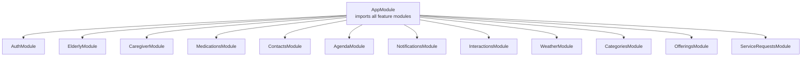
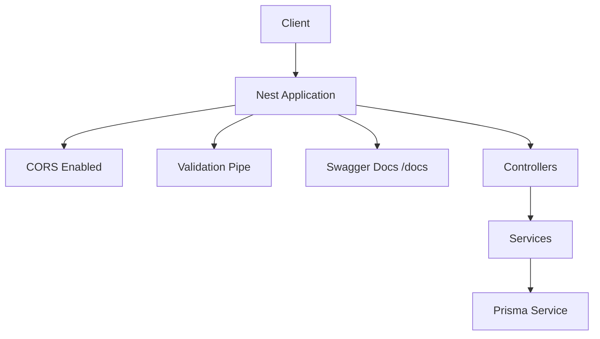
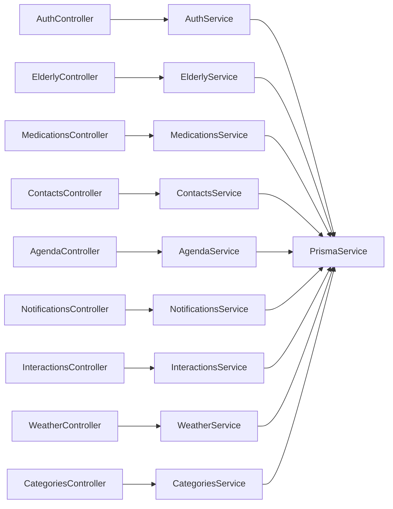

# API Reference

<cite>
**Referenced Files in This Document**
- [main.ts](file://src/main.ts)
- [app.module.ts](file://src/app.module.ts)
- [auth.controller.ts](file://src/auth/auth.controller.ts)
- [auth.service.ts](file://src/auth/auth.service.ts)
- [jwt-auth.guard.ts](file://src/auth/jwt-auth.guard.ts)
- [signup.dto.ts](file://src/auth/dto/signup.dto.ts)
- [login.dto.ts](file://src/auth/dto/login.dto.ts)
- [elderly.controller.ts](file://src/elderly/elderly.controller.ts)
- [update-profile.dto.ts](file://src/elderly/dto/update-profile.dto.ts)
- [medications.controller.ts](file://src/medications/medications.controller.ts)
- [create-medication.dto.ts](file://src/medications/dto/create-medication.dto.ts)
- [contacts.controller.ts](file://src/contacts/contacts.controller.ts)
- [create-contact.dto.ts](file://src/contacts/dto/create-contact.dto.ts)
- [agenda.controller.ts](file://src/agenda/agenda.controller.ts)
- [create-agenda.dto.ts](file://src/agenda/dto/create-agenda.dto.ts)
- [notifications.controller.ts](file://src/notifications/notifications.controller.ts)
- [register-token.dto.ts](file://src/notifications/dto/register-token.dto.ts)
- [interactions.controller.ts](file://src/interactions/interactions.controller.ts)
- [log-interaction.dto.ts](file://src/interactions/dto/log-interaction.dto.ts)
- [weather.controller.ts](file://src/weather/weather.controller.ts)
- [categories.controller.ts](file://src/categories/categories.controller.ts)
</cite>

## Table of Contents
1. [Introduction](#introduction)
2. [Project Structure](#project-structure)
3. [Core Components](#core-components)
4. [Architecture Overview](#architecture-overview)
5. [Detailed Component Analysis](#detailed-component-analysis)
6. [Dependency Analysis](#dependency-analysis)
7. [Performance Considerations](#performance-considerations)
8. [Troubleshooting Guide](#troubleshooting-guide)
9. [Conclusion](#conclusion)
10. [Appendices](#appendices)

## Introduction
This document provides a comprehensive API reference for the 99-Pai backend. It covers HTTP methods, URL patterns, request/response schemas, authentication, validation rules, error responses, and practical examples. The API is organized by functional areas: Authentication, Elderly Care, Marketplace, and Communication. The backend is built with NestJS, uses Swagger/OpenAPI for documentation, and enforces global validation and CORS.

Key runtime and configuration highlights:
- Global base path: api
- Swagger UI: /docs
- Versioning: 1.0
- CORS enabled with credentials support
- Global validation pipe enabled

**Section sources**
- [main.ts:1-43](file://src/main.ts#L1-L43)

## Project Structure
The application is modularized by feature. Each module exposes controllers that define endpoints grouped by domain. The main application wires all feature modules.

**Diagram sources**
- [app.module.ts:17-34](file://src/app.module.ts#L17-L34)

**Section sources**
- [app.module.ts:1-36](file://src/app.module.ts#L1-L36)

## Core Components
- Global prefix: api
- CORS: enabled with origin true and credentials true
- Validation: global ValidationPipe with transform, whitelist, forbidNonWhitelisted
- OpenAPI/Swagger: configured with bearer auth and version 1.0

**Section sources**
- [main.ts:9-35](file://src/main.ts#L9-L35)

## Architecture Overview
High-level flow:
- Bootstrap initializes the app, sets global prefix, enables CORS, registers validation pipe, and builds Swagger.
- Controllers expose endpoints under /api/<route>.
- Services encapsulate business logic and interact with Prisma.
- Guards enforce authentication and role-based access.

**Diagram sources**
- [main.ts:6-35](file://src/main.ts#L6-L35)

## Detailed Component Analysis

### Authentication
Endpoints
- POST /api/signup
  - Description: Register a new user
  - Auth: None
  - Request body: [SignupDto:12-52](file://src/auth/dto/signup.dto.ts#L12-L52)
  - Responses:
    - 201 Created: User registered and JWT token issued
    - 409 Conflict: Email or cellphone already registered
- POST /api/auth/login
  - Description: Login user
  - Auth: None
  - Request body: [LoginDto:4-12](file://src/auth/dto/login.dto.ts#L4-L12)
  - Responses:
    - 200 OK: Token and user info returned
    - 401 Unauthorized: Invalid credentials
- GET /api/auth/me
  - Description: Get current user info
  - Auth: Bearer JWT
  - Guards: JwtAuthGuard
  - Responses:
    - 200 OK: User info including onboarding flag
    - 401 Unauthorized: Not authenticated

Request/response schemas
- SignupDto
  - email: string, required, email format
  - password: string, required, min length 6
  - name: string, required
  - role: enum ['elderly','caregiver','provider','admin'], required
  - cellphone: string, optional
  - nickname: string, optional
  - document: string, optional
  - birthday: date-time string, optional
- LoginDto
  - email: string, required, email format
  - password: string, required

Example requests
- curl -X POST http://localhost:3000/api/signup -H "Content-Type: application/json" -d '{"email":"john@example.com","password":"password123","name":"John Doe","role":"elderly"}'
- curl -X POST http://localhost:3000/api/auth/login -H "Content-Type: application/json" -d '{"email":"john@example.com","password":"password123"}'

Example response
- {
  "token": "eyJhbGciOiJIUzI1NiIs...",
  "user": {
    "id": "uuid",
    "email": "john@example.com",
    "name": "John Doe",
    "role": "elderly"
  }
}

Common failures
- 409 Conflict on duplicate email or cellphone during signup
- 401 Unauthorized on invalid login credentials

**Section sources**
- [auth.controller.ts:19-42](file://src/auth/auth.controller.ts#L19-L42)
- [auth.service.ts:23-100](file://src/auth/auth.service.ts#L23-L100)
- [auth.service.ts:102-135](file://src/auth/auth.service.ts#L102-L135)
- [auth.service.ts:137-162](file://src/auth/auth.service.ts#L137-L162)
- [signup.dto.ts:12-52](file://src/auth/dto/signup.dto.ts#L12-L52)
- [login.dto.ts:4-12](file://src/auth/dto/login.dto.ts#L4-L12)

### Elderly Profile
Endpoints
- GET /api/elderly/profile
  - Description: Get elderly user profile
  - Auth: Bearer JWT
  - Roles: elderly
  - Guards: JwtAuthGuard, RolesGuard
  - Responses: 200 OK with profile data
- PATCH /api/elderly/profile
  - Description: Update elderly user profile
  - Auth: Bearer JWT
  - Roles: elderly
  - Guards: JwtAuthGuard, RolesGuard
  - Request body: [UpdateElderlyProfileDto:12-43](file://src/elderly/dto/update-profile.dto.ts#L12-L43)
  - Responses: 200 OK with updated profile

Request/response schemas
- UpdateElderlyProfileDto
  - preferredName: string, optional
  - autonomyScore: integer, optional, min 0, max 100
  - interactionTimes: string[], optional, each string time value
  - location: string, optional
  - onboardingComplete: boolean, optional

Example request
- curl -X PATCH http://localhost:3000/api/elderly/profile -H "Authorization: Bearer <token>" -H "Content-Type: application/json" -d '{"preferredName":"Maria","autonomyScore":75,"onboardingComplete":true}'

Common failures
- 401 Unauthorized if not authenticated or missing role elderly
- Validation errors for out-of-range autonomyScore or invalid time formats

**Section sources**
- [elderly.controller.ts:23-40](file://src/elderly/elderly.controller.ts#L23-L40)
- [update-profile.dto.ts:12-43](file://src/elderly/dto/update-profile.dto.ts#L12-L43)

### Medications
Endpoints
- GET /api/elderly/{elderlyProfileId}/medications
  - Description: Get all medications for an elderly user
  - Auth: Bearer JWT
  - Roles: caregiver, provider, admin (via RolesGuard)
  - Path params: elderlyProfileId (string)
  - Responses: 200 OK with list
- POST /api/elderly/{elderlyProfileId}/medications
  - Description: Create a new medication (caregiver/provider/admin)
  - Auth: Bearer JWT
  - Roles: caregiver, provider, admin
  - Path params: elderlyProfileId (string)
  - Request body: [CreateMedicationDto:4-16](file://src/medications/dto/create-medication.dto.ts#L4-L16)
  - Responses: 201 Created
- PATCH /api/elderly/{elderlyProfileId}/medications/{id}
  - Description: Update a medication
  - Auth: Bearer JWT
  - Roles: caregiver, provider, admin
  - Path params: elderlyProfileId (string), id (string)
  - Request body: [UpdateMedicationDto:1-200](file://src/medications/dto/update-medication.dto.ts#L1-L200)
  - Responses: 200 OK
- DELETE /api/elderly/{elderlyProfileId}/medications/{id}
  - Description: Delete a medication
  - Auth: Bearer JWT
  - Roles: caregiver, provider, admin
  - Path params: elderlyProfileId (string), id (string)
  - Responses: 200 OK
- GET /api/medications/today
  - Description: Get today's medications for elderly user
  - Auth: Bearer JWT
  - Roles: elderly
  - Responses: 200 OK with today’s meds
- POST /api/medications/{id}/confirm
  - Description: Confirm or mark medication as missed
  - Auth: Bearer JWT
  - Roles: elderly
  - Path params: id (string)
  - Request body: [ConfirmMedicationDto:1-200](file://src/medications/dto/confirm-medication.dto.ts#L1-L200)
  - Responses: 201 Created
- GET /api/elderly/{elderlyProfileId}/medication-history
  - Description: Get medication history for an elderly user
  - Auth: Bearer JWT
  - Roles: caregiver, provider, admin
  - Path params: elderlyProfileId (string)
  - Query params: from (string, optional), to (string, optional), page (number, optional), limit (number, optional)
  - Responses: 200 OK with paginated history

Request/response schemas
- CreateMedicationDto
  - name: string, required
  - time: string, required (time format)
  - dosage: string, required

Pagination and filtering
- Page defaults to 1, limit defaults to 50 when not provided

Example request
- curl -X POST http://localhost:3000/api/elderly/{elderlyProfileId}/medications -H "Authorization: Bearer <token>" -H "Content-Type: application/json" -d '{"name":"Losartana","time":"08:00","dosage":"50mg"}'

Common failures
- 401 Unauthorized for missing/invalid token
- 403 Forbidden for insufficient roles
- Validation errors for malformed time or missing required fields

**Section sources**
- [medications.controller.ts:36-143](file://src/medications/medications.controller.ts#L36-L143)
- [create-medication.dto.ts:4-16](file://src/medications/dto/create-medication.dto.ts#L4-L16)

### Contacts
Endpoints
- GET /api/elderly/{elderlyProfileId}/contacts
  - Description: Get all contacts for an elderly user
  - Auth: Bearer JWT
  - Roles: caregiver, provider, admin
  - Path params: elderlyProfileId (string)
  - Responses: 200 OK with list
- POST /api/elderly/{elderlyProfileId}/contacts
  - Description: Create a new contact (caregiver/provider/admin)
  - Auth: Bearer JWT
  - Roles: caregiver, provider, admin
  - Path params: elderlyProfileId (string)
  - Request body: [CreateContactDto:4-18](file://src/contacts/dto/create-contact.dto.ts#L4-L18)
  - Responses: 201 Created
- PATCH /api/elderly/{elderlyProfileId}/contacts/{id}
  - Description: Update a contact
  - Auth: Bearer JWT
  - Roles: caregiver, provider, admin
  - Path params: elderlyProfileId (string), id (string)
  - Request body: [UpdateContactDto:1-200](file://src/contacts/dto/update-contact.dto.ts#L1-L200)
  - Responses: 200 OK
- DELETE /api/elderly/{elderlyProfileId}/contacts/{id}
  - Description: Delete a contact
  - Auth: Bearer JWT
  - Roles: caregiver, provider, admin
  - Path params: elderlyProfileId (string), id (string)
  - Responses: 200 OK
- GET /api/contacts
  - Description: Get contacts for elderly user with overdue status
  - Auth: Bearer JWT
  - Roles: elderly
  - Responses: 200 OK with status info
- POST /api/contacts/{id}/called
  - Description: Mark that elderly user called this contact
  - Auth: Bearer JWT
  - Roles: elderly
  - Path params: id (string)
  - Responses: 201 Created
- GET /api/elderly/{elderlyProfileId}/call-history
  - Description: Get call history for an elderly user
  - Auth: Bearer JWT
  - Roles: caregiver, provider, admin
  - Path params: elderlyProfileId (string)
  - Query params: page (number, optional), limit (number, optional)
  - Responses: 200 OK with paginated history

Request/response schemas
- CreateContactDto
  - name: string, required
  - phone: string, required
  - thresholdDays: integer, optional, min 1

Pagination and filtering
- Page defaults to 1, limit defaults to 50 when not provided

Example request
- curl -X POST http://localhost:3000/api/elderly/{elderlyProfileId}/contacts -H "Authorization: Bearer <token>" -H "Content-Type: application/json" -d '{"name":"Maria Silva","phone":"+5511999999999","thresholdDays":7}'

Common failures
- 401 Unauthorized for missing/invalid token
- 403 Forbidden for insufficient roles
- Validation errors for phone format or thresholdDays < 1

**Section sources**
- [contacts.controller.ts:35-127](file://src/contacts/contacts.controller.ts#L35-L127)
- [create-contact.dto.ts:4-18](file://src/contacts/dto/create-contact.dto.ts#L4-L18)

### Agenda
Endpoints
- GET /api/elderly/{elderlyProfileId}/agenda
  - Description: Get agenda for an elderly user
  - Auth: Bearer JWT
  - Roles: caregiver, provider, admin
  - Path params: elderlyProfileId (string)
  - Query params: from (string, optional), to (string, optional)
  - Responses: 200 OK with list
- POST /api/elderly/{elderlyProfileId}/agenda
  - Description: Create a new agenda event (caregiver/provider/admin)
  - Auth: Bearer JWT
  - Roles: caregiver, provider, admin
  - Path params: elderlyProfileId (string)
  - Request body: [CreateAgendaDto:4-17](file://src/agenda/dto/create-agenda.dto.ts#L4-L17)
  - Responses: 201 Created
- PATCH /api/elderly/{elderlyProfileId}/agenda/{id}
  - Description: Update an agenda event
  - Auth: Bearer JWT
  - Roles: caregiver, provider, admin
  - Path params: elderlyProfileId (string), id (string)
  - Request body: [UpdateAgendaDto:1-200](file://src/agenda/dto/update-agenda.dto.ts#L1-L200)
  - Responses: 200 OK
- DELETE /api/elderly/{elderlyProfileId}/agenda/{id}
  - Description: Delete an agenda event
  - Auth: Bearer JWT
  - Roles: caregiver, provider, admin
  - Path params: elderlyProfileId (string), id (string)
  - Responses: 200 OK
- GET /api/agenda/today
  - Description: Get today's agenda for elderly user
  - Auth: Bearer JWT
  - Roles: elderly
  - Responses: 200 OK with today’s events

Request/response schemas
- CreateAgendaDto
  - description: string, required
  - dateTime: string, required (date-time)
  - reminder: boolean, optional

Filtering
- from/to filters supported via query params

Example request
- curl -X POST http://localhost:3000/api/elderly/{elderlyProfileId}/agenda -H "Authorization: Bearer <token>" -H "Content-Type: application/json" -d '{"description":"Consulta médica","dateTime":"2026-03-25T10:00:00Z","reminder":true}'

Common failures
- 401 Unauthorized for missing/invalid token
- 403 Forbidden for insufficient roles
- Validation errors for dateTime format

**Section sources**
- [agenda.controller.ts:35-103](file://src/agenda/agenda.controller.ts#L35-L103)
- [create-agenda.dto.ts:4-17](file://src/agenda/dto/create-agenda.dto.ts#L4-L17)

### Notifications
Endpoints
- POST /api/notifications/register
  - Description: Register push notification token
  - Auth: Bearer JWT
  - Guards: JwtAuthGuard
  - Request body: [RegisterTokenDto:5-13](file://src/notifications/dto/register-token.dto.ts#L5-L13)
  - Responses: 201 Created

Request/response schemas
- RegisterTokenDto
  - pushToken: string, required
  - platform: enum ['ios','android','web'], required

Example request
- curl -X POST http://localhost:3000/api/notifications/register -H "Authorization: Bearer <token>" -H "Content-Type: application/json" -d '{"pushToken":"expo-push-token-xxx","platform":"android"}'

Common failures
- 401 Unauthorized for missing/invalid token

**Section sources**
- [notifications.controller.ts:20-28](file://src/notifications/notifications.controller.ts#L20-L28)
- [register-token.dto.ts:5-13](file://src/notifications/dto/register-token.dto.ts#L5-L13)

### Interactions
Endpoints
- POST /api/interactions/log
  - Description: Log interaction (voice or button)
  - Auth: Bearer JWT
  - Roles: elderly
  - Request body: [LogInteractionDto:5-9](file://src/interactions/dto/log-interaction.dto.ts#L5-L9)
  - Responses: 201 Created

Request/response schemas
- LogInteractionDto
  - type: enum ['voice','button'], required

Example request
- curl -X POST http://localhost:3000/api/interactions/log -H "Authorization: Bearer <token>" -H "Content-Type: application/json" -d '{"type":"voice"}'

Common failures
- 401 Unauthorized for missing/invalid token
- 403 Forbidden for non-elderly users

**Section sources**
- [interactions.controller.ts:23-29](file://src/interactions/interactions.controller.ts#L23-L29)
- [log-interaction.dto.ts:5-9](file://src/interactions/dto/log-interaction.dto.ts#L5-L9)

### Weather
Endpoints
- GET /api/weather
  - Description: Get weather forecast with clothing advice
  - Auth: Bearer JWT
  - Guards: JwtAuthGuard
  - Query params: location (string, optional)
  - Responses: 200 OK with weather data

Example request
- curl "http://localhost:3000/api/weather?location=S%C3%A3o+Paulo"

Common failures
- 401 Unauthorized for missing/invalid token

**Section sources**
- [weather.controller.ts:20-26](file://src/weather/weather.controller.ts#L20-L26)

### Categories
Endpoints
- GET /api/categories
  - Description: List all root categories with subcategories
  - Auth: None
  - Responses: 200 OK with array of categories
- GET /api/categories/{id}
  - Description: Get a category by ID
  - Auth: None
  - Path params: id (UUID)
  - Responses: 200 OK with category, 404 Not Found
- POST /api/categories
  - Description: Create a new category (admin only)
  - Auth: Bearer JWT
  - Roles: admin
  - Guards: JwtAuthGuard, RolesGuard
  - Request body: [CreateCategoryDto:1-200](file://src/categories/dto/create-category.dto.ts#L1-L200)
  - Responses: 201 Created, 401 Unauthorized, 403 Forbidden, 404 Not Found
- PATCH /api/categories/{id}
  - Description: Update a category (admin only)
  - Auth: Bearer JWT
  - Roles: admin
  - Guards: JwtAuthGuard, RolesGuard
  - Path params: id (UUID)
  - Request body: [UpdateCategoryDto:1-200](file://src/categories/dto/update-category.dto.ts#L1-L200)
  - Responses: 200 OK, 401 Unauthorized, 403 Forbidden, 404 Not Found
- DELETE /api/categories/{id}
  - Description: Delete a category (admin only)
  - Auth: Bearer JWT
  - Roles: admin
  - Guards: JwtAuthGuard, RolesGuard
  - Path params: id (UUID)
  - Responses: 200 OK, 400 Bad Request (cannot delete if has children/offerings), 401 Unauthorized, 403 Forbidden, 404 Not Found

Example request
- curl -X POST http://localhost:3000/api/categories -H "Authorization: Bearer <token>" -H "Content-Type: application/json" -d '{"name":"Healthcare","parentId":null}'

Common failures
- 401 Unauthorized for missing/invalid token
- 403 Forbidden for non-admin users
- 400 Bad Request when attempting to delete a category with subcategories or offerings

**Section sources**
- [categories.controller.ts:35-113](file://src/categories/categories.controller.ts#L35-L113)

## Dependency Analysis
- Controllers depend on Services for business logic.
- Services depend on PrismaService for database operations.
- Guards (JwtAuthGuard, RolesGuard) protect routes.
- DTOs define request schemas validated by the global ValidationPipe.

**Diagram sources**
- [auth.controller.ts:16-43](file://src/auth/auth.controller.ts#L16-L43)
- [elderly.controller.ts:20-41](file://src/elderly/elderly.controller.ts#L20-L41)
- [medications.controller.ts:33-144](file://src/medications/medications.controller.ts#L33-L144)
- [contacts.controller.ts:32-128](file://src/contacts/contacts.controller.ts#L32-L128)
- [agenda.controller.ts:32-104](file://src/agenda/agenda.controller.ts#L32-L104)
- [notifications.controller.ts:17-29](file://src/notifications/notifications.controller.ts#L17-L29)
- [interactions.controller.ts:20-30](file://src/interactions/interactions.controller.ts#L20-L30)
- [weather.controller.ts:17-27](file://src/weather/weather.controller.ts#L17-L27)
- [categories.controller.ts:32-114](file://src/categories/categories.controller.ts#L32-L114)

**Section sources**
- [auth.controller.ts:1-43](file://src/auth/auth.controller.ts#L1-L43)
- [elderly.controller.ts:1-42](file://src/elderly/elderly.controller.ts#L1-L42)
- [medications.controller.ts:1-145](file://src/medications/medications.controller.ts#L1-L145)
- [contacts.controller.ts:1-129](file://src/contacts/contacts.controller.ts#L1-L129)
- [agenda.controller.ts:1-105](file://src/agenda/agenda.controller.ts#L1-L105)
- [notifications.controller.ts:1-30](file://src/notifications/notifications.controller.ts#L1-L30)
- [interactions.controller.ts:1-31](file://src/interactions/interactions.controller.ts#L1-L31)
- [weather.controller.ts:1-28](file://src/weather/weather.controller.ts#L1-L28)
- [categories.controller.ts:1-115](file://src/categories/categories.controller.ts#L1-L115)

## Performance Considerations
- Pagination defaults: page=1, limit=50 for endpoints supporting pagination (medication-history, call-history).
- ValidationPipe transforms and enforces whitelisting, reducing downstream parsing overhead.
- Use query filters (from/to) for time-bound queries to limit payload sizes.
- Prefer bulk operations where feasible; current controllers expose per-item endpoints.

[No sources needed since this section provides general guidance]

## Troubleshooting Guide
Common HTTP statuses and causes
- 400 Bad Request
  - Validation errors from DTOs (e.g., invalid time/date, out-of-range values)
- 401 Unauthorized
  - Missing or invalid Bearer token; user not found in protected routes
- 403 Forbidden
  - Insufficient role (e.g., non-elderly attempting elderly-only endpoints)
- 404 Not Found
  - Resource not found (e.g., category ID not present)
- 409 Conflict
  - Duplicate registration (email or cellphone) during signup

Validation rules summary
- Strings: min length for passwords, required fields enforced
- Numbers: min/max constraints for autonomyScore
- Enums: constrained to allowed values (role, platform, interaction type)
- Dates: ISO date-time strings for dateTime fields

**Section sources**
- [auth.service.ts:35-51](file://src/auth/auth.service.ts#L35-L51)
- [auth.service.ts:106-115](file://src/auth/auth.service.ts#L106-L115)
- [auth.service.ts:149-151](file://src/auth/auth.service.ts#L149-L151)
- [medications.controller.ts:120-143](file://src/medications/medications.controller.ts#L120-L143)
- [contacts.controller.ts:110-127](file://src/contacts/contacts.controller.ts#L110-L127)

## Conclusion
This API provides a cohesive set of endpoints for user authentication, elderly care management (medications, contacts, agenda), communication/logging, notifications, weather assistance, and marketplace categorization. All endpoints are documented via Swagger at /docs, with global validation and CORS enabled. Use the provided curl examples and Postman collection to test endpoints efficiently.

[No sources needed since this section summarizes without analyzing specific files]

## Appendices

### API Base URL and Versioning
- Base URL: http://localhost:3000/api
- Version: 1.0 (Swagger version field)

**Section sources**
- [main.ts:10-35](file://src/main.ts#L10-L35)

### Authentication and Authorization
- JWT Bearer tokens are required for most endpoints.
- Roles:
  - elderly: can access elderly-specific endpoints (e.g., /api/medications/today, /api/interactions/log)
  - caregiver/provider/admin: can manage others’ data (e.g., create/update/delete for medications, contacts, agenda)
- Guard usage:
  - JwtAuthGuard: protects routes requiring a valid token
  - RolesGuard: restricts routes by role

**Section sources**
- [jwt-auth.guard.ts:1-6](file://src/auth/jwt-auth.guard.ts#L1-L6)
- [elderly.controller.ts:24-32](file://src/elderly/elderly.controller.ts#L24-L32)
- [medications.controller.ts:96-118](file://src/medications/medications.controller.ts#L96-L118)
- [interactions.controller.ts:23-29](file://src/interactions/interactions.controller.ts#L23-L29)

### CORS and Content-Type
- CORS: enabled with origin true and credentials true
- Content-Type: application/json is recommended for JSON payloads

**Section sources**
- [main.ts:12-16](file://src/main.ts#L12-L16)

### Rate Limiting
- No explicit rate limiting middleware is configured in the bootstrap code.

[No sources needed since this section provides general guidance]

### Pagination and Filtering
- Pagination pattern:
  - page: integer, default 1
  - limit: integer, default 50
- Filtering pattern:
  - from/to: date-time strings for time-range queries (medications, agenda)
  - thresholdDays: integer >= 1 for contacts

**Section sources**
- [medications.controller.ts:120-143](file://src/medications/medications.controller.ts#L120-L143)
- [contacts.controller.ts:110-127](file://src/contacts/contacts.controller.ts#L110-L127)
- [agenda.controller.ts:37-52](file://src/agenda/agenda.controller.ts#L37-L52)

### Example Requests and Postman Collection
- Swagger UI: http://localhost:3000/docs
- Example curl commands are included in each endpoint section above.

[No sources needed since this section provides general guidance]