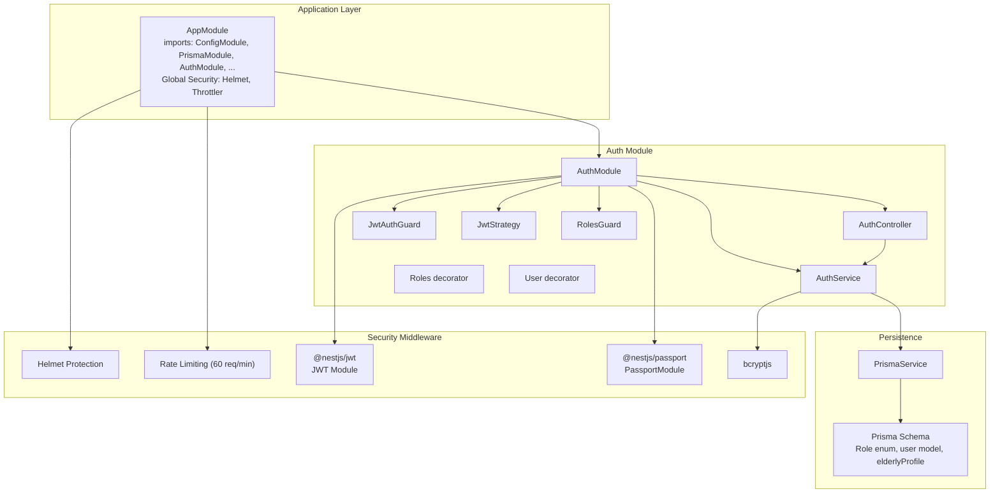
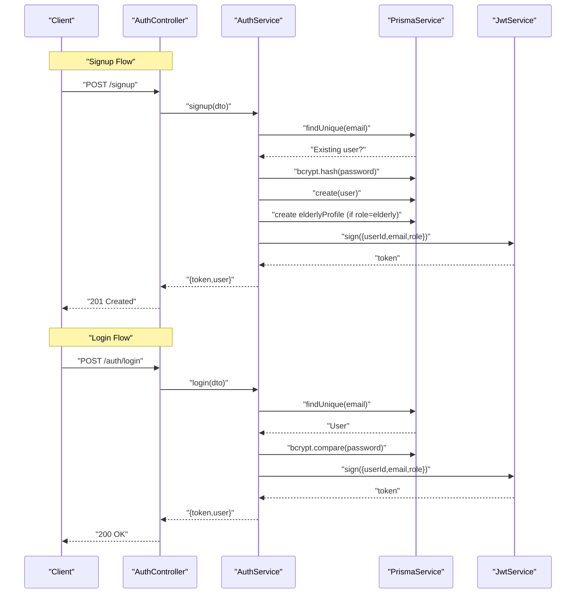
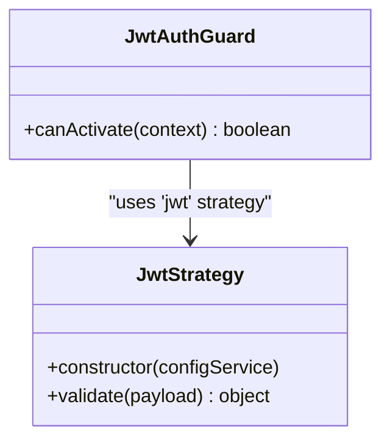
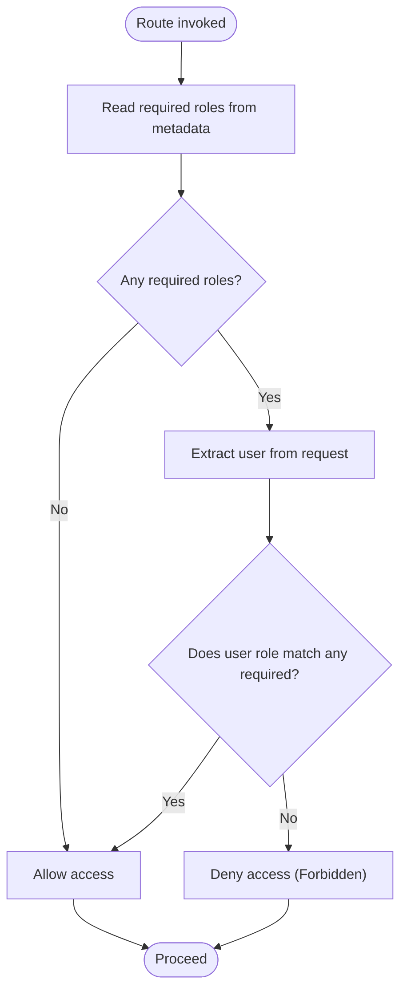
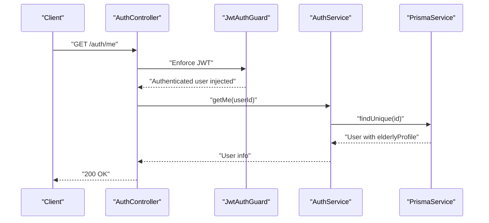
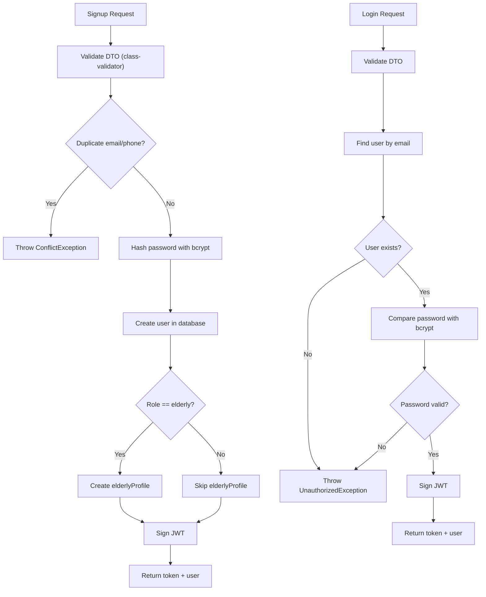
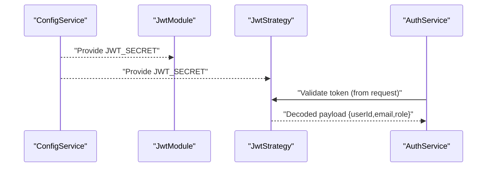
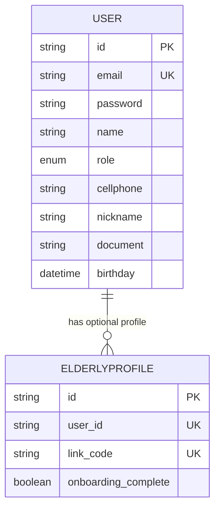
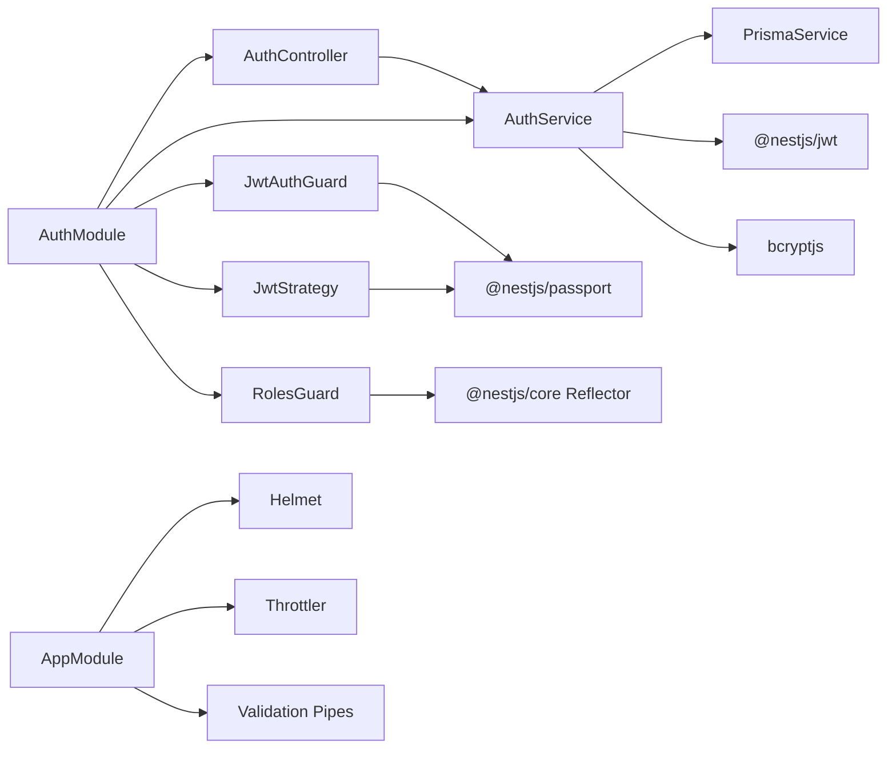

# Authentication & Authorization System

<cite>
**Referenced Files in This Document**
- [auth.controller.ts](file://src/auth/auth.controller.ts)
- [auth.service.ts](file://src/auth/auth.service.ts)
- [auth.module.ts](file://src/auth/auth.module.ts)
- [jwt.strategy.ts](file://src/auth/jwt.strategy.ts)
- [jwt-auth.guard.ts](file://src/auth/jwt-auth.guard.ts)
- [roles.guard.ts](file://src/auth/roles.guard.ts)
- [roles.decorator.ts](file://src/auth/roles.decorator.ts)
- [user.decorator.ts](file://src/common/decorators/user.decorator.ts)
- [login.dto.ts](file://src/auth/dto/login.dto.ts)
- [signup.dto.ts](file://src/auth/dto/signup.dto.ts)
- [schema.prisma](file://prisma/schema.prisma)
- [app.module.ts](file://src/app.module.ts)
- [package.json](file://package.json)
- [auth-health.e2e-spec.ts](file://test/auth-health.e2e-spec.ts)
- [elderly-caregiver.e2e-spec.ts](file://test/elderly-caregiver.e2e-spec.ts)
</cite>

## Update Summary
**Changes Made**
- Added comprehensive E2E test coverage documentation for authentication flows
- Documented known login endpoint status code issue (returns 201 instead of 200)
- Added security middleware documentation including helmet protection and rate limiting
- Enhanced authentication flow documentation with actual implementation details
- Updated troubleshooting guide with test environment considerations

## Table of Contents
1. [Introduction](#introduction)
2. [Project Structure](#project-structure)
3. [Core Components](#core-components)
4. [Architecture Overview](#architecture-overview)
5. [Detailed Component Analysis](#detailed-component-analysis)
6. [Enhanced Security Implementation](#enhanced-security-implementation)
7. [Comprehensive E2E Test Coverage](#comprehensive-e2e-test-coverage)
8. [Dependency Analysis](#dependency-analysis)
9. [Performance Considerations](#performance-considerations)
10. [Troubleshooting Guide](#troubleshooting-guide)
11. [Conclusion](#conclusion)
12. [Appendices](#appendices)

## Introduction
This document explains the authentication and authorization system for the 99-Pai platform. It covers JWT-based authentication, token generation and validation, role-based access control (RBAC), Passport.js integration, guard patterns, DTO validation, password hashing with bcrypt, and security best practices. The system now includes comprehensive E2E test coverage demonstrating real-world authentication flows across all user roles (elderly, caregiver, provider, admin) and includes documented security improvements such as helmet protection and rate limiting.

## Project Structure
The authentication subsystem resides under the auth module and integrates with Prisma for persistence and Swagger for API documentation. The application module wires the AuthModule and other domain modules, along with global security middleware including helmet and rate limiting.

**Diagram sources**
- [app.module.ts:21-46](file://src/app.module.ts#L21-L46)
- [auth.module.ts:10-27](file://src/auth/auth.module.ts#L10-L27)
- [auth.controller.ts:14-44](file://src/auth/auth.controller.ts#L14-L44)
- [auth.service.ts:14-175](file://src/auth/auth.service.ts#L14-L175)
- [jwt.strategy.ts:6-25](file://src/auth/jwt.strategy.ts#L6-L25)
- [jwt-auth.guard.ts:1-6](file://src/auth/jwt-auth.guard.ts#L1-L6)
- [roles.guard.ts:6-22](file://src/auth/roles.guard.ts#L6-L22)
- [roles.decorator.ts:1-6](file://src/auth/roles.decorator.ts#L1-L6)
- [user.decorator.ts:1-9](file://src/common/decorators/user.decorator.ts#L1-L9)
- [schema.prisma:17-65](file://prisma/schema.prisma#L17-L65)
- [package.json:22-39](file://package.json#L22-L39)

**Section sources**
- [app.module.ts:21-46](file://src/app.module.ts#L21-L46)
- [auth.module.ts:10-27](file://src/auth/auth.module.ts#L10-L27)
- [schema.prisma:17-65](file://prisma/schema.prisma#L17-L65)
- [package.json:22-39](file://package.json#L22-L39)

## Core Components
- AuthController: Exposes endpoints for user registration, login, and retrieving current user information. Uses guards and decorators for protection and user extraction.
- AuthService: Implements signup, login, and profile retrieval. Handles DTO validation, password hashing, and JWT signing.
- JwtStrategy: Passport strategy that validates JWT tokens and extracts user identity.
- JwtAuthGuard: Guard that enforces JWT authentication via the "jwt" strategy.
- RolesGuard and Roles decorator: Enforce role-based access control by checking required roles against the authenticated user.
- User decorator: Extracts the authenticated user from the request context.
- DTOs: Validate request payloads for login and signup operations.
- Prisma schema: Defines the Role enum and user model used by the auth system.
- Security Middleware: Helmet protection and rate limiting for enhanced security.

**Section sources**
- [auth.controller.ts:14-44](file://src/auth/auth.controller.ts#L14-L44)
- [auth.service.ts:14-175](file://src/auth/auth.service.ts#L14-L175)
- [jwt.strategy.ts:6-25](file://src/auth/jwt.strategy.ts#L6-L25)
- [jwt-auth.guard.ts:1-6](file://src/auth/jwt-auth.guard.ts#L1-L6)
- [roles.guard.ts:6-22](file://src/auth/roles.guard.ts#L6-L22)
- [roles.decorator.ts:1-6](file://src/auth/roles.decorator.ts#L1-L6)
- [user.decorator.ts:1-9](file://src/common/decorators/user.decorator.ts#L1-L9)
- [login.dto.ts:1-13](file://src/auth/dto/login.dto.ts#L1-L13)
- [signup.dto.ts:1-53](file://src/auth/dto/signup.dto.ts#L1-L53)
- [schema.prisma:17-65](file://prisma/schema.prisma#L17-L65)

## Architecture Overview
The authentication flow combines Passport.js with NestJS guards and the @nestjs/jwt module. The system uses bearer tokens and enforces RBAC via a dedicated guard and decorator. Enhanced with comprehensive E2E testing and security middleware.

**Diagram sources**
- [auth.controller.ts:19-33](file://src/auth/auth.controller.ts#L19-L33)
- [auth.service.ts:24-101](file://src/auth/auth.service.ts#L24-L101)
- [auth.service.ts:103-136](file://src/auth/auth.service.ts#L103-L136)

**Section sources**
- [auth.controller.ts:19-33](file://src/auth/auth.controller.ts#L19-L33)
- [auth.service.ts:24-101](file://src/auth/auth.service.ts#L24-L101)
- [auth.service.ts:103-136](file://src/auth/auth.service.ts#L103-L136)

## Detailed Component Analysis

### JWT Strategy and Guard
- JwtStrategy initializes passport-jwt with a secret from configuration and extracts the JWT from the Authorization header. It validates the token and returns a user object for downstream use.
- JwtAuthGuard leverages the "jwt" strategy to enforce authentication at route level.

**Diagram sources**
- [jwt.strategy.ts:6-25](file://src/auth/jwt.strategy.ts#L6-L25)
- [jwt-auth.guard.ts:1-6](file://src/auth/jwt-auth.guard.ts#L1-L6)

**Section sources**
- [jwt.strategy.ts:6-25](file://src/auth/jwt.strategy.ts#L6-L25)
- [jwt-auth.guard.ts:1-6](file://src/auth/jwt-auth.guard.ts#L1-L6)

### Role-Based Access Control (RBAC)
- Roles decorator sets metadata indicating required roles for a handler or controller.
- RolesGuard reads the required roles from metadata and compares against the authenticated user's role.

**Diagram sources**
- [roles.guard.ts:10-21](file://src/auth/roles.guard.ts#L10-L21)
- [roles.decorator.ts:4-5](file://src/auth/roles.decorator.ts#L4-L5)

**Section sources**
- [roles.guard.ts:6-22](file://src/auth/roles.guard.ts#L6-L22)
- [roles.decorator.ts:1-6](file://src/auth/roles.decorator.ts#L1-L6)

### Protected Routes and Decorators
- AuthController exposes three endpoints:
  - POST /signup: Creates a new user, performs duplicate checks, hashes the password, optionally creates an elderly profile, and signs a JWT.
  - POST /auth/login: Authenticates an existing user by verifying credentials and returns a JWT.
  - GET /auth/me: Protected by JwtAuthGuard and returns the current user's information.
- The User decorator extracts the authenticated user from the request for use in handlers.

**Diagram sources**
- [auth.controller.ts:35-42](file://src/auth/auth.controller.ts#L35-L42)
- [jwt-auth.guard.ts:1-6](file://src/auth/jwt-auth.guard.ts#L1-L6)
- [auth.service.ts:138-163](file://src/auth/auth.service.ts#L138-L163)
- [user.decorator.ts:3-8](file://src/common/decorators/user.decorator.ts#L3-L8)

**Section sources**
- [auth.controller.ts:35-42](file://src/auth/auth.controller.ts#L35-L42)
- [jwt-auth.guard.ts:1-6](file://src/auth/jwt-auth.guard.ts#L1-L6)
- [auth.service.ts:138-163](file://src/auth/auth.service.ts#L138-L163)
- [user.decorator.ts:1-9](file://src/common/decorators/user.decorator.ts#L1-L9)

### DTO Validation and Password Hashing
- LoginDto and SignupDto define validation rules enforced by class-validator and swagger metadata.
- AuthService hashes passwords using bcrypt and compares during login. It throws appropriate exceptions for invalid credentials or conflicts.

**Diagram sources**
- [signup.dto.ts:12-52](file://src/auth/dto/signup.dto.ts#L12-L52)
- [login.dto.ts:4-12](file://src/auth/dto/login.dto.ts#L4-L12)
- [auth.service.ts:24-101](file://src/auth/auth.service.ts#L24-L101)
- [auth.service.ts:103-136](file://src/auth/auth.service.ts#L103-L136)

**Section sources**
- [signup.dto.ts:12-52](file://src/auth/dto/signup.dto.ts#L12-L52)
- [login.dto.ts:4-12](file://src/auth/dto/login.dto.ts#L4-L12)
- [auth.service.ts:24-101](file://src/auth/auth.service.ts#L24-L101)
- [auth.service.ts:103-136](file://src/auth/auth.service.ts#L103-L136)

### Token Generation and Validation
- JwtModule registers the JWT secret and expiration options via ConfigService.
- JwtStrategy defines how tokens are extracted and validated.
- AuthService signs tokens containing userId, email, and role.

**Diagram sources**
- [auth.module.ts:14-21](file://src/auth/auth.module.ts#L14-L21)
- [jwt.strategy.ts:8-19](file://src/auth/jwt.strategy.ts#L8-L19)
- [auth.service.ts:84-88](file://src/auth/auth.service.ts#L84-L88)

**Section sources**
- [auth.module.ts:14-21](file://src/auth/auth.module.ts#L14-L21)
- [jwt.strategy.ts:8-19](file://src/auth/jwt.strategy.ts#L8-L19)
- [auth.service.ts:84-88](file://src/auth/auth.service.ts#L84-L88)

### Multi-Role System and Data Model
- Role enum includes elderly, caregiver, provider, and admin.
- The user model stores role and other attributes. Elderly users have an associated elderlyProfile with a unique link code and onboarding flag.

**Diagram sources**
- [schema.prisma:17-22](file://prisma/schema.prisma#L17-L22)
- [schema.prisma:47-65](file://prisma/schema.prisma#L47-L65)
- [schema.prisma:71-96](file://prisma/schema.prisma#L71-L96)

**Section sources**
- [schema.prisma:17-22](file://prisma/schema.prisma#L17-L22)
- [schema.prisma:47-65](file://prisma/schema.prisma#L47-L65)
- [schema.prisma:71-96](file://prisma/schema.prisma#L71-L96)

## Enhanced Security Implementation

### Helmet Protection
The application implements comprehensive security headers through Helmet middleware, providing protection against common web vulnerabilities including XSS attacks, clickjacking, and other malicious exploits. The middleware is applied globally during application initialization in the E2E test setup.

### Rate Limiting
The system includes rate limiting configured for 60 requests per minute, implemented through the @nestjs/throttler module. This protection helps prevent brute force attacks and API abuse while allowing normal application usage patterns.

### Security Middleware Integration
Both helmet and rate limiting are integrated at the application module level and are actively tested in the E2E test suite to ensure they function correctly across all authentication scenarios.

**Section sources**
- [app.module.ts:24-42](file://src/app.module.ts#L24-L42)
- [auth-health.e2e-spec.ts:33](file://test/auth-health.e2e-spec.ts#L33-L33)
- [auth-health.e2e-spec.ts:289-325](file://test/auth-health.e2e-spec.ts#L289-L325)

## Comprehensive E2E Test Coverage

### Authentication Flow Testing
The E2E test suite provides comprehensive coverage of authentication flows across all user roles:

#### Login Endpoint Testing
- **All Roles**: Tests authentication for elderly, caregiver, provider, and admin users
- **Success Cases**: Validates JWT token generation and user information retrieval
- **Failure Cases**: Tests invalid credentials handling with 401 Unauthorized responses
- **Status Code Issue**: Documents the known issue where login returns 201 instead of 200

#### Protected Route Testing
- **User Information Retrieval**: Tests GET /api/auth/me endpoint with proper Bearer token authentication
- **Role-Specific Access**: Verifies correct user information retrieval for each role type
- **Authentication Failure**: Confirms 401 Unauthorized response without proper authentication

### Security Feature Testing
- **Helmet Protection**: Verifies security headers are properly applied
- **Rate Limiting**: Tests request throttling mechanisms (configured but test intentionally skipped due to flakiness)
- **Validation Pipeline**: Ensures global validation pipeline is active and functioning

### Test Environment Configuration
The E2E tests configure:
- Global prefix: `/api`
- Validation pipes with transformation, whitelisting, and non-whitelisted forbiddance
- Helmet middleware for security headers
- Extended timeouts for database connectivity

**Section sources**
- [auth-health.e2e-spec.ts:11-327](file://test/auth-health.e2e-spec.ts#L11-L327)
- [elderly-caregiver.e2e-spec.ts:1-334](file://test/elderly-caregiver.e2e-spec.ts#L1-L334)

## Dependency Analysis
- AuthModule depends on PrismaModule, PassportModule, JwtModule, and exports AuthService for use across the application.
- AuthController depends on AuthService and guards.
- AuthService depends on PrismaService, JwtService, and bcrypt for password operations.
- Guards and decorators rely on NestJS reflection and request context.
- Application module includes global security middleware (helmet, throttler) and validation pipes.

**Diagram sources**
- [auth.module.ts:10-27](file://src/auth/auth.module.ts#L10-L27)
- [auth.controller.ts:14-44](file://src/auth/auth.controller.ts#L14-L44)
- [auth.service.ts:14-175](file://src/auth/auth.service.ts#L14-L175)
- [jwt-auth.guard.ts:1-6](file://src/auth/jwt-auth.guard.ts#L1-L6)
- [jwt.strategy.ts:1-25](file://src/auth/jwt.strategy.ts#L1-L25)
- [roles.guard.ts:1-22](file://src/auth/roles.guard.ts#L1-L22)
- [app.module.ts:21-46](file://src/app.module.ts#L21-L46)

**Section sources**
- [auth.module.ts:10-27](file://src/auth/auth.module.ts#L10-L27)
- [auth.controller.ts:14-44](file://src/auth/auth.controller.ts#L14-L44)
- [auth.service.ts:14-175](file://src/auth/auth.service.ts#L14-L175)
- [jwt-auth.guard.ts:1-6](file://src/auth/jwt-auth.guard.ts#L1-L6)
- [jwt.strategy.ts:1-25](file://src/auth/jwt.strategy.ts#L1-L25)
- [roles.guard.ts:1-22](file://src/auth/roles.guard.ts#L1-L22)
- [app.module.ts:21-46](file://src/app.module.ts#L21-L46)

## Performance Considerations
- Token expiration is configured to seven days. Consider short-lived access tokens with a refresh mechanism for higher security if needed.
- Password hashing cost is set to 10 using bcryptjs; ensure the server environment is tuned appropriately.
- Database queries for duplicate checks and user retrieval are minimal; ensure proper indexing on email and cellphone fields.
- Rate limiting is configured at 60 requests per minute to balance security with performance.
- Helmet middleware adds minimal overhead while providing comprehensive security header protection.

## Troubleshooting Guide
- Missing JWT_SECRET: JwtStrategy throws an error if the secret is not defined in configuration.
- Invalid credentials: Login and signup throw UnauthorizedException for invalid email/password combinations.
- Duplicate email or phone: Signup throws ConflictException when attempting to reuse an existing email or phone number.
- User not found: getMe throws UnauthorizedException if the user does not exist.
- Missing Authorization header: Requests without a valid bearer token fail JwtAuthGuard.
- **Known Login Status Issue**: The login endpoint currently returns 201 (Created) instead of 200 (OK) for authenticated requests. This is documented in the E2E tests and appears to be related to route registration where the signup endpoint is being matched instead of login for certain requests.
- **Rate Limiting Flakiness**: Rate limiting tests are intentionally skipped in the E2E suite due to timing variations and shared rate limit state across tests.
- **Helmet Configuration**: Security headers are applied through helmet middleware during application initialization in test setup.

**Section sources**
- [jwt.strategy.ts:9-12](file://src/auth/jwt.strategy.ts#L9-L12)
- [auth.service.ts:108-116](file://src/auth/auth.service.ts#L108-L116)
- [auth.service.ts:40-52](file://src/auth/auth.service.ts#L40-L52)
- [auth.service.ts:150-152](file://src/auth/auth.service.ts#L150-L152)
- [auth-health.e2e-spec.ts:104-170](file://test/auth-health.e2e-spec.ts#L104-L170)
- [auth-health.e2e-spec.ts:290-325](file://test/auth-health.e2e-spec.ts#L290-L325)

## Conclusion
The 99-Pai authentication and authorization system is built on a robust JWT foundation with Passport.js, validated by DTOs, secured by bcrypt, and governed by role-based guards. The system now includes comprehensive E2E test coverage demonstrating real-world authentication flows across all user roles and enhanced security features including helmet protection and rate limiting. The design cleanly separates concerns across modules and decorators, enabling secure and maintainable access control across the platform's multi-role environment while providing extensive test validation for critical authentication flows.

## Appendices

### Practical Examples Index
- Protected route example: GET /auth/me guarded by JwtAuthGuard
  - [auth.controller.ts:35-42](file://src/auth/auth.controller.ts#L35-L42)
- Role-decorated endpoint example: Apply Roles(...) to restrict access to specific roles
  - [roles.decorator.ts:4-5](file://src/auth/roles.decorator.ts#L4-L5)
  - [roles.guard.ts:10-21](file://src/auth/roles.guard.ts#L10-L21)
- Permission checking: RolesGuard evaluates required roles against the authenticated user
  - [roles.guard.ts:10-21](file://src/auth/roles.guard.ts#L10-L21)
- DTO validation for login/signup:
  - [login.dto.ts:4-12](file://src/auth/dto/login.dto.ts#L4-L12)
  - [signup.dto.ts:12-52](file://src/auth/dto/signup.dto.ts#L12-L52)
- Password hashing with bcrypt:
  - [auth.service.ts:55](file://src/auth/auth.service.ts#L55)
  - [auth.service.ts:113](file://src/auth/auth.service.ts#L113)
- E2E Test Coverage:
  - [auth-health.e2e-spec.ts:114-170](file://test/auth-health.e2e-spec.ts#L114-L170)
  - [elderly-caregiver.e2e-spec.ts:34-46](file://test/elderly-caregiver.e2e-spec.ts#L34-L46)
- Security Middleware:
  - [app.module.ts:24-42](file://src/app.module.ts#L24-L42)
  - [auth-health.e2e-spec.ts:33](file://test/auth-health.e2e-spec.ts#L33-L33)

**Section sources**
- [auth.controller.ts:35-42](file://src/auth/auth.controller.ts#L35-L42)
- [roles.decorator.ts:4-5](file://src/auth/roles.decorator.ts#L4-L5)
- [roles.guard.ts:10-21](file://src/auth/roles.guard.ts#L10-L21)
- [login.dto.ts:4-12](file://src/auth/dto/login.dto.ts#L4-L12)
- [signup.dto.ts:12-52](file://src/auth/dto/signup.dto.ts#L12-L52)
- [auth.service.ts:55](file://src/auth/auth.service.ts#L55)
- [auth.service.ts:113](file://src/auth/auth.service.ts#L113)
- [auth-health.e2e-spec.ts:114-170](file://test/auth-health.e2e-spec.ts#L114-L170)
- [elderly-caregiver.e2e-spec.ts:34-46](file://test/elderly-caregiver.e2e-spec.ts#L34-L46)
- [app.module.ts:24-42](file://src/app.module.ts#L24-L42)
- [auth-health.e2e-spec.ts:33](file://test/auth-health.e2e-spec.ts#L33-L33)