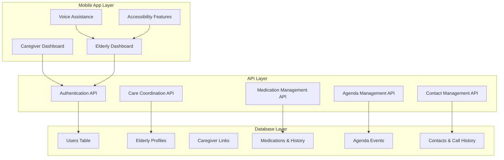
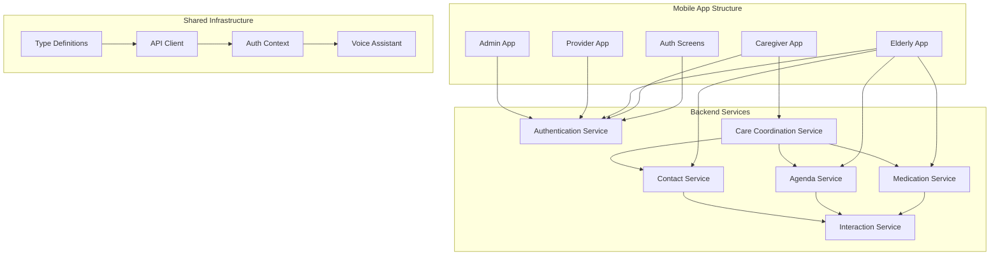
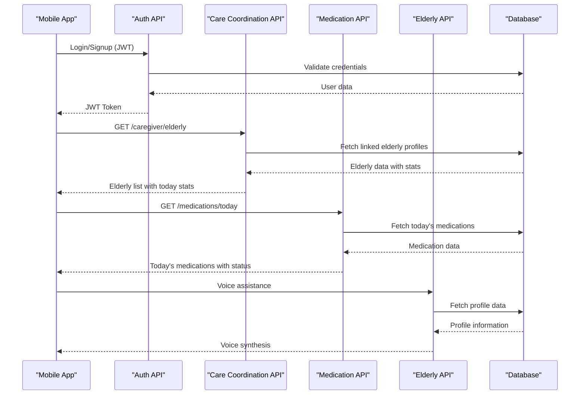
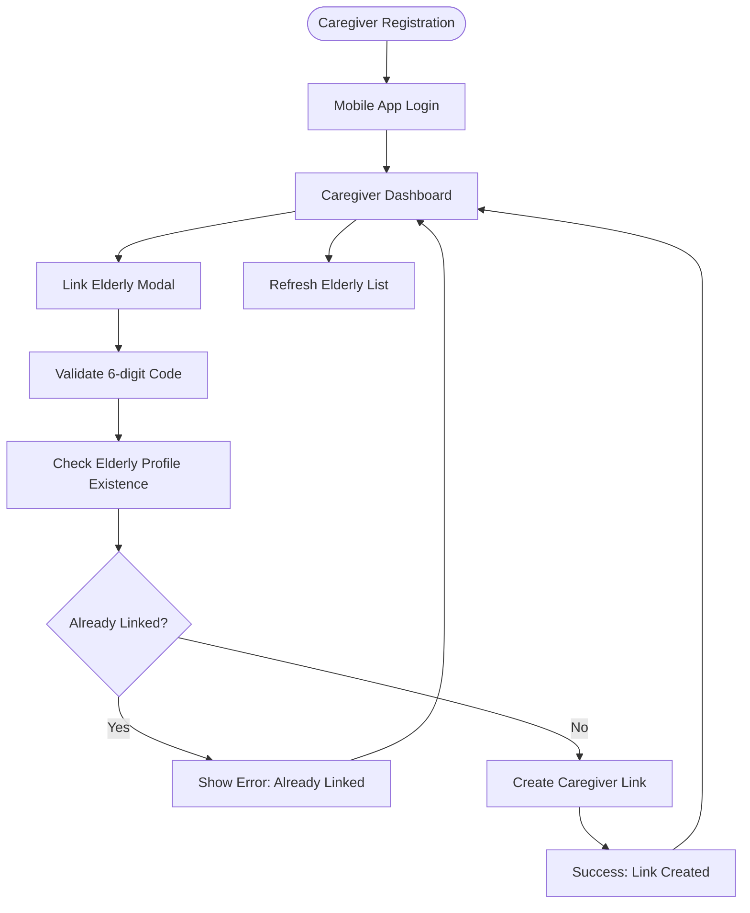
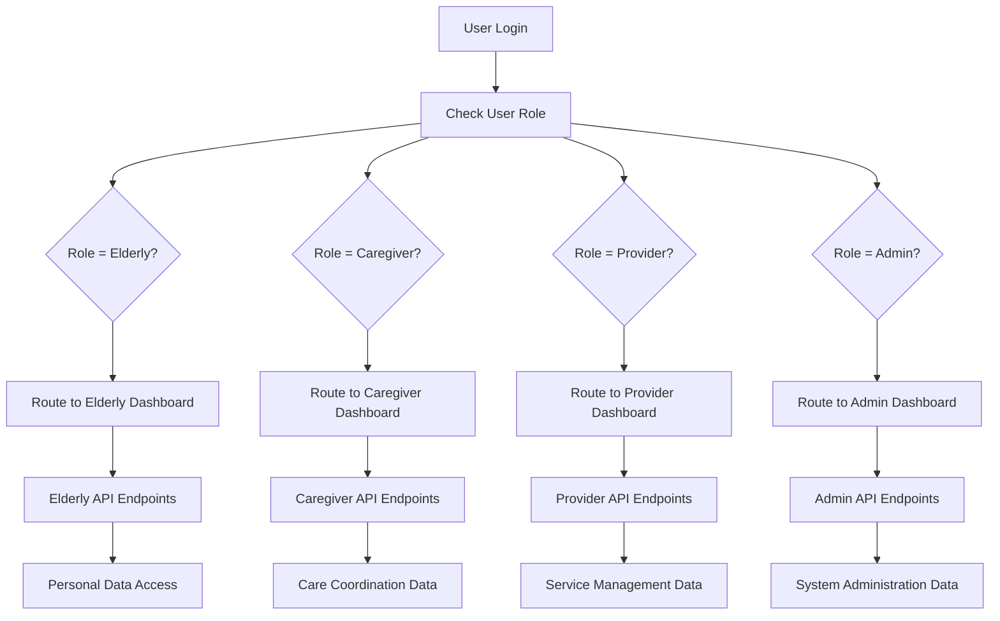
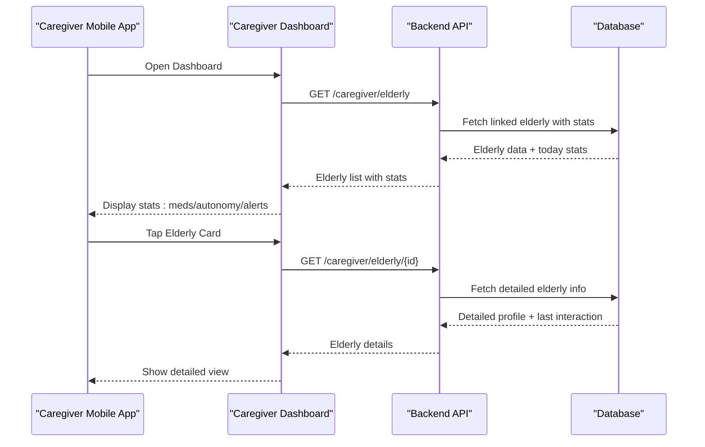
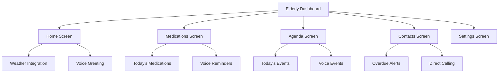

# Caregiver Integration

<cite>
**Referenced Files in This Document**
- [caregiver.controller.ts](file://src/caregiver/caregiver.controller.ts)
- [caregiver.service.ts](file://src/caregiver/caregiver.service.ts)
- [link.dto.ts](file://src/caregiver/dto/link.dto.ts)
- [caregiver.module.ts](file://src/caregiver/caregiver.module.ts)
- [auth.service.ts](file://src/auth/auth.service.ts)
- [jwt-auth.guard.ts](file://src/auth/jwt-auth.guard.ts)
- [roles.guard.ts](file://src/auth/roles.guard.ts)
- [roles.decorator.ts](file://src/auth/roles.decorator.ts)
- [user.decorator.ts](file://src/common/decorators/user.decorator.ts)
- [app.module.ts](file://src/app.module.ts)
- [schema.prisma](file://prisma/schema.prisma)
- [elderly.service.ts](file://src/elderly/elderly.service.ts)
- [medications.service.ts](file://src/medications/medications.service.ts)
- [interactions.service.ts](file://src/interactions/interactions.service.ts)
- [confirm-medication.dto.ts](file://src/medications/dto/confirm-medication.dto.ts)
- [create-medication.dto.ts](file://src/medications/dto/create-medication.dto.ts)
- [update-medication.dto.ts](file://src/medications/dto/update-medication.dto.ts)
- [log-interaction.dto.ts](file://src/interactions/dto/log-interaction.dto.ts)
- [update-profile.dto.ts](file://src/elderly/dto/update-profile.dto.ts)
- [dashboard.tsx](file://mobile-app/app/caregiver/dashboard.tsx)
- [elderly-detail-screen.tsx](file://mobile-app/app/caregiver/elderly/[id].tsx)
- [home.tsx](file://mobile-app/app/elderly/home.tsx)
- [medications.tsx](file://mobile-app/app/elderly/medications.tsx)
- [agenda.tsx](file://mobile-app/app/elderly/agenda.tsx)
- [contacts.tsx](file://mobile-app/app/elderly/contacts.tsx)
- [types/index.ts](file://mobile-app/src/types/index.ts)
- [api.ts](file://mobile-app/src/services/api.ts)
- [_layout.tsx](file://mobile-app/app/_layout.tsx)
- [elderly.controller.ts](file://src/elderly/elderly.controller.ts)
- [medications.controller.ts](file://src/medications/medications.controller.ts)
- [agenda.controller.ts](file://src/agenda/agenda.controller.ts)
- [contacts.controller.ts](file://src/contacts/contacts.controller.ts)
</cite>

## Update Summary
**Changes Made**
- Added comprehensive mobile app dashboard documentation for caregiver and elderly interfaces
- Documented elderly profile management and care coordination features
- Updated API documentation to include new mobile app endpoints and workflows
- Enhanced security considerations with mobile app authentication patterns
- Added real-time voice assistance and accessibility features
- Expanded care coordination capabilities with integrated medication, agenda, and contact management

## Table of Contents
1. [Introduction](#introduction)
2. [Mobile App Architecture](#mobile-app-architecture)
3. [Project Structure](#project-structure)
4. [Core Components](#core-components)
5. [Architecture Overview](#architecture-overview)
6. [Detailed Component Analysis](#detailed-component-analysis)
7. [Mobile App Dashboard Features](#mobile-app-dashboard-features)
8. [Elderly Care Coordination System](#elderly-care-coordination-system)
9. [Dependency Analysis](#dependency-analysis)
10. [Performance Considerations](#performance-considerations)
11. [Security and Audit Trails](#security-and-audit-trails)
12. [Troubleshooting Guide](#troubleshooting-guide)
13. [Conclusion](#conclusion)
14. [Appendices](#appendices)

## Introduction
This document describes the comprehensive caregiver integration system with mobile app dashboard, elderly profile management, and care coordination features. The system now includes a complete mobile application ecosystem that enables caregivers to manage elderly care remotely while providing elderly users with intuitive self-management tools. The platform leverages role-based access control (RBAC), JWT authentication, real-time voice assistance, and integrated care coordination across medication management, agenda scheduling, contact management, and interaction tracking.

## Mobile App Architecture
The system now operates as a hybrid mobile-backend architecture with three main components:
- **Mobile App Layer**: React Native application with TypeScript, providing caregiver and elderly dashboards
- **Backend API Layer**: NestJS RESTful services with Swagger documentation and comprehensive validation
- **Database Layer**: Prisma ORM with PostgreSQL, supporting complex care relationships and real-time data synchronization



**Diagram sources**
- [dashboard.tsx:15-198](file://mobile-app/app/caregiver/dashboard.tsx#L15-L198)
- [home.tsx:15-122](file://mobile-app/app/elderly/home.tsx#L15-L122)
- [medications.tsx:14-106](file://mobile-app/app/elderly/medications.tsx#L14-L106)
- [agenda.tsx:16-92](file://mobile-app/app/elderly/agenda.tsx#L16-L92)
- [contacts.tsx:15-114](file://mobile-app/app/elderly/contacts.tsx#L15-L114)

**Section sources**
- [_layout.tsx:12-61](file://mobile-app/app/_layout.tsx#L12-L61)
- [types/index.ts:1-139](file://mobile-app/src/types/index.ts#L1-L139)

## Project Structure
The caregiver integration system now encompasses a comprehensive mobile application ecosystem:
- **Mobile App**: React Native with TypeScript, organized by user roles (caregiver, elderly, provider, admin)
- **Backend Services**: RESTful APIs for authentication, care coordination, medication management, agenda, and contacts
- **Shared Types**: Comprehensive TypeScript interfaces for all data models and API responses
- **Authentication Context**: Centralized authentication state management with role-based routing
- **Voice Assistance**: Integrated speech synthesis for accessibility and hands-free operation



**Diagram sources**
- [dashboard.tsx:15-198](file://mobile-app/app/caregiver/dashboard.tsx#L15-L198)
- [home.tsx:15-122](file://mobile-app/app/elderly/home.tsx#L15-L122)
- [elderly-detail-screen.tsx:18-424](file://mobile-app/app/caregiver/elderly/[id].tsx#L18-L424)
- [medications.tsx:14-106](file://mobile-app/app/elderly/medications.tsx#L14-L106)
- [agenda.tsx:16-92](file://mobile-app/app/elderly/agenda.tsx#L16-L92)
- [contacts.tsx:15-114](file://mobile-app/app/elderly/contacts.tsx#L15-L114)

**Section sources**
- [app.module.ts:1-36](file://src/app.module.ts#L1-L36)
- [caregiver.module.ts:1-13](file://src/caregiver/caregiver.module.ts#L1-L13)

## Core Components
The system now includes comprehensive mobile app components alongside traditional backend services:

### Mobile App Components
- **Caregiver Dashboard**: Real-time elderly monitoring, medication statistics, and care coordination
- **Elderly Dashboard**: Personal care management with voice assistance and accessibility features
- **Detail Management**: Comprehensive elderly profile management with medication, agenda, and contact coordination
- **Voice Assistant**: Speech synthesis for medication reminders, agenda notifications, and care guidance
- **Real-time Updates**: Live synchronization of care data between mobile app and backend services

### Backend API Components
- **Authentication and Authorization**: JWT-based security with role-based access control
- **Care Coordination**: Centralized management of elderly-caregiver relationships and care data
- **Medication Management**: Complete medication lifecycle tracking with confirmation and history
- **Agenda Management**: Personal scheduling with reminder systems and voice notifications
- **Contact Management**: Social connection tracking with overdue alerts and call logging
- **Interaction Logging**: Comprehensive care activity tracking and audit trails

**Section sources**
- [dashboard.tsx:15-198](file://mobile-app/app/caregiver/dashboard.tsx#L15-L198)
- [home.tsx:15-122](file://mobile-app/app/elderly/home.tsx#L15-L122)
- [elderly-detail-screen.tsx:18-424](file://mobile-app/app/caregiver/elderly/[id].tsx#L18-L424)
- [medications.tsx:14-106](file://mobile-app/app/elderly/medications.tsx#L14-L106)
- [agenda.tsx:16-92](file://mobile-app/app/elderly/agenda.tsx#L16-L92)
- [contacts.tsx:15-114](file://mobile-app/app/elderly/contacts.tsx#L15-L114)

## Architecture Overview
The system follows a modern microservices architecture with mobile app integration:
- **Presentation Layer**: React Native mobile applications with role-based interfaces
- **Application Layer**: NestJS services with comprehensive business logic and validation
- **Persistence Layer**: Prisma ORM with PostgreSQL for robust data management
- **Integration Layer**: Real-time communication between mobile app and backend services



**Diagram sources**
- [dashboard.tsx:23-36](file://mobile-app/app/caregiver/dashboard.tsx#L23-L36)
- [medications.tsx:19-39](file://mobile-app/app/elderly/medications.tsx#L19-L39)
- [home.tsx:22-48](file://mobile-app/app/elderly/home.tsx#L22-L48)
- [api.ts:11-22](file://mobile-app/src/services/api.ts#L11-L22)

## Detailed Component Analysis

### Caregiver Registration and Linking Workflow
The system now includes a sophisticated mobile app interface for caregiver registration and elderly linking:



**Diagram sources**
- [dashboard.tsx:38-56](file://mobile-app/app/caregiver/dashboard.tsx#L38-L56)
- [caregiver.service.ts:19-64](file://src/caregiver/caregiver.service.ts#L19-L64)

**Section sources**
- [dashboard.tsx:15-198](file://mobile-app/app/caregiver/dashboard.tsx#L15-L198)
- [caregiver.controller.ts:23-29](file://src/caregiver/caregiver.controller.ts#L23-L29)
- [caregiver.service.ts:19-64](file://src/caregiver/caregiver.service.ts#L19-L64)

### Access Control and Permission Model
The system implements comprehensive role-based access control with mobile app integration:



**Diagram sources**
- [_layout.tsx:20-40](file://mobile-app/app/_layout.tsx#L20-L40)
- [roles.guard.ts:10-20](file://src/auth/roles.guard.ts#L10-L20)

**Section sources**
- [_layout.tsx:12-61](file://mobile-app/app/_layout.tsx#L12-L61)
- [roles.guard.ts:10-20](file://src/auth/roles.guard.ts#L10-L20)
- [roles.decorator.ts:1-6](file://src/auth/roles.decorator.ts#L1-L6)

### Caregiver-Related Features: Statistics and Activity Tracking
The mobile app dashboard provides comprehensive care coordination features:



**Diagram sources**
- [dashboard.tsx:23-36](file://mobile-app/app/caregiver/dashboard.tsx#L23-L36)
- [elderly-detail-screen.tsx:38-64](file://mobile-app/app/caregiver/elderly/[id].tsx#L38-L64)

**Section sources**
- [dashboard.tsx:90-117](file://mobile-app/app/caregiver/dashboard.tsx#L90-L117)
- [elderly-detail-screen.tsx:18-424](file://mobile-app/app/caregiver/elderly/[id].tsx#L18-L424)

### Elderly Care Coordination Features
The elderly mobile app provides comprehensive self-management capabilities:



**Diagram sources**
- [home.tsx:56-122](file://mobile-app/app/elderly/home.tsx#L56-L122)
- [medications.tsx:14-106](file://mobile-app/app/elderly/medications.tsx#L14-L106)
- [agenda.tsx:16-92](file://mobile-app/app/elderly/agenda.tsx#L16-L92)
- [contacts.tsx:15-114](file://mobile-app/app/elderly/contacts.tsx#L15-L114)

**Section sources**
- [home.tsx:15-122](file://mobile-app/app/elderly/home.tsx#L15-L122)
- [medications.tsx:14-106](file://mobile-app/app/elderly/medications.tsx#L14-L106)
- [agenda.tsx:16-92](file://mobile-app/app/elderly/agenda.tsx#L16-L92)
- [contacts.tsx:15-114](file://mobile-app/app/elderly/contacts.tsx#L15-L114)

## Mobile App Dashboard Features

### Caregiver Dashboard
The caregiver dashboard provides comprehensive elderly monitoring and management capabilities:

**Key Features:**
- **Real-time Elderly Monitoring**: Displays linked elderly profiles with daily medication statistics, autonomy scores, and alert indicators
- **Quick Actions**: One-tap elderly linking with validation and error handling
- **Visual Alerts**: Color-coded alert system for care emergencies
- **Navigation**: Seamless navigation between elderly profiles and management screens

**Dashboard Components:**
- **Header**: Caregiver identification and logout functionality
- **Action Bar**: Prominent elderly linking button with visual feedback
- **Elderly List**: Scrollable list with medication compliance, autonomy scores, and last interaction timestamps
- **Modal Interface**: Clean elderly linking modal with validation and success/error states

**Section sources**
- [dashboard.tsx:15-198](file://mobile-app/app/caregiver/dashboard.tsx#L15-L198)

### Elderly Dashboard
The elderly dashboard focuses on accessibility and self-management:

**Key Features:**
- **Voice Assistance**: Personalized voice greetings with weather and clothing advice
- **Quick Navigation**: Grid-based navigation to all care functions
- **Weather Integration**: Current weather conditions and clothing recommendations
- **Accessibility**: Large buttons, clear typography, and high contrast design

**Dashboard Components:**
- **Header**: Logo, personalized greeting, and weather display
- **Button Grid**: Medications, Agenda, Contacts, and Settings with appropriate icons
- **Weather Card**: Temperature, description, and clothing advice
- **Responsive Design**: Optimized for various screen sizes and orientations

**Section sources**
- [home.tsx:15-122](file://mobile-app/app/elderly/home.tsx#L15-L122)

### Elderly Detail Management
Comprehensive elderly profile management within the caregiver interface:

**Management Categories:**
- **Medication Management**: Add, edit, delete, and track medication schedules
- **Contact Management**: Family and friend connections with overdue alerting
- **Agenda Management**: Personal scheduling with reminder systems
- **History Tracking**: Complete medication and contact interaction history

**Detail Screen Features:**
- **Tabbed Interface**: Organized sections for different management areas
- **Form Validation**: Comprehensive input validation with user feedback
- **Real-time Updates**: Immediate reflection of changes in the system
- **Confirmation Dialogs**: Safety measures for destructive operations

**Section sources**
- [elderly-detail-screen.tsx:18-424](file://mobile-app/app/caregiver/elderly/[id].tsx#L18-L424)

## Elderly Care Coordination System

### Medication Management
The elderly medication system provides comprehensive self-management with voice assistance:

**Features:**
- **Today's Medications**: Personalized list of medications due today with status tracking
- **Voice Reminders**: Audio notifications for upcoming medication times
- **Confirmation System**: Simple one-tap confirmation with voice feedback
- **Missed Dose Handling**: Clear indication and management of missed medications

**Voice Integration:**
- **Personalized Greetings**: Customized voice messages based on user preferences
- **Medication Reminders**: Audio alerts for pending medications
- **Success Feedback**: Positive reinforcement for medication compliance
- **Accessibility**: Hands-free operation for elderly users

**Section sources**
- [medications.tsx:14-106](file://mobile-app/app/elderly/medications.tsx#L14-L106)

### Agenda Management
Personal scheduling system with calendar integration:

**Features:**
- **Today's Agenda**: Sorted list of appointments for the current day
- **Voice Announcements**: Audio confirmation of scheduled events
- **Date Formatting**: Localized date and time presentation
- **Empty State Handling**: Clear messaging when no events are scheduled

**Integration:**
- **Real-time Updates**: Immediate reflection of schedule changes
- **Sorting Logic**: Automatic chronological ordering of events
- **Accessibility**: Large, readable interface for elderly users

**Section sources**
- [agenda.tsx:16-92](file://mobile-app/app/elderly/agenda.tsx#L16-L92)

### Contact Management
Social connection tracking with overdue alerting:

**Features:**
- **Contact List**: Personal contacts with overdue day tracking
- **Voice Alerts**: Gentle reminders when contact hasn't been made within threshold
- **Direct Calling**: One-tap phone dialing with automatic call logging
- **Visual Indicators**: Overdue contacts highlighted for easy identification

**Safety Features:**
- **Call Confirmation**: Double-check before initiating calls
- **Error Handling**: Graceful handling of call initiation failures
- **Privacy Protection**: Secure handling of contact information

**Section sources**
- [contacts.tsx:15-114](file://mobile-app/app/elderly/contacts.tsx#L15-L114)

## Dependency Analysis
The system now includes comprehensive mobile app dependencies alongside backend services:

```mermaid
graph LR
subgraph "Mobile App Dependencies"
ReactNative["React Native"]
ExpoRouter["Expo Router"]
Axios["Axios HTTP Client"]
ReactNativePaper["React Native Paper"]
SafeAreaContext["Safe Area Context"]
ExpoVectorIcons["Expo Vector Icons"]
DateFns["Date Fns"]
Axios --> API["API Client"]
ExpoRouter --> Layout["_layout.tsx"]
ReactNativePaper --> Components["UI Components"]
SafeAreaContext --> Layout
ExpoVectorIcons --> UI["UI Components"]
DateFns --> UI
end
subgraph "Backend Dependencies"
NestJS["NestJS Framework"]
Prisma["Prisma ORM"]
Swagger["Swagger Documentation"]
JWT["JWT Authentication"]
Axios --> API
end
subgraph "Shared Dependencies"
TypeScript["TypeScript Types"]
Axios --> API
```

**Diagram sources**
- [api.ts:1-44](file://mobile-app/src/services/api.ts#L1-L44)
- [types/index.ts:1-139](file://mobile-app/src/types/index.ts#L1-L139)
- [_layout.tsx:1-61](file://mobile-app/app/_layout.tsx#L1-L61)

**Section sources**
- [api.ts:1-44](file://mobile-app/src/services/api.ts#L1-L44)
- [types/index.ts:1-139](file://mobile-app/src/types/index.ts#L1-L139)
- [app.module.ts:1-36](file://src/app.module.ts#L1-L36)

## Performance Considerations
The mobile app system implements several performance optimization strategies:

**Mobile App Optimizations:**
- **Lazy Loading**: Route-based lazy loading for improved startup performance
- **State Management**: Efficient state updates with minimal re-renders
- **Network Optimization**: Batch API requests and intelligent caching
- **Memory Management**: Proper cleanup of resources and listeners

**Backend Optimizations:**
- **Database Indexing**: Strategic indexing for frequent queries (elderly links, medication history)
- **Query Optimization**: Efficient joins and filtering for real-time data
- **Pagination**: Default pagination for large datasets (medication history, call logs)
- **Connection Pooling**: Optimized database connections for high concurrency

**Real-time Features:**
- **WebSocket Integration**: Potential for real-time updates (future enhancement)
- **Background Sync**: Intelligent background data synchronization
- **Offline Support**: Basic offline capability for critical functions

**Section sources**
- [dashboard.tsx:32-36](file://mobile-app/app/caregiver/dashboard.tsx#L32-L36)
- [medications.tsx:22-39](file://mobile-app/app/elderly/medications.tsx#L22-L39)
- [schema.prisma:98-145](file://prisma/schema.prisma#L98-L145)

## Security and Audit Trails

### Authentication and Authorization
The system implements comprehensive security measures:

**Mobile App Security:**
- **Token Storage**: Secure JWT token storage with encryption
- **Biometric Authentication**: Optional biometric login for enhanced security
- **Session Management**: Automatic logout on inactivity
- **Cross-Site Scripting Prevention**: Input sanitization and validation

**Backend Security:**
- **JWT Validation**: Robust token validation and expiration handling
- **Role-Based Access Control**: Fine-grained permission management
- **Input Validation**: Comprehensive DTO validation for all endpoints
- **Rate Limiting**: Protection against abuse and brute force attacks

**Audit Trail Features:**
- **Activity Logging**: Comprehensive logging of all user actions
- **Data Changes**: Audit trail for all profile and care data modifications
- **Access Monitoring**: Tracking of system access and usage patterns
- **Security Events**: Alerting for suspicious activities and unauthorized access attempts

**Section sources**
- [api.ts:16-22](file://mobile-app/src/services/api.ts#L16-L22)
- [roles.guard.ts:10-20](file://src/auth/roles.guard.ts#L10-L20)
- [caregiver.service.ts:188-220](file://src/caregiver/caregiver.service.ts#L188-L220)

### Privacy and Data Protection
- **Data Encryption**: Sensitive data encryption at rest and in transit
- **GDPR Compliance**: User data rights and protection mechanisms
- **Consent Management**: Explicit user consent for data collection and processing
- **Data Minimization**: Collection of only necessary personal and health information

**Section sources**
- [types/index.ts:16-25](file://mobile-app/src/types/index.ts#L16-L25)
- [schema.prisma:47-110](file://prisma/schema.prisma#L47-L110)

## Troubleshooting Guide

### Mobile App Issues
**Authentication Problems:**
- **Symptom**: Cannot access mobile app despite valid backend credentials
- **Cause**: JWT token expiration or mobile app cache issues
- **Resolution**: Clear app cache, re-login, verify device time and date settings

**Network Connectivity:**
- **Symptom**: Mobile app cannot connect to backend services
- **Cause**: Network configuration issues or API URL misconfiguration
- **Resolution**: Verify API base URL in environment variables, check network connectivity

**Voice Assistance Issues:**
- **Symptom**: Voice features not working properly
- **Cause**: Device audio settings or browser compatibility issues
- **Resolution**: Check device volume, microphone permissions, and browser speech synthesis support

### Backend API Issues
**Authentication Failures:**
- **Symptom**: 401 Unauthorized or 403 Forbidden responses
- **Cause**: Invalid JWT tokens, expired sessions, or incorrect role permissions
- **Resolution**: Regenerate tokens, verify user roles, check authentication middleware configuration

**Data Access Issues:**
- **Symptom**: Caregivers cannot access elderly data or elderly cannot access their own data
- **Cause**: Verification access method failures or incorrect linkage verification
- **Resolution**: Verify caregiver-elderly linkages, check access control logic, validate user permissions

**Mobile App Integration Issues:**
- **Symptom**: Mobile app endpoints not returning expected data formats
- **Cause**: Type definition mismatches or API contract violations
- **Resolution**: Align mobile app types with backend DTOs, implement proper error handling

**Section sources**
- [dashboard.tsx:27-30](file://mobile-app/app/caregiver/dashboard.tsx#L27-L30)
- [medications.tsx:30-33](file://mobile-app/app/elderly/medications.tsx#L30-L33)
- [api.ts:24-43](file://mobile-app/src/services/api.ts#L24-L43)

## Conclusion
The caregiver integration system now provides a comprehensive, mobile-first solution for elderly care coordination. The addition of mobile app dashboards, elderly self-management tools, and integrated voice assistance creates a seamless ecosystem that enhances care delivery while improving user experience. The system maintains strong security practices, comprehensive audit trails, and real-time data synchronization across all components. The modular architecture supports future enhancements including real-time communication, advanced analytics, and expanded care coordination features.

## Appendices

### Data Model Summary
The system maintains a comprehensive data model supporting all care coordination features:

**Enhanced Data Model:**
- **Users**: Identity, credentials, roles, and authentication state
- **Elderly Profiles**: Personal details, preferences, autonomy scoring, and care coordination data
- **Caregiver Links**: Many-to-one relationships with care statistics and alert indicators
- **Medications**: Complete medication lifecycle with history tracking and voice integration
- **Agenda**: Personal scheduling with reminder systems and voice announcements
- **Contacts**: Social connections with overdue tracking and call logging
- **Interactions**: Comprehensive care activity tracking and audit trails

**Mobile App Types:**
- **UserRole**: Extended role definitions supporting all user types
- **ElderlyProfile**: Enhanced profile data with care coordination metrics
- **Medication**: Complete medication data with status tracking
- **Contact**: Contact management with overdue status
- **AgendaEvent**: Personal scheduling with reminder capabilities
- **WeatherData**: Environmental data for elderly comfort and safety

**Section sources**
- [schema.prisma:47-212](file://prisma/schema.prisma#L47-L212)
- [types/index.ts:1-139](file://mobile-app/src/types/index.ts#L1-L139)

### API Endpoint Summary
**Mobile-Optimized Endpoints:**
- **Authentication**: JWT-based login/signup with role validation
- **Care Coordination**: Elderly linking, profile management, and care statistics
- **Medication Management**: Today's medications, confirmation, and history tracking
- **Agenda Management**: Today's events, scheduling, and voice announcements
- **Contact Management**: Contact lists, overdue tracking, and call logging
- **Voice Assistance**: Personalized audio feedback and accessibility features

**Section sources**
- [medications.controller.ts:96-102](file://src/medications/medications.controller.ts#L96-L102)
- [agenda.controller.ts:97-103](file://src/agenda/agenda.controller.ts#L97-L103)
- [contacts.controller.ts:92-100](file://src/contacts/contacts.controller.ts#L92-L100)