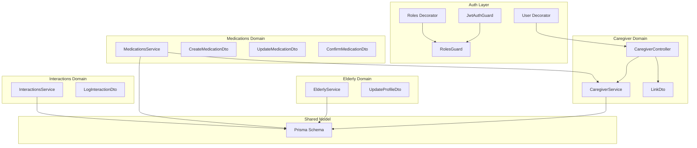
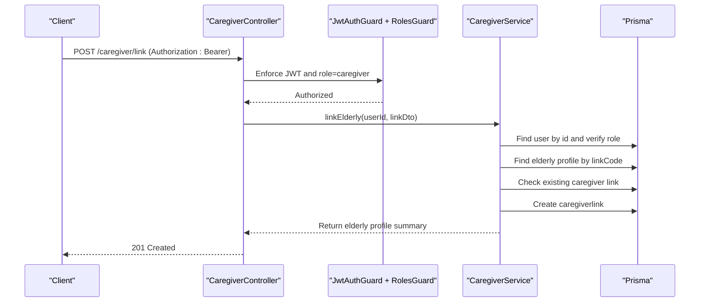
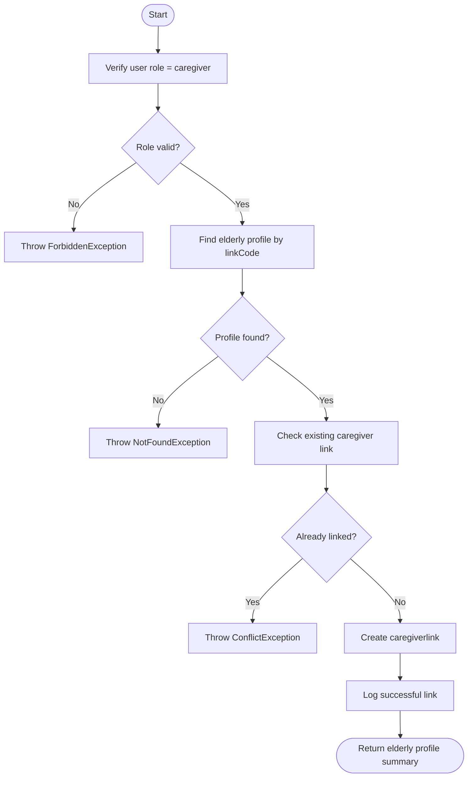
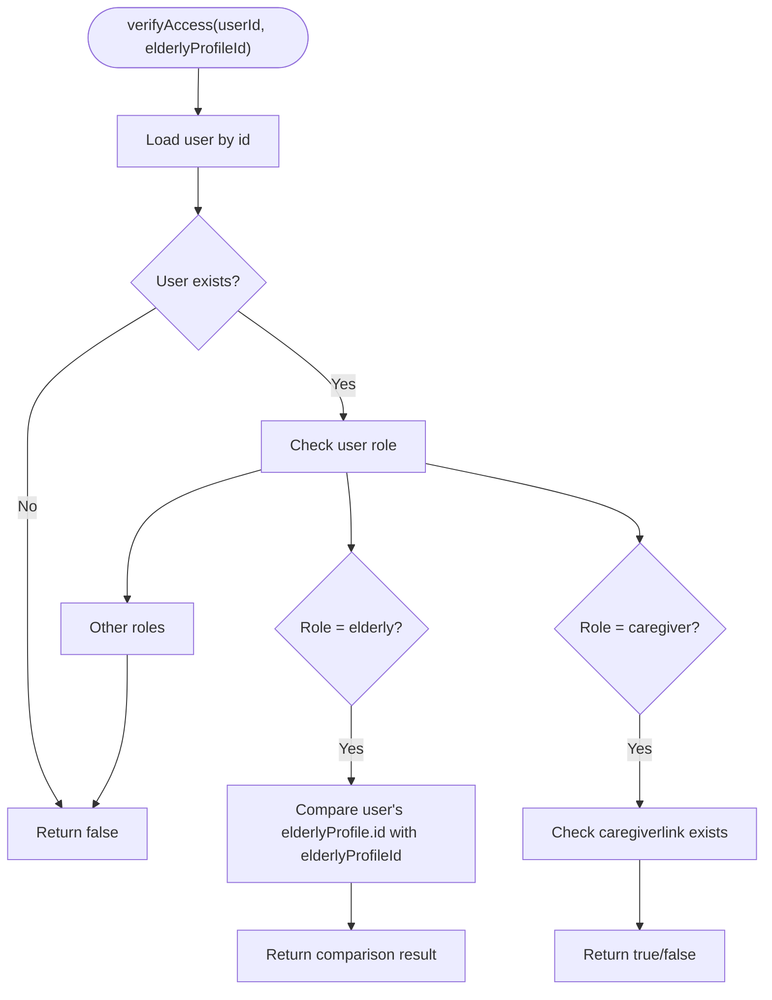
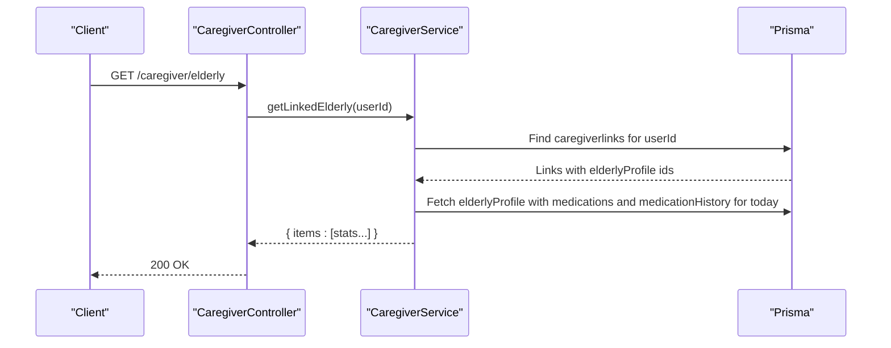
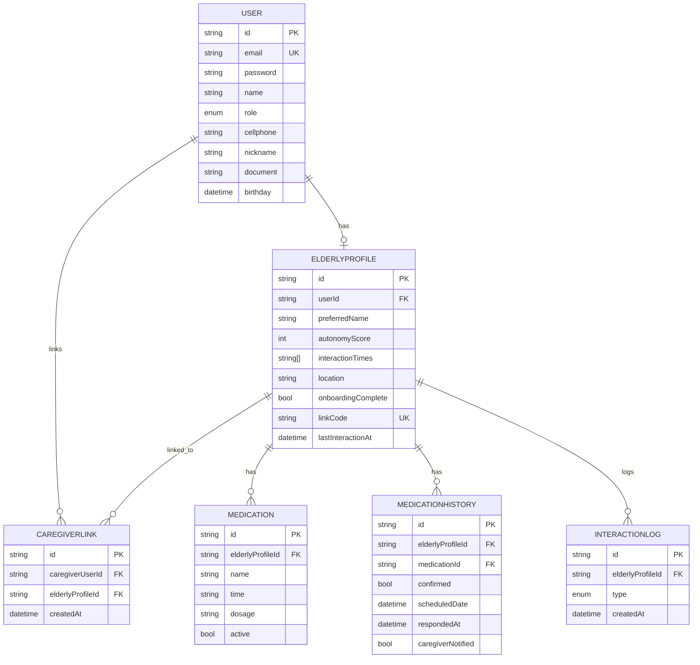
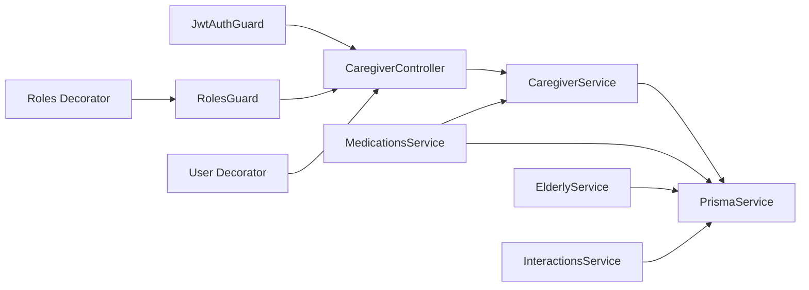

# Caregiver Integration

<cite>
**Referenced Files in This Document**
- [caregiver.controller.ts](file://src/caregiver/caregiver.controller.ts)
- [caregiver.service.ts](file://src/caregiver/caregiver.service.ts)
- [link.dto.ts](file://src/caregiver/dto/link.dto.ts)
- [caregiver.module.ts](file://src/caregiver/caregiver.module.ts)
- [auth.service.ts](file://src/auth/auth.service.ts)
- [jwt-auth.guard.ts](file://src/auth/jwt-auth.guard.ts)
- [roles.guard.ts](file://src/auth/roles.guard.ts)
- [roles.decorator.ts](file://src/auth/roles.decorator.ts)
- [user.decorator.ts](file://src/common/decorators/user.decorator.ts)
- [app.module.ts](file://src/app.module.ts)
- [schema.prisma](file://prisma/schema.prisma)
- [elderly.service.ts](file://src/elderly/elderly.service.ts)
- [medications.service.ts](file://src/medications/medications.service.ts)
- [interactions.service.ts](file://src/interactions/interactions.service.ts)
- [confirm-medication.dto.ts](file://src/medications/dto/confirm-medication.dto.ts)
- [create-medication.dto.ts](file://src/medications/dto/create-medication.dto.ts)
- [update-medication.dto.ts](file://src/medications/dto/update-medication.dto.ts)
- [log-interaction.dto.ts](file://src/interactions/dto/log-interaction.dto.ts)
- [update-profile.dto.ts](file://src/elderly/dto/update-profile.dto.ts)
</cite>

## Table of Contents
1. [Introduction](#introduction)
2. [Project Structure](#project-structure)
3. [Core Components](#core-components)
4. [Architecture Overview](#architecture-overview)
5. [Detailed Component Analysis](#detailed-component-analysis)
6. [Dependency Analysis](#dependency-analysis)
7. [Performance Considerations](#performance-considerations)
8. [Troubleshooting Guide](#troubleshooting-guide)
9. [Conclusion](#conclusion)
10. [Appendices](#appendices)

## Introduction
This document describes the caregiver integration system, focusing on how caregivers register and link to elderly users, how access control is enforced, and how caregiver-specific features operate. It also documents the data model for caregiver-elderly relationships, permission models, and data access patterns. The system leverages role-based access control (RBAC), JWT authentication, and a shared Prisma schema to manage users, profiles, and care-related data.

## Project Structure
The caregiver integration spans several modules:
- Authentication and authorization: JWT guard, roles guard, and role decorator
- Caregiver domain: controller, service, and DTOs
- Elderly domain: profile management and interactions
- Medications domain: medication management and history
- Shared data model: Prisma schema defining users, elderly profiles, caregiver links, and related entities

**Diagram sources**
- [caregiver.controller.ts:1-53](file://src/caregiver/caregiver.controller.ts#L1-L53)
- [caregiver.service.ts:1-222](file://src/caregiver/caregiver.service.ts#L1-L222)
- [link.dto.ts:1-10](file://src/caregiver/dto/link.dto.ts#L1-L10)
- [elderly.service.ts:1-79](file://src/elderly/elderly.service.ts#L1-L79)
- [medications.service.ts:1-310](file://src/medications/medications.service.ts#L1-L310)
- [interactions.service.ts:1-45](file://src/interactions/interactions.service.ts#L1-L45)
- [jwt-auth.guard.ts:1-6](file://src/auth/jwt-auth.guard.ts#L1-L6)
- [roles.guard.ts:1-22](file://src/auth/roles.guard.ts#L1-L22)
- [roles.decorator.ts:1-6](file://src/auth/roles.decorator.ts#L1-L6)
- [user.decorator.ts:1-9](file://src/common/decorators/user.decorator.ts#L1-L9)
- [schema.prisma:1-286](file://prisma/schema.prisma#L1-L286)

**Section sources**
- [app.module.ts:1-36](file://src/app.module.ts#L1-L36)
- [caregiver.module.ts:1-13](file://src/caregiver/caregiver.module.ts#L1-L13)

## Core Components
- CaregiverController: Exposes endpoints for linking to elderly profiles, listing linked elderly, and retrieving detailed elderly information. Uses JWT and roles guards and restricts access to caregivers.
- CaregiverService: Implements business logic for linking, retrieving linked elderly with daily stats, fetching elderly details, and verifying access permissions.
- DTOs: Validation models for link code and other payloads.
- Authentication and Authorization: JWT guard for bearer tokens, roles guard for role enforcement, and a user parameter decorator to extract the authenticated user.
- Data Model: Prisma schema defines users, elderly profiles, caregiver links, medications, medication history, and interactions.

Key responsibilities:
- Registration and linking: Caregivers link to elderly via a 6-character link code generated for elderly profiles during signup.
- Access control: Only caregivers can access caregiver endpoints; access to elderly data is further restricted by linkage verification.
- Care statistics: Daily medication statistics (total, confirmed, missed) and alert thresholds are computed per elderly profile.
- Care activity tracking: Interaction logs and last interaction timestamps are maintained.

**Section sources**
- [caregiver.controller.ts:1-53](file://src/caregiver/caregiver.controller.ts#L1-L53)
- [caregiver.service.ts:1-222](file://src/caregiver/caregiver.service.ts#L1-L222)
- [link.dto.ts:1-10](file://src/caregiver/dto/link.dto.ts#L1-L10)
- [jwt-auth.guard.ts:1-6](file://src/auth/jwt-auth.guard.ts#L1-L6)
- [roles.guard.ts:1-22](file://src/auth/roles.guard.ts#L1-L22)
- [roles.decorator.ts:1-6](file://src/auth/roles.decorator.ts#L1-L6)
- [user.decorator.ts:1-9](file://src/common/decorators/user.decorator.ts#L1-L9)
- [schema.prisma:47-110](file://prisma/schema.prisma#L47-L110)

## Architecture Overview
The caregiver integration follows a layered architecture:
- Presentation: NestJS controllers expose REST endpoints.
- Application: Services encapsulate business logic and enforce access control.
- Persistence: Prisma ORM maps to PostgreSQL.

**Diagram sources**
- [caregiver.controller.ts:23-29](file://src/caregiver/caregiver.controller.ts#L23-L29)
- [caregiver.service.ts:19-64](file://src/caregiver/caregiver.service.ts#L19-L64)
- [jwt-auth.guard.ts:1-6](file://src/auth/jwt-auth.guard.ts#L1-L6)
- [roles.guard.ts:10-20](file://src/auth/roles.guard.ts#L10-L20)
- [schema.prisma:47-110](file://prisma/schema.prisma#L47-L110)

## Detailed Component Analysis

### Caregiver Registration and Linking Workflow
- Elderly registration: During signup, if the role is elderly, a unique link code is generated and stored with the elderly profile.
- Caregiver linking: Caregivers submit a 6-character link code; the system verifies uniqueness, prevents duplicate links, and creates a caregiver link record.
- Access verification: The system checks whether the authenticated user is a caregiver and whether the caregiver is linked to the target elderly profile.

**Diagram sources**
- [caregiver.service.ts:19-64](file://src/caregiver/caregiver.service.ts#L19-L64)
- [auth.service.ts:70-79](file://src/auth/auth.service.ts#L70-L79)
- [schema.prisma:71-96](file://prisma/schema.prisma#L71-L96)

**Section sources**
- [caregiver.controller.ts:23-29](file://src/caregiver/caregiver.controller.ts#L23-L29)
- [caregiver.service.ts:19-64](file://src/caregiver/caregiver.service.ts#L19-L64)
- [auth.service.ts:70-79](file://src/auth/auth.service.ts#L70-L79)
- [link.dto.ts:1-10](file://src/caregiver/dto/link.dto.ts#L1-L10)

### Access Control and Permission Model
- Authentication: All caregiver endpoints require a valid JWT bearer token.
- Authorization: The roles guard enforces that only users with the caregiver role can access caregiver endpoints.
- Data access: The verifyAccess method ensures that:
  - Elderly users can only access their own profile.
  - Caregivers can access only elderly profiles they are linked to.
  - Other roles are denied by default.

**Diagram sources**
- [caregiver.service.ts:188-220](file://src/caregiver/caregiver.service.ts#L188-L220)

**Section sources**
- [caregiver.controller.ts:18-19](file://src/caregiver/caregiver.controller.ts#L18-L19)
- [roles.guard.ts:10-20](file://src/auth/roles.guard.ts#L10-L20)
- [roles.decorator.ts:1-6](file://src/auth/roles.decorator.ts#L1-L6)
- [caregiver.service.ts:188-220](file://src/caregiver/caregiver.service.ts#L188-L220)

### Caregiver-Related Features: Statistics and Activity Tracking
- Linked elderly listing: Returns a list of elderly profiles linked to the caregiver, including daily medication statistics and alerts.
- Elderly details: Retrieves detailed information for a specific elderly profile, including today’s medication stats and last interaction timestamp.
- Care activity tracking: Interaction logs are recorded and the elderly profile’s last interaction timestamp is updated.

**Diagram sources**
- [caregiver.controller.ts:31-37](file://src/caregiver/caregiver.controller.ts#L31-L37)
- [caregiver.service.ts:66-120](file://src/caregiver/caregiver.service.ts#L66-L120)

**Section sources**
- [caregiver.controller.ts:31-51](file://src/caregiver/caregiver.controller.ts#L31-L51)
- [caregiver.service.ts:66-186](file://src/caregiver/caregiver.service.ts#L66-L186)
- [interactions.service.ts:12-43](file://src/interactions/interactions.service.ts#L12-L43)

### Data Access Patterns and Relationships
- Caregiver-elderly relationship: Managed via the caregiverlink table, ensuring one-to-many semantics and preventing duplicates.
- Elderly profile: Contains personal preferences, autonomy score, interaction times, location, and a unique link code.
- Medication and history: Medications define scheduled doses; medication history records daily confirmations and missed doses.
- Interactions: Logs interaction events and updates last interaction timestamps.

**Diagram sources**
- [schema.prisma:47-212](file://prisma/schema.prisma#L47-L212)

**Section sources**
- [schema.prisma:47-212](file://prisma/schema.prisma#L47-L212)

### API Documentation

- Base Path: `/caregiver`
- Security: Bearer token required; role must be caregiver for all endpoints.

Endpoints:
- POST /link
  - Description: Link caregiver to an elderly user using a 6-character link code.
  - Authenticated: Yes
  - Roles: caregiver
  - Request body: [LinkDto:1-10](file://src/caregiver/dto/link.dto.ts#L1-L10)
  - Responses:
    - 201 Created: Link created successfully; returns elderly profile summary.
    - 400 Bad Request: Invalid link code or already linked.
    - 403 Forbidden: Not authorized as a caregiver.
    - 404 Not Found: Invalid link code.

- GET /elderly
  - Description: List all elderly users linked to the caregiver with daily medication statistics and alerts.
  - Authenticated: Yes
  - Roles: caregiver
  - Responses:
    - 200 OK: Array of elderly items with todayMedicationStats and hasAlert.
    - 403 Forbidden: Not authorized as a caregiver.

- GET /elderly/{elderlyProfileId}
  - Description: Retrieve detailed information for a specific elderly profile linked to the caregiver.
  - Authenticated: Yes
  - Roles: caregiver
  - Path parameters:
    - elderlyProfileId: string
  - Responses:
    - 200 OK: Elderly profile details including todayMedicationStats and lastInteraction.
    - 403 Forbidden: Not linked to the elderly profile.
    - 404 Not Found: Profile not found.

Notes:
- The elderly domain exposes profile management and interaction logging APIs that complement caregiver access. These are used by elderly users to manage their profiles and log interactions.

**Section sources**
- [caregiver.controller.ts:23-51](file://src/caregiver/caregiver.controller.ts#L23-L51)
- [link.dto.ts:1-10](file://src/caregiver/dto/link.dto.ts#L1-L10)

### Examples of Common Caregiver Scenarios

- Profile Management (Elderly perspective):
  - Elderly users can retrieve and update their profile, including preferred name, autonomy score, interaction times, location, and onboarding completion flag.
  - Example operations:
    - GET profile: Retrieve current profile data.
    - PUT profile: Update profile fields (preferred name, autonomy score, interaction times, location, onboarding completion).

  **Section sources**
  - [elderly.service.ts:17-77](file://src/elderly/elderly.service.ts#L17-L77)
  - [update-profile.dto.ts:1-44](file://src/elderly/dto/update-profile.dto.ts#L1-L44)

- Access Requests (Medications):
  - Caregivers can manage medications for linked elderly profiles: list, create, update, delete, and view history.
  - Elderly users can view today’s medications and confirm or mark them as missed.

  **Section sources**
  - [medications.service.ts:24-310](file://src/medications/medications.service.ts#L24-L310)
  - [create-medication.dto.ts:1-17](file://src/medications/dto/create-medication.dto.ts#L1-L17)
  - [update-medication.dto.ts:1-25](file://src/medications/dto/update-medication.dto.ts#L1-L25)
  - [confirm-medication.dto.ts:1-9](file://src/medications/dto/confirm-medication.dto.ts#L1-L9)

- Care Coordination (Interactions):
  - Elderly users log interactions (voice or button), which updates the elderly profile’s last interaction timestamp.
  - Caregivers can rely on these timestamps and interaction logs as part of care coordination.

  **Section sources**
  - [interactions.service.ts:12-43](file://src/interactions/interactions.service.ts#L12-L43)
  - [log-interaction.dto.ts:1-10](file://src/interactions/dto/log-interaction.dto.ts#L1-L10)

## Dependency Analysis
- CaregiverController depends on CaregiverService and authentication guards.
- CaregiverService depends on PrismaService and uses the verifyAccess method for access control.
- MedicationsService depends on CaregiverService to verify access before performing operations.
- ElderlyService and InteractionsService are used by elderly users; their access is enforced by role guards.

**Diagram sources**
- [caregiver.controller.ts:1-53](file://src/caregiver/caregiver.controller.ts#L1-L53)
- [caregiver.service.ts:1-222](file://src/caregiver/caregiver.service.ts#L1-L222)
- [medications.service.ts:1-310](file://src/medications/medications.service.ts#L1-L310)
- [elderly.service.ts:1-79](file://src/elderly/elderly.service.ts#L1-L79)
- [interactions.service.ts:1-45](file://src/interactions/interactions.service.ts#L1-L45)
- [jwt-auth.guard.ts:1-6](file://src/auth/jwt-auth.guard.ts#L1-L6)
- [roles.guard.ts:1-22](file://src/auth/roles.guard.ts#L1-L22)
- [roles.decorator.ts:1-6](file://src/auth/roles.decorator.ts#L1-L6)
- [user.decorator.ts:1-9](file://src/common/decorators/user.decorator.ts#L1-L9)

**Section sources**
- [caregiver.module.ts:1-13](file://src/caregiver/caregiver.module.ts#L1-L13)
- [app.module.ts:1-36](file://src/app.module.ts#L1-L36)

## Performance Considerations
- Indexes: The Prisma schema includes strategic indexes on foreign keys and composite keys to optimize lookups for caregiver links, medication history, and elderly profiles.
- Filtering by date: Queries filter medication history by the current day to keep results bounded.
- Aggregation: Statistics are computed client-side from included relations to minimize round-trips while keeping logic explicit.

Recommendations:
- Consider caching frequently accessed elderly summaries for caregivers.
- Add pagination for listing elderly profiles if the number of links grows large.
- Monitor Prisma queries for N+1 issues; the current implementation includes relations efficiently.

**Section sources**
- [schema.prisma:98-145](file://prisma/schema.prisma#L98-L145)
- [caregiver.service.ts:73-92](file://src/caregiver/caregiver.service.ts#L73-L92)

## Troubleshooting Guide
Common issues and resolutions:
- Authentication failures:
  - Symptom: 401 Unauthorized or 403 Forbidden on caregiver endpoints.
  - Cause: Missing or invalid JWT, or user role is not caregiver.
  - Resolution: Ensure the Authorization header contains a valid Bearer token and the user has role caregiver.

- Invalid link code:
  - Symptom: 404 Not Found when linking.
  - Cause: The elderly profile link code does not exist.
  - Resolution: Verify the link code and ensure it matches the elderly profile.

- Already linked:
  - Symptom: 409 Conflict when linking.
  - Cause: Duplicate caregiver-elderly link.
  - Resolution: Do not re-link; use existing linkage.

- Access denied:
  - Symptom: 403 Forbidden when accessing elderly details.
  - Cause: User is not linked to the specified elderly profile.
  - Resolution: Ensure the caregiver is linked to the elderly profile before accessing details.

- Profile not found:
  - Symptom: 404 Not Found when retrieving elderly details.
  - Cause: Elderly profile does not exist.
  - Resolution: Confirm the elderly profile ID is correct.

Audit and logging:
- The system logs significant actions (linking, medication confirmations, interaction logs) to aid auditing and troubleshooting.

**Section sources**
- [caregiver.controller.ts:18-19](file://src/caregiver/caregiver.controller.ts#L18-L19)
- [caregiver.service.ts:22-24](file://src/caregiver/caregiver.service.ts#L22-L24)
- [caregiver.service.ts:30-32](file://src/caregiver/caregiver.service.ts#L30-L32)
- [caregiver.service.ts:44-46](file://src/caregiver/caregiver.service.ts#L44-L46)
- [caregiver.service.ts:139-141](file://src/caregiver/caregiver.service.ts#L139-L141)
- [medications.service.ts:25-31](file://src/medications/medications.service.ts#L25-L31)
- [interactions.service.ts:32-36](file://src/interactions/interactions.service.ts#L32-L36)

## Conclusion
The caregiver integration system provides a secure, role-based pathway for caregivers to link to elderly users and manage care-related data. Access control is enforced at both the endpoint and data level, ensuring caregivers can only access profiles they are linked to. The system offers caregiver-specific insights such as daily medication statistics and alerts, and integrates with elderly profile management and interaction logging to support coordinated care.

## Appendices

### Data Model Summary
- Users: Store identity, credentials, and roles.
- Elderly Profiles: Contain personal details, preferences, autonomy score, interaction times, location, onboarding status, and a unique link code.
- Caregiver Links: Establish many-to-one relationships between caregivers and elderly profiles.
- Medications and History: Track scheduled medications and daily confirmations/missestions.
- Interactions: Record interaction events and maintain last interaction timestamps.

**Section sources**
- [schema.prisma:47-212](file://prisma/schema.prisma#L47-L212)