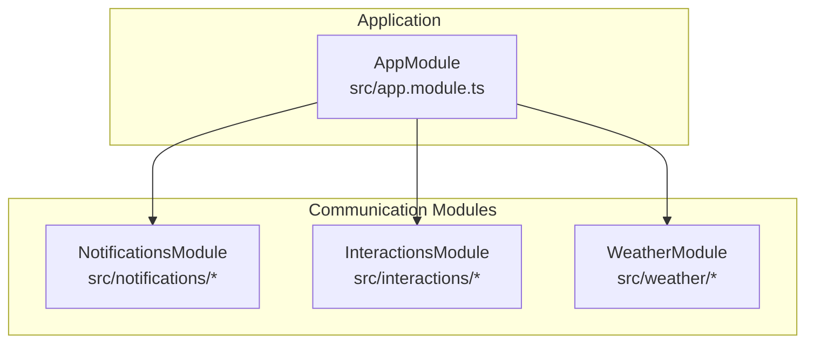
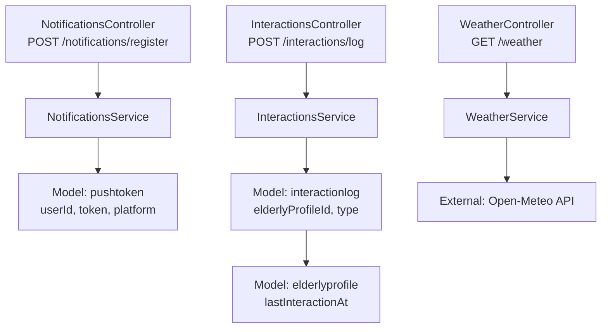
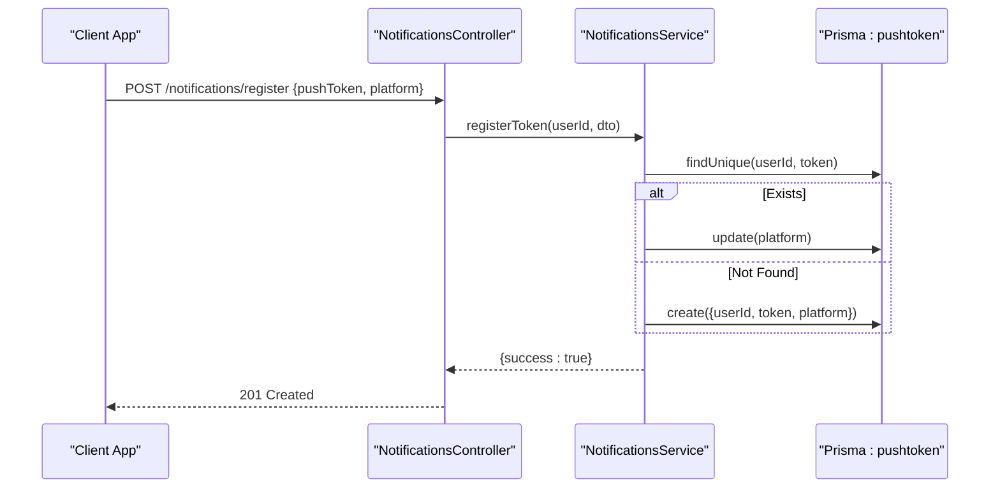
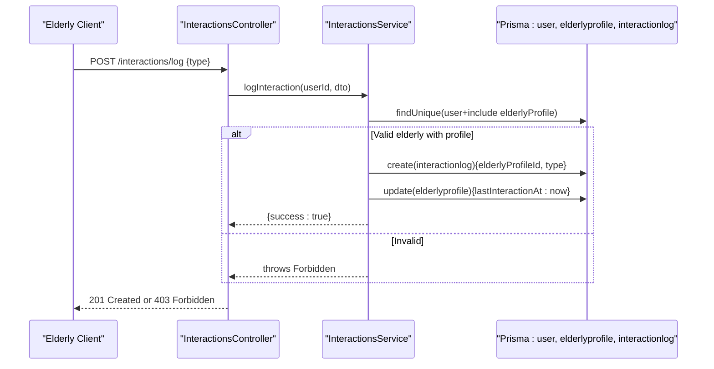
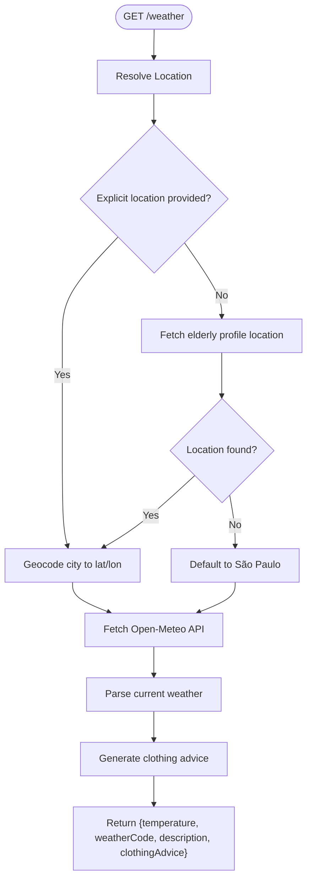
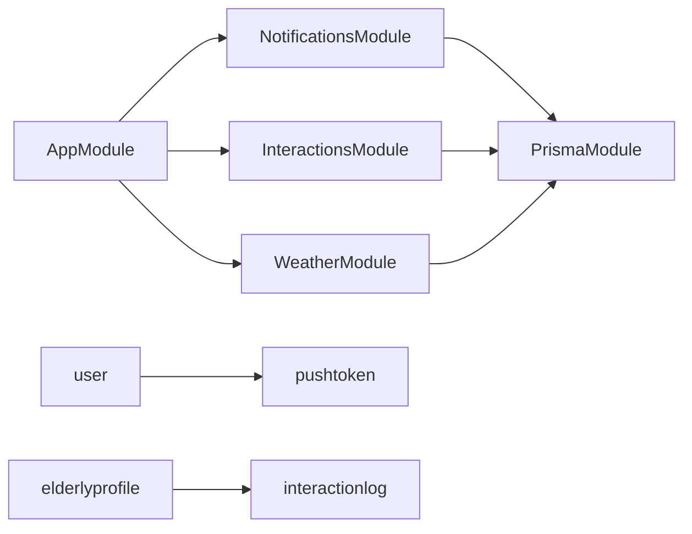

# Communication Systems

<cite>
**Referenced Files in This Document**
- [app.module.ts](file://src/app.module.ts)
- [schema.prisma](file://prisma/schema.prisma)
- [notifications.controller.ts](file://src/notifications/notifications.controller.ts)
- [notifications.service.ts](file://src/notifications/notifications.service.ts)
- [register-token.dto.ts](file://src/notifications/dto/register-token.dto.ts)
- [interactions.controller.ts](file://src/interactions/interactions.controller.ts)
- [interactions.service.ts](file://src/interactions/interactions.service.ts)
- [log-interaction.dto.ts](file://src/interactions/dto/log-interaction.dto.ts)
- [weather.controller.ts](file://src/weather/weather.controller.ts)
- [weather.service.ts](file://src/weather/weather.service.ts)
</cite>

## Table of Contents
1. [Introduction](#introduction)
2. [Project Structure](#project-structure)
3. [Core Components](#core-components)
4. [Architecture Overview](#architecture-overview)
5. [Detailed Component Analysis](#detailed-component-analysis)
6. [Dependency Analysis](#dependency-analysis)
7. [Performance Considerations](#performance-considerations)
8. [Troubleshooting Guide](#troubleshooting-guide)
9. [Conclusion](#conclusion)
10. [Appendices](#appendices)

## Introduction
This document describes the communication systems within the 99-Pai platform, focusing on:
- Push notifications with token management and platform support
- Interaction logging for care activity tracking
- Weather integration for location-based services

It documents the implementation of notification delivery mechanisms, interaction type classification, and weather data integration. It also provides API documentation for communication endpoints, notification templates, and interaction recording, along with examples of common communication scenarios such as care reminders, service updates, and weather alerts. Platform-specific considerations for iOS/Android/web notification delivery and data privacy for communication logs are addressed.

## Project Structure
The communication subsystems are implemented as independent NestJS modules integrated into the main application module. Each module exposes a controller with Swagger metadata and a service that encapsulates business logic and persistence via Prisma.

**Diagram sources**
- [app.module.ts:17-33](file://src/app.module.ts#L17-L33)

**Section sources**
- [app.module.ts:17-33](file://src/app.module.ts#L17-L33)

## Core Components
- Push Notifications
  - Endpoint: POST /notifications/register
  - Purpose: Register or update a push notification token per user and platform
  - Supported platforms: ios, android, web
  - Persistence: Tokens stored with unique constraint on (userId, token)
- Interaction Logging
  - Endpoint: POST /interactions/log
  - Purpose: Record care interaction events (voice or button) for elderly users
  - Persistence: Logs linked to elderly profile with timestamps
- Weather Integration
  - Endpoint: GET /weather
  - Purpose: Retrieve current weather conditions and clothing advice
  - Location resolution: explicit query param or elderly profile location fallback
  - External service: Open-Meteo API

**Section sources**
- [notifications.controller.ts:20-28](file://src/notifications/notifications.controller.ts#L20-L28)
- [interactions.controller.ts:23-29](file://src/interactions/interactions.controller.ts#L23-L29)
- [weather.controller.ts:20-26](file://src/weather/weather.controller.ts#L20-L26)
- [schema.prisma:190-212](file://prisma/schema.prisma#L190-L212)

## Architecture Overview
The communication systems follow a layered architecture:
- Controllers expose REST endpoints with Swagger metadata and JWT guard
- Services encapsulate business logic and coordinate with Prisma
- Prisma models define data structures and relationships
- External integrations are isolated in services (e.g., weather API)

**Diagram sources**
- [notifications.controller.ts:17-28](file://src/notifications/notifications.controller.ts#L17-L28)
- [notifications.service.ts:11-44](file://src/notifications/notifications.service.ts#L11-L44)
- [interactions.controller.ts:20-29](file://src/interactions/interactions.controller.ts#L20-L29)
- [interactions.service.ts:12-43](file://src/interactions/interactions.service.ts#L12-L43)
- [weather.controller.ts:17-26](file://src/weather/weather.controller.ts#L17-L26)
- [weather.service.ts:10-72](file://src/weather/weather.service.ts#L10-L72)
- [schema.prisma:190-212](file://prisma/schema.prisma#L190-L212)

## Detailed Component Analysis

### Push Notifications
- Endpoint
  - Method: POST
  - Path: /notifications/register
  - Authentication: Bearer JWT
  - Roles: None (uses JWT guard)
- Request Body
  - pushToken: string
  - platform: enum [ios, android, web]
- Behavior
  - Upsert token per user
  - Update platform if token exists
  - Return success indicator
- Delivery Mechanism
  - Current implementation logs notification attempts
  - Real-world deployment would integrate with FCM/APNs/WebPush
- Data Model
  - pushtoken: unique (userId, token); includes platform

**Diagram sources**
- [notifications.controller.ts:20-28](file://src/notifications/notifications.controller.ts#L20-L28)
- [notifications.service.ts:11-44](file://src/notifications/notifications.service.ts#L11-L44)
- [register-token.dto.ts:5-13](file://src/notifications/dto/register-token.dto.ts#L5-L13)
- [schema.prisma:190-201](file://prisma/schema.prisma#L190-L201)

**Section sources**
- [notifications.controller.ts:13-28](file://src/notifications/notifications.controller.ts#L13-L28)
- [notifications.service.ts:11-44](file://src/notifications/notifications.service.ts#L11-L44)
- [register-token.dto.ts:5-13](file://src/notifications/dto/register-token.dto.ts#L5-L13)
- [schema.prisma:190-201](file://prisma/schema.prisma#L190-L201)

### Interaction Logging
- Endpoint
  - Method: POST
  - Path: /interactions/log
  - Authentication: Bearer JWT
  - Guards: JWT + Roles (elderly)
- Request Body
  - type: enum [voice, button]
- Behavior
  - Validates user is elderly with profile
  - Creates interaction log record
  - Updates elderly profile lastInteractionAt
- Data Model
  - interactionlog: links to elderly profile
  - elderlyprofile: lastInteractionAt timestamp

**Diagram sources**
- [interactions.controller.ts:23-29](file://src/interactions/interactions.controller.ts#L23-L29)
- [interactions.service.ts:12-43](file://src/interactions/interactions.service.ts#L12-L43)
- [log-interaction.dto.ts:5-9](file://src/interactions/dto/log-interaction.dto.ts#L5-L9)
- [schema.prisma:71-96](file://prisma/schema.prisma#L71-L96)
- [schema.prisma:203-212](file://prisma/schema.prisma#L203-L212)

**Section sources**
- [interactions.controller.ts:16-29](file://src/interactions/interactions.controller.ts#L16-L29)
- [interactions.service.ts:12-43](file://src/interactions/interactions.service.ts#L12-L43)
- [log-interaction.dto.ts:5-9](file://src/interactions/dto/log-interaction.dto.ts#L5-L9)
- [schema.prisma:71-96](file://prisma/schema.prisma#L71-L96)
- [schema.prisma:203-212](file://prisma/schema.prisma#L203-L212)

### Weather Integration
- Endpoint
  - Method: GET
  - Path: /weather
  - Authentication: Bearer JWT
  - Query: location (optional)
- Behavior
  - Resolves coordinates from explicit location or elderly profile location
  - Defaults to São Paulo if no location available
  - Calls Open-Meteo API for current weather
  - Returns temperature, weather code, description, and clothing advice
- Data Model
  - No persistent model for weather; data is transient

**Diagram sources**
- [weather.controller.ts:20-26](file://src/weather/weather.controller.ts#L20-L26)
- [weather.service.ts:10-72](file://src/weather/weather.service.ts#L10-L72)
- [schema.prisma:71-82](file://prisma/schema.prisma#L71-L82)

**Section sources**
- [weather.controller.ts:13-26](file://src/weather/weather.controller.ts#L13-L26)
- [weather.service.ts:10-72](file://src/weather/weather.service.ts#L10-L72)
- [schema.prisma:71-82](file://prisma/schema.prisma#L71-L82)

## Dependency Analysis
- Module composition
  - AppModule imports NotificationsModule, InteractionsModule, WeatherModule
  - Each module depends on PrismaModule for data access
- Cross-cutting concerns
  - JWT guard applied to all communication endpoints
  - Swagger tags and operation metadata present on controllers
- Data relationships
  - pushtoken belongs to user
  - interactionlog belongs to elderly profile
  - elderly profile tracks last interaction timestamp

**Diagram sources**
- [app.module.ts:17-33](file://src/app.module.ts#L17-L33)
- [schema.prisma:47-65](file://prisma/schema.prisma#L47-L65)
- [schema.prisma:190-201](file://prisma/schema.prisma#L190-L201)
- [schema.prisma:203-212](file://prisma/schema.prisma#L203-L212)

**Section sources**
- [app.module.ts:17-33](file://src/app.module.ts#L17-L33)
- [schema.prisma:47-65](file://prisma/schema.prisma#L47-L65)
- [schema.prisma:190-201](file://prisma/schema.prisma#L190-L201)
- [schema.prisma:203-212](file://prisma/schema.prisma#L203-L212)

## Performance Considerations
- Token upsert
  - Single lookup by unique (userId, token) ensures O(1) token existence check
  - Update only platform when token exists avoids duplication
- Notification sending
  - Current implementation logs; in production, batch and rate-limit external pushes
  - Consider queuing and retries for reliability
- Interaction logging
  - Single insert plus single update; minimal overhead
  - Indexes on elderly profile and interaction log timestamps support queries
- Weather fetching
  - External API latency dominates; consider caching and short TTL
  - City-to-coords mapping is O(1) hash lookup

[No sources needed since this section provides general guidance]

## Troubleshooting Guide
- Push notifications
  - Symptom: Registration succeeds but no devices receive notifications
  - Actions: Verify platform field matches client SDK, ensure token validity, check external push provider configuration
  - Related code: token registration and send method
- Interaction logging
  - Symptom: 403 Forbidden when logging interactions
  - Actions: Confirm user role is elderly and elderly profile exists
  - Related code: role guard and validation logic
- Weather endpoint
  - Symptom: 400 Bad Request for invalid location
  - Actions: Provide supported city name or valid coordinates; check network connectivity to Open-Meteo
  - Related code: location resolution and API error handling

**Section sources**
- [notifications.service.ts:46-64](file://src/notifications/notifications.service.ts#L46-L64)
- [interactions.service.ts:18-20](file://src/interactions/interactions.service.ts#L18-L20)
- [weather.service.ts:15-50](file://src/weather/weather.service.ts#L15-L50)

## Conclusion
The 99-Pai platform implements three core communication capabilities:
- Push notifications with robust token management and platform awareness
- Interaction logging tailored to elderly users for care tracking
- Weather integration with location resolution and actionable advice

The modular design, clear separation of concerns, and Swagger-enabled endpoints facilitate maintainability and extensibility. Future enhancements should focus on integrating reliable push delivery, implementing structured notification templates, and adding privacy controls for communication logs.

[No sources needed since this section summarizes without analyzing specific files]

## Appendices

### API Reference: Push Notifications
- POST /notifications/register
  - Auth: Bearer JWT
  - Request body: RegisterTokenDto
    - pushToken: string
    - platform: enum [ios, android, web]
  - Responses:
    - 201 Created: Token registered/updated
    - 401 Unauthorized: Invalid or missing token
  - Notes:
    - Tokens are unique per user and device
    - Platform is updated if the same token is reused on a different platform

**Section sources**
- [notifications.controller.ts:13-28](file://src/notifications/notifications.controller.ts#L13-L28)
- [register-token.dto.ts:5-13](file://src/notifications/dto/register-token.dto.ts#L5-L13)
- [schema.prisma:190-201](file://prisma/schema.prisma#L190-L201)

### API Reference: Interaction Logging
- POST /interactions/log
  - Auth: Bearer JWT
  - Roles: elderly
  - Request body: LogInteractionDto
    - type: enum [voice, button]
  - Responses:
    - 201 Created: Interaction logged
    - 403 Forbidden: Non-elderly user or missing profile
  - Notes:
    - Updates elderly profile last interaction timestamp
    - Only elderly users can log interactions

**Section sources**
- [interactions.controller.ts:16-29](file://src/interactions/interactions.controller.ts#L16-L29)
- [log-interaction.dto.ts:5-9](file://src/interactions/dto/log-interaction.dto.ts#L5-L9)
- [schema.prisma:71-96](file://prisma/schema.prisma#L71-L96)

### API Reference: Weather Integration
- GET /weather
  - Auth: Bearer JWT
  - Query: location (optional)
  - Responses:
    - 200 OK: Weather data {temperature, temperatureUnit, weatherCode, weatherDescription, clothingAdvice}
    - 400 Bad Request: Invalid location or failed to fetch weather
  - Notes:
    - Supported cities include major Brazilian metropolitan areas
    - Defaults to São Paulo if no location provided

**Section sources**
- [weather.controller.ts:13-26](file://src/weather/weather.controller.ts#L13-L26)
- [weather.service.ts:10-72](file://src/weather/weather.service.ts#L10-L72)

### Notification Templates (Conceptual)
- Care Reminder
  - Title: "Time for your medication"
  - Body: "Please take your medication now"
  - Action: Open medication screen
- Service Update
  - Title: "Caregiver availability"
  - Body: "Your caregiver is available today"
  - Action: View schedule
- Weather Alert
  - Title: "Weather advisory"
  - Body: "Temperature drops below freezing tonight"
  - Action: View clothing advice

[No sources needed since this section provides conceptual guidance]

### Platform-Specific Considerations
- iOS
  - Use APNs; ensure proper certificate/provisioning profile
  - Handle sandbox vs production environments
- Android
  - Use FCM; manage server keys and device tokens
  - Account for background restrictions and battery optimization
- Web
  - Use WebPush protocol; handle subscription lifecycle and permission prompts
- Privacy
  - Store tokens encrypted at rest
  - Limit retention of personal data; implement user consent and opt-out mechanisms
  - Comply with regional regulations (e.g., GDPR, Lei Geral de Proteção de Dados)

[No sources needed since this section provides general guidance]