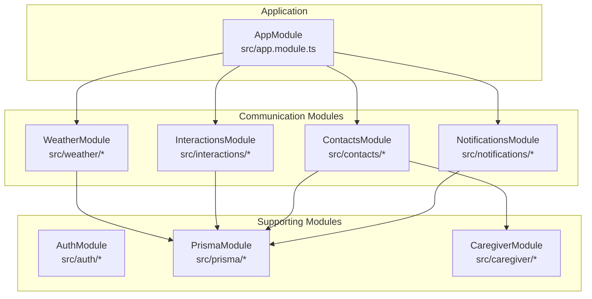
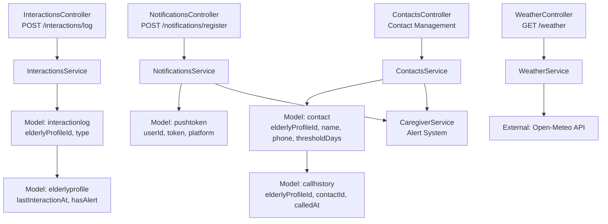
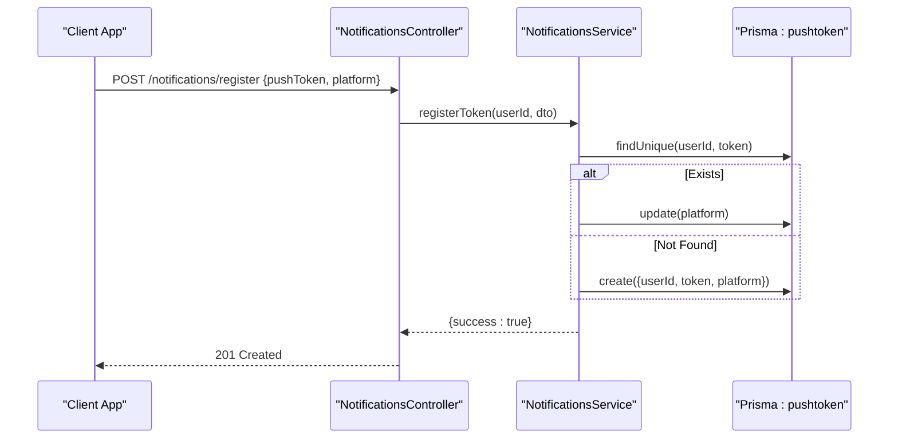
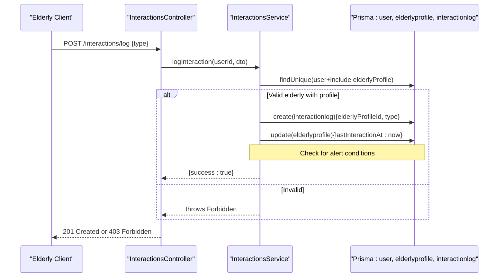
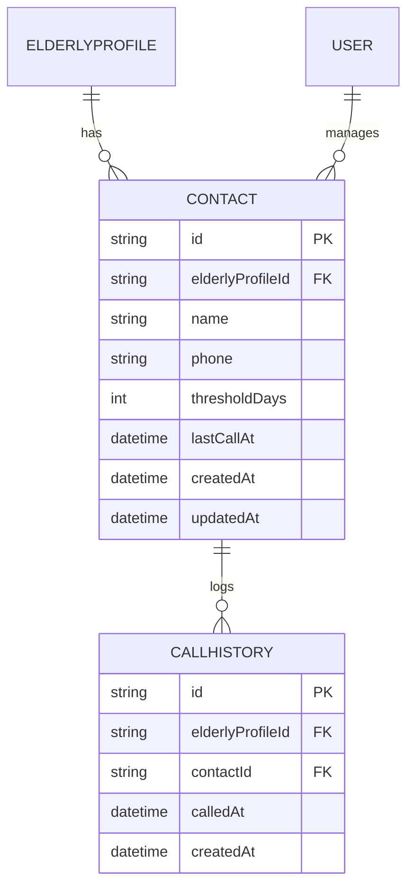
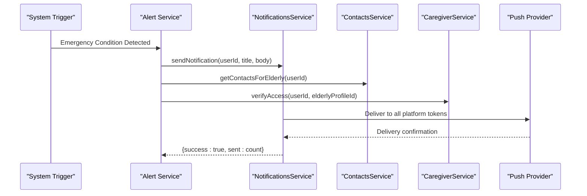
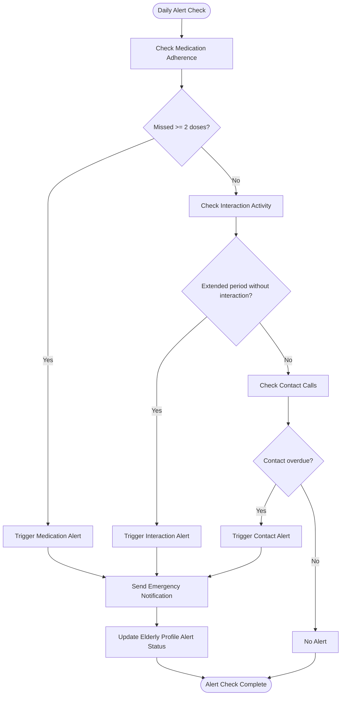
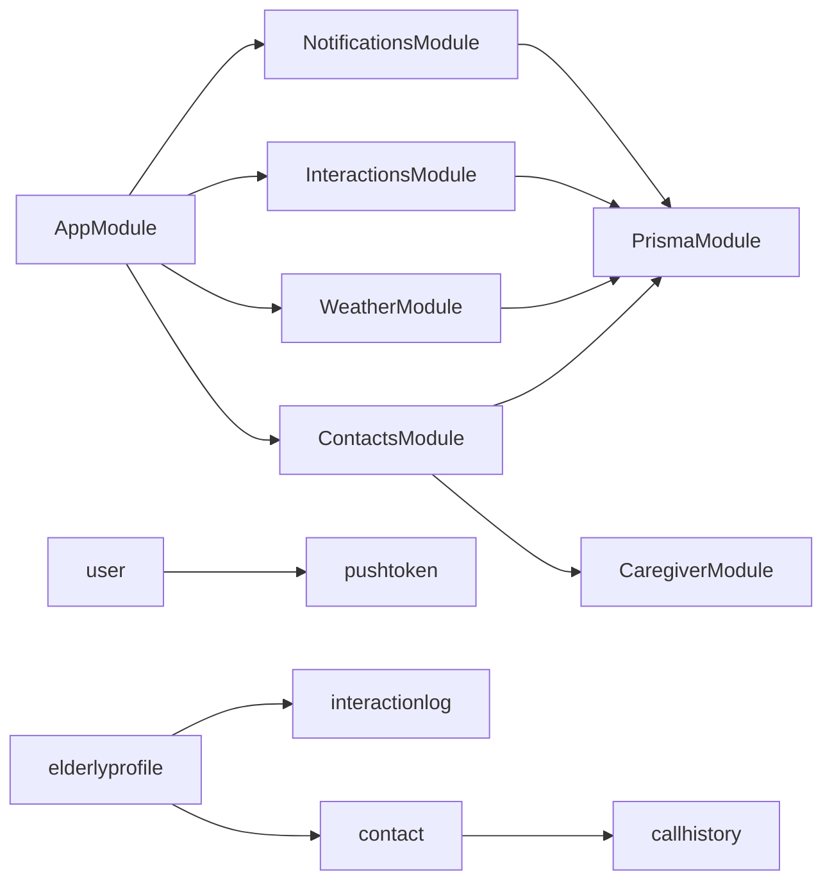

# Communication Systems

<cite>
**Referenced Files in This Document**
- [app.module.ts](file://src/app.module.ts)
- [schema.prisma](file://prisma/schema.prisma)
- [notifications.controller.ts](file://src/notifications/notifications.controller.ts)
- [notifications.service.ts](file://src/notifications/notifications.service.ts)
- [register-token.dto.ts](file://src/notifications/dto/register-token.dto.ts)
- [interactions.controller.ts](file://src/interactions/interactions.controller.ts)
- [interactions.service.ts](file://src/interactions/interactions.service.ts)
- [log-interaction.dto.ts](file://src/interactions/dto/log-interaction.dto.ts)
- [weather.controller.ts](file://src/weather/weather.controller.ts)
- [weather.service.ts](file://src/weather/weather.service.ts)
- [contacts.controller.ts](file://src/contacts/contacts.controller.ts)
- [contacts.service.ts](file://src/contacts/contacts.service.ts)
- [create-contact.dto.ts](file://src/contacts/dto/create-contact.dto.ts)
- [update-contact.dto.ts](file://src/contacts/dto/update-contact.dto.ts)
- [caregiver.service.ts](file://src/caregiver/caregiver.service.ts)
- [usePushNotifications.ts](file://mobile-app/src/hooks/usePushNotifications.ts)
</cite>

## Update Summary
**Changes Made**
- Added comprehensive emergency contacts system with contact management and call tracking
- Enhanced notification system with platform-specific delivery mechanisms
- Integrated caregiver alert system for emergency monitoring
- Added call history tracking and overdue contact management
- Updated architecture diagrams to reflect expanded communication ecosystem

## Table of Contents
1. [Introduction](#introduction)
2. [Project Structure](#project-structure)
3. [Core Components](#core-components)
4. [Architecture Overview](#architecture-overview)
5. [Detailed Component Analysis](#detailed-component-analysis)
6. [Emergency Contacts System](#emergency-contacts-system)
7. [Notification Delivery Mechanisms](#notification-delivery-mechanisms)
8. [Caregiver Alert System](#caregiver-alert-system)
9. [Dependency Analysis](#dependency-analysis)
10. [Performance Considerations](#performance-considerations)
11. [Troubleshooting Guide](#troubleshooting-guide)
12. [Conclusion](#conclusion)
13. [Appendices](#appendices)

## Introduction
This document describes the comprehensive communication systems within the 99-Pai platform, focusing on three integrated communication channels:

- **Push Notifications** with token management, platform support, and emergency alert delivery
- **Emergency Contacts System** for family member and caregiver coordination with call tracking and overdue management
- **Interaction Logging** for care activity tracking and health monitoring

The platform implements a unified communication ecosystem that enables real-time care coordination, emergency response capabilities, and comprehensive care activity monitoring. It documents the implementation of notification delivery mechanisms, contact management workflows, interaction type classification, and emergency alert protocols. The system provides API documentation for communication endpoints, notification templates, contact management, and interaction recording, along with examples of common communication scenarios including care reminders, service updates, weather alerts, and emergency notifications.

## Project Structure
The communication subsystems are implemented as independent NestJS modules integrated into the main application module. Each module exposes a controller with Swagger metadata and a service that encapsulates business logic and persistence via Prisma. The system now includes three primary communication modules plus supporting infrastructure.

**Diagram sources**
- [app.module.ts:17-33](file://src/app.module.ts#L17-L33)

**Section sources**
- [app.module.ts:17-33](file://src/app.module.ts#L17-L33)

## Core Components
- **Push Notifications**
  - Endpoint: POST /notifications/register
  - Purpose: Register or update a push notification token per user and platform
  - Supported platforms: ios, android, web
  - Persistence: Tokens stored with unique constraint on (userId, token)
  - Emergency delivery: Integrated with caregiver alert system for critical notifications
- **Emergency Contacts System**
  - Endpoints: GET/POST/PATCH/DELETE /elderly/:elderlyProfileId/contacts
  - Purpose: Manage emergency contacts with call tracking and overdue management
  - Features: Contact threshold management, call history logging, overdue status calculation
  - Persistence: Contacts with call history tracking
- **Interaction Logging**
  - Endpoint: POST /interactions/log
  - Purpose: Record care interaction events (voice or button) for elderly users
  - Persistence: Logs linked to elderly profile with timestamps
  - Integration: Used for caregiver alert triggers and care monitoring
- **Weather Integration**
  - Endpoint: GET /weather
  - Purpose: Retrieve current weather conditions and clothing advice
  - Location resolution: explicit query param or elderly profile location fallback
  - External service: Open-Meteo API

**Section sources**
- [notifications.controller.ts:20-28](file://src/notifications/notifications.controller.ts#L20-L28)
- [interactions.controller.ts:23-29](file://src/interactions/interactions.controller.ts#L23-L29)
- [weather.controller.ts:20-26](file://src/weather/weather.controller.ts#L20-L26)
- [contacts.controller.ts:35-90](file://src/contacts/contacts.controller.ts#L35-L90)
- [schema.prisma:102-127](file://prisma/schema.prisma#L102-L127)

## Architecture Overview
The communication systems follow a layered architecture with integrated emergency response capabilities:
- Controllers expose REST endpoints with Swagger metadata and JWT guard
- Services encapsulate business logic and coordinate with Prisma
- Prisma models define data structures and relationships
- External integrations are isolated in services (e.g., weather API, push notification providers)
- Emergency alert system integrates caregiver monitoring with contact management

**Diagram sources**
- [notifications.controller.ts:17-28](file://src/notifications/notifications.controller.ts#L17-L28)
- [notifications.service.ts:11-65](file://src/notifications/notifications.service.ts#L11-L65)
- [contacts.controller.ts:35-128](file://src/contacts/contacts.controller.ts#L35-L128)
- [contacts.service.ts:14-247](file://src/contacts/contacts.service.ts#L14-247)
- [interactions.controller.ts:20-29](file://src/interactions/interactions.controller.ts#L20-L29)
- [interactions.service.ts:12-43](file://src/interactions/interactions.service.ts#L12-L43)
- [caregiver.service.ts:188-221](file://src/caregiver/caregiver.service.ts#L188-L221)
- [schema.prisma:102-162](file://prisma/schema.prisma#L102-L162)

## Detailed Component Analysis

### Push Notifications
- **Endpoint**
  - Method: POST
  - Path: /notifications/register
  - Authentication: Bearer JWT
  - Roles: None (uses JWT guard)
- **Request Body**
  - pushToken: string
  - platform: enum [ios, android, web]
- **Behavior**
  - Upsert token per user
  - Update platform if token exists
  - Return success indicator
  - Integrated with emergency alert system for critical notifications
- **Delivery Mechanism**
  - Current implementation logs notification attempts
  - Real-world deployment integrates with FCM/APNs/WebPush
  - Emergency notifications trigger caregiver alerts
- **Data Model**
  - pushtoken: unique (userId, token); includes platform

**Diagram sources**
- [notifications.controller.ts:20-28](file://src/notifications/notifications.controller.ts#L20-L28)
- [notifications.service.ts:11-44](file://src/notifications/notifications.service.ts#L11-L44)
- [register-token.dto.ts:5-13](file://src/notifications/dto/register-token.dto.ts#L5-L13)
- [schema.prisma:142-152](file://prisma/schema.prisma#L142-L152)

**Section sources**
- [notifications.controller.ts:13-28](file://src/notifications/notifications.controller.ts#L13-L28)
- [notifications.service.ts:11-44](file://src/notifications/notifications.service.ts#L11-L44)
- [register-token.dto.ts:5-13](file://src/notifications/dto/register-token.dto.ts#L5-L13)
- [schema.prisma:142-152](file://prisma/schema.prisma#L142-L152)

### Interaction Logging
- **Endpoint**
  - Method: POST
  - Path: /interactions/log
  - Authentication: Bearer JWT
  - Guards: JWT + Roles (elderly)
- **Request Body**
  - type: enum [voice, button]
- **Behavior**
  - Validates user is elderly with profile
  - Creates interaction log record
  - Updates elderly profile lastInteractionAt
  - Triggers caregiver alert system when thresholds are exceeded
- **Integration Points**
  - Used for medication adherence monitoring
  - Triggers emergency contact notifications
  - Supports caregiver alert thresholds
- **Data Model**
  - interactionlog: links to elderly profile
  - elderlyprofile: lastInteractionAt timestamp, hasAlert flag

**Diagram sources**
- [interactions.controller.ts:23-29](file://src/interactions/interactions.controller.ts#L23-L29)
- [interactions.service.ts:12-43](file://src/interactions/interactions.service.ts#L12-L43)
- [log-interaction.dto.ts:5-9](file://src/interactions/dto/log-interaction.dto.ts#L5-L9)
- [schema.prisma:154-162](file://prisma/schema.prisma#L154-L162)

**Section sources**
- [interactions.controller.ts:16-29](file://src/interactions/interactions.controller.ts#L16-L29)
- [interactions.service.ts:12-43](file://src/interactions/interactions.service.ts#L12-L43)
- [log-interaction.dto.ts:5-9](file://src/interactions/dto/log-interaction.dto.ts#L5-L9)
- [schema.prisma:154-162](file://prisma/schema.prisma#L154-L162)

### Weather Integration
- **Endpoint**
  - Method: GET
  - Path: /weather
  - Authentication: Bearer JWT
  - Query: location (optional)
- **Behavior**
  - Resolves coordinates from explicit location or elderly profile location
  - Defaults to São Paulo if no location available
  - Calls Open-Meteo API for current weather
  - Returns temperature, weather code, description, and clothing advice
- **Data Model**
  - No persistent model for weather; data is transient

**Diagram sources**
- [weather.controller.ts:20-26](file://src/weather/weather.controller.ts#L20-L26)
- [weather.service.ts:10-72](file://src/weather/weather.service.ts#L10-L72)
- [schema.prisma:71-82](file://prisma/schema.prisma#L71-L82)

**Section sources**
- [weather.controller.ts:13-26](file://src/weather/weather.controller.ts#L13-L26)
- [weather.service.ts:10-72](file://src/weather/weather.service.ts#L10-L72)
- [schema.prisma:71-82](file://prisma/schema.prisma#L71-L82)

## Emergency Contacts System
The emergency contacts system provides comprehensive family member and caregiver coordination with call tracking and overdue management capabilities.

### Core Features
- **Contact Management**
  - CRUD operations for emergency contacts
  - Threshold-based overdue management (days between contact calls)
  - Call history tracking with timestamps
- **Call Tracking**
  - Automatic overdue calculation based on thresholdDays
  - Call logging with detailed history
  - Status indicators for overdue contacts
- **Integration Points**
  - Works with caregiver alert system
  - Supports emergency notification triggers
  - Provides contact information for emergency services

### API Endpoints
- **GET /elderly/:elderlyProfileId/contacts** - List all contacts for an elderly user
- **POST /elderly/:elderlyProfileId/contacts** - Create a new contact (caregiver only)
- **PATCH /elderly/:elderlyProfileId/contacts/:id** - Update contact information
- **DELETE /elderly/:elderlyProfileId/contacts/:id** - Delete a contact
- **GET /contacts** - Get contacts for elderly user with overdue status
- **POST /contacts/:id/called** - Mark that elderly user called this contact
- **GET /elderly/:elderlyProfileId/call-history** - Get call history for an elderly user

### Data Model

**Diagram sources**
- [schema.prisma:102-127](file://prisma/schema.prisma#L102-L127)

**Section sources**
- [contacts.controller.ts:35-128](file://src/contacts/contacts.controller.ts#L35-L128)
- [contacts.service.ts:23-247](file://src/contacts/contacts.service.ts#L23-247)
- [schema.prisma:102-127](file://prisma/schema.prisma#L102-L127)

## Notification Delivery Mechanisms
The notification system supports multiple platforms with platform-specific delivery mechanisms and emergency alert capabilities.

### Platform Support
- **iOS (APNs)**
  - Uses Apple Push Notification service
  - Supports background notifications and silent updates
  - Handles sandbox vs production environments
- **Android (FCM)**
  - Uses Firebase Cloud Messaging
  - Manages server keys and device tokens
  - Accounts for background restrictions and battery optimization
- **Web (WebPush)**
  - Uses Web Push protocol
  - Handles subscription lifecycle and permission prompts

### Emergency Notification Flow

**Diagram sources**
- [notifications.service.ts:46-65](file://src/notifications/notifications.service.ts#L46-L65)
- [contacts.service.ts:127-158](file://src/contacts/contacts.service.ts#L127-158)
- [caregiver.service.ts:188-221](file://src/caregiver/caregiver.service.ts#L188-L221)

### Mobile App Integration
The mobile application handles platform-specific notification registration and delivery:

- **Token Registration**: Automatic token registration during app startup
- **Permission Handling**: Platform-specific permission requests
- **Notification Channels**: Android channel configuration for different notification types
- **Background Processing**: Handling notifications in foreground and background states

**Section sources**
- [usePushNotifications.ts:44-105](file://mobile-app/src/hooks/usePushNotifications.ts#L44-L105)
- [notifications.service.ts:46-65](file://src/notifications/notifications.service.ts#L46-L65)

## Caregiver Alert System
The caregiver alert system monitors elderly user activity and triggers emergency notifications when predefined thresholds are exceeded.

### Alert Triggers
- **Medication Adherence**: Multiple missed medication doses in a day
- **Interaction Logging**: Extended periods without interaction logging
- **Contact Overdue**: Excessive time between contact calls
- **Health Monitoring**: Abnormal patterns in care activities

### Alert Calculation Logic

**Diagram sources**
- [caregiver.service.ts:105-117](file://src/caregiver/caregiver.service.ts#L105-L117)
- [contacts.service.ts:144-155](file://src/contacts/contacts.service.ts#L144-L155)

### Alert Response Workflow
- **Notification Delivery**: Immediate push notification to all caregiver devices
- **Contact Notification**: Automated call to emergency contacts
- **Caregiver Dashboard**: Real-time alert display in caregiver interface
- **Escalation Protocol**: Multi-tiered alert escalation based on severity

**Section sources**
- [caregiver.service.ts:66-120](file://src/caregiver/caregiver.service.ts#L66-L120)
- [contacts.service.ts:127-158](file://src/contacts/contacts.service.ts#L127-158)

## Dependency Analysis
- **Module composition**
  - AppModule imports NotificationsModule, InteractionsModule, WeatherModule, ContactsModule
  - Each module depends on PrismaModule for data access
  - ContactsModule integrates with CaregiverModule for access control
- **Cross-cutting concerns**
  - JWT guard applied to all communication endpoints
  - Swagger tags and operation metadata present on controllers
  - Role-based access control for sensitive operations
- **Data relationships**
  - pushtoken belongs to user
  - interactionlog belongs to elderly profile
  - elderly profile tracks last interaction timestamp and alert status
  - contact belongs to elderly profile with call history tracking
  - callhistory links contacts to elderly profiles with timestamps

**Diagram sources**
- [app.module.ts:17-33](file://src/app.module.ts#L17-L33)
- [schema.prisma:102-162](file://prisma/schema.prisma#L102-L162)

**Section sources**
- [app.module.ts:17-33](file://src/app.module.ts#L17-L33)
- [schema.prisma:102-162](file://prisma/schema.prisma#L102-L162)

## Performance Considerations
- **Token upsert**
  - Single lookup by unique (userId, token) ensures O(1) token existence check
  - Update only platform when token exists avoids duplication
- **Notification sending**
  - Current implementation logs; in production, batch and rate-limit external pushes
  - Consider queuing and retries for reliability
  - Emergency notifications prioritize delivery order
- **Contact management**
  - Efficient overdue calculation using date arithmetic
  - Call history pagination with configurable limits
  - Index optimization for frequent queries
- **Interaction logging**
  - Single insert plus single update; minimal overhead
  - Indexes on elderly profile and interaction log timestamps support queries
  - Alert calculations optimized for daily batch processing
- **Weather fetching**
  - External API latency dominates; consider caching and short TTL
  - City-to-coords mapping is O(1) hash lookup

## Troubleshooting Guide
- **Push notifications**
  - Symptom: Registration succeeds but no devices receive notifications
  - Actions: Verify platform field matches client SDK, ensure token validity, check external push provider configuration
  - Related code: token registration and send method
- **Emergency contacts**
  - Symptom: Contacts not appearing for elderly users
  - Actions: Verify caregiver-user relationship, check elderly profile association, validate role permissions
  - Related code: access verification and contact listing
- **Interaction logging**
  - Symptom: 403 Forbidden when logging interactions
  - Actions: Confirm user role is elderly and elderly profile exists
  - Related code: role guard and validation logic
- **Weather endpoint**
  - Symptom: 400 Bad Request for invalid location
  - Actions: Provide supported city name or valid coordinates; check network connectivity to Open-Meteo
  - Related code: location resolution and API error handling
- **Alert system**
  - Symptom: Alerts not triggering despite threshold violations
  - Actions: Check daily alert processing, verify contact configurations, review notification delivery logs
  - Related code: alert calculation and notification sending

**Section sources**
- [notifications.service.ts:46-65](file://src/notifications/notifications.service.ts#L46-L65)
- [contacts.service.ts:23-38](file://src/contacts/contacts.service.ts#L23-38)
- [interactions.service.ts:18-20](file://src/interactions/interactions.service.ts#L18-L20)
- [weather.service.ts:15-50](file://src/weather/weather.service.ts#L15-L50)

## Conclusion
The 99-Pai platform implements a comprehensive communication ecosystem with three integrated communication capabilities:

- **Push notifications** with robust token management, platform awareness, and emergency alert integration
- **Emergency contacts system** providing family member coordination with call tracking and overdue management
- **Interaction logging** tailored to elderly users for care tracking and caregiver alert system integration
- **Weather integration** with location resolution and actionable advice

The modular design, clear separation of concerns, and Swagger-enabled endpoints facilitate maintainability and extensibility. The integrated emergency response system provides comprehensive care coordination with automated alert triggers and multi-channel notification delivery. Future enhancements should focus on integrating reliable push delivery, implementing structured notification templates, expanding emergency response capabilities, and adding advanced analytics for communication effectiveness.

## Appendices

### API Reference: Push Notifications
- **POST /notifications/register**
  - Auth: Bearer JWT
  - Request body: RegisterTokenDto
    - pushToken: string
    - platform: enum [ios, android, web]
  - Responses:
    - 201 Created: Token registered/updated
    - 401 Unauthorized: Invalid or missing token
  - Notes:
    - Tokens are unique per user and device
    - Platform is updated if the same token is reused on a different platform
    - Integrated with emergency alert system for critical notifications

**Section sources**
- [notifications.controller.ts:13-28](file://src/notifications/notifications.controller.ts#L13-L28)
- [register-token.dto.ts:5-13](file://src/notifications/dto/register-token.dto.ts#L5-L13)
- [schema.prisma:142-152](file://prisma/schema.prisma#L142-L152)

### API Reference: Emergency Contacts Management
- **GET /elderly/:elderlyProfileId/contacts**
  - Auth: Bearer JWT
  - Roles: caregiver
  - Responses:
    - 200 OK: List of contacts with status
    - 403 Forbidden: Access denied
  - Notes:
    - Requires caregiver-user relationship verification
    - Returns contacts sorted by name
- **POST /elderly/:elderlyProfileId/contacts**
  - Auth: Bearer JWT
  - Roles: caregiver
  - Request body: CreateContactDto
    - name: string
    - phone: string
    - thresholdDays: number (optional, default: 7)
  - Responses:
    - 201 Created: Contact created
    - 400 BadRequest: Invalid contact data
    - 403 Forbidden: Access denied
- **PATCH /elderly/:elderlyProfileId/contacts/:id**
  - Auth: Bearer JWT
  - Roles: caregiver
  - Request body: UpdateContactDto
  - Responses:
    - 200 OK: Contact updated
    - 404 NotFound: Contact not found
- **DELETE /elderly/:elderlyProfileId/contacts/:id**
  - Auth: Bearer JWT
  - Roles: caregiver
  - Responses:
    - 200 OK: Contact deleted
    - 404 NotFound: Contact not found
- **GET /contacts**
  - Auth: Bearer JWT
  - Roles: elderly
  - Responses:
    - 200 OK: Contacts with overdue status
    - 403 Forbidden: Access denied
  - Notes:
    - Calculates overdue status based on thresholdDays and lastCallAt
- **POST /contacts/:id/called**
  - Auth: Bearer JWT
  - Roles: elderly
  - Responses:
    - 201 Created: Call logged with updated lastCallAt
    - 404 NotFound: Contact not found
  - Notes:
    - Updates contact lastCallAt and creates call history entry
- **GET /elderly/:elderlyProfileId/call-history**
  - Auth: Bearer JWT
  - Roles: caregiver
  - Query: page, limit (optional)
  - Responses:
    - 200 OK: Call history with pagination
    - 403 Forbidden: Access denied
  - Notes:
    - Returns paginated call history with contact details

**Section sources**
- [contacts.controller.ts:35-128](file://src/contacts/contacts.controller.ts#L35-L128)
- [create-contact.dto.ts:4-18](file://src/contacts/dto/create-contact.dto.ts#L4-L18)
- [update-contact.dto.ts:4-20](file://src/contacts/dto/update-contact.dto.ts#L4-L20)

### API Reference: Interaction Logging
- **POST /interactions/log**
  - Auth: Bearer JWT
  - Roles: elderly
  - Request body: LogInteractionDto
    - type: enum [voice, button]
  - Responses:
    - 201 Created: Interaction logged
    - 403 Forbidden: Non-elderly user or missing profile
  - Notes:
    - Updates elderly profile last interaction timestamp
    - Triggers caregiver alert system when thresholds are exceeded
    - Only elderly users can log interactions

**Section sources**
- [interactions.controller.ts:16-29](file://src/interactions/interactions.controller.ts#L16-L29)
- [log-interaction.dto.ts:5-9](file://src/interactions/dto/log-interaction.dto.ts#L5-L9)
- [schema.prisma:154-162](file://prisma/schema.prisma#L154-L162)

### API Reference: Weather Integration
- **GET /weather**
  - Auth: Bearer JWT
  - Query: location (optional)
  - Responses:
    - 200 OK: Weather data {temperature, temperatureUnit, weatherCode, weatherDescription, clothingAdvice}
    - 400 Bad Request: Invalid location or failed to fetch weather
  - Notes:
    - Supported cities include major Brazilian metropolitan areas
    - Defaults to São Paulo if no location provided

**Section sources**
- [weather.controller.ts:13-26](file://src/weather/weather.controller.ts#L13-L26)
- [weather.service.ts:10-72](file://src/weather/weather.service.ts#L10-L72)

### Notification Templates (Conceptual)
- **Care Reminder**
  - Title: "Time for your medication"
  - Body: "Please take your medication now"
  - Action: Open medication screen
- **Service Update**
  - Title: "Caregiver availability"
  - Body: "Your caregiver is available today"
  - Action: View schedule
- **Weather Alert**
  - Title: "Weather advisory"
  - Body: "Temperature drops below freezing tonight"
  - Action: View clothing advice
- **Emergency Alert**
  - Title: "Emergency: Care Required"
  - Body: "Elderly user requires immediate assistance"
  - Action: View care details
- **Contact Overdue**
  - Title: "Contact Overdue"
  - Body: "Please call emergency contact: [Name]"
  - Action: Call contact

### Platform-Specific Considerations
- **iOS**
  - Use APNs; ensure proper certificate/provisioning profile
  - Handle sandbox vs production environments
  - Support background notification processing
- **Android**
  - Use FCM; manage server keys and device tokens
  - Account for background restrictions and battery optimization
  - Implement notification channels for different alert types
- **Web**
  - Use WebPush protocol; handle subscription lifecycle and permission prompts
  - Support service workers for offline notification handling
- **Privacy**
  - Store tokens encrypted at rest
  - Limit retention of personal data; implement user consent and opt-out mechanisms
  - Comply with regional regulations (e.g., GDPR, Lei Geral de Proteção de Dados)
  - Secure emergency contact information with access controls
- **Emergency Response**
  - Implement redundant notification delivery
  - Support multiple communication channels (SMS, email, push)
  - Provide escalation protocols for critical alerts
  - Maintain audit trails for all emergency notifications