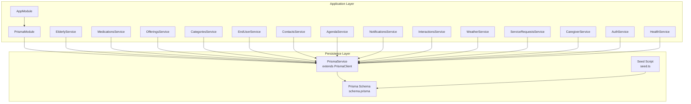
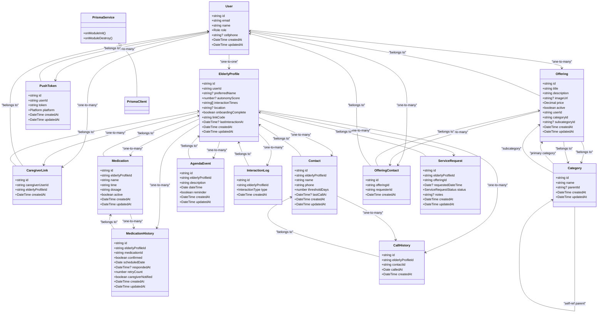
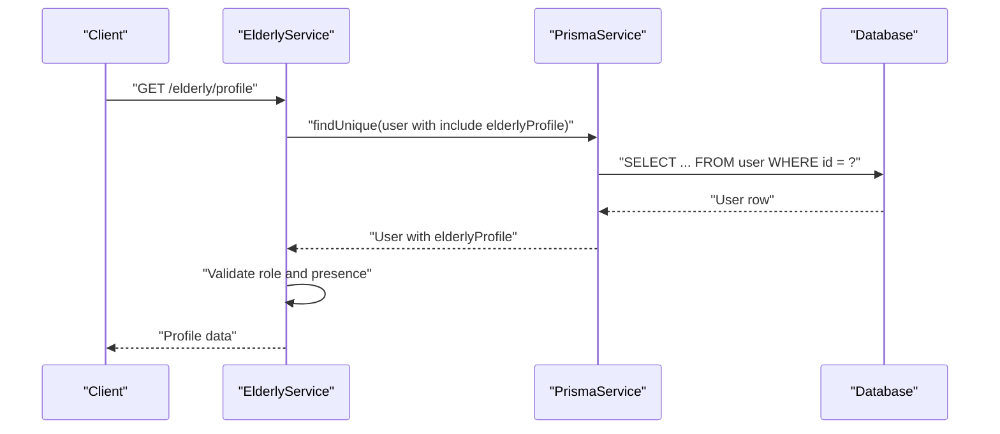
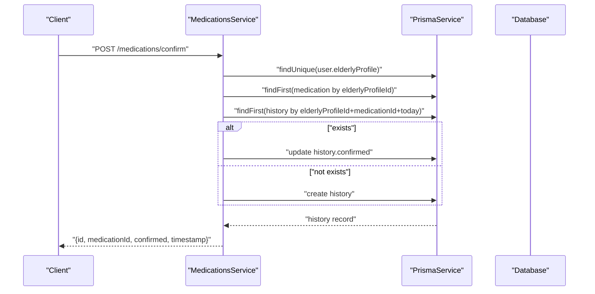
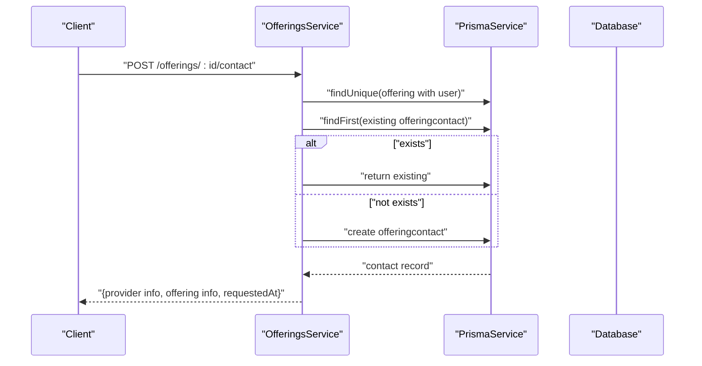
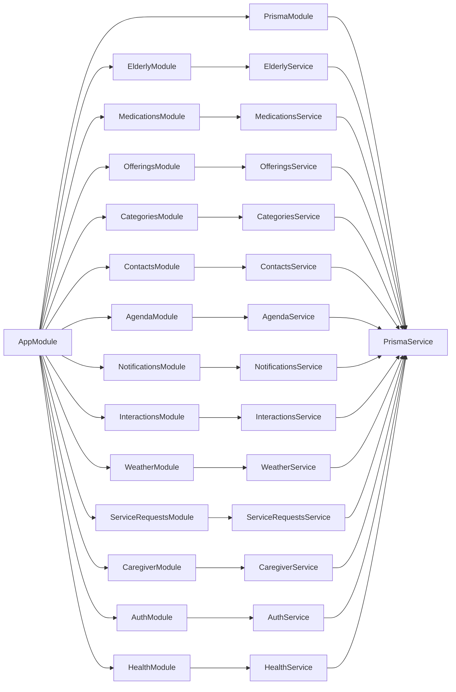

# Database Schema & Data Models

<cite>
**Referenced Files in This Document**
- [schema.prisma](file://prisma/schema.prisma)
- [seed.ts](file://prisma/seed.ts)
- [prisma.service.ts](file://src/prisma/prisma.service.ts)
- [prisma.module.ts](file://src/prisma/prisma.module.ts)
- [app.module.ts](file://src/app.module.ts)
- [main.ts](file://src/main.ts)
- [elderly.service.ts](file://src/elderly/elderly.service.ts)
- [medications.service.ts](file://src/medications/medications.service.ts)
- [offerings.service.ts](file://src/offerings/offerings.service.ts)
- [categories.service.ts](file://src/categories/categories.service.ts)
- [create-offering.dto.ts](file://src/offerings/dto/create-offering.dto.ts)
- [create-medication.dto.ts](file://src/medications/dto/create-medication.dto.ts)
- [update-profile.dto.ts](file://src/elderly/dto/update-profile.dto.ts)
- [create-category.dto.ts](file://src/categories/dto/create-category.dto.ts)
- [prisma.config.ts](file://prisma.config.ts)
</cite>

## Update Summary
**Changes Made**
- Enhanced schema documentation to reflect the expanded 250+ line Prisma model definition
- Added comprehensive coverage of all entity relationships and constraints
- Updated data validation rules and business constraints documentation
- Expanded service marketplace data flow explanations
- Added detailed indexing strategy documentation
- Enhanced troubleshooting guidance for the complete schema

## Table of Contents
1. [Introduction](#introduction)
2. [Project Structure](#project-structure)
3. [Core Components](#core-components)
4. [Architecture Overview](#architecture-overview)
5. [Detailed Component Analysis](#detailed-component-analysis)
6. [Dependency Analysis](#dependency-analysis)
7. [Performance Considerations](#performance-considerations)
8. [Troubleshooting Guide](#troubleshooting-guide)
9. [Conclusion](#conclusion)
10. [Appendices](#appendices)

## Introduction
This document describes the 99-Pai database schema and data models implemented with Prisma. It covers entity definitions, relationships, indexes, constraints, enums, and the hierarchical category system. The schema encompasses 250+ lines of Prisma models covering user management, elderly care profiles, medication tracking, contact management, agenda scheduling, and service offerings with proper indexing and foreign key relationships. It also documents the Prisma service implementation, automatic connection management, migration configuration, seed data initialization, and the service marketplace data flows for offerings and requests. Business constraints, referential integrity, and validation rules are explained alongside practical diagrams and sample data references.

## Project Structure
The database schema is defined centrally in the Prisma schema file and complemented by:
- Prisma service and module for automatic connection lifecycle
- Seed script for initial data
- Application module wiring and global configuration
- Service modules that consume Prisma for domain operations

**Diagram sources**
- [app.module.ts:21-39](file://src/app.module.ts#L21-L39)
- [prisma.module.ts:1-10](file://src/prisma/prisma.module.ts#L1-L10)
- [prisma.service.ts:1-38](file://src/prisma/prisma.service.ts#L1-L38)
- [schema.prisma:1-250](file://prisma/schema.prisma#L1-L250)
- [seed.ts:1-365](file://prisma/seed.ts#L1-L365)

**Section sources**
- [app.module.ts:21-39](file://src/app.module.ts#L21-L39)
- [prisma.module.ts:1-10](file://src/prisma/prisma.module.ts#L1-L10)
- [prisma.service.ts:1-38](file://src/prisma/prisma.service.ts#L1-L38)
- [prisma.config.ts:7-16](file://prisma.config.ts#L7-L16)

## Core Components
This section outlines the core entities and their attributes, primary/foreign keys, indexes, and constraints as defined in the Prisma schema.

### User Management System
- **Users**
  - Fields: id (PK, UUID), email (unique), password, name, role (enum), cellphone (unique), nickname, document, birthday, timestamps
  - Relationships: one-to-one with ElderlyProfile; one-to-many with CaregiverLink, PushToken, Offering, OfferingContact
  - Indexes: unique(email), unique(cellphone), index on id
  - Constraints: role enum values include elderly, caregiver, provider, admin

- **ElderlyProfiles**
  - Fields: id (PK, UUID), userId (unique, FK), preferredName, autonomyScore, interactionTimes (array), location, onboardingComplete, linkCode (unique), lastInteractionAt, timestamps
  - Relationships: one-to-one with User; one-to-many with CaregiverLink, Medication, MedicationHistory, Contact, CallHistory, AgendaEvent, InteractionLog, ServiceRequest
  - Indexes: unique(userId), unique(linkCode), index on userId
  - Constraints: defaults for onboardingComplete and interactionTimes array

- **CaregiverLinks**
  - Fields: id (PK, UUID), caregiverUserId (FK), elderlyProfileId (FK), createdAt
  - Relationships: belongs to User and ElderlyProfile
  - Indexes: unique(caregiverUserId, elderlyProfileId), index on caregiverUserId, index on elderlyProfileId
  - Constraints: cascade deletes on either side

### Healthcare and Care Management
- **Medications**
  - Fields: id (PK, UUID), elderlyProfileId (FK), name, time, dosage, active (default true), timestamps
  - Relationships: belongs to ElderlyProfile; one-to-many with MedicationHistory
  - Indexes: index on elderlyProfileId, composite index on (elderlyProfileId, active)
  - Constraints: active flag to filter current meds

- **MedicationHistory**
  - Fields: id (PK, UUID), elderlyProfileId (FK), medicationId (FK), confirmed, scheduledDate, respondedAt, retryCount (default 0), caregiverNotified (default false), timestamps
  - Relationships: belongs to ElderlyProfile and Medication
  - Indexes: composite index on (elderlyProfileId, scheduledDate), index on medicationId
  - Constraints: per-day scheduling via scheduledDate

- **Contacts**
  - Fields: id (PK, UUID), elderlyProfileId (FK), name, phone, thresholdDays (default 7), lastCallAt, timestamps
  - Relationships: belongs to ElderlyProfile; one-to-many with CallHistory
  - Indexes: index on elderlyProfileId
  - Constraints: thresholdDays default for alerting logic

- **CallHistory**
  - Fields: id (PK, UUID), elderlyProfileId (FK), contactId (FK), calledAt, timestamps
  - Relationships: belongs to ElderlyProfile and Contact
  - Indexes: composite index on (elderlyProfileId, calledAt)

- **AgendaEvents**
  - Fields: id (PK, UUID), elderlyProfileId (FK), description, dateTime, reminder (default true), timestamps
  - Relationships: belongs to ElderlyProfile
  - Indexes: composite index on (elderlyProfileId, dateTime)

### Communication and Notification System
- **PushTokens**
  - Fields: id (PK, UUID), userId (FK), token, platform (enum), timestamps
  - Relationships: belongs to User
  - Indexes: unique(userId, token)

- **InteractionLogs**
  - Fields: id (PK, UUID), elderlyProfileId (FK), type (enum), timestamps
  - Relationships: belongs to ElderlyProfile
  - Indexes: composite index on (elderlyProfileId, createdAt)

### Service Marketplace Infrastructure
- **Categories (Hierarchical)**
  - Fields: id (PK, UUID), name, parentId (FK to self), timestamps
  - Relationships: self-referencing parent/subcategories; one-to-many with Offerings (primary and secondary category relations)
  - Indexes: none explicitly declared (implicit PK index)

- **Offerings**
  - Fields: id (PK, UUID), title, description, imageUrl, price (Decimal), active (default true), userId (FK), categoryId (FK), subcategoryId (FK), timestamps
  - Relationships: belongs to User; belongs to Category (primary); belongs to Category (secondary); one-to-many with OfferingContact
  - Indexes: index on categoryId, subcategoryId, userId
  - Constraints: Decimal for price; active flag for marketplace visibility

- **OfferingContacts**
  - Fields: id (PK, UUID), offeringId (FK), requesterId (FK), timestamps
  - Relationships: belongs to Offering and User
  - Indexes: index on offeringId, requesterId

- **ServiceRequests**
  - Fields: id (PK, UUID), elderlyProfileId (FK), offeringId (FK), requestedDateTime, status (enum), notes, timestamps
  - Relationships: belongs to ElderlyProfile
  - Indexes: index on elderlyProfileId, status

### Enumerations
- **Role**: elderly, caregiver, provider, admin
- **Platform**: ios, android, web
- **InteractionType**: voice, button
- **ServiceRequestStatus**: pending, accepted, rejected, completed, cancelled

**Section sources**
- [schema.prisma:11-28](file://prisma/schema.prisma#L11-L28)
- [schema.prisma:30-54](file://prisma/schema.prisma#L30-L54)
- [schema.prisma:56-67](file://prisma/schema.prisma#L56-L67)
- [schema.prisma:69-83](file://prisma/schema.prisma#L69-L83)
- [schema.prisma:85-100](file://prisma/schema.prisma#L85-L100)
- [schema.prisma:102-115](file://prisma/schema.prisma#L102-L115)
- [schema.prisma:117-127](file://prisma/schema.prisma#L117-L127)
- [schema.prisma:129-140](file://prisma/schema.prisma#L129-L140)
- [schema.prisma:142-152](file://prisma/schema.prisma#L142-L152)
- [schema.prisma:154-162](file://prisma/schema.prisma#L154-L162)
- [schema.prisma:164-174](file://prisma/schema.prisma#L164-L174)
- [schema.prisma:176-196](file://prisma/schema.prisma#L176-L196)
- [schema.prisma:198-208](file://prisma/schema.prisma#L198-L208)
- [schema.prisma:210-223](file://prisma/schema.prisma#L210-L223)
- [schema.prisma:225-249](file://prisma/schema.prisma#L225-L249)

## Architecture Overview
The application integrates Prisma as the ORM layer with comprehensive entity relationships. The PrismaService extends PrismaClient and manages connection lifecycle automatically via NestJS module hooks. Services encapsulate domain logic and delegate persistence to Prisma with strict validation and business rule enforcement.

**Diagram sources**
- [prisma.service.ts:1-38](file://src/prisma/prisma.service.ts#L1-L38)
- [schema.prisma:11-223](file://prisma/schema.prisma#L11-L223)

**Section sources**
- [prisma.service.ts:1-38](file://src/prisma/prisma.service.ts#L1-L38)
- [schema.prisma:11-223](file://prisma/schema.prisma#L11-L223)

## Detailed Component Analysis

### User Authentication and Elderly Care Profiles
- **Purpose**: Authenticate users across four distinct roles and maintain elderly profiles with comprehensive care preferences and onboarding state.
- **Keys and constraints**:
  - User.email and User.cellphone are unique; User.id is PK (UUID).
  - ElderlyProfile.userId is unique and FK to User.id; ElderlyProfile.linkCode is unique.
  - All entities use UUID primary keys for distributed system compatibility.
- **Access control**: Services enforce role-based access control with explicit validation for each endpoint.

**Diagram sources**
- [elderly.service.ts:17-43](file://src/elderly/elderly.service.ts#L17-L43)
- [schema.prisma:11-54](file://prisma/schema.prisma#L11-L54)

**Section sources**
- [elderly.service.ts:17-79](file://src/elderly/elderly.service.ts#L17-L79)
- [schema.prisma:11-54](file://prisma/schema.prisma#L11-L54)
- [update-profile.dto.ts:12-44](file://src/elderly/dto/update-profile.dto.ts#L12-L44)

### Caregiver Management and Medication Tracking System
- **Purpose**: Link caregivers to elderly profiles and track medication schedules and confirmations with comprehensive audit trails.
- **Keys and constraints**:
  - CaregiverLink unique composite on (caregiverUserId, elderlyProfileId).
  - MedicationHistory scheduledDate combined with elderlyProfileId and medicationId for daily tracking.
  - All entities use UUID primary keys with proper cascade deletion policies.
- **Business flows**:
  - Elderly confirms medication intake; system creates or updates MedicationHistory for the day.
  - Caregiver can view history and manage medications with pagination support.
  - Automatic retry mechanisms and notification flags for missed doses.

**Diagram sources**
- [medications.service.ts:181-253](file://src/medications/medications.service.ts#L181-L253)
- [schema.prisma:69-100](file://prisma/schema.prisma#L69-L100)

**Section sources**
- [medications.service.ts:24-310](file://src/medications/medications.service.ts#L24-L310)
- [medications.service.ts:181-253](file://src/medications/medications.service.ts#L181-L253)
- [create-medication.dto.ts:1-17](file://src/medications/dto/create-medication.dto.ts#L1-L17)

### Hierarchical Categories and Service Marketplace
- **Purpose**: Organize offerings in a sophisticated tree-like hierarchy and enable providers to publish services with comprehensive validation.
- **Keys and constraints**:
  - Category.self-referencing parent-child via parentId with proper validation.
  - Offering belongs to Category (primary) and optionally to a subcategory; indexed for optimal queries.
  - Circular reference prevention and hierarchical validation.
- **Business flows**:
  - Providers create offerings linked to category/subcategory with price validation.
  - Clients request provider contact; system prevents self-request and duplicate requests.
  - Comprehensive category management with inheritance validation.

**Diagram sources**
- [offerings.service.ts:429-503](file://src/offerings/offerings.service.ts#L429-L503)
- [schema.prisma:176-208](file://prisma/schema.prisma#L176-L208)

**Section sources**
- [categories.service.ts:19-180](file://src/categories/categories.service.ts#L19-L180)
- [offerings.service.ts:67-517](file://src/offerings/offerings.service.ts#L67-L517)
- [create-offering.dto.ts:1-32](file://src/offerings/dto/create-offering.dto.ts#L1-L32)
- [create-category.dto.ts:1-35](file://src/categories/dto/create-category.dto.ts#L1-L35)

### Service Requests and Data Flow Management
- **Purpose**: Manage requests from elderly profiles to specific offerings with comprehensive status tracking and business rule enforcement.
- **Keys and constraints**:
  - ServiceRequest.status uses enum with default pending; indexed for efficient filtering.
  - Cascade deletion ensures data consistency across the relationship hierarchy.
- **Data flow**:
  - Requests are associated with an offering and elderly profile with proper validation.
  - Status transitions occur via business logic with audit trail capabilities.
  - Pagination support for historical request management.

**Diagram sources**
- [schema.prisma:210-223](file://prisma/schema.prisma#L210-L223)

**Section sources**
- [schema.prisma:210-223](file://prisma/schema.prisma#L210-L223)

## Dependency Analysis
- **Prisma integration**:
  - PrismaModule exports PrismaService globally with proper dependency injection.
  - AppModule imports PrismaModule and all feature modules with comprehensive routing.
  - PrismaService implements OnModuleInit/OnModuleDestroy with logging and error handling.
- **Service dependencies**:
  - Services depend on PrismaService for data access with proper transaction handling.
  - OfferingsService validates category/subcategory relationships with hierarchical checks.
  - MedicationsService coordinates caregiver access and elderly confirmations with role validation.
  - Comprehensive validation pipeline ensures data integrity across all operations.

**Diagram sources**
- [app.module.ts:21-39](file://src/app.module.ts#L21-L39)
- [prisma.module.ts:1-10](file://src/prisma/prisma.module.ts#L1-L10)
- [prisma.service.ts:1-38](file://src/prisma/prisma.service.ts#L1-L38)

**Section sources**
- [app.module.ts:21-39](file://src/app.module.ts#L21-L39)
- [prisma.module.ts:1-10](file://src/prisma/prisma.module.ts#L1-L10)
- [prisma.service.ts:1-38](file://src/prisma/prisma.service.ts#L1-L38)

## Performance Considerations
- **Indexing Strategy**:
  - Composite indexes on (elderlyProfileId, scheduledDate) for medication history optimize time-series queries.
  - Composite indexes on (elderlyProfileId, dateTime) for agenda events enable efficient scheduling lookups.
  - Unique constraints on email, cellphone, and (userId, token) prevent duplicate entries and improve lookup performance.
  - Multi-column indexes on (elderlyProfileId, createdAt) for interaction logs support chronological queries.
- **Query Optimization**:
  - Prefer filtered queries with indexes (e.g., active=true for offerings, elderlyProfileId for related entities).
  - Pagination via skip/take in medication history and service requests reduces payload size.
  - UUID primary keys provide better distribution for sharding scenarios.
- **Data Type Efficiency**:
  - Decimal for price ensures precise financial calculations without floating-point errors.
  - Arrays (interactionTimes) stored as JSON arrays; consider normalization if growth demands exceed 1000+ entries.
  - DateTime fields use appropriate precision for temporal queries.
- **Connection Management**:
  - PrismaService implements automatic connection lifecycle with proper error logging.
  - Connection pooling configured through Prisma client options for optimal resource utilization.

## Troubleshooting Guide
- **Connection Lifecycle Issues**:
  - PrismaService connects on module init and disconnects on destroy with comprehensive logging.
  - Ensure proper NestJS bootstrapping order and environment variable configuration.
- **Seed Script Failures**:
  - Seed script uses upserts with bcrypt hashing for secure password storage.
  - Failures often relate to DATABASE_URL configuration, role enum mismatches, or constraint violations.
  - Review logs for seeding errors and ensure environment variables are properly set.
- **Validation Errors**:
  - DTOs enforce field types and constraints (e.g., price min 0, UUID validation, role enum restrictions).
  - Class-validator provides comprehensive input sanitization and error reporting.
  - Adjust payloads according to validation rules and enum constraints.
- **Referential Integrity**:
  - Cascade deletes on relations ensure data consistency but may cause unintended data removal.
  - Use soft-deletion patterns for critical business data if needed.
  - Foreign key constraints prevent orphaned records and maintain schema integrity.
- **Performance Issues**:
  - Monitor slow query logs and implement appropriate indexes for frequently accessed queries.
  - Use pagination for large result sets and consider query optimization techniques.
  - Monitor connection pool usage and adjust Prisma client configuration as needed.

**Section sources**
- [prisma.service.ts:20-36](file://src/prisma/prisma.service.ts#L20-L36)
- [seed.ts:16-365](file://prisma/seed.ts#L16-L365)
- [create-offering.dto.ts:18-21](file://src/offerings/dto/create-offering.dto.ts#L18-L21)
- [create-category.dto.ts:14-15](file://src/categories/dto/create-category.dto.ts#L14-L15)

## Conclusion
The 99-Pai schema models a comprehensive elderly care ecosystem with sophisticated healthcare management, service marketplace capabilities, and robust user management infrastructure. The enhanced schema with 250+ lines of Prisma models provides strong typing, comprehensive relationships, and proper indexing strategies. It leverages Prisma's advanced features to enforce referential integrity while enabling flexible hierarchical categories, robust medication tracking, and seamless service marketplace operations. The Prisma service and module provide automatic connection management with proper logging and error handling, while the seed script initializes realistic sample data for comprehensive testing and evaluation. Services encapsulate business logic with explicit validations, role-based access control, and comprehensive error handling, ensuring data quality and predictable flows across all functional domains.

## Appendices

### Prisma Service Implementation and Migration Strategy
- **Automatic Connection Management**:
  - PrismaService extends PrismaClient with comprehensive logging and error handling.
  - Implements OnModuleInit/OnModuleDestroy lifecycle hooks for proper connection management.
  - Configurable log levels for warnings and errors with structured logging support.
- **Migration Configuration**:
  - prisma.config.ts defines schema path, migrations folder, and datasource URL from environment.
  - Classic engine mode provides better compatibility with various deployment environments.
  - Proper separation of concerns between schema definition and migration management.

**Section sources**
- [prisma.service.ts:1-38](file://src/prisma/prisma.service.ts#L1-L38)
- [prisma.config.ts:7-16](file://prisma.config.ts#L7-L16)

### Seed Data Structure and Initialization Process
- **Comprehensive Data Initialization**:
  - Four authenticated users (elderly, caregiver, provider, admin) with hashed passwords and role assignments.
  - Elderly profile with complete onboarding data, interaction preferences, and care settings.
  - Caregiver link establishing relationship between caregiver and elderly profile.
  - Hierarchical categories spanning five major domains: Saúde e Bem-estar, Serviços Domésticos, Transporte, Alimentação, and specialized subcategories.
  - Sample offering demonstrating marketplace functionality with pricing and categorization.
  - Two medication records with different timing and dosing schedules.
  - Scheduled agenda event for future care coordination.
- **Initialization Workflow**:
  - Run the seed script after Prisma migrations and database connectivity establishment.
  - Sequential processing ensures proper dependency resolution across entities.
  - Comprehensive logging provides visibility into the seeding process and completion status.

**Section sources**
- [seed.ts:16-365](file://prisma/seed.ts#L16-L365)

### Sample Data Examples and Usage Patterns
- **User Accounts**:
  - elderly@test.com / 123456 (Elderly - Maria Silva) with complete profile data
  - caregiver@test.com / 123456 (Caregiver - João Santos) with professional credentials
  - provider@test.com / 123456 (Provider - Ana Oliveira) with service catalog
  - admin@test.com / 123456 (Administrator - Carlos Admin) with full system access
- **Elderly Profile Data**:
  - preferredName, autonomyScore, location, onboardingComplete, linkCode, interactionTimes
  - Care coordination settings and communication preferences
- **Category Hierarchy**:
  - Root categories with extensive subcategory structures
  - Health and wellness services, domestic services, transportation, and nutrition
  - Hierarchical organization supporting complex service categorization
- **Offering Examples**:
  - Cuidado Domiciliar Especializado with detailed description and pricing
  - Comprehensive marketplace demonstration with category/subcategory relationships
- **Medication Management**:
  - Losartana 50mg at 08:00 with 1 comprimido dosage
  - Metformina 500mg at 12:00 with 1 comprimido dosage
  - Active medication tracking with confirmation system
- **Agenda Management**:
  - Future appointment scheduling with reminder notifications
  - Integration with medication schedules and care coordination

**Section sources**
- [seed.ts:27-120](file://prisma/seed.ts#L27-L120)
- [seed.ts:128-231](file://prisma/seed.ts#L128-L231)
- [seed.ts:272-286](file://prisma/seed.ts#L272-L286)
- [seed.ts:294-318](file://prisma/seed.ts#L294-L318)
- [seed.ts:332-342](file://prisma/seed.ts#L332-L342)