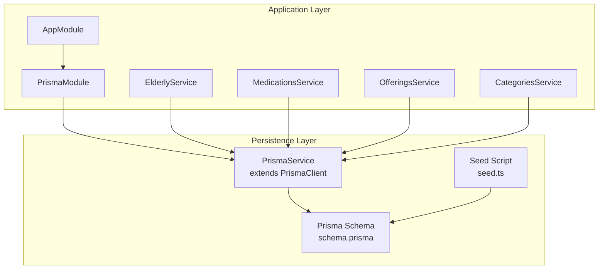
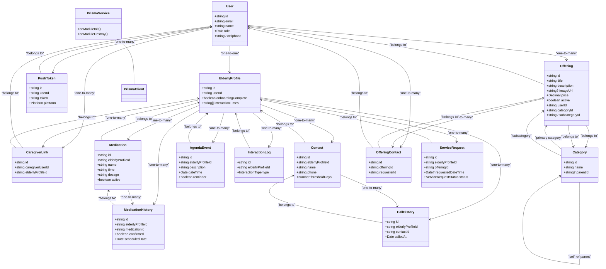
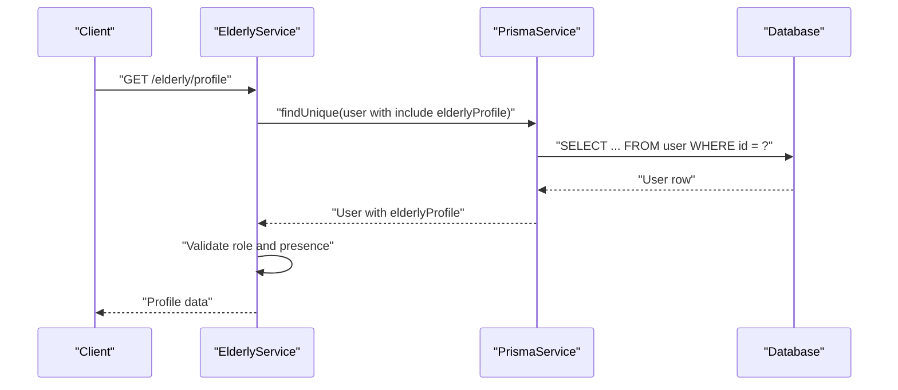
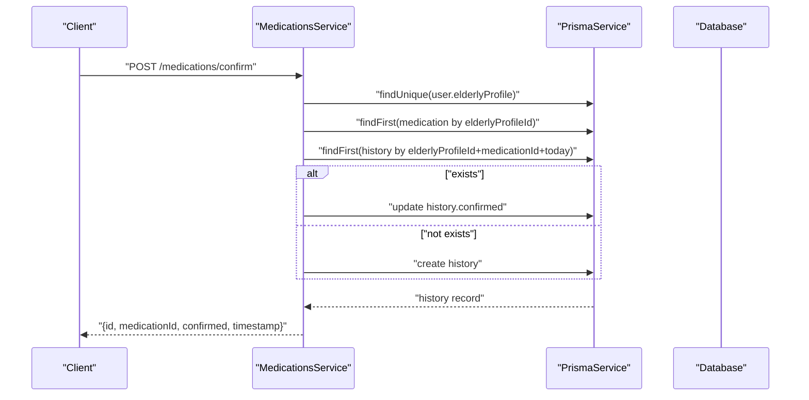
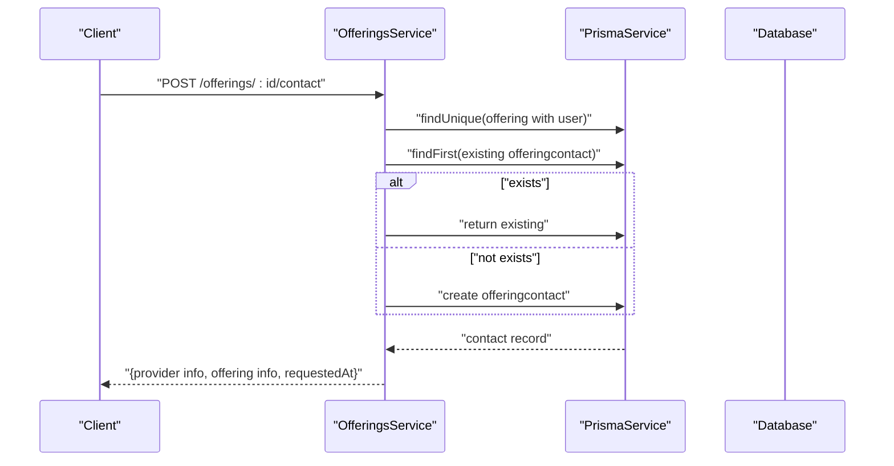
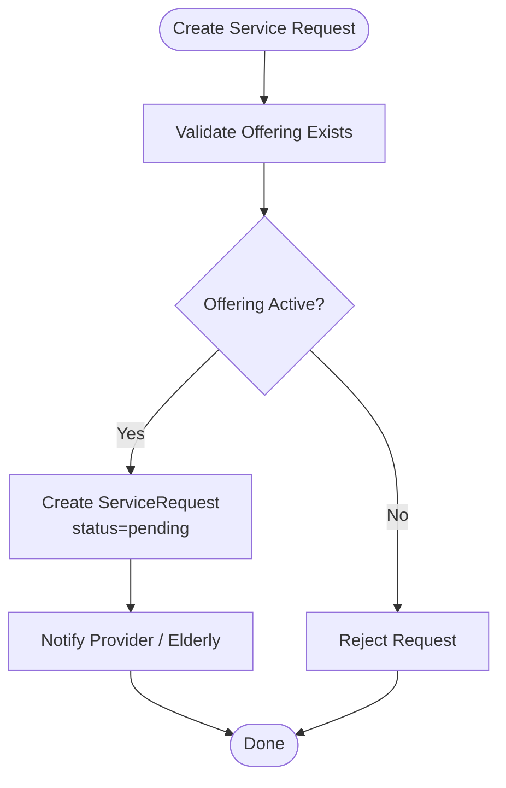
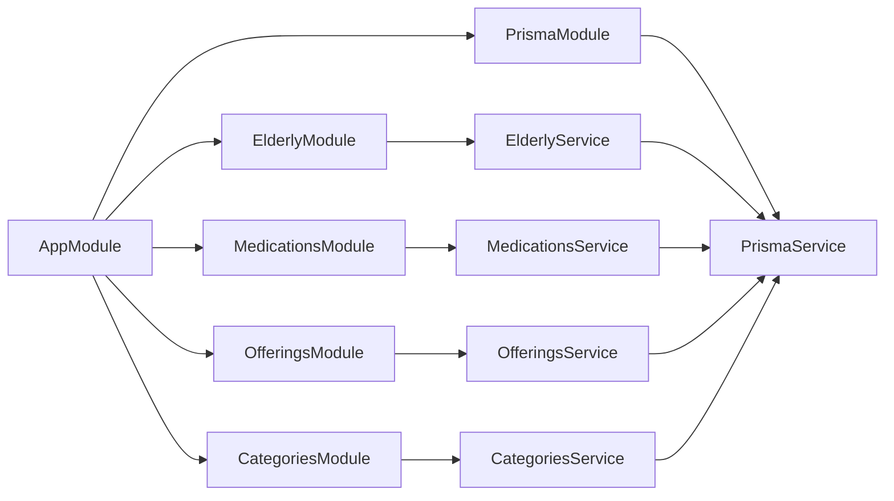

# Database Schema & Data Models

<cite>
**Referenced Files in This Document**
- [schema.prisma](file://prisma/schema.prisma)
- [seed.ts](file://prisma/seed.ts)
- [prisma.service.ts](file://src/prisma/prisma.service.ts)
- [prisma.module.ts](file://src/prisma/prisma.module.ts)
- [app.module.ts](file://src/app.module.ts)
- [main.ts](file://src/main.ts)
- [elderly.service.ts](file://src/elderly/elderly.service.ts)
- [medications.service.ts](file://src/medications/medications.service.ts)
- [offerings.service.ts](file://src/offerings/offerings.service.ts)
- [categories.service.ts](file://src/categories/categories.service.ts)
- [create-offering.dto.ts](file://src/offerings/dto/create-offering.dto.ts)
- [create-medication.dto.ts](file://src/medications/dto/create-medication.dto.ts)
- [update-profile.dto.ts](file://src/elderly/dto/update-profile.dto.ts)
- [create-category.dto.ts](file://src/categories/dto/create-category.dto.ts)
- [prisma.config.ts](file://prisma.config.ts)
</cite>

## Table of Contents
1. [Introduction](#introduction)
2. [Project Structure](#project-structure)
3. [Core Components](#core-components)
4. [Architecture Overview](#architecture-overview)
5. [Detailed Component Analysis](#detailed-component-analysis)
6. [Dependency Analysis](#dependency-analysis)
7. [Performance Considerations](#performance-considerations)
8. [Troubleshooting Guide](#troubleshooting-guide)
9. [Conclusion](#conclusion)
10. [Appendices](#appendices)

## Introduction
This document describes the 99-Pai database schema and data models implemented with Prisma. It covers entity definitions, relationships, indexes, constraints, enums, and the hierarchical category system. It also documents the Prisma service implementation, automatic connection management, migration configuration, seed data initialization, and the service marketplace data flows for offerings and requests. Business constraints, referential integrity, and validation rules are explained alongside practical diagrams and sample data references.

## Project Structure
The database schema is defined centrally in the Prisma schema file and complemented by:
- Prisma service and module for automatic connection lifecycle
- Seed script for initial data
- Application module wiring and global configuration
- Service modules that consume Prisma for domain operations

**Diagram sources**
- [app.module.ts:17-35](file://src/app.module.ts#L17-L35)
- [prisma.module.ts:1-10](file://src/prisma/prisma.module.ts#L1-L10)
- [prisma.service.ts:1-17](file://src/prisma/prisma.service.ts#L1-L17)
- [schema.prisma:1-286](file://prisma/schema.prisma#L1-L286)
- [seed.ts:1-365](file://prisma/seed.ts#L1-L365)

**Section sources**
- [app.module.ts:17-35](file://src/app.module.ts#L17-L35)
- [prisma.module.ts:1-10](file://src/prisma/prisma.module.ts#L1-L10)
- [prisma.service.ts:1-17](file://src/prisma/prisma.service.ts#L1-L17)
- [prisma.config.ts:1-17](file://prisma.config.ts#L1-L17)

## Core Components
This section outlines the core entities and their attributes, primary/foreign keys, indexes, and constraints as defined in the Prisma schema.

- Users
  - Fields: id (PK), email (unique), password, name, role (enum), cellphone (unique), nickname, document, birthday, timestamps
  - Relationships: one-to-one with ElderlyProfile; one-to-many with CaregiverLink, PushToken, Offering, OfferingContact
  - Indexes: unique(email), unique(cellphone), index on id
  - Constraints: role enum values include elderly, caregiver, provider, admin

- ElderlyProfiles
  - Fields: id (PK), userId (unique, FK), preferredName, autonomyScore, interactionTimes (array), location, onboardingComplete, linkCode (unique), timestamps
  - Relationships: one-to-one with User; one-to-many with CaregiverLink, Medication, MedicationHistory, Contact, CallHistory, AgendaEvent, InteractionLog, ServiceRequest
  - Indexes: unique(userId), unique(linkCode), index on userId
  - Constraints: defaults for onboardingComplete and interactionTimes array

- CaregiverLinks
  - Fields: id (PK), caregiverUserId (FK), elderlyProfileId (FK), createdAt
  - Relationships: belongs to User and ElderlyProfile
  - Indexes: unique(caregiverUserId, elderlyProfileId), index on caregiverUserId, index on elderlyProfileId
  - Constraints: cascade deletes on either side

- Medications
  - Fields: id (PK), elderlyProfileId (FK), name, time, dosage, active (default true), timestamps
  - Relationships: belongs to ElderlyProfile; one-to-many with MedicationHistory
  - Indexes: index on elderlyProfileId, composite index on (elderlyProfileId, active)
  - Constraints: active flag to filter current meds

- MedicationHistory
  - Fields: id (PK), elderlyProfileId (FK), medicationId (FK), confirmed, scheduledDate, respondedAt, retryCount (default 0), caregiverNotified (default false), timestamps
  - Relationships: belongs to ElderlyProfile and Medication
  - Indexes: composite index on (elderlyProfileId, scheduledDate), index on medicationId
  - Constraints: per-day scheduling via scheduledDate

- Contacts
  - Fields: id (PK), elderlyProfileId (FK), name, phone, thresholdDays (default 7), lastCallAt, timestamps
  - Relationships: belongs to ElderlyProfile; one-to-many with CallHistory
  - Indexes: index on elderlyProfileId
  - Constraints: thresholdDays default for alerting logic

- CallHistory
  - Fields: id (PK), elderlyProfileId (FK), contactId (FK), calledAt, timestamps
  - Relationships: belongs to ElderlyProfile and Contact
  - Indexes: composite index on (elderlyProfileId, calledAt)

- AgendaEvents
  - Fields: id (PK), elderlyProfileId (FK), description, dateTime, reminder (default true), timestamps
  - Relationships: belongs to ElderlyProfile
  - Indexes: composite index on (elderlyProfileId, dateTime)

- PushTokens
  - Fields: id (PK), userId (FK), token, platform (enum), timestamps
  - Relationships: belongs to User
  - Indexes: unique(userId, token)

- InteractionLogs
  - Fields: id (PK), elderlyProfileId (FK), type (enum), timestamps
  - Relationships: belongs to ElderlyProfile
  - Indexes: composite index on (elderlyProfileId, createdAt)

- Categories (Hierarchical)
  - Fields: id (PK), name, parentId (FK to self), timestamps
  - Relationships: self-referencing parent/subcategories; one-to-many with Offerings (primary and secondary category relations)
  - Indexes: none explicitly declared (implicit PK index)

- Offerings
  - Fields: id (PK), title, description, imageUrl, price (Decimal), active (default true), userId (FK), categoryId (FK), subcategoryId (FK), timestamps
  - Relationships: belongs to User; belongs to Category (primary); belongs to Category (secondary); one-to-many with OfferingContact
  - Indexes: index on categoryId, subcategoryId, userId
  - Constraints: Decimal for price; active flag for marketplace visibility

- OfferingContacts
  - Fields: id (PK), offeringId (FK), requesterId (FK), timestamps
  - Relationships: belongs to Offering and User
  - Indexes: index on offeringId, requesterId

- ServiceRequests
  - Fields: id (PK), elderlyProfileId (FK), offeringId (FK), requestedDateTime, status (enum), notes, timestamps
  - Relationships: belongs to ElderlyProfile
  - Indexes: index on elderlyProfileId, status

Enums:
- Role: elderly, caregiver, provider, admin
- Platform: ios, android, web
- InteractionType: voice, button
- ServiceRequestStatus: pending, accepted, rejected, completed, cancelled

**Section sources**
- [schema.prisma:17-41](file://prisma/schema.prisma#L17-L41)
- [schema.prisma:47-65](file://prisma/schema.prisma#L47-L65)
- [schema.prisma:71-96](file://prisma/schema.prisma#L71-L96)
- [schema.prisma:98-110](file://prisma/schema.prisma#L98-L110)
- [schema.prisma:112-127](file://prisma/schema.prisma#L112-L127)
- [schema.prisma:129-145](file://prisma/schema.prisma#L129-L145)
- [schema.prisma:147-161](file://prisma/schema.prisma#L147-L161)
- [schema.prisma:163-174](file://prisma/schema.prisma#L163-L174)
- [schema.prisma:176-188](file://prisma/schema.prisma#L176-L188)
- [schema.prisma:190-201](file://prisma/schema.prisma#L190-L201)
- [schema.prisma:203-212](file://prisma/schema.prisma#L203-L212)
- [schema.prisma:218-229](file://prisma/schema.prisma#L218-L229)
- [schema.prisma:231-252](file://prisma/schema.prisma#L231-L252)
- [schema.prisma:254-265](file://prisma/schema.prisma#L254-L265)
- [schema.prisma:271-285](file://prisma/schema.prisma#L271-L285)

## Architecture Overview
The application integrates Prisma as the ORM layer. The PrismaService extends PrismaClient and manages connection lifecycle automatically via NestJS module hooks. Services encapsulate domain logic and delegate persistence to Prisma.

**Diagram sources**
- [prisma.service.ts:1-17](file://src/prisma/prisma.service.ts#L1-L17)
- [schema.prisma:47-285](file://prisma/schema.prisma#L47-L285)

**Section sources**
- [prisma.service.ts:1-17](file://src/prisma/prisma.service.ts#L1-L17)
- [schema.prisma:47-285](file://prisma/schema.prisma#L47-L285)

## Detailed Component Analysis

### Users and Elderly Profiles
- Purpose: Authenticate users and maintain elderly profiles with preferences and onboarding state.
- Keys and constraints:
  - User.email and User.cellphone are unique; User.id is PK.
  - ElderlyProfile.userId is unique and FK to User.id; ElderlyProfile.linkCode is unique.
- Access control: Services enforce role checks (e.g., only elderly can access profile endpoints).

**Diagram sources**
- [elderly.service.ts:17-43](file://src/elderly/elderly.service.ts#L17-L43)
- [schema.prisma:47-96](file://prisma/schema.prisma#L47-L96)

**Section sources**
- [elderly.service.ts:17-43](file://src/elderly/elderly.service.ts#L17-L43)
- [schema.prisma:47-96](file://prisma/schema.prisma#L47-L96)
- [update-profile.dto.ts:12-44](file://src/elderly/dto/update-profile.dto.ts#L12-L44)

### Caregiver Links and Medication Tracking
- Purpose: Link caregivers to elderly profiles and track medication schedules and confirmations.
- Keys and constraints:
  - CaregiverLink unique composite on (caregiverUserId, elderlyProfileId).
  - MedicationHistory scheduledDate combined with elderlyProfileId and medicationId for daily tracking.
- Business flows:
  - Elderly confirms medication intake; system creates or updates MedicationHistory for the day.
  - Caregiver can view history and manage medications.

**Diagram sources**
- [medications.service.ts:181-253](file://src/medications/medications.service.ts#L181-L253)
- [schema.prisma:112-145](file://prisma/schema.prisma#L112-L145)

**Section sources**
- [medications.service.ts:24-179](file://src/medications/medications.service.ts#L24-L179)
- [medications.service.ts:181-253](file://src/medications/medications.service.ts#L181-L253)
- [create-medication.dto.ts:1-17](file://src/medications/dto/create-medication.dto.ts#L1-L17)

### Hierarchical Categories and Offerings Marketplace
- Purpose: Organize offerings in a tree-like hierarchy and enable providers to publish services.
- Keys and constraints:
  - Category.self-referencing parent-child via parentId.
  - Offering belongs to Category (primary) and optionally to a subcategory; indexed for queries.
- Business flows:
  - Providers create offerings linked to category/subcategory.
  - Clients request provider contact; system prevents self-request and duplicates.

**Diagram sources**
- [offerings.service.ts:429-503](file://src/offerings/offerings.service.ts#L429-L503)
- [schema.prisma:231-265](file://prisma/schema.prisma#L231-L265)

**Section sources**
- [categories.service.ts:19-179](file://src/categories/categories.service.ts#L19-L179)
- [offerings.service.ts:67-342](file://src/offerings/offerings.service.ts#L67-L342)
- [create-offering.dto.ts:1-32](file://src/offerings/dto/create-offering.dto.ts#L1-L32)
- [create-category.dto.ts:1-35](file://src/categories/dto/create-category.dto.ts#L1-L35)

### Service Requests and Data Flows
- Purpose: Manage requests from elderly profiles to specific offerings with status tracking.
- Keys and constraints:
  - ServiceRequest.status uses enum; indexed for filtering.
- Data flow:
  - Requests are associated with an offering and elderly profile; status transitions occur via business logic.

**Diagram sources**
- [schema.prisma:271-285](file://prisma/schema.prisma#L271-L285)

**Section sources**
- [schema.prisma:271-285](file://prisma/schema.prisma#L271-L285)

## Dependency Analysis
- Prisma integration:
  - PrismaModule exports PrismaService globally.
  - AppModule imports PrismaModule and other feature modules.
  - PrismaService implements OnModuleInit/OnModuleDestroy to connect/disconnect.
- Service dependencies:
  - Services depend on PrismaService for data access.
  - OfferingsService validates category/subcategory relationships.
  - MedicationsService coordinates caregiver access and elderly confirmations.

**Diagram sources**
- [app.module.ts:17-35](file://src/app.module.ts#L17-L35)
- [prisma.module.ts:1-10](file://src/prisma/prisma.module.ts#L1-L10)
- [prisma.service.ts:1-17](file://src/prisma/prisma.service.ts#L1-L17)

**Section sources**
- [app.module.ts:17-35](file://src/app.module.ts#L17-L35)
- [prisma.module.ts:1-10](file://src/prisma/prisma.module.ts#L1-L10)
- [prisma.service.ts:1-17](file://src/prisma/prisma.service.ts#L1-L17)

## Performance Considerations
- Indexes:
  - Composite indexes on (elderlyProfileId, scheduledDate) for medication history and (elderlyProfileId, dateTime) for agenda events optimize time-series queries.
  - Unique constraints on email, cellphone, and (userId, token) reduce duplicate writes and improve lookup performance.
- Queries:
  - Prefer filtered queries with indexes (e.g., active=true for offerings, elderlyProfileId for related entities).
  - Pagination via skip/take in medication history reduces payload size.
- Data types:
  - Decimal for price ensures precise financial calculations.
  - Arrays (interactionTimes) stored as JSON arrays; consider normalization if growth demands.

[No sources needed since this section provides general guidance]

## Troubleshooting Guide
- Connection lifecycle:
  - PrismaService connects on module init and disconnects on destroy. Ensure proper NestJS bootstrapping.
- Seed failures:
  - Seed script uses upserts and bcrypt hashing. Failures often relate to DATABASE_URL or role enum mismatches. Review logs for seeding errors and ensure environment variables are set.
- Validation errors:
  - DTOs enforce field types and constraints (e.g., price min 0, UUIDs for category IDs). Adjust payloads accordingly.
- Referential integrity:
  - Cascade deletes on relations mean deleting a User or ElderlyProfile cascades related records. Use soft-deletion patterns if needed.

**Section sources**
- [prisma.service.ts:9-15](file://src/prisma/prisma.service.ts#L9-L15)
- [seed.ts:16-365](file://prisma/seed.ts#L16-L365)
- [create-offering.dto.ts:18-21](file://src/offerings/dto/create-offering.dto.ts#L18-L21)
- [create-category.dto.ts:14-15](file://src/categories/dto/create-category.dto.ts#L14-L15)

## Conclusion
The 99-Pai schema models a cohesive ecosystem for elderly care and service marketplace operations. It leverages Prisma’s strong typing and relations to enforce referential integrity while enabling flexible hierarchical categories and robust medication tracking. The Prisma service and module provide automatic connection management, and the seed script initializes realistic sample data for quick evaluation. Services encapsulate business logic with explicit validations and constraints, ensuring data quality and predictable flows.

[No sources needed since this section summarizes without analyzing specific files]

## Appendices

### Prisma Service Implementation and Migration Strategy
- Automatic connection management:
  - PrismaService extends PrismaClient and connects/disconnects during NestJS lifecycle hooks.
- Migration configuration:
  - prisma.config.ts defines schema path, migrations folder, and datasource URL from environment.

**Section sources**
- [prisma.service.ts:1-17](file://src/prisma/prisma.service.ts#L1-L17)
- [prisma.config.ts:7-16](file://prisma.config.ts#L7-L16)

### Seed Data Structure and Initialization
- Seed script initializes:
  - Four users (elderly, caregiver, provider, admin) with hashed passwords.
  - An elderly profile with onboarding and interaction times.
  - A caregiver link between the caregiver and elderly profile.
  - Hierarchical categories under Saúde e Bem-estar, Serviços Domésticos, Transporte, and Alimentação.
  - One sample offering under the health/home care category.
  - Two sample medications for the elderly profile.
  - One agenda event scheduled for tomorrow.
- Initialization steps:
  - Run the seed script after Prisma migrations and database connectivity are established.

**Section sources**
- [seed.ts:16-365](file://prisma/seed.ts#L16-L365)

### Sample Data Examples
- Users:
  - elderly@test.com, caregiver@test.com, provider@test.com, admin@test.com
- Elderly Profile:
  - preferredName, autonomyScore, location, onboardingComplete, linkCode, interactionTimes
- Categories:
  - Root categories and subcategories for health, home services, transport, and food.
- Offering:
  - title, description, price, active, categoryId, subcategoryId.
- Medications:
  - name, time, dosage, active.
- Agenda Event:
  - description, dateTime, reminder.

**Section sources**
- [seed.ts:27-120](file://prisma/seed.ts#L27-L120)
- [seed.ts:128-231](file://prisma/seed.ts#L128-L231)
- [seed.ts:272-286](file://prisma/seed.ts#L272-L286)
- [seed.ts:294-318](file://prisma/seed.ts#L294-L318)
- [seed.ts:332-342](file://prisma/seed.ts#L332-L342)