# Development Guidelines

<cite>
**Referenced Files in This Document**
- [package.json](file://package.json)
- [eslint.config.mjs](file://eslint.config.mjs)
- [.prettierrc](file://.prettierrc)
- [tsconfig.json](file://tsconfig.json)
- [tsconfig.build.json](file://tsconfig.build.json)
- [nest-cli.json](file://nest-cli.json)
- [README.md](file://README.md)
- [src/main.ts](file://src/main.ts)
- [src/app.module.ts](file://src/app.module.ts)
- [src/prisma/prisma.module.ts](file://src/prisma/prisma.module.ts)
- [src/prisma/prisma.service.ts](file://src/prisma/prisma.service.ts)
- [src/auth/auth.module.ts](file://src/auth/auth.module.ts)
- [src/auth/auth.service.ts](file://src/auth/auth.service.ts)
- [src/auth/auth.controller.ts](file://src/auth/auth.controller.ts)
- [src/auth/dto/signup.dto.ts](file://src/auth/dto/signup.dto.ts)
- [src/common/decorators/user.decorator.ts](file://src/common/decorators/user.decorator.ts)
- [prisma/schema.prisma](file://prisma/schema.prisma)
- [prisma/seed.ts](file://prisma/seed.ts)
- [test/jest-e2e.json](file://test/jest-e2e.json)
- [mobile-app/package.json](file://mobile-app/package.json)
- [mobile-app/README.md](file://mobile-app/README.md)
- [mobile-app/INTEGRATION_GUIDE.md](file://mobile-app/INTEGRATION_GUIDE.md)
- [mobile-app/NAVIGATION_MAP.md](file://mobile-app/NAVIGATION_MAP.md)
- [mobile-app/API_CONTRACTS.md](file://mobile-app/API_CONTRACTS.md)
- [mobile-app/src/lib/firebase.ts](file://mobile-app/src/lib/firebase.ts)
- [mobile-app/src/services/api.ts](file://mobile-app/src/services/api.ts)
- [mobile-app/app/_layout.tsx](file://mobile-app/app/_layout.tsx)
- [.agent/ARCHITECTURE.md](file://.agent/ARCHITECTURE.md)
</cite>

## Update Summary
**Changes Made**
- Added comprehensive mobile application development guidelines for React Native + Expo
- Integrated AI agent system development guidelines with Antigravity Kit architecture
- Updated API documentation and integration contracts for mobile frontend-backend communication
- Enhanced navigation and routing documentation for role-based application flows
- Added web documentation site development guidelines and deployment strategies
- Expanded contribution guidelines to cover multi-platform development workflows

## Table of Contents
1. [Introduction](#introduction)
2. [Project Structure](#project-structure)
3. [Core Components](#core-components)
4. [Architecture Overview](#architecture-overview)
5. [Detailed Component Analysis](#detailed-component-analysis)
6. [Mobile Application Development](#mobile-application-development)
7. [AI Agent System Development](#ai-agent-system-development)
8. [Web Documentation Site Development](#web-documentation-site-development)
9. [API Integration and Contracts](#api-integration-and-contracts)
10. [Dependency Analysis](#dependency-analysis)
11. [Performance Considerations](#performance-considerations)
12. [Troubleshooting Guide](#troubleshooting-guide)
13. [Contribution and Release Management](#contribution-and-release-management)
14. [Conclusion](#conclusion)

## Introduction
This document provides comprehensive development guidelines for the 99-Pai project, covering a multi-platform ecosystem including NestJS backend, React Native mobile application, AI agent system, and web documentation site. The guidelines ensure consistent, maintainable, and high-quality contributions across all development platforms while supporting unified elderly care and service marketplace functionality.

## Project Structure
The 99-Pai project follows a comprehensive multi-platform architecture with distinct but interconnected components:

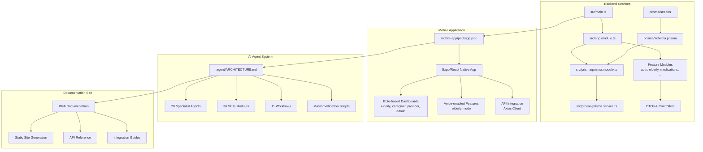

**Diagram sources**
- [src/main.ts:1-52](file://src/main.ts#L1-L52)
- [src/app.module.ts:1-46](file://src/app.module.ts#L1-L46)
- [mobile-app/package.json:1-82](file://mobile-app/package.json#L1-L82)
- [.agent/ARCHITECTURE.md:1-289](file://.agent/ARCHITECTURE.md#L1-L289)

**Section sources**
- [src/app.module.ts:1-46](file://src/app.module.ts#L1-L46)
- [src/main.ts:1-52](file://src/main.ts#L1-L52)
- [mobile-app/package.json:1-82](file://mobile-app/package.json#L1-L82)
- [.agent/ARCHITECTURE.md:1-289](file://.agent/ARCHITECTURE.md#L1-L289)

## Core Components
The 99-Pai ecosystem consists of four primary development platforms:

### Backend Services (NestJS)
- **Application bootstrap** initializes global prefix, CORS, validation pipe, Swagger, and security middleware
- **AppModule** aggregates all feature modules and global providers including throttling and request ID interceptors
- **PrismaModule** provides centralized database access with global PrismaService
- **AuthModule** implements JWT authentication with role-based access control

### Mobile Application (React Native + Expo)
- **Expo Router** for navigation with role-based protected routes
- **Authentication Context** managing JWT token lifecycle and session persistence
- **Axios API Client** with automatic token injection and error handling
- **Role-based UI** with specialized dashboards for elderly, caregivers, providers, and administrators

### AI Agent System (Antigravity Kit)
- **20 Specialist Agents** with domain expertise in web development, mobile apps, security, testing, and more
- **36 Skills Modules** providing modular knowledge domains for on-demand loading
- **11 Workflows** enabling slash-command automation for development tasks
- **Master Validation Scripts** ensuring code quality and security compliance

### Web Documentation Site
- **Comprehensive API Documentation** with integration guides and troubleshooting
- **Interactive Examples** demonstrating mobile-backend integration
- **Development Workflow Documentation** covering all platform aspects

**Section sources**
- [src/main.ts:1-52](file://src/main.ts#L1-L52)
- [src/app.module.ts:1-46](file://src/app.module.ts#L1-L46)
- [mobile-app/README.md:1-105](file://mobile-app/README.md#L1-L105)
- [.agent/ARCHITECTURE.md:1-289](file://.agent/ARCHITECTURE.md#L1-L289)

## Architecture Overview
The 99-Pai system implements a distributed architecture supporting multiple concurrent development streams:

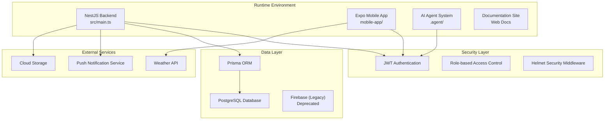

**Diagram sources**
- [src/main.ts:1-52](file://src/main.ts#L1-L52)
- [mobile-app/src/services/api.ts:1-44](file://mobile-app/src/services/api.ts#L1-L44)
- [mobile-app/src/lib/firebase.ts:1-46](file://mobile-app/src/lib/firebase.ts#L1-L46)

**Section sources**
- [src/main.ts:1-52](file://src/main.ts#L1-L52)
- [mobile-app/src/services/api.ts:1-44](file://mobile-app/src/services/api.ts#L1-L44)

## Detailed Component Analysis

### Authentication Module
The authentication system supports four distinct user roles with comprehensive JWT-based security:

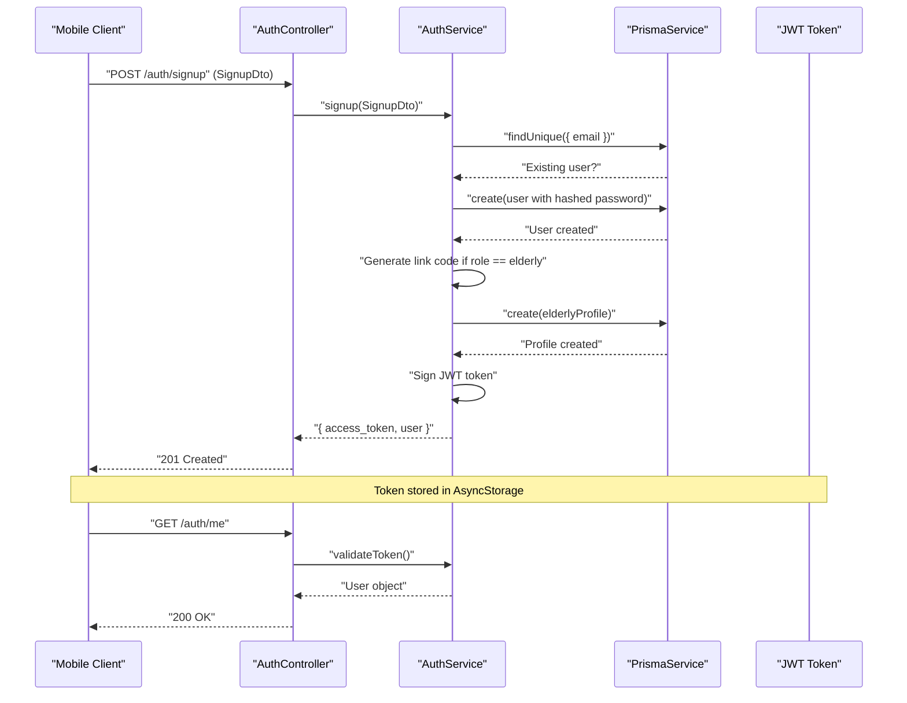

**Diagram sources**
- [src/auth/auth.controller.ts:1-44](file://src/auth/auth.controller.ts#L1-L44)
- [src/auth/auth.service.ts:1-173](file://src/auth/auth.service.ts#L1-L173)
- [src/auth/dto/signup.dto.ts:1-53](file://src/auth/dto/signup.dto.ts#L1-L53)

**Section sources**
- [src/auth/auth.module.ts:1-28](file://src/auth/auth.module.ts#L1-L28)
- [src/auth/auth.service.ts:1-173](file://src/auth/auth.service.ts#L1-L173)
- [src/auth/auth.controller.ts:1-44](file://src/auth/auth.controller.ts#L1-L44)

### DTOs and Validation
The system uses comprehensive DTO validation with class-validator decorators:

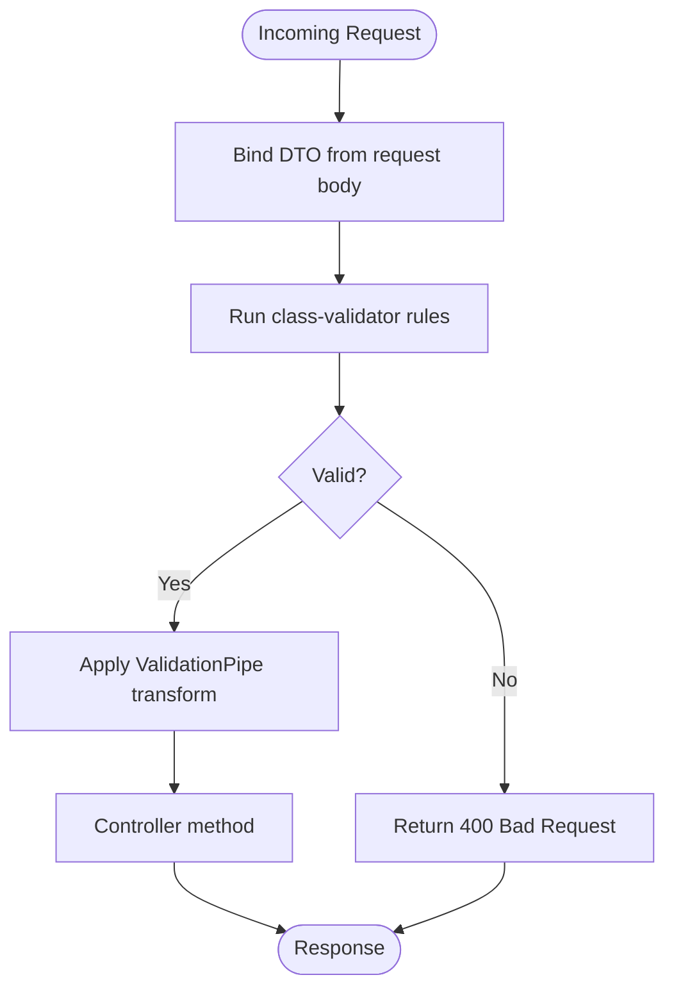

**Diagram sources**
- [src/main.ts:22-28](file://src/main.ts#L22-L28)
- [src/auth/dto/signup.dto.ts:1-53](file://src/auth/dto/signup.dto.ts#L1-L53)

**Section sources**
- [src/main.ts:22-28](file://src/main.ts#L22-L28)
- [src/auth/dto/signup.dto.ts:1-53](file://src/auth/dto/signup.dto.ts#L1-L53)

### Prisma Data Model and Seed
The database schema supports comprehensive elderly care functionality:

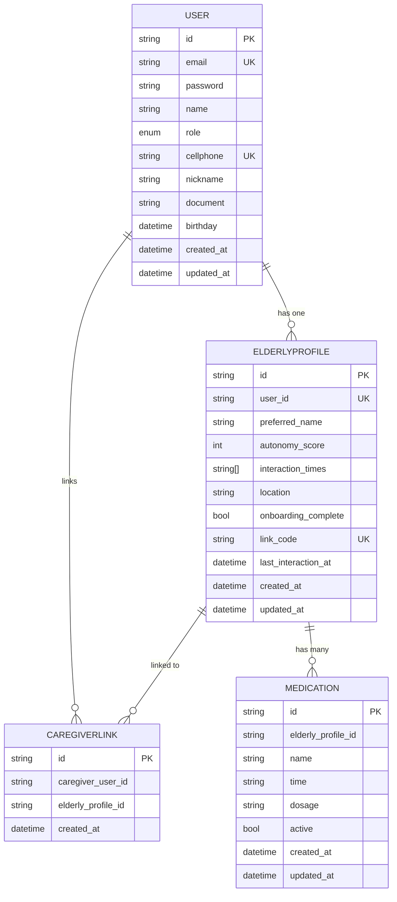

**Diagram sources**
- [prisma/schema.prisma:47-286](file://prisma/schema.prisma#L47-L286)

**Section sources**
- [prisma/schema.prisma:1-286](file://prisma/schema.prisma#L1-L286)
- [prisma/seed.ts:1-365](file://prisma/seed.ts#L1-L365)

## Mobile Application Development

### Application Architecture
The React Native mobile application implements a comprehensive role-based system with specialized interfaces for different user types:

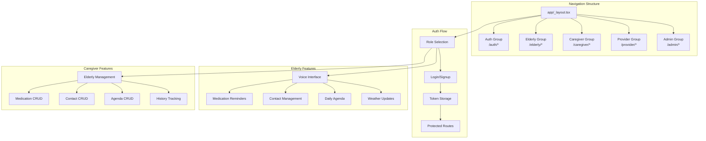

**Diagram sources**
- [mobile-app/app/_layout.tsx:1-61](file://mobile-app/app/_layout.tsx#L1-L61)
- [mobile-app/NAVIGATION_MAP.md:1-134](file://mobile-app/NAVIGATION_MAP.md#L1-L134)

### Authentication and Session Management
The mobile app implements robust authentication with AsyncStorage persistence:

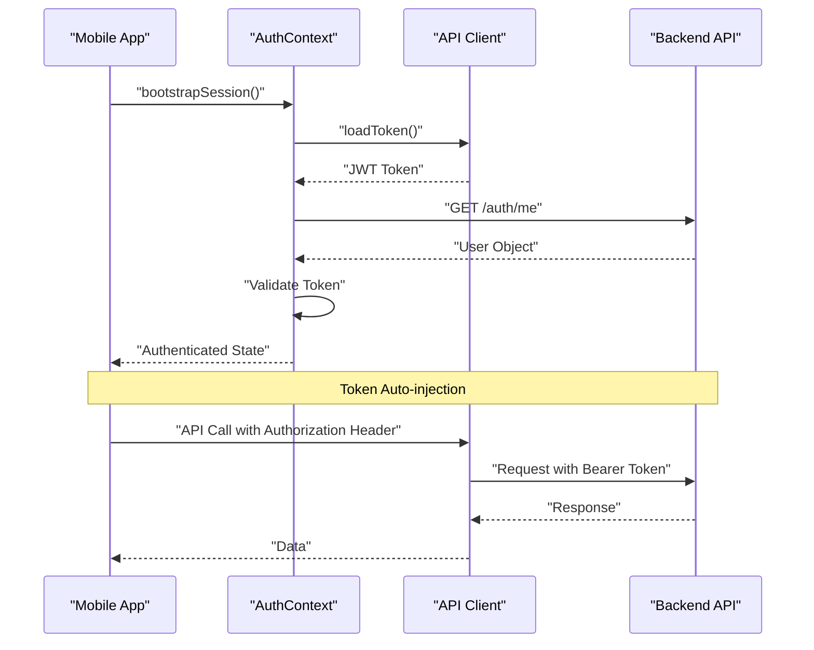

**Diagram sources**
- [mobile-app/src/services/api.ts:1-44](file://mobile-app/src/services/api.ts#L1-L44)
- [mobile-app/INTEGRATION_GUIDE.md:71-101](file://mobile-app/INTEGRATION_GUIDE.md#L71-L101)

### Voice-enabled Features
The elderly interface provides comprehensive voice interaction capabilities:

| Feature | Technology | Implementation |
|---------|------------|----------------|
| Speech-to-Text | @react-native-voice/voice | Real-time voice commands |
| Text-to-Speech | expo-speech | Audio feedback and announcements |
| Voice Navigation | Custom voice prompts | Contextual voice guidance |
| Voice Settings | Voice preferences | Adjustable speech rate and tone |

**Section sources**
- [mobile-app/README.md:1-105](file://mobile-app/README.md#L1-L105)
- [mobile-app/INTEGRATION_GUIDE.md:1-262](file://mobile-app/INTEGRATION_GUIDE.md#L1-L262)
- [mobile-app/NAVIGATION_MAP.md:1-134](file://mobile-app/NAVIGATION_MAP.md#L1-L134)

## AI Agent System Development

### Antigravity Kit Architecture
The AI agent system provides comprehensive development assistance through specialized agents and skills:

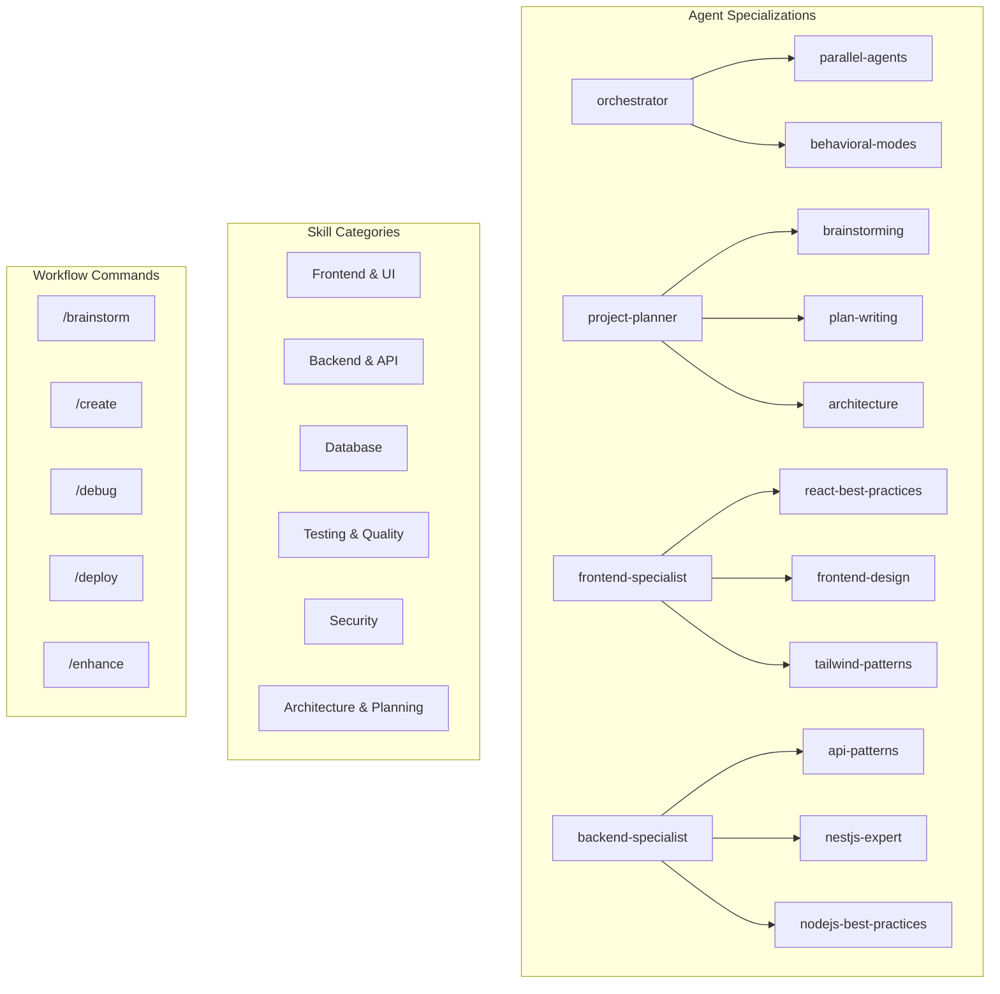

**Diagram sources**
- [.agent/ARCHITECTURE.md:31-188](file://.agent/ARCHITECTURE.md#L31-L188)

### Skill Loading Protocol
The system implements dynamic skill loading for on-demand functionality:

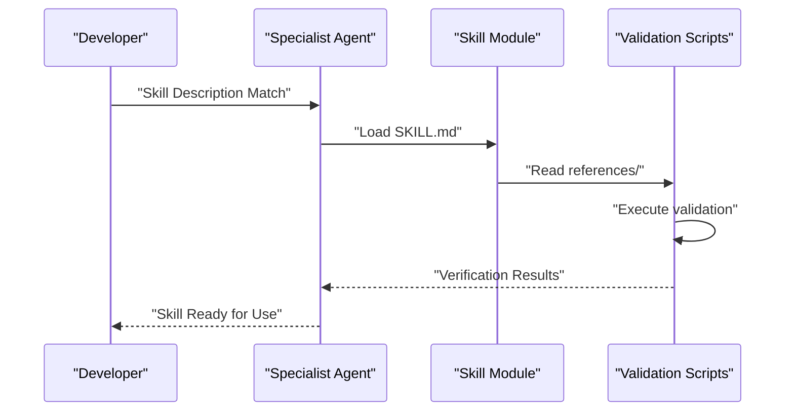

**Diagram sources**
- [.agent/ARCHITECTURE.md:191-210](file://.agent/ARCHITECTURE.md#L191-L210)

### Master Validation Scripts
The system includes comprehensive quality assurance through master validation scripts:

| Script | Purpose | When to Use |
|--------|---------|-------------|
| checklist.py | Priority-based validation (Core checks) | Development, pre-commit |
| verify_all.py | Comprehensive verification (All checks) | Pre-deployment, releases |

**Section sources**
- [.agent/ARCHITECTURE.md:1-289](file://.agent/ARCHITECTURE.md#L1-L289)

## Web Documentation Site Development

### Documentation Architecture
The web documentation site provides comprehensive technical documentation and integration guides:

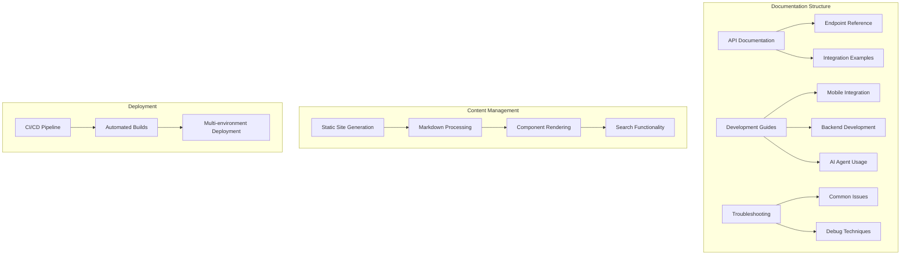

### API Reference Documentation
The documentation includes comprehensive API reference with practical examples:

| Category | Endpoints | Methods |
|----------|-----------|---------|
| Authentication | `/auth/signup`, `/auth/login`, `/auth/me` | POST, GET |
| Elderly Features | `/elderly/profile`, `/weather`, `/medications/today` | GET, PATCH |
| Caregiver Features | `/caregiver/elderly`, `/caregiver/link` | GET, POST |
| Medication Management | `/medications/{id}/confirm`, `/elderly/{id}/medications` | POST, GET, DELETE |
| Contact Management | `/contacts`, `/contacts/{id}/called`, `/elderly/{id}/contacts` | GET, POST, DELETE |
| Agenda Management | `/agenda/today`, `/elderly/{id}/agenda` | GET, POST, DELETE |

**Section sources**
- [mobile-app/API_CONTRACTS.md:1-520](file://mobile-app/API_CONTRACTS.md#L1-L520)
- [mobile-app/INTEGRATION_GUIDE.md:1-262](file://mobile-app/INTEGRATION_GUIDE.md#L1-L262)

## API Integration and Contracts

### Mobile Backend Integration
The mobile application integrates seamlessly with the NestJS backend through RESTful APIs:

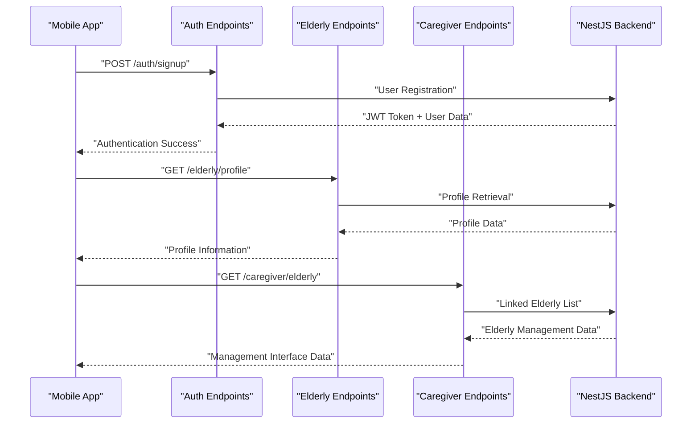

**Diagram sources**
- [mobile-app/API_CONTRACTS.md:7-520](file://mobile-app/API_CONTRACTS.md#L7-L520)
- [mobile-app/INTEGRATION_GUIDE.md:102-125](file://mobile-app/INTEGRATION_GUIDE.md#L102-L125)

### Error Handling and Response Formats
The system implements standardized error handling across all API endpoints:

| Status Code | Purpose | Example Response |
|-------------|---------|------------------|
| 200 | Success | `{ "message": "Operation successful" }` |
| 201 | Created | `{ "id": "uuid", "message": "Resource created" }` |
| 202 | Accepted | `{ "message": "Request accepted for processing" }` |
| 400 | Bad Request | `{ "statusCode": 400, "message": "Validation error" }` |
| 401 | Unauthorized | `{ "statusCode": 401, "message": "Invalid credentials" }` |
| 403 | Forbidden | `{ "statusCode": 403, "message": "Insufficient permissions" }` |
| 404 | Not Found | `{ "statusCode": 404, "message": "Resource not found" }` |
| 500 | Internal Error | `{ "statusCode": 500, "message": "Internal server error" }` |

**Section sources**
- [mobile-app/API_CONTRACTS.md:485-520](file://mobile-app/API_CONTRACTS.md#L485-L520)
- [mobile-app/INTEGRATION_GUIDE.md:223-243](file://mobile-app/INTEGRATION_GUIDE.md#L223-L243)

## Dependency Analysis
The multi-platform project maintains comprehensive dependency management across all components:

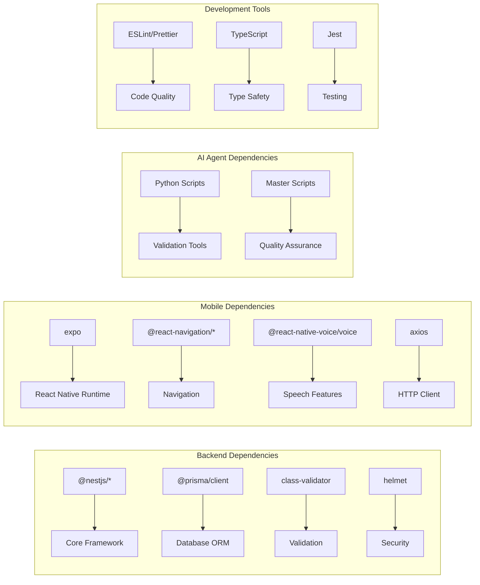

**Diagram sources**
- [package.json:22-70](file://package.json#L22-L70)
- [mobile-app/package.json:12-81](file://mobile-app/package.json#L12-L81)

**Section sources**
- [package.json:22-70](file://package.json#L22-L70)
- [mobile-app/package.json:12-81](file://mobile-app/package.json#L12-L81)

## Performance Considerations
The multi-platform architecture requires optimized performance strategies across all components:

### Backend Performance
- **Strict TypeScript settings** improve type safety and catch errors early
- **Incremental builds** and source maps aid development speed and debugging
- **Global ValidationPipe** reduces boilerplate and ensures consistent input sanitization
- **Prisma indexes** are defined in the schema to optimize queries
- **Helmet security middleware** provides protection against common web vulnerabilities

### Mobile Performance
- **Expo Router** provides efficient navigation with lazy loading
- **AsyncStorage** enables fast local caching of authentication tokens
- **Voice features** optimized for background processing and battery efficiency
- **Image optimization** through Expo Asset Management
- **Network request optimization** with automatic token injection

### AI Agent Performance
- **Dynamic skill loading** minimizes memory footprint
- **Master validation scripts** ensure code quality without runtime overhead
- **Modular architecture** allows selective agent activation
- **Python script optimization** for validation tasks

## Troubleshooting Guide

### Backend Development Issues
- **Linting/formatting errors**
  - Run `npm run lint` and `npm run format` to auto-fix issues
  - Ensure editor integrations use configured ESLint and Prettier settings
- **Build failures**
  - Clean and rebuild using `npm run build` and `npm run start:dev`
  - Verify TypeScript configuration and module resolution
- **Database seeding issues**
  - Use `npx prisma db seed` to initialize test data
  - Check Prisma schema and seed script for consistency

### Mobile Application Issues
- **Authentication problems**
  - Verify `EXPO_PUBLIC_API_URL` environment variable
  - Check AsyncStorage for token persistence
  - Review backend JWT configuration
- **Navigation issues**
  - Validate route definitions in `app/_layout.tsx`
  - Check role-based access controls
  - Verify navigation parameters and state
- **Voice feature problems**
  - Ensure microphone permissions are granted
  - Test voice features on physical devices
  - Check network connectivity for voice processing

### AI Agent System Issues
- **Skill loading failures**
  - Verify skill directory structure
  - Check Python script execution permissions
  - Validate master script configuration
- **Agent coordination issues**
  - Review orchestrator agent configuration
  - Check behavioral modes settings
  - Verify parallel agent execution limits

### API Integration Issues
- **Mobile-backend communication**
  - Verify CORS configuration in backend
  - Check API endpoint availability
  - Validate JWT token format and expiration
- **Response format mismatches**
  - Compare frontend expectations with backend responses
  - Update API contracts documentation
  - Implement proper error handling

**Section sources**
- [package.json:8-21](file://package.json#L8-L21)
- [eslint.config.mjs:1-36](file://eslint.config.mjs#L1-L36)
- [.prettierrc:1-2](file://.prettierrc#L1-L2)
- [mobile-app/INTEGRATION_GUIDE.md:223-262](file://mobile-app/INTEGRATION_GUIDE.md#L223-L262)

## Contribution and Release Management

### Multi-Platform Development Standards
The 99-Pai project requires adherence to comprehensive development standards across all platforms:

#### Code Style Standards
- **Backend (NestJS)**: Use ESLint with TypeScript and Prettier plugins
- **Mobile (React Native)**: Follow React Native community standards with TypeScript
- **AI Agents**: Python code follows PEP 8 standards with comprehensive docstrings
- **Documentation**: Markdown files with consistent formatting and cross-references

#### ESLint Configuration
- Extends recommended rules with TypeScript-specific type-checked configurations
- Integrates Prettier to enforce formatting consistency across all platforms
- Includes global environment settings for Node, Jest, and React Native

#### Prettier Formatting Rules
- Single quotes and trailing commas enforced consistently
- Line ending handling set to auto for cross-platform compatibility
- Platform-specific overrides for different file types

#### TypeScript Configuration
- **Backend**: Target ES2023, strict mode enabled, decorator metadata enabled
- **Mobile**: React Native TypeScript configuration with Expo compatibility
- **AI Agents**: Python type hints and comprehensive documentation

#### Build and Development Workflow
- **Backend**: Nest CLI for building and running in development/watch modes
- **Mobile**: Expo CLI for development, EAS for production builds
- **AI Agents**: Python virtual environments for development and testing
- **Documentation**: Static site generation with automated deployment

#### Testing Strategies
- **Backend**: Jest unit tests with ts-jest transformer, E2E testing with Supertest
- **Mobile**: React Native testing library, Expo-specific testing approaches
- **AI Agents**: Python unittest framework with comprehensive validation
- **Integration**: Cross-platform testing with API contract validation

#### Adding New Features
- **Backend**: Create new feature module with controller, service, and DTOs
- **Mobile**: Implement new screens with proper navigation and state management
- **AI Agents**: Develop new skills with proper documentation and validation
- **Documentation**: Update API contracts and integration guides

#### Extending Existing Modules
- **Backend**: Keep concerns separated within feature modules
- **Mobile**: Reuse components and navigation patterns where possible
- **AI Agents**: Extend existing skills with new capabilities
- **Documentation**: Maintain consistency across all platform documentation

#### Version Control Practices
- **Branching Strategy**: Feature branches with clear naming conventions
- **Commit Messages**: Descriptive messages with issue references
- **Code Reviews**: Multi-platform review process with specialized reviewers
- **Testing Requirements**: All changes must pass platform-specific tests

#### Pull Request Process
- **Cross-platform Review**: Ensure changes work across all development platforms
- **Integration Testing**: Verify API contracts and mobile-backend compatibility
- **Documentation Updates**: Update all relevant documentation for new features
- **Release Coordination**: Coordinate releases across all platform components

#### Release Management
- **Version Synchronization**: Maintain consistent version numbers across platforms
- **Deployment Strategy**: Coordinated deployment of backend, mobile, and documentation
- **Rollback Procedures**: Comprehensive rollback plans for multi-platform releases
- **Monitoring**: Post-release monitoring across all platform components

**Section sources**
- [eslint.config.mjs:1-36](file://eslint.config.mjs#L1-L36)
- [.prettierrc:1-2](file://.prettierrc#L1-L2)
- [tsconfig.json:1-24](file://tsconfig.json#L1-L24)
- [mobile-app/README.md:1-105](file://mobile-app/README.md#L1-L105)
- [.agent/ARCHITECTURE.md:1-289](file://.agent/ARCHITECTURE.md#L1-L289)

## Conclusion
The 99-Pai development guidelines provide comprehensive standards for managing a complex multi-platform ecosystem including NestJS backend services, React Native mobile applications, AI agent systems, and web documentation sites. By following these guidelines across all development platforms, contributors can ensure consistency, reliability, and maintainability while supporting the project's mission of elderly care and service marketplace functionality.

The guidelines emphasize cross-platform coordination, comprehensive testing strategies, and unified documentation standards that support both current development needs and future expansion of the 99-Pai ecosystem. Regular updates to these guidelines will ensure they remain aligned with evolving technologies and best practices across all supported platforms.