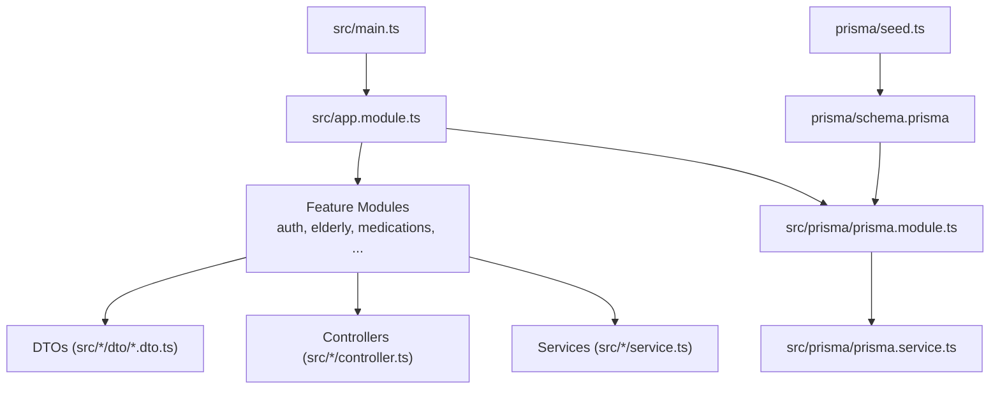
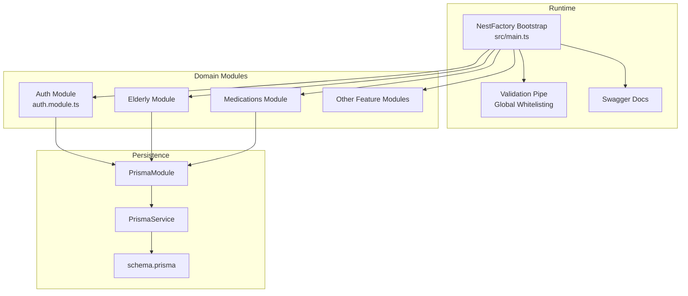
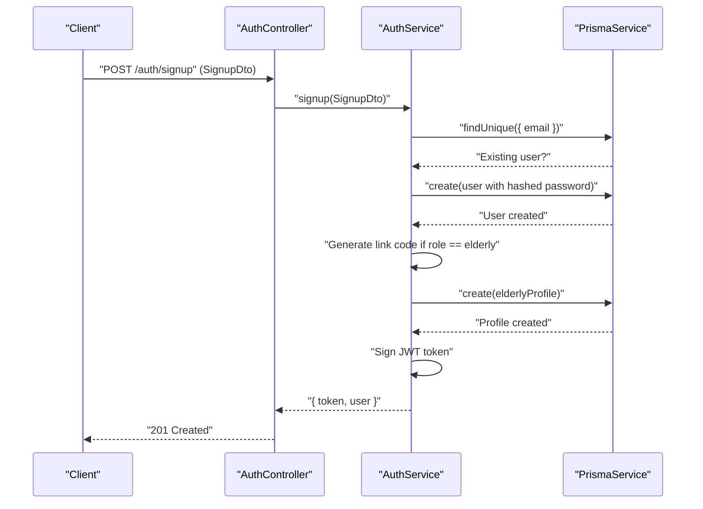
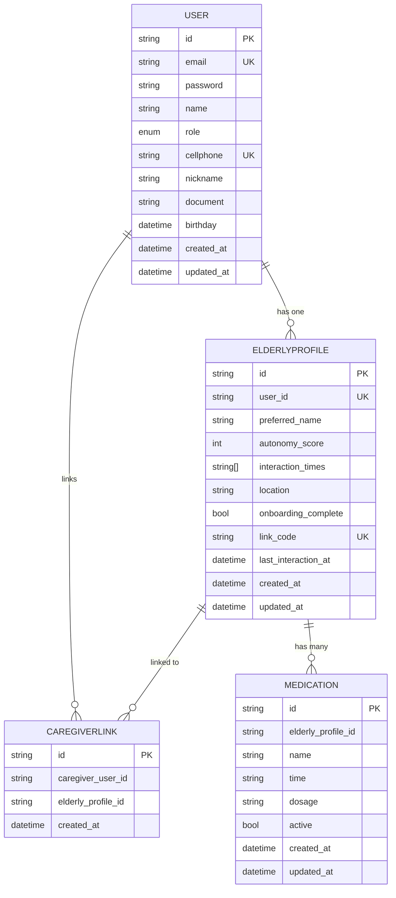
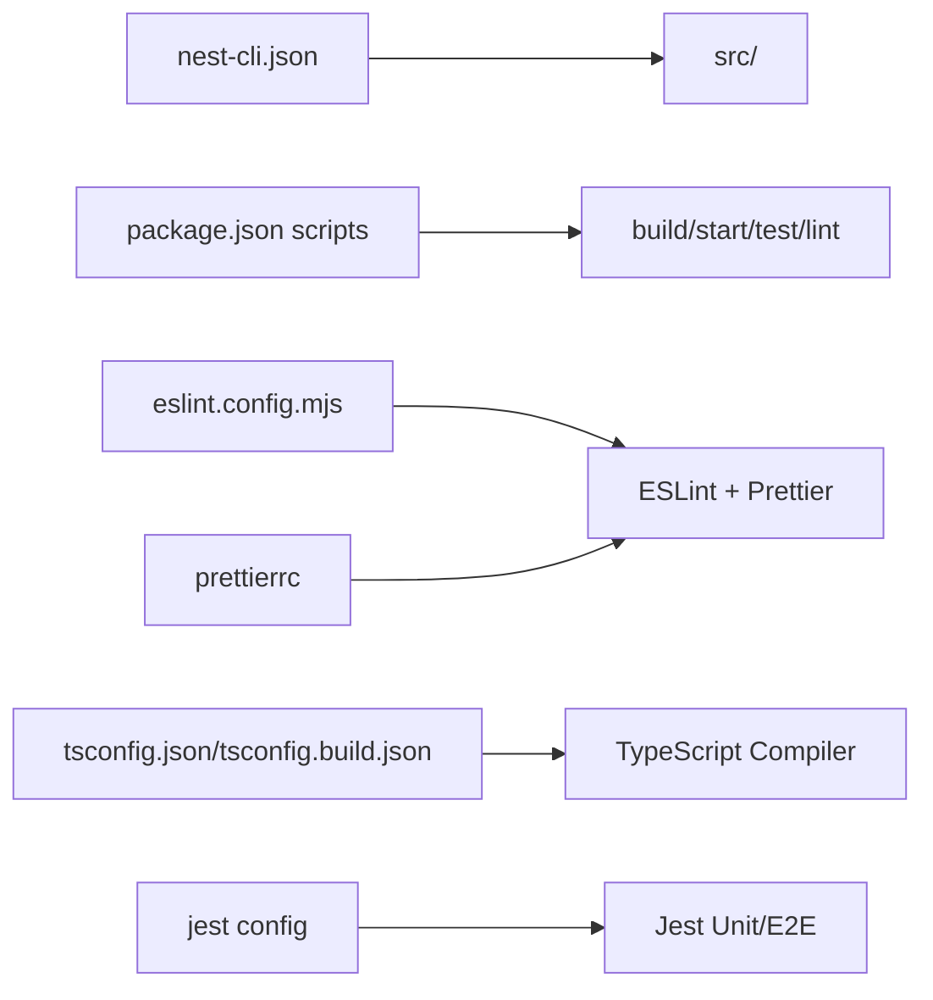

# Development Guidelines

<cite>
**Referenced Files in This Document**
- [package.json](file://package.json)
- [eslint.config.mjs](file://eslint.config.mjs)
- [.prettierrc](file://.prettierrc)
- [tsconfig.json](file://tsconfig.json)
- [tsconfig.build.json](file://tsconfig.build.json)
- [nest-cli.json](file://nest-cli.json)
- [README.md](file://README.md)
- [src/main.ts](file://src/main.ts)
- [src/app.module.ts](file://src/app.module.ts)
- [src/prisma/prisma.module.ts](file://src/prisma/prisma.module.ts)
- [src/prisma/prisma.service.ts](file://src/prisma/prisma.service.ts)
- [src/auth/auth.module.ts](file://src/auth/auth.module.ts)
- [src/auth/auth.service.ts](file://src/auth/auth.service.ts)
- [src/auth/auth.controller.ts](file://src/auth/auth.controller.ts)
- [src/auth/dto/signup.dto.ts](file://src/auth/dto/signup.dto.ts)
- [src/common/decorators/user.decorator.ts](file://src/common/decorators/user.decorator.ts)
- [prisma/schema.prisma](file://prisma/schema.prisma)
- [prisma/seed.ts](file://prisma/seed.ts)
- [test/jest-e2e.json](file://test/jest-e2e.json)
</cite>

## Table of Contents
1. [Introduction](#introduction)
2. [Project Structure](#project-structure)
3. [Core Components](#core-components)
4. [Architecture Overview](#architecture-overview)
5. [Detailed Component Analysis](#detailed-component-analysis)
6. [Dependency Analysis](#dependency-analysis)
7. [Performance Considerations](#performance-considerations)
8. [Troubleshooting Guide](#troubleshooting-guide)
9. [Contribution and Release Management](#contribution-and-release-management)
10. [Conclusion](#conclusion)

## Introduction
This document provides comprehensive development guidelines for the 99-Pai project. It covers code style standards, linting and formatting configurations, TypeScript settings, module architecture, naming conventions, testing and CI workflows, and operational procedures for local development, debugging, and deployment. The goal is to ensure consistent, maintainable, and high-quality contributions across the NestJS backend.

## Project Structure
The project follows a modular NestJS layout with feature-based modules under src. Each domain area (authentication, elderly care, medications, etc.) is encapsulated in its own module with dedicated controllers, services, DTOs, and database integration via Prisma.

**Diagram sources**
- [src/main.ts:1-43](file://src/main.ts#L1-L43)
- [src/app.module.ts:1-36](file://src/app.module.ts#L1-L36)
- [src/prisma/prisma.module.ts:1-10](file://src/prisma/prisma.module.ts#L1-L10)
- [src/prisma/prisma.service.ts:1-17](file://src/prisma/prisma.service.ts#L1-L17)
- [prisma/schema.prisma:1-286](file://prisma/schema.prisma#L1-L286)
- [prisma/seed.ts:1-365](file://prisma/seed.ts#L1-L365)

Key conventions observed:
- Feature folders mirror domain areas (e.g., auth, elderly, medications).
- Each feature folder contains a module, controller, service, and DTOs.
- Shared decorators live under a common directory.
- Prisma is configured globally and injected via a shared module.

**Section sources**
- [src/app.module.ts:1-36](file://src/app.module.ts#L1-L36)
- [src/main.ts:1-43](file://src/main.ts#L1-L43)
- [src/prisma/prisma.module.ts:1-10](file://src/prisma/prisma.module.ts#L1-L10)
- [src/prisma/prisma.service.ts:1-17](file://src/prisma/prisma.service.ts#L1-L17)
- [prisma/schema.prisma:1-286](file://prisma/schema.prisma#L1-L286)

## Core Components
- Application bootstrap initializes global prefix, CORS, validation pipe, Swagger, and port binding.
- AppModule aggregates all feature modules and global providers.
- PrismaModule provides a globally available PrismaService for database operations.
- AuthModule configures JWT and Passport strategies and exposes AuthService and AuthController.

**Section sources**
- [src/main.ts:1-43](file://src/main.ts#L1-L43)
- [src/app.module.ts:1-36](file://src/app.module.ts#L1-L36)
- [src/prisma/prisma.module.ts:1-10](file://src/prisma/prisma.module.ts#L1-L10)
- [src/prisma/prisma.service.ts:1-17](file://src/prisma/prisma.service.ts#L1-L17)
- [src/auth/auth.module.ts:1-28](file://src/auth/auth.module.ts#L1-L28)

## Architecture Overview
The system is a layered NestJS application with:
- HTTP entrypoint and middleware pipeline (global prefix, CORS, validation).
- Swagger/OpenAPI documentation generation.
- Feature modules implementing CRUD and business logic.
- Centralized Prisma integration for data access.
- DTOs for request/response validation and documentation.

**Diagram sources**
- [src/main.ts:1-43](file://src/main.ts#L1-L43)
- [src/auth/auth.module.ts:1-28](file://src/auth/auth.module.ts#L1-L28)
- [src/prisma/prisma.module.ts:1-10](file://src/prisma/prisma.module.ts#L1-L10)
- [src/prisma/prisma.service.ts:1-17](file://src/prisma/prisma.service.ts#L1-L17)
- [prisma/schema.prisma:1-286](file://prisma/schema.prisma#L1-L286)

## Detailed Component Analysis

### Authentication Module
- Module composition includes PrismaModule, Passport, and JWT registration with async factory.
- Service handles user creation, login, and retrieval with validation and logging.
- Controller exposes endpoints for signup, login, and profile retrieval with Swagger metadata and guards.

**Diagram sources**
- [src/auth/auth.controller.ts:1-44](file://src/auth/auth.controller.ts#L1-L44)
- [src/auth/auth.service.ts:1-173](file://src/auth/auth.service.ts#L1-L173)
- [src/auth/dto/signup.dto.ts:1-53](file://src/auth/dto/signup.dto.ts#L1-L53)
- [src/prisma/prisma.service.ts:1-17](file://src/prisma/prisma.service.ts#L1-L17)

**Section sources**
- [src/auth/auth.module.ts:1-28](file://src/auth/auth.module.ts#L1-L28)
- [src/auth/auth.service.ts:1-173](file://src/auth/auth.service.ts#L1-L173)
- [src/auth/auth.controller.ts:1-44](file://src/auth/auth.controller.ts#L1-L44)
- [src/auth/dto/signup.dto.ts:1-53](file://src/auth/dto/signup.dto.ts#L1-L53)
- [src/common/decorators/user.decorator.ts:1-9](file://src/common/decorators/user.decorator.ts#L1-L9)

### DTOs and Validation
- DTOs use class-validator decorators for runtime validation and Swagger metadata.
- ValidationPipe enforces whitelisting and transformation globally.

**Diagram sources**
- [src/main.ts:18-25](file://src/main.ts#L18-L25)
- [src/auth/dto/signup.dto.ts:1-53](file://src/auth/dto/signup.dto.ts#L1-L53)

**Section sources**
- [src/main.ts:18-25](file://src/main.ts#L18-L25)
- [src/auth/dto/signup.dto.ts:1-53](file://src/auth/dto/signup.dto.ts#L1-L53)

### Prisma Data Model and Seed
- The schema defines enums, relations, indexes, and composite unique keys.
- Seed script creates users, profiles, categories, offerings, medications, and agenda events for local testing.

**Diagram sources**
- [prisma/schema.prisma:47-286](file://prisma/schema.prisma#L47-L286)

**Section sources**
- [prisma/schema.prisma:1-286](file://prisma/schema.prisma#L1-L286)
- [prisma/seed.ts:1-365](file://prisma/seed.ts#L1-L365)

## Dependency Analysis
- Nest CLI configuration sets source root and compiler options.
- TypeScript configuration enables strictness, decorators, and nodenext modules.
- Package scripts define build, dev, debug, lint, test, and e2e commands.
- Jest configuration targets TS sources and collects coverage.

**Diagram sources**
- [nest-cli.json:1-9](file://nest-cli.json#L1-L9)
- [package.json:8-21](file://package.json#L8-L21)
- [eslint.config.mjs:1-36](file://eslint.config.mjs#L1-L36)
- [.prettierrc:1-2](file://.prettierrc#L1-L2)
- [tsconfig.json:1-24](file://tsconfig.json#L1-L24)
- [tsconfig.build.json:1-5](file://tsconfig.build.json#L1-L5)
- [test/jest-e2e.json](file://test/jest-e2e.json)

**Section sources**
- [nest-cli.json:1-9](file://nest-cli.json#L1-L9)
- [package.json:8-21](file://package.json#L8-L21)
- [eslint.config.mjs:1-36](file://eslint.config.mjs#L1-L36)
- [.prettierrc:1-2](file://.prettierrc#L1-L2)
- [tsconfig.json:1-24](file://tsconfig.json#L1-L24)
- [tsconfig.build.json:1-5](file://tsconfig.build.json#L1-L5)
- [test/jest-e2e.json](file://test/jest-e2e.json)

## Performance Considerations
- Strict TypeScript settings improve type safety and catch errors early.
- Incremental builds and source maps aid development speed and debugging.
- Global ValidationPipe reduces boilerplate and ensures consistent input sanitization.
- Prisma indexes are defined in the schema to optimize queries.

[No sources needed since this section provides general guidance]

## Troubleshooting Guide
Common development issues and resolutions:
- Linting/formatting errors
  - Run the formatting and lint scripts to auto-fix issues.
  - Ensure editor integrations use the configured ESLint and Prettier settings.
- Build failures
  - Clean and rebuild using the provided scripts; verify TypeScript configuration and module resolution.
- Test failures
  - Use watch mode for iterative testing and coverage reporting.
  - For e2e tests, ensure the environment supports the Jest configuration.
- Database seeding
  - Use the Prisma seed command to initialize test data locally.
- Runtime errors
  - Enable debug mode for interactive debugging sessions.
  - Review logs emitted by services and controllers.

**Section sources**
- [package.json:8-21](file://package.json#L8-L21)
- [eslint.config.mjs:1-36](file://eslint.config.mjs#L1-L36)
- [.prettierrc:1-2](file://.prettierrc#L1-L2)
- [tsconfig.json:1-24](file://tsconfig.json#L1-L24)
- [prisma/seed.ts:1-365](file://prisma/seed.ts#L1-L365)

## Contribution and Release Management
This section outlines recommended practices for contributing to the project. While the repository does not include explicit contribution guidelines, the following standards are derived from the existing configuration and codebase:

- Code Style Standards
  - Use ESLint with TypeScript and Prettier plugins as configured.
  - Apply automatic formatting and lint fixes via scripts.
  - Maintain consistent naming patterns: PascalCase for classes and DTOs, camelCase for properties and methods, kebab-case for file names.

- ESLint Configuration
  - Extends recommended rules with TypeScript-specific type-checked configurations.
  - Integrates Prettier to enforce formatting consistency.
  - Includes global environment settings for Node and Jest.

- Prettier Formatting Rules
  - Single quotes and trailing commas are enforced.
  - Line ending handling is set to auto for cross-platform compatibility.

- TypeScript Configuration
  - Target ES2023, strict mode enabled, decorator metadata enabled, and nodenext modules.
  - Separate build configuration excludes tests and spec files.

- Build and Development Workflow
  - Use Nest CLI for building and running in development/watch modes.
  - Debug mode supports breakpoint debugging.
  - Production startup runs the compiled main entrypoint.

- Testing
  - Unit tests use Jest with ts-jest transformer.
  - Coverage collection is enabled.
  - E2E tests use a separate Jest configuration.

- Adding New Features
  - Create a new feature module with controller, service, and DTOs.
  - Register the module in AppModule.
  - Add DTOs with validation decorators and Swagger metadata.
  - Implement service logic with PrismaService for persistence.
  - Expose endpoints via the controller with appropriate guards and decorators.

- Extending Existing Modules
  - Keep concerns separated within the module’s folder.
  - Reuse PrismaService and shared guards/decorators where applicable.
  - Update DTOs and Swagger documentation for any API changes.

- Version Control Practices
  - Branch by feature; keep commits small and focused.
  - Reference related issues in commit messages.
  - Ensure all linting, formatting, and tests pass before opening a pull request.

- Pull Request Process
  - Include a summary of changes and rationale.
  - Link to relevant issues and schemas.
  - Request reviews from maintainers; address feedback promptly.

- Release Management
  - Tag releases appropriately.
  - Update version in package.json prior to release.
  - Publish artifacts following the build pipeline.

**Section sources**
- [eslint.config.mjs:1-36](file://eslint.config.mjs#L1-L36)
- [.prettierrc:1-2](file://.prettierrc#L1-L2)
- [tsconfig.json:1-24](file://tsconfig.json#L1-L24)
- [tsconfig.build.json:1-5](file://tsconfig.build.json#L1-L5)
- [nest-cli.json:1-9](file://nest-cli.json#L1-L9)
- [package.json:8-21](file://package.json#L8-L21)
- [src/app.module.ts:1-36](file://src/app.module.ts#L1-L36)
- [src/prisma/prisma.service.ts:1-17](file://src/prisma/prisma.service.ts#L1-L17)
- [prisma/schema.prisma:1-286](file://prisma/schema.prisma#L1-L286)

## Conclusion
These guidelines consolidate the project’s established patterns for code style, linting, formatting, TypeScript configuration, module architecture, and development workflow. By adhering to these standards—especially around validation, DTOs, Prisma modeling, and testing—you ensure consistency, reliability, and maintainability across the codebase. Follow the contribution and release practices to streamline collaboration and delivery.