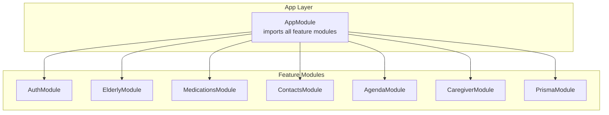
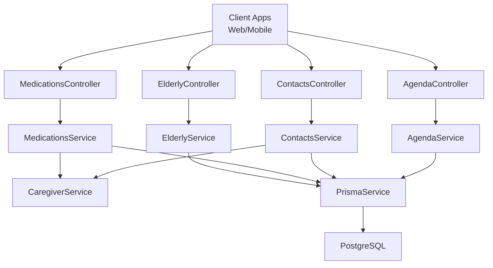
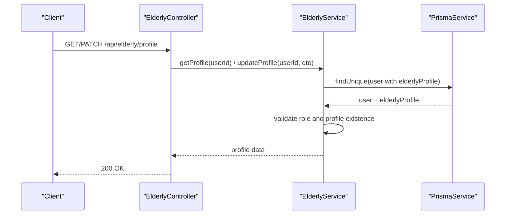
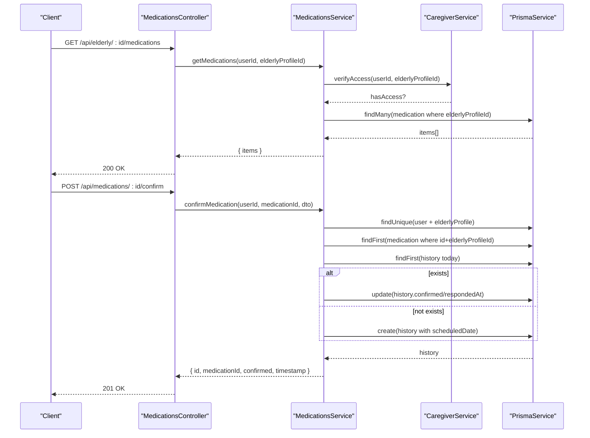
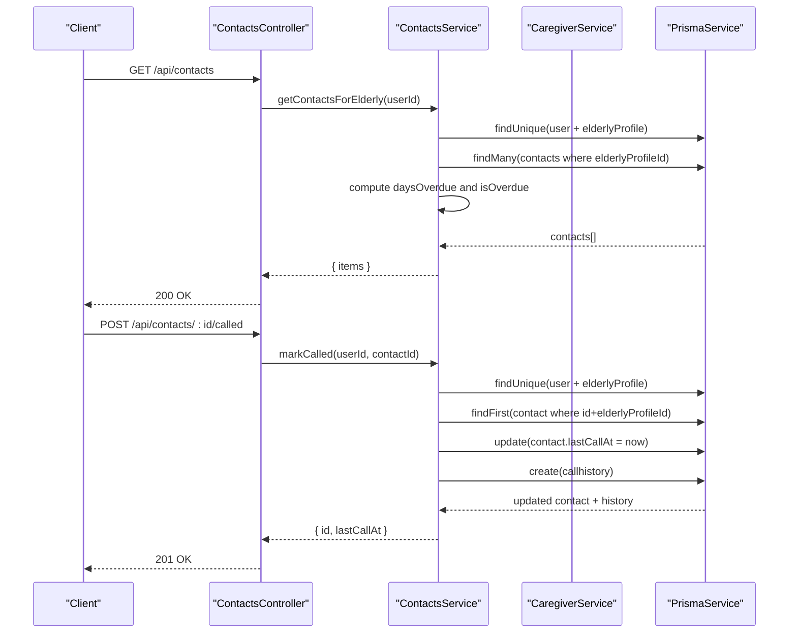
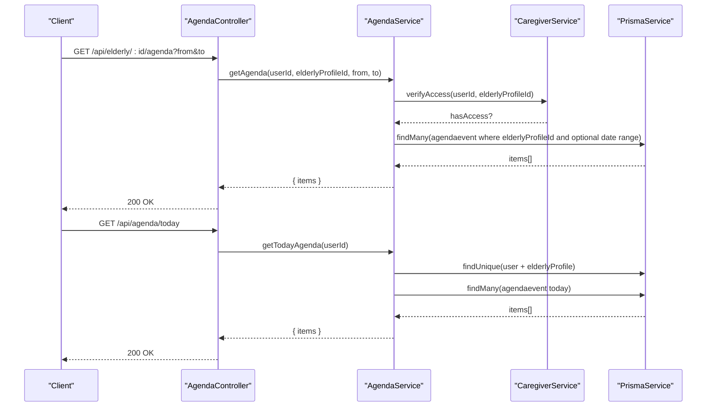
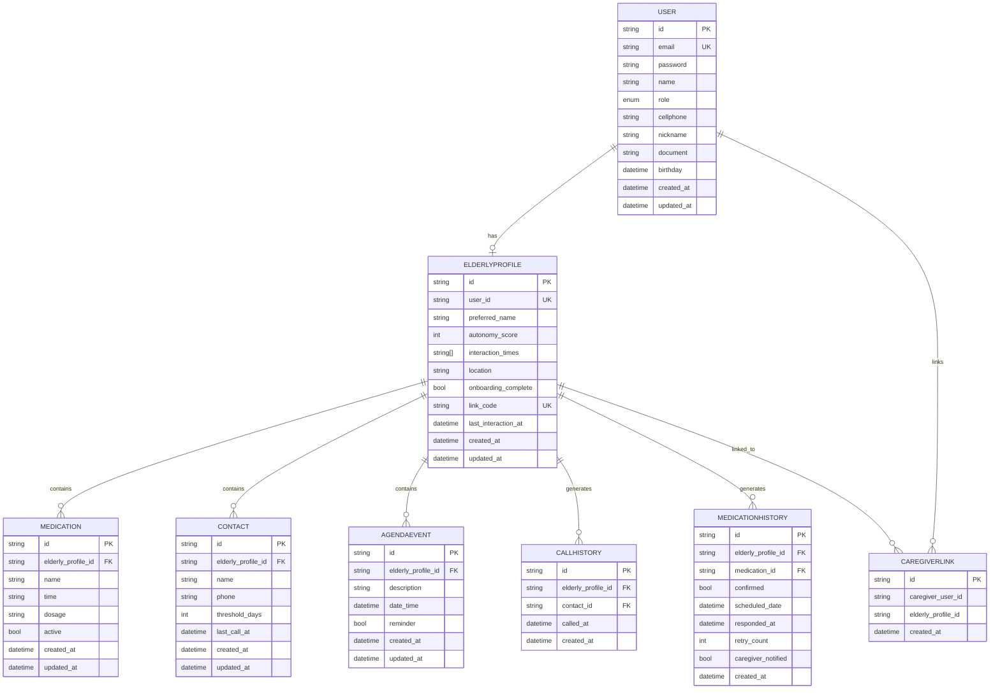

# Elderly Care Management

<cite>
**Referenced Files in This Document**
- [app.module.ts](file://src/app.module.ts)
- [main.ts](file://src/main.ts)
- [schema.prisma](file://prisma/schema.prisma)
- [README.md](file://README.md)
- [elderly.controller.ts](file://src/elderly/elderly.controller.ts)
- [elderly.service.ts](file://src/elderly/elderly.service.ts)
- [update-profile.dto.ts](file://src/elderly/dto/update-profile.dto.ts)
- [medications.controller.ts](file://src/medications/medications.controller.ts)
- [medications.service.ts](file://src/medications/medications.service.ts)
- [create-medication.dto.ts](file://src/medications/dto/create-medication.dto.ts)
- [update-medication.dto.ts](file://src/medications/dto/update-medication.dto.ts)
- [confirm-medication.dto.ts](file://src/medications/dto/confirm-medication.dto.ts)
- [contacts.controller.ts](file://src/contacts/contacts.controller.ts)
- [contacts.service.ts](file://src/contacts/contacts.service.ts)
- [create-contact.dto.ts](file://src/contacts/dto/create-contact.dto.ts)
- [update-contact.dto.ts](file://src/contacts/dto/update-contact.dto.ts)
- [agenda.controller.ts](file://src/agenda/agenda.controller.ts)
- [agenda.service.ts](file://src/agenda/agenda.service.ts)
- [create-agenda.dto.ts](file://src/agenda/dto/create-agenda.dto.ts)
- [update-agenda.dto.ts](file://src/agenda/dto/update-agenda.dto.ts)
- [jwt-auth.guard.ts](file://src/auth/jwt-auth.guard.ts)
- [roles.guard.ts](file://src/auth/roles.guard.ts)
- [roles.decorator.ts](file://src/auth/roles.decorator.ts)
- [user.decorator.ts](file://src/common/decorators/user.decorator.ts)
- [caregiver.service.ts](file://src/caregiver/caregiver.service.ts)
</cite>

## Table of Contents
1. [Introduction](#introduction)
2. [Project Structure](#project-structure)
3. [Core Components](#core-components)
4. [Architecture Overview](#architecture-overview)
5. [Detailed Component Analysis](#detailed-component-analysis)
6. [Dependency Analysis](#dependency-analysis)
7. [Performance Considerations](#performance-considerations)
8. [Troubleshooting Guide](#troubleshooting-guide)
9. [Conclusion](#conclusion)
10. [Appendices](#appendices)

## Introduction
This document describes the elderly care management system built with NestJS and Prisma. It focuses on four core subsystems:
- Elderly profile management
- Medication tracking
- Contact management
- Agenda scheduling

It explains implementation patterns (CRUD, validation, and business logic), controller-to-service relationships, authentication and authorization, and how these systems integrate to coordinate care. It also includes API documentation with request/response schemas, authentication requirements, error handling, and practical workflows such as medication scheduling, emergency contact updates, and appointment management.

## Project Structure
The application is organized as a modular NestJS project. The main application module aggregates feature modules for authentication, elderly profiles, caregivers, medications, contacts, agenda, notifications, interactions, weather, categories, offerings, and service requests. The Prisma schema defines the data model and relationships across these domains.

**Diagram sources**
- [app.module.ts:17-34](file://src/app.module.ts#L17-L34)

**Section sources**
- [app.module.ts:1-36](file://src/app.module.ts#L1-L36)
- [main.ts:1-43](file://src/main.ts#L1-L43)
- [README.md:24-99](file://README.md#L24-L99)

## Core Components
- Authentication and Authorization
  - JWT-based guard and role-based guard enforce bearer token authentication and role checks.
  - Decorators extract the current user’s ID and roles.
- Elderly Profile Management
  - Controllers expose endpoints to retrieve and update an elderly user’s profile.
  - Services validate role and presence of a linked elderly profile before performing operations.
- Medication Tracking
  - Controllers expose CRUD endpoints for medications and confirmation of intake per day.
  - Services enforce access via caregiver links and maintain daily confirmation records.
- Contact Management
  - Controllers expose CRUD endpoints for emergency and support contacts.
  - Services compute overdue status based on thresholds and track call history.
- Agenda Scheduling
  - Controllers expose CRUD endpoints for agenda events and today’s agenda retrieval.
  - Services filter events by date range and enforce access controls.

**Section sources**
- [jwt-auth.guard.ts](file://src/auth/jwt-auth.guard.ts)
- [roles.guard.ts](file://src/auth/roles.guard.ts)
- [roles.decorator.ts](file://src/auth/roles.decorator.ts)
- [user.decorator.ts](file://src/common/decorators/user.decorator.ts)
- [elderly.controller.ts:16-41](file://src/elderly/elderly.controller.ts#L16-L41)
- [elderly.service.ts:17-77](file://src/elderly/elderly.service.ts#L17-L77)
- [medications.controller.ts:29-144](file://src/medications/medications.controller.ts#L29-L144)
- [medications.service.ts:24-308](file://src/medications/medications.service.ts#L24-L308)
- [contacts.controller.ts:28-128](file://src/contacts/contacts.controller.ts#L28-L128)
- [contacts.service.ts:23-245](file://src/contacts/contacts.service.ts#L23-L245)
- [agenda.controller.ts:28-104](file://src/agenda/agenda.controller.ts#L28-L104)
- [agenda.service.ts:23-174](file://src/agenda/agenda.service.ts#L23-L174)

## Architecture Overview
The system uses a layered architecture:
- Controllers handle HTTP requests, apply guards, and delegate to services.
- Services encapsulate business logic, enforce access control, and interact with Prisma.
- Prisma provides strongly typed database access and enforces referential integrity.

**Diagram sources**
- [elderly.controller.ts:20-41](file://src/elderly/elderly.controller.ts#L20-L41)
- [medications.controller.ts:34-144](file://src/medications/medications.controller.ts#L34-L144)
- [contacts.controller.ts:33-128](file://src/contacts/contacts.controller.ts#L33-L128)
- [agenda.controller.ts:32-104](file://src/agenda/agenda.controller.ts#L32-L104)
- [elderly.service.ts:15](file://src/elderly/elderly.service.ts#L15)
- [medications.service.ts:19-22](file://src/medications/medications.service.ts#L19-L22)
- [contacts.service.ts:18-21](file://src/contacts/contacts.service.ts#L18-L21)
- [agenda.service.ts:18-21](file://src/agenda/agenda.service.ts#L18-L21)
- [caregiver.service.ts](file://src/caregiver/caregiver.service.ts)
- [schema.prisma:47-286](file://prisma/schema.prisma#L47-L286)

## Detailed Component Analysis

### Elderly Profile Management
- Responsibilities
  - Retrieve and update an elderly user’s profile.
  - Enforce role checks so only elderly users can access profile endpoints.
- Implementation pattern
  - Controller endpoints decorated with JWT and role guards.
  - Service validates user role and existence of elderly profile before updating.
- Validation rules
  - Update DTO enforces optional fields with types and bounds for autonomy score and array of interaction times.
- Access control
  - Only users with role elderly can access profile endpoints.

**Diagram sources**
- [elderly.controller.ts:23-40](file://src/elderly/elderly.controller.ts#L23-L40)
- [elderly.service.ts:17-77](file://src/elderly/elderly.service.ts#L17-L77)

**Section sources**
- [elderly.controller.ts:16-41](file://src/elderly/elderly.controller.ts#L16-L41)
- [elderly.service.ts:17-77](file://src/elderly/elderly.service.ts#L17-L77)
- [update-profile.dto.ts:12-43](file://src/elderly/dto/update-profile.dto.ts#L12-L43)

### Medication Tracking
- Responsibilities
  - CRUD for medications associated with an elderly profile.
  - Today’s medication list for the elderly user.
  - Confirmation of intake per day with history tracking.
  - History pagination and filtering by date range.
- Implementation pattern
  - Controllers delegate to service; service verifies access via caregiver links.
  - Daily confirmation uses a dedicated history entity with scheduledDate and respondedAt timestamps.
- Validation rules
  - Create and update DTOs enforce non-empty strings for name/time/dosage and optional activation flag.
  - Confirmation DTO enforces boolean for intake status.
- Access control
  - Non-elderly users require caregiver access to profile; elderly users can confirm their own medications.

**Diagram sources**
- [medications.controller.ts:36-118](file://src/medications/medications.controller.ts#L36-L118)
- [medications.service.ts:24-253](file://src/medications/medications.service.ts#L24-L253)
- [caregiver.service.ts](file://src/caregiver/caregiver.service.ts)

**Section sources**
- [medications.controller.ts:29-144](file://src/medications/medications.controller.ts#L29-L144)
- [medications.service.ts:24-308](file://src/medications/medications.service.ts#L24-L308)
- [create-medication.dto.ts:4-16](file://src/medications/dto/create-medication.dto.ts#L4-L16)
- [update-medication.dto.ts:4-24](file://src/medications/dto/update-medication.dto.ts#L4-L24)
- [confirm-medication.dto.ts:4-8](file://src/medications/dto/confirm-medication.dto.ts#L4-L8)

### Contact Management
- Responsibilities
  - CRUD for contacts associated with an elderly profile.
  - Overdue contact list for the elderly user computed from thresholds and last call dates.
  - Call logging when elderly user marks a call.
  - Call history pagination.
- Implementation pattern
  - Controllers delegate to service; service verifies access via caregiver links.
  - Overdue computation compares last call date plus threshold against current date.
- Validation rules
  - Create and update DTOs enforce non-empty strings for name/phone and positive integer threshold.
- Access control
  - Non-elderly users require caregiver access to profile; elderly users can mark calls.

**Diagram sources**
- [contacts.controller.ts:92-108](file://src/contacts/contacts.controller.ts#L92-L108)
- [contacts.service.ts:127-203](file://src/contacts/contacts.service.ts#L127-L203)
- [caregiver.service.ts](file://src/caregiver/caregiver.service.ts)

**Section sources**
- [contacts.controller.ts:28-128](file://src/contacts/contacts.controller.ts#L28-L128)
- [contacts.service.ts:23-245](file://src/contacts/contacts.service.ts#L23-L245)
- [create-contact.dto.ts:4-18](file://src/contacts/dto/create-contact.dto.ts#L4-L18)
- [update-contact.dto.ts:4-20](file://src/contacts/dto/update-contact.dto.ts#L4-L20)

### Agenda Scheduling
- Responsibilities
  - CRUD for agenda events associated with an elderly profile.
  - Today’s agenda retrieval for the elderly user.
  - Optional reminder flag and date-time filtering.
- Implementation pattern
  - Controllers delegate to service; service verifies access via caregiver links.
  - Today’s agenda filters by start/end of day.
- Validation rules
  - Create and update DTOs enforce non-empty strings for description/date-time and optional boolean reminder.
- Access control
  - Non-elderly users require caregiver access to profile; elderly users can retrieve today’s agenda.

**Diagram sources**
- [agenda.controller.ts:35-103](file://src/agenda/agenda.controller.ts#L35-L103)
- [agenda.service.ts:23-174](file://src/agenda/agenda.service.ts#L23-L174)
- [caregiver.service.ts](file://src/caregiver/caregiver.service.ts)

**Section sources**
- [agenda.controller.ts:28-104](file://src/agenda/agenda.controller.ts#L28-L104)
- [agenda.service.ts:23-174](file://src/agenda/agenda.service.ts#L23-L174)
- [create-agenda.dto.ts:4-17](file://src/agenda/dto/create-agenda.dto.ts#L4-L17)
- [update-agenda.dto.ts:4-19](file://src/agenda/dto/update-agenda.dto.ts#L4-L19)

## Dependency Analysis
- Module dependencies
  - AppModule aggregates all feature modules.
  - Feature controllers depend on their respective services.
  - Services depend on PrismaService and optionally on CaregiverService for access verification.
- Data model relationships
  - user ↔ elderlyprofile (one-to-one)
  - elderlyprofile ←→ medication/contact/agendaevent/callhistory/interactionlog/serviceRequest (one-to-many)
  - caregiverlink connects user (caregivers) to elderlyprofile (many-to-many via link table)

**Diagram sources**
- [schema.prisma:47-286](file://prisma/schema.prisma#L47-L286)

**Section sources**
- [schema.prisma:47-286](file://prisma/schema.prisma#L47-L286)

## Performance Considerations
- Pagination
  - Medication history and call history endpoints accept page and limit parameters to control payload sizes.
- Indexes
  - Prisma schema defines indexes on frequently queried columns (e.g., elderlyProfileId, active flag, scheduledDate, dateTime) to optimize queries.
- Asynchronous operations
  - Services use Promise.all for count and list queries to reduce round-trips.
- Recommendations
  - Consider caching today’s agenda and medication lists for elderly users to minimize repeated database queries.
  - Add rate limiting for elderly self-service endpoints to prevent abuse.

[No sources needed since this section provides general guidance]

## Troubleshooting Guide
- Authentication and Authorization
  - Ensure requests include a valid Bearer token and the user has the correct role.
  - Verify that elderly users have a linked elderly profile before accessing profile endpoints.
- Access Denied
  - Non-elderly users attempting to access elderly-only endpoints will receive forbidden errors.
  - Caregivers must be linked to the elderly profile for profile-scoped operations.
- Entity Not Found
  - Operations targeting non-existent medications, contacts, or agenda events return not found errors.
- Validation Failures
  - DTO validation enforces field types and constraints; incorrect payloads will be rejected.

**Section sources**
- [elderly.service.ts:23-31](file://src/elderly/elderly.service.ts#L23-L31)
- [medications.service.ts:78-88](file://src/medications/medications.service.ts#L78-L88)
- [contacts.service.ts:84-87](file://src/contacts/contacts.service.ts#L84-L87)
- [agenda.service.ts:100-102](file://src/agenda/agenda.service.ts#L100-L102)

## Conclusion
The elderly care management system integrates four core subsystems—elderly profile, medication tracking, contact management, and agenda scheduling—through a robust authentication and authorization layer. Controllers delegate to services that enforce access control and business rules, while Prisma ensures data integrity and efficient querying. Together, these components enable coordinated care with clear separation of concerns and strong validation.

[No sources needed since this section summarizes without analyzing specific files]

## Appendices

### API Reference

- Authentication
  - Header: Authorization: Bearer {token}
  - Swagger UI: Available under /docs

- Elderly Profile
  - GET /api/elderly/profile
    - Roles: elderly
    - Response: Profile object
  - PATCH /api/elderly/profile
    - Roles: elderly
    - Request body: UpdateElderlyProfileDto
    - Response: Updated profile object

- Medications
  - GET /api/elderly/{elderlyProfileId}/medications
    - Roles: caregiver
    - Response: { items: Medication[] }
  - POST /api/elderly/{elderlyProfileId}/medications
    - Roles: caregiver
    - Request body: CreateMedicationDto
    - Response: Medication
  - PATCH /api/elderly/{elderlyProfileId}/medications/{id}
    - Roles: caregiver
    - Request body: UpdateMedicationDto
    - Response: Medication
  - DELETE /api/elderly/{elderlyProfileId}/medications/{id}
    - Roles: caregiver
    - Response: { success: true }
  - GET /api/medications/today
    - Roles: elderly
    - Response: { items: TodayItem[] }
  - POST /api/medications/{id}/confirm
    - Roles: elderly
    - Request body: ConfirmMedicationDto
    - Response: { id, medicationId, confirmed, timestamp }
  - GET /api/elderly/{elderlyProfileId}/medication-history
    - Roles: caregiver
    - Query params: from, to, page, limit
    - Response: Paginated history with medicationName

- Contacts
  - GET /api/elderly/{elderlyProfileId}/contacts
    - Roles: caregiver
    - Response: { items: Contact[] }
  - POST /api/elderly/{elderlyProfileId}/contacts
    - Roles: caregiver
    - Request body: CreateContactDto
    - Response: Contact
  - PATCH /api/elderly/{elderlyProfileId}/contacts/{id}
    - Roles: caregiver
    - Request body: UpdateContactDto
    - Response: Contact
  - DELETE /api/elderly/{elderlyProfileId}/contacts/{id}
    - Roles: caregiver
    - Response: { success: true }
  - GET /api/contacts
    - Roles: elderly
    - Response: { items: OverdueContact[] }
  - POST /api/contacts/{id}/called
    - Roles: elderly
    - Response: { id, lastCallAt }
  - GET /api/elderly/{elderlyProfileId}/call-history
    - Roles: caregiver
    - Query params: page, limit
    - Response: Paginated call history

- Agenda
  - GET /api/elderly/{elderlyProfileId}/agenda
    - Roles: caregiver
    - Query params: from, to
    - Response: { items: AgendaEvent[] }
  - POST /api/elderly/{elderlyProfileId}/agenda
    - Roles: caregiver
    - Request body: CreateAgendaDto
    - Response: AgendaEvent
  - PATCH /api/elderly/{elderlyProfileId}/agenda/{id}
    - Roles: caregiver
    - Request body: UpdateAgendaDto
    - Response: AgendaEvent
  - DELETE /api/elderly/{elderlyProfileId}/agenda/{id}
    - Roles: caregiver
    - Response: { success: true }
  - GET /api/agenda/today
    - Roles: elderly
    - Response: { items: AgendaEvent[] }

**Section sources**
- [main.ts:28-35](file://src/main.ts#L28-L35)
- [elderly.controller.ts:23-40](file://src/elderly/elderly.controller.ts#L23-L40)
- [medications.controller.ts:36-143](file://src/medications/medications.controller.ts#L36-L143)
- [contacts.controller.ts:35-127](file://src/contacts/contacts.controller.ts#L35-L127)
- [agenda.controller.ts:35-103](file://src/agenda/agenda.controller.ts#L35-L103)

### Data Privacy and Caregiver Access Permissions
- Data privacy
  - All endpoints require JWT authentication.
  - Controllers restrict access by role and by verifying caregiver links to the elderly profile.
- Caregiver access
  - Caregivers must be linked to the elderly profile to perform profile-scoped operations.
  - Elderly users can only access their own data and cannot modify profile-scoped entities.

**Section sources**
- [medications.service.ts:24-31](file://src/medications/medications.service.ts#L24-L31)
- [contacts.service.ts:23-30](file://src/contacts/contacts.service.ts#L23-L30)
- [agenda.service.ts:23-34](file://src/agenda/agenda.service.ts#L23-L34)
- [elderly.service.ts:23-27](file://src/elderly/elderly.service.ts#L23-L27)

### Practical Workflows

- Medication scheduling
  - Steps
    - Create a medication record for the elderly profile via caregiver.
    - Elderly user retrieves today’s medications.
    - Elderly user confirms intake or marks as missed.
  - Endpoints
    - POST /api/elderly/{id}/medications
    - GET /api/medications/today
    - POST /api/medications/{id}/confirm

- Emergency contact updates
  - Steps
    - Create or update a contact via caregiver.
    - Elderly user marks a call after contacting a contact.
    - Review overdue contacts and call history via respective endpoints.
  - Endpoints
    - POST/PATCH /api/elderly/{id}/contacts
    - POST /api/contacts/{id}/called
    - GET /api/contacts
    - GET /api/elderly/{id}/call-history

- Appointment management
  - Steps
    - Create agenda events via caregiver.
    - Elderly user views today’s agenda.
    - Update or delete events via caregiver.
  - Endpoints
    - POST /api/elderly/{id}/agenda
    - GET /api/agenda/today
    - PATCH /api/elderly/{id}/agenda/{id}
    - DELETE /api/elderly/{id}/agenda/{id}

**Section sources**
- [medications.controller.ts:49-118](file://src/medications/medications.controller.ts#L49-L118)
- [medications.service.ts:128-253](file://src/medications/medications.service.ts#L128-L253)
- [contacts.controller.ts:45-108](file://src/contacts/contacts.controller.ts#L45-L108)
- [contacts.service.ts:127-203](file://src/contacts/contacts.service.ts#L127-L203)
- [agenda.controller.ts:54-103](file://src/agenda/agenda.controller.ts#L54-L103)
- [agenda.service.ts:149-174](file://src/agenda/agenda.service.ts#L149-L174)