# Elderly Care Management

<cite>
**Referenced Files in This Document**
- [app.module.ts](file://src/app.module.ts)
- [main.ts](file://src/main.ts)
- [schema.prisma](file://prisma/schema.prisma)
- [README.md](file://README.md)
- [elderly.controller.ts](file://src/elderly/elderly.controller.ts)
- [elderly.service.ts](file://src/elderly/elderly.service.ts)
- [update-profile.dto.ts](file://src/elderly/dto/update-profile.dto.ts)
- [medications.controller.ts](file://src/medications/medications.controller.ts)
- [medications.service.ts](file://src/medications/medications.service.ts)
- [create-medication.dto.ts](file://src/medications/dto/create-medication.dto.ts)
- [update-medication.dto.ts](file://src/medications/dto/update-medication.dto.ts)
- [confirm-medication.dto.ts](file://src/medications/dto/confirm-medication.dto.ts)
- [contacts.controller.ts](file://src/contacts/contacts.controller.ts)
- [contacts.service.ts](file://src/contacts/contacts.service.ts)
- [create-contact.dto.ts](file://src/contacts/dto/create-contact.dto.ts)
- [update-contact.dto.ts](file://src/contacts/dto/update-contact.dto.ts)
- [agenda.controller.ts](file://src/agenda/agenda.controller.ts)
- [agenda.service.ts](file://src/agenda/agenda.service.ts)
- [create-agenda.dto.ts](file://src/agenda/dto/create-agenda.dto.ts)
- [update-agenda.dto.ts](file://src/agenda/dto/update-agenda.dto.ts)
- [jwt-auth.guard.ts](file://src/auth/jwt-auth.guard.ts)
- [roles.guard.ts](file://src/auth/roles.guard.ts)
- [roles.decorator.ts](file://src/auth/roles.decorator.ts)
- [user.decorator.ts](file://src/common/decorators/user.decorator.ts)
- [caregiver.service.ts](file://src/caregiver/caregiver.service.ts)
- [caregiver.controller.ts](file://src/caregiver/caregiver.controller.ts)
- [link.dto.ts](file://src/caregiver/dto/link.dto.ts)
- [weather.controller.ts](file://src/weather/weather.controller.ts)
- [weather.service.ts](file://src/weather/weather.service.ts)
- [notifications.service.ts](file://src/notifications/notifications.service.ts)
- [useVoice.ts](file://mobile-app/src/hooks/useVoice.ts)
- [voice.ts](file://mobile-app/src/services/voice.ts)
- [VoiceButton.tsx](file://mobile-app/src/components/shared/VoiceButton.tsx)
- [home.tsx](file://mobile-app/app/elderly/home.tsx)
- [settings.tsx](file://mobile-app/app/elderly/settings.tsx)
- [usePushNotifications.ts](file://mobile-app/src/hooks/usePushNotifications.ts)
- [api.ts](file://mobile-app/src/services/api.ts)
- [index.ts](file://mobile-app/src/types/index.ts)
- [package.json](file://mobile-app/package.json)
- [README.md](file://mobile-app/README.md)
- [elderly-caregiver.e2e-spec.ts](file://test/elderly-caregiver.e2e-spec.ts)
- [app.e2e-spec.ts](file://test/app.e2e-spec.ts)
- [auth-health.e2e-spec.ts](file://test/auth-health.e2e-spec.ts)
- [jest-e2e.json](file://test/jest-e2e.json)
</cite>

## Update Summary
**Changes Made**
- Added comprehensive elderly care feature testing suite validating all core subsystems
- Enhanced test coverage for elderly profile management, medication tracking, contact management, and agenda scheduling
- Integrated caregiver functionality testing with linked elderly user validation
- Expanded end-to-end test infrastructure with dedicated test files and configuration
- Improved test reliability with proper authentication token management and profile ID resolution

## Table of Contents
1. [Introduction](#introduction)
2. [Project Structure](#project-structure)
3. [Core Components](#core-components)
4. [Architecture Overview](#architecture-overview)
5. [Mobile Application Integration](#mobile-application-integration)
6. [Voice Assistance System](#voice-assistance-system)
7. [Weather Services Integration](#weather-services-integration)
8. [Push Notification System](#push-notification-system)
9. [Advanced Care Coordination Features](#advanced-care-coordination-features)
10. [Comprehensive Testing Framework](#comprehensive-testing-framework)
11. [Detailed Component Analysis](#detailed-component-analysis)
12. [Dependency Analysis](#dependency-analysis)
13. [Performance Considerations](#performance-considerations)
14. [Troubleshooting Guide](#troubleshooting-guide)
15. [Conclusion](#conclusion)
16. [Appendices](#appendices)

## Introduction
This document describes the comprehensive elderly care management system built with NestJS and Prisma, now enhanced with extensive testing infrastructure and mobile app integration. The system serves four core subsystems:
- Elderly profile management
- Medication tracking
- Contact management
- Agenda scheduling

The system has been significantly strengthened with a comprehensive end-to-end testing framework that validates all elderly-specific endpoints and workflows. The testing suite ensures reliable operation of caregiver-elderly relationships, medication management, contact coordination, and agenda scheduling through automated validation of authentication, authorization, and data integrity.

## Project Structure
The application is organized as a modular NestJS project with enhanced testing infrastructure and mobile integration. The main application module aggregates feature modules for authentication, elderly profiles, caregivers, medications, contacts, agenda, notifications, interactions, weather, categories, offerings, and service requests. The testing framework provides comprehensive validation through dedicated test suites for different aspects of the system.

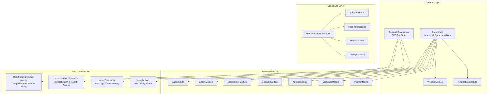

**Diagram sources**
- [app.module.ts:17-34](file://src/app.module.ts#L17-L34)
- [elderly-caregiver.e2e-spec.ts:11-58](file://test/elderly-caregiver.e2e-spec.ts#L11-L58)
- [auth-health.e2e-spec.ts:11-84](file://test/auth-health.e2e-spec.ts#L11-L84)
- [app.e2e-spec.ts:7-26](file://test/app.e2e-spec.ts#L7-L26)
- [weather.controller.ts:14-27](file://src/weather/weather.controller.ts#L14-L27)
- [notifications.service.ts:5-65](file://src/notifications/notifications.service.ts#L5-L65)

**Section sources**
- [app.module.ts:1-36](file://src/app.module.ts#L1-L36)
- [main.ts:1-43](file://src/main.ts#L1-L43)
- [README.md:24-99](file://README.md#L24-L99)
- [elderly-caregiver.e2e-spec.ts:1-334](file://test/elderly-caregiver.e2e-spec.ts#L1-334)

## Core Components
- Authentication and Authorization
  - JWT-based guard and role-based guard enforce bearer token authentication and role checks.
  - Decorators extract the current user's ID and roles.
- Elderly Profile Management
  - Controllers expose endpoints to retrieve and update an elderly user's profile.
  - Services validate role and presence of a linked elderly profile before performing operations.
- Medication Tracking
  - Controllers expose CRUD endpoints for medications and confirmation of intake per day.
  - Services enforce access via caregiver links and maintain daily confirmation records.
- Contact Management
  - Controllers expose CRUD endpoints for emergency and support contacts.
  - Services compute overdue status based on thresholds and track call history.
- Agenda Scheduling
  - Controllers expose CRUD endpoints for agenda events and today's agenda retrieval.
  - Services filter events by date range and enforce access controls.
- Caregiver Management
  - New module provides comprehensive caregiver functionality including elderly linking and access verification.
  - Supports caregiver-elderly relationship management with validation and statistics.
- Weather Services
  - New module provides weather forecasts with clothing advice for elderly care planning.
- Push Notifications
  - Comprehensive notification system supporting multiple platforms and devices.

**Section sources**
- [jwt-auth.guard.ts](file://src/auth/jwt-auth.guard.ts)
- [roles.guard.ts](file://src/auth/roles.guard.ts)
- [roles.decorator.ts](file://src/auth/roles.decorator.ts)
- [user.decorator.ts](file://src/common/decorators/user.decorator.ts)
- [elderly.controller.ts:16-41](file://src/elderly/elderly.controller.ts#L16-L41)
- [elderly.service.ts:17-77](file://src/elderly/elderly.service.ts#L17-L77)
- [medications.controller.ts:29-144](file://src/medications/medications.controller.ts#L29-L144)
- [medications.service.ts:24-308](file://src/medications/medications.service.ts#L24-L308)
- [contacts.controller.ts:28-128](file://src/contacts/contacts.controller.ts#L28-L128)
- [contacts.service.ts:23-245](file://src/contacts/contacts.service.ts#L23-L245)
- [agenda.controller.ts:28-104](file://src/agenda/agenda.controller.ts#L28-L104)
- [agenda.service.ts:23-174](file://src/agenda/agenda.service.ts#L23-L174)
- [caregiver.controller.ts:16-52](file://src/caregiver/caregiver.controller.ts#L16-L52)
- [caregiver.service.ts:13-222](file://src/caregiver/caregiver.service.ts#L13-L222)
- [weather.controller.ts:14-27](file://src/weather/weather.controller.ts#L14-L27)
- [notifications.service.ts:5-65](file://src/notifications/notifications.service.ts#L5-L65)

## Architecture Overview
The system uses a layered architecture with comprehensive testing infrastructure and enhanced mobile integration:
- Controllers handle HTTP requests, apply guards, and delegate to services.
- Services encapsulate business logic, enforce access control, and interact with Prisma.
- Prisma provides strongly typed database access and enforces referential integrity.
- Mobile app provides voice-enabled interfaces with offline capabilities.
- Weather services integrate external APIs for care coordination.
- Push notification system enables real-time care coordination.
- Testing framework provides end-to-end validation of all system components.

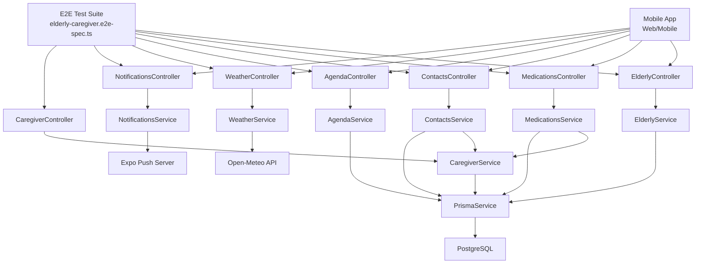

**Diagram sources**
- [elderly.controller.ts:20-41](file://src/elderly/elderly.controller.ts#L20-L41)
- [medications.controller.ts:34-144](file://src/medications/medications.controller.ts#L34-L144)
- [contacts.controller.ts:33-128](file://src/contacts/contacts.controller.ts#L33-L128)
- [agenda.controller.ts:32-104](file://src/agenda/agenda.controller.ts#L32-L104)
- [caregiver.controller.ts:23-51](file://src/caregiver/caregiver.controller.ts#L23-L51)
- [elderly-caregiver.e2e-spec.ts:17-58](file://test/elderly-caregiver.e2e-spec.ts#L17-L58)
- [weather.controller.ts:14-27](file://src/weather/weather.controller.ts#L14-L27)
- [notifications.service.ts:5-65](file://src/notifications/notifications.service.ts#L5-L65)
- [elderly.service.ts:15](file://src/elderly/elderly.service.ts#L15)
- [medications.service.ts:19-22](file://src/medications/medications.service.ts#L19-L22)
- [contacts.service.ts:18-21](file://src/contacts/contacts.service.ts#L18-L21)
- [agenda.service.ts:18-21](file://src/agenda/agenda.service.ts#L18-L21)
- [caregiver.service.ts](file://src/caregiver/caregiver.service.ts)
- [schema.prisma:47-286](file://prisma/schema.prisma#L47-L286)

## Mobile Application Integration
The mobile application provides a comprehensive React Native interface with Expo, designed specifically for elderly care management. The app features voice-enabled interfaces, offline capabilities, and accessibility optimizations.

### Key Mobile Features
- **Voice Interface**: Complete voice interaction in Portuguese (PT-BR) for elderly users
- **Home Screen**: Personalized greeting, weather information, and quick access buttons
- **Navigation**: Intuitive navigation between care management sections
- **Offline Support**: Local caching for essential features
- **Accessibility**: High contrast, large touch targets, and audio feedback

### Mobile App Architecture
The mobile application integrates seamlessly with the backend through RESTful APIs and provides enhanced user experience through voice assistance and push notifications.

**Section sources**
- [home.tsx:15-122](file://mobile-app/app/elderly/home.tsx#L15-L122)
- [settings.tsx:13-117](file://mobile-app/app/elderly/settings.tsx#L13-L117)
- [package.json:12-66](file://mobile-app/package.json#L12-L66)
- [README.md:1-105](file://mobile-app/README.md#L1-L105)

## Voice Assistance System
The voice assistance system provides comprehensive speech-to-text and text-to-speech capabilities for elderly users, enabling hands-free operation of the care management system.

### Voice System Components
- **Text-to-Speech**: Uses Expo Speech for natural voice synthesis
- **Speech-to-Text**: Implements @react-native-voice for voice recognition
- **Voice Button**: Interactive microphone button with visual feedback
- **Configuration**: PT-BR language support with adjustable pitch and rate

### Voice Features
- **Personalized Greetings**: Automated welcome messages with weather information
- **Command Recognition**: Voice commands for medication tracking, agenda management, and contact management
- **Error Handling**: Robust error handling for voice recognition failures
- **Platform Support**: Optimized for native platforms with web limitations

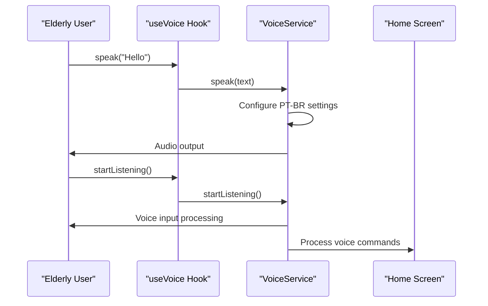

**Diagram sources**
- [useVoice.ts:32-51](file://mobile-app/src/hooks/useVoice.ts#L32-L51)
- [voice.ts:39-84](file://mobile-app/src/services/voice.ts#L39-L84)
- [home.tsx:22-42](file://mobile-app/app/elderly/home.tsx#L22-L42)

**Section sources**
- [useVoice.ts:1-80](file://mobile-app/src/hooks/useVoice.ts#L1-L80)
- [voice.ts:1-129](file://mobile-app/src/services/voice.ts#L1-L129)
- [VoiceButton.tsx:1-67](file://mobile-app/src/components/shared/VoiceButton.tsx#L1-L67)
- [home.tsx:15-42](file://mobile-app/app/elderly/home.tsx#L15-L42)

## Weather Services Integration
The weather service module provides comprehensive weather forecasting with clothing advice tailored for elderly care planning. The system integrates with Open-Meteo API to deliver accurate weather information.

### Weather Service Features
- **Geolocation Support**: Automatic location detection from elderly profile
- **Weather Forecasting**: Current weather conditions with detailed descriptions
- **Clothing Advice**: Personalized recommendations based on temperature
- **Multiple Cities**: Support for major Brazilian cities
- **Error Handling**: Graceful degradation when weather data is unavailable

### Weather Data Processing
The system processes weather codes from Open-Meteo API and converts them to human-readable descriptions in Portuguese, along with practical clothing recommendations for different temperature ranges.

**Section sources**
- [weather.controller.ts:14-27](file://src/weather/weather.controller.ts#L14-L27)
- [weather.service.ts:10-72](file://src/weather/weather.service.ts#L10-L72)
- [index.ts:67-73](file://mobile-app/src/types/index.ts#L67-L73)

## Push Notification System
The push notification system enables real-time care coordination through multi-platform push notifications using Expo Notifications.

### Notification System Components
- **Token Registration**: Secure registration of push tokens per user
- **Multi-Platform Support**: Android, iOS, and web platform compatibility
- **Permission Management**: Comprehensive permission handling and user consent
- **Notification Channels**: Platform-specific notification channel configuration
- **Real-time Alerts**: Immediate notifications for care coordination events

### Notification Features
- **Care Coordination**: Real-time alerts for medication reminders, appointment changes, and care updates
- **Multi-device Support**: Notifications delivered across all user devices
- **Platform Optimization**: Native notification experiences optimized for each platform
- **Error Handling**: Robust error handling for notification delivery failures

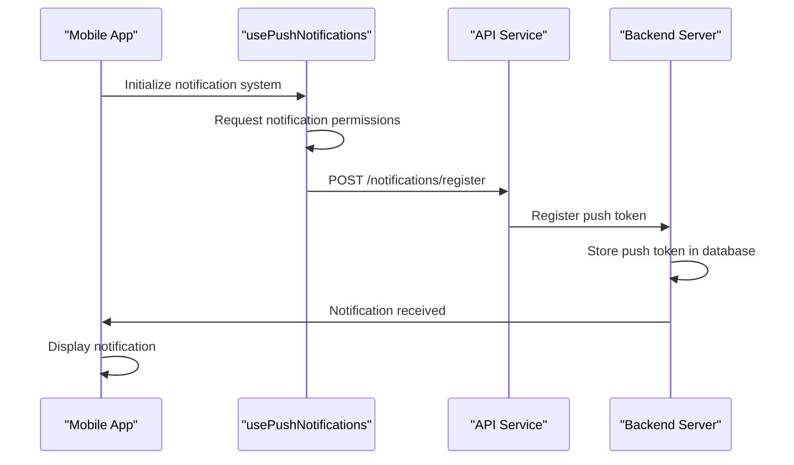

**Diagram sources**
- [usePushNotifications.ts:44-105](file://mobile-app/src/hooks/usePushNotifications.ts#L44-L105)
- [notifications.service.ts:11-44](file://src/notifications/notifications.service.ts#L11-L44)

**Section sources**
- [usePushNotifications.ts:1-133](file://mobile-app/src/hooks/usePushNotifications.ts#L1-L133)
- [notifications.service.ts:1-66](file://src/notifications/notifications.service.ts#L1-L66)
- [api.ts:11-22](file://mobile-app/src/services/api.ts#L11-L22)

## Advanced Care Coordination Features
The system now includes advanced care coordination features that enhance the overall elderly care management experience through integrated services and intelligent automation.

### Enhanced Features
- **Integrated Weather Planning**: Weather information integrated into daily care routines
- **Voice-Enabled Navigation**: Hands-free navigation through care management features
- **Multi-Device Synchronization**: Seamless coordination across mobile, web, and desktop platforms
- **Real-time Communication**: Instant updates between elderly users and caregivers
- **Accessibility Optimization**: Specialized interfaces for users with varying abilities
- **Comprehensive Testing**: End-to-end validation ensuring reliable care coordination

### Care Coordination Benefits
- **Proactive Care**: Weather-based recommendations for outdoor activities
- **Voice Assistance**: Reduced cognitive load through voice commands
- **Emergency Response**: Quick access to emergency contacts and services
- **Caregiver Communication**: Streamlined communication channels between caregivers and elderly users
- **Automated Reminders**: Intelligent scheduling and reminder systems
- **Reliable Operation**: Comprehensive testing ensures system stability and data integrity

## Comprehensive Testing Framework
The system now features a comprehensive end-to-end testing framework that validates all elderly care management functionality through automated test suites.

### Test Infrastructure
- **Elderly & Caregiver E2E Tests**: Comprehensive validation of all elderly-specific endpoints and workflows
- **Authentication & Health Tests**: Validation of login functionality, health checks, and public endpoints
- **Basic Application Tests**: Fundamental application functionality testing
- **Test Configuration**: Jest-based testing infrastructure with TypeScript support

### Testing Capabilities
- **Authentication Validation**: End-to-end authentication flow testing with token management
- **Role-Based Access Control**: Validation of caregiver-elderly relationship enforcement
- **CRUD Operations**: Comprehensive testing of create, read, update, and delete operations
- **Data Integrity**: Validation of data consistency and business logic enforcement
- **Error Handling**: Testing of appropriate error responses and exception handling

### Test Coverage Areas
- **Elderly Profile Management**: Complete validation of profile retrieval and update operations
- **Medication Tracking**: End-to-end testing of medication CRUD operations and confirmation workflows
- **Contact Management**: Validation of contact CRUD operations and overdue status calculations
- **Agenda Scheduling**: Testing of event CRUD operations and today's agenda retrieval
- **Caregiver Functionality**: Validation of elderly linking and access verification mechanisms

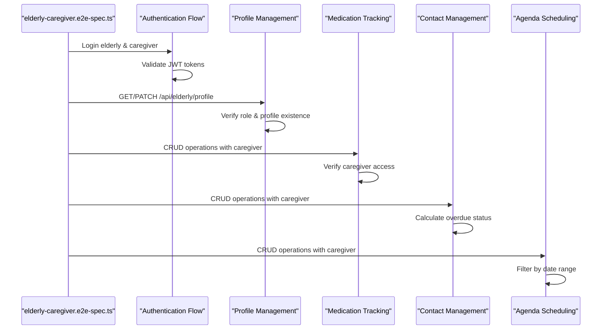

**Diagram sources**
- [elderly-caregiver.e2e-spec.ts:17-58](file://test/elderly-caregiver.e2e-spec.ts#L17-L58)
- [elderly-caregiver.e2e-spec.ts:63-103](file://test/elderly-caregiver.e2e-spec.ts#L63-L103)
- [elderly-caregiver.e2e-spec.ts:133-185](file://test/elderly-caregiver.e2e-spec.ts#L133-L185)
- [elderly-caregiver.e2e-spec.ts:205-250](file://test/elderly-caregiver.e2e-spec.ts#L205-L250)
- [elderly-caregiver.e2e-spec.ts:255-307](file://test/elderly-caregiver.e2e-spec.ts#L255-L307)

**Section sources**
- [elderly-caregiver.e2e-spec.ts:1-334](file://test/elderly-caregiver.e2e-spec.ts#L1-334)
- [auth-health.e2e-spec.ts:1-327](file://test/auth-health.e2e-spec.ts#L1-327)
- [app.e2e-spec.ts:1-27](file://test/app.e2e-spec.ts#L1-27)
- [jest-e2e.json:1-10](file://test/jest-e2e.json#L1-10)

## Detailed Component Analysis

### Elderly Profile Management
- Responsibilities
  - Retrieve and update an elderly user's profile.
  - Enforce role checks so only elderly users can access profile endpoints.
- Implementation pattern
  - Controller endpoints decorated with JWT and role guards.
  - Service validates user role and existence of elderly profile before updating.
- Validation rules
  - Update DTO enforces optional fields with types and bounds for autonomy score and array of interaction times.
- Access control
  - Only users with role elderly can access profile endpoints.

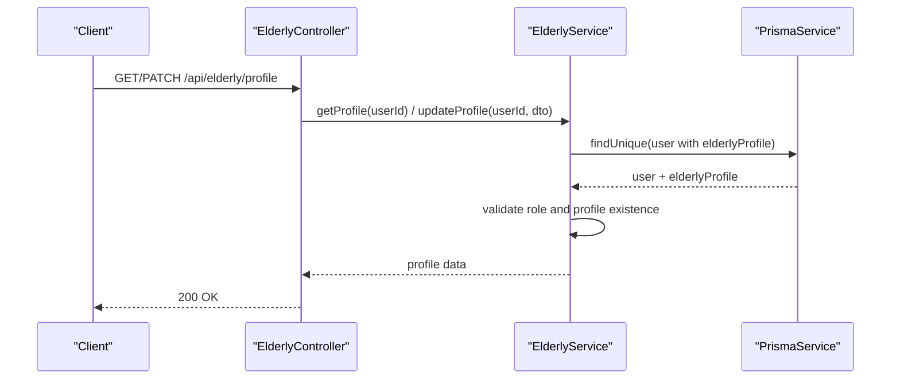

**Diagram sources**
- [elderly.controller.ts:23-40](file://src/elderly/elderly.controller.ts#L23-L40)
- [elderly.service.ts:17-77](file://src/elderly/elderly.service.ts#L17-L77)

**Section sources**
- [elderly.controller.ts:16-41](file://src/elderly/elderly.controller.ts#L16-L41)
- [elderly.service.ts:17-77](file://src/elderly/elderly.service.ts#L17-L77)
- [update-profile.dto.ts:12-43](file://src/elderly/dto/update-profile.dto.ts#L12-L43)

### Medication Tracking
- Responsibilities
  - CRUD for medications associated with an elderly profile.
  - Today's medication list for the elderly user.
  - Confirmation of intake per day with history tracking.
  - History pagination and filtering by date range.
- Implementation pattern
  - Controllers delegate to service; service verifies access via caregiver links.
  - Daily confirmation uses a dedicated history entity with scheduledDate and respondedAt timestamps.
- Validation rules
  - Create and update DTOs enforce non-empty strings for name/time/dosage and optional activation flag.
  - Confirmation DTO enforces boolean for intake status.
- Access control
  - Non-elderly users require caregiver access to profile; elderly users can confirm their own medications.

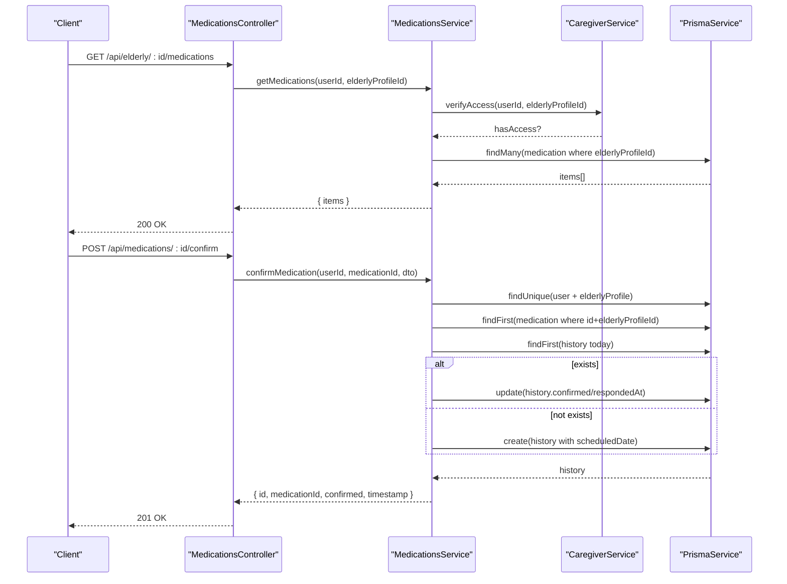

**Diagram sources**
- [medications.controller.ts:36-118](file://src/medications/medications.controller.ts#L36-L118)
- [medications.service.ts:24-253](file://src/medications/medications.service.ts#L24-L253)
- [caregiver.service.ts](file://src/caregiver/caregiver.service.ts)

**Section sources**
- [medications.controller.ts:29-144](file://src/medications/medications.controller.ts#L29-L144)
- [medications.service.ts:24-308](file://src/medications/medications.service.ts#L24-L308)
- [create-medication.dto.ts:4-16](file://src/medications/dto/create-medication.dto.ts#L4-L16)
- [update-medication.dto.ts:4-24](file://src/medications/dto/update-medication.dto.ts#L4-L24)
- [confirm-medication.dto.ts:4-8](file://src/medications/dto/confirm-medication.dto.ts#L4-L8)

### Contact Management
- Responsibilities
  - CRUD for contacts associated with an elderly profile.
  - Overdue contact list for the elderly user computed from thresholds and last call dates.
  - Call logging when elderly user marks a call.
  - Call history pagination.
- Implementation pattern
  - Controllers delegate to service; service verifies access via caregiver links.
  - Overdue computation compares last call date plus threshold against current date.
- Validation rules
  - Create and update DTOs enforce non-empty strings for name/phone and positive integer threshold.
- Access control
  - Non-elderly users require caregiver access to profile; elderly users can mark calls.

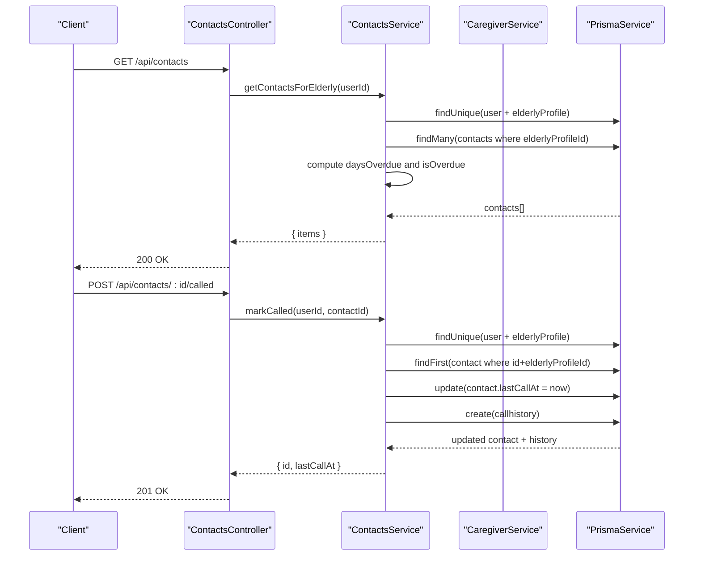

**Diagram sources**
- [contacts.controller.ts:92-108](file://src/contacts/contacts.controller.ts#L92-L108)
- [contacts.service.ts:127-203](file://src/contacts/contacts.service.ts#L127-L203)
- [caregiver.service.ts](file://src/caregiver/caregiver.service.ts)

**Section sources**
- [contacts.controller.ts:28-128](file://src/contacts/contacts.controller.ts#L28-L128)
- [contacts.service.ts:23-245](file://src/contacts/contacts.service.ts#L23-L245)
- [create-contact.dto.ts:4-18](file://src/contacts/dto/create-contact.dto.ts#L4-L18)
- [update-contact.dto.ts:4-20](file://src/contacts/dto/update-contact.dto.ts#L4-L20)

### Agenda Scheduling
- Responsibilities
  - CRUD for agenda events associated with an elderly profile.
  - Today's agenda retrieval for the elderly user.
  - Optional reminder flag and date-time filtering.
- Implementation pattern
  - Controllers delegate to service; service verifies access via caregiver links.
  - Today's agenda filters by start/end of day.
- Validation rules
  - Create and update DTOs enforce non-empty strings for description/date-time and optional boolean reminder.
- Access control
  - Non-elderly users require caregiver access to profile; elderly users can retrieve today's agenda.

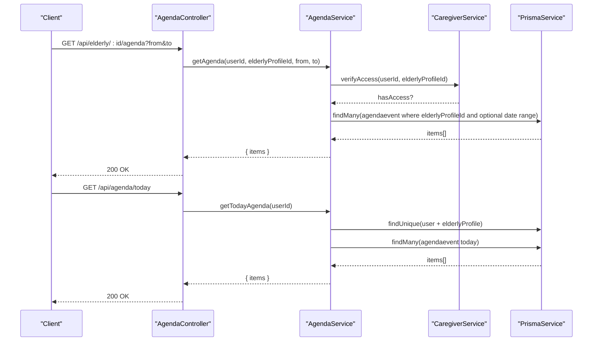

**Diagram sources**
- [agenda.controller.ts:35-103](file://src/agenda/agenda.controller.ts#L35-L103)
- [agenda.service.ts:23-174](file://src/agenda/agenda.service.ts#L23-L174)
- [caregiver.service.ts](file://src/caregiver/caregiver.service.ts)

**Section sources**
- [agenda.controller.ts:28-104](file://src/agenda/agenda.controller.ts#L28-L104)
- [agenda.service.ts:23-174](file://src/agenda/agenda.service.ts#L23-L174)
- [create-agenda.dto.ts:4-17](file://src/agenda/dto/create-agenda.dto.ts#L4-L17)
- [update-agenda.dto.ts:4-19](file://src/agenda/dto/update-agenda.dto.ts#L4-L19)

### Caregiver Management
- Responsibilities
  - Link caregivers to elderly users using unique link codes.
  - Retrieve all elderly users linked to a caregiver.
  - Get detailed information about a specific linked elderly user.
  - Verify access permissions for profile-scoped operations.
- Implementation pattern
  - Controllers enforce caregiver role and delegate to service.
  - Service validates caregiver status, elderly profile existence, and existing links.
  - Access verification ensures proper caregiver-elderly relationships.
- Validation rules
  - Link DTO enforces 6-character string length for link codes.
  - Role-based access control prevents unauthorized operations.
- Access control
  - Only users with role caregiver can access caregiver endpoints.

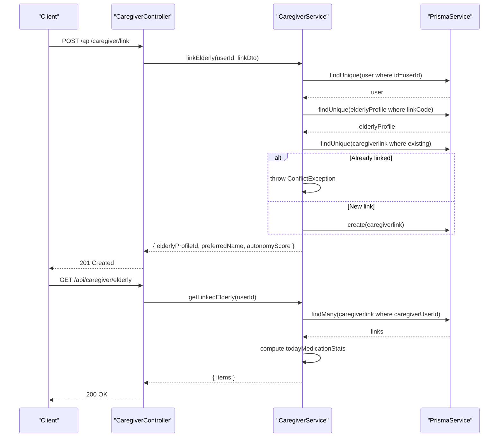

**Diagram sources**
- [caregiver.controller.ts:23-51](file://src/caregiver/caregiver.controller.ts#L23-L51)
- [caregiver.service.ts:19-120](file://src/caregiver/caregiver.service.ts#L19-L120)
- [link.dto.ts:4-9](file://src/caregiver/dto/link.dto.ts#L4-L9)

**Section sources**
- [caregiver.controller.ts:16-52](file://src/caregiver/caregiver.controller.ts#L16-L52)
- [caregiver.service.ts:13-222](file://src/caregiver/caregiver.service.ts#L13-L222)
- [link.dto.ts:1-10](file://src/caregiver/dto/link.dto.ts#L1-L10)

### Weather Services
- Responsibilities
  - Fetch weather forecasts for elderly users with clothing advice.
  - Support multiple locations and automatic geolocation detection.
  - Provide weather descriptions in Portuguese for better understanding.
- Implementation pattern
  - Service integrates with Open-Meteo API for weather data.
  - Converts weather codes to human-readable descriptions.
  - Provides personalized clothing recommendations based on temperature.
- Validation rules
  - Location validation with support for major Brazilian cities.
  - Error handling for API failures and invalid locations.
- Access control
  - Weather endpoint requires authentication but no role restrictions.

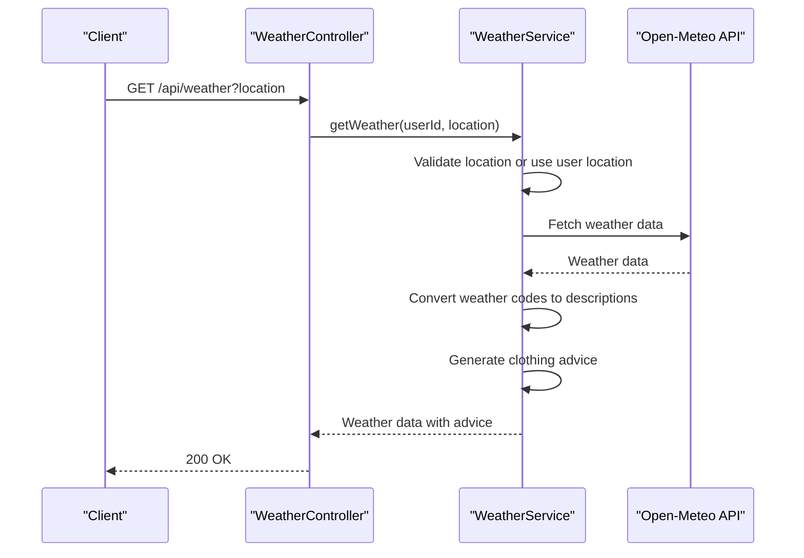

**Diagram sources**
- [weather.controller.ts:20-26](file://src/weather/weather.controller.ts#L20-L26)
- [weather.service.ts:10-72](file://src/weather/weather.service.ts#L10-L72)

**Section sources**
- [weather.controller.ts:14-27](file://src/weather/weather.controller.ts#L14-L27)
- [weather.service.ts:10-136](file://src/weather/weather.service.ts#L10-L136)

### Push Notifications
- Responsibilities
  - Register push tokens for user devices.
  - Send push notifications to multiple devices simultaneously.
  - Manage notification permissions and platform-specific configurations.
- Implementation pattern
  - Service handles token registration and storage.
  - Supports multiple platforms (Android, iOS, Web).
  - Integrates with Expo Push Notifications system.
- Validation rules
  - Token uniqueness validation per user.
  - Platform validation and updates.
- Access control
  - Requires authenticated user context for token registration.

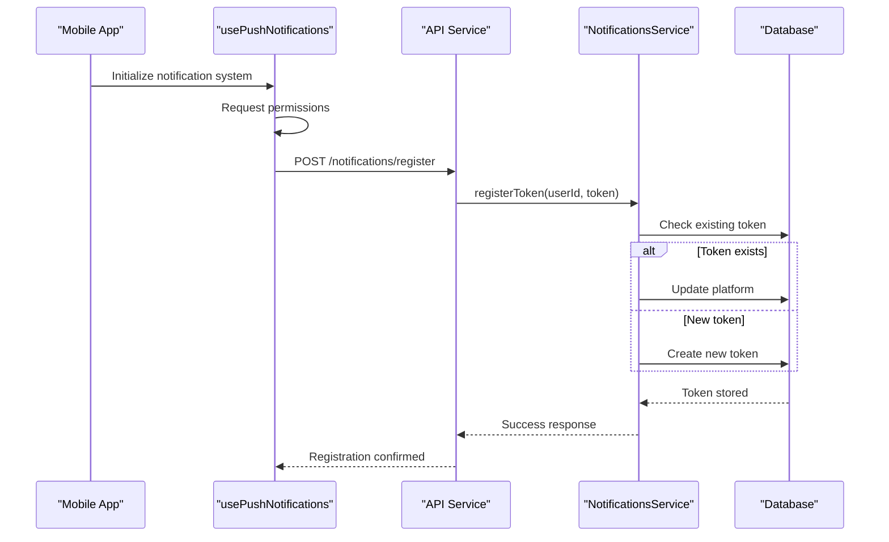

**Diagram sources**
- [usePushNotifications.ts:44-105](file://mobile-app/src/hooks/usePushNotifications.ts#L44-L105)
- [notifications.service.ts:11-44](file://src/notifications/notifications.service.ts#L11-L44)

**Section sources**
- [notifications.service.ts:1-66](file://src/notifications/notifications.service.ts#L1-L66)
- [usePushNotifications.ts:1-133](file://mobile-app/src/hooks/usePushNotifications.ts#L1-L133)

## Dependency Analysis
- Module dependencies
  - AppModule aggregates all feature modules including new weather and notifications modules.
  - Feature controllers depend on their respective services.
  - Services depend on PrismaService and optionally on CaregiverService for access verification.
  - Mobile app depends on backend APIs and voice services.
  - Testing framework depends on NestJS testing infrastructure and Supertest.
- Data model relationships
  - user ↔ elderlyprofile (one-to-one)
  - elderlyprofile ←→ medication/contact/agendaevent/callhistory/interactionlog/serviceRequest (one-to-many)
  - caregiverlink connects user (caregivers) to elderlyprofile (many-to-many via link table)
  - pushtoken connects user to push notification tokens (one-to-many)

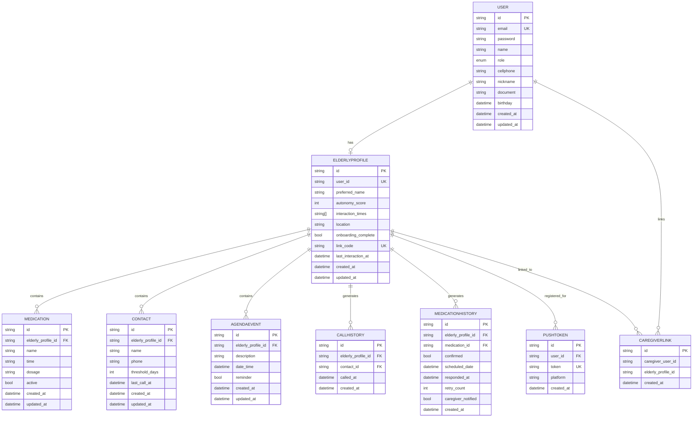

**Diagram sources**
- [schema.prisma:47-286](file://prisma/schema.prisma#L47-L286)

**Section sources**
- [schema.prisma:47-286](file://prisma/schema.prisma#L47-L286)

## Performance Considerations
- Pagination
  - Medication history and call history endpoints accept page and limit parameters to control payload sizes.
- Indexes
  - Prisma schema defines indexes on frequently queried columns (e.g., elderlyProfileId, active flag, scheduledDate, dateTime) to optimize queries.
- Asynchronous operations
  - Services use Promise.all for count and list queries to reduce round-trips.
- Mobile Optimization
  - Voice services implement efficient speech processing with proper cleanup and resource management.
  - Weather API calls are cached and processed asynchronously to avoid blocking UI updates.
- Push Notification Scalability
  - Token registration supports batch operations for multiple device management.
  - Notification delivery optimized for multi-device scenarios.
- Test Performance
  - E2E tests use increased timeouts for database operations.
  - Test suites are organized to minimize redundant setup and teardown operations.

## Troubleshooting Guide
- Authentication and Authorization
  - Ensure requests include a valid Bearer token and the user has the correct role.
  - Verify that elderly users have a linked elderly profile before accessing profile endpoints.
- Access Denied
  - Non-elderly users attempting to access elderly-only endpoints will receive forbidden errors.
  - Caregivers must be linked to the elderly profile for profile-scoped operations.
- Entity Not Found
  - Operations targeting non-existent medications, contacts, or agenda events return not found errors.
- Validation Failures
  - DTO validation enforces field types and constraints; incorrect payloads will be rejected.
- Voice Issues
  - Ensure microphone permissions are granted for voice recognition features.
  - Voice services gracefully handle platform limitations (web lacks voice recognition).
- Weather Service Failures
  - Weather API integration includes error handling for network failures and invalid locations.
- Push Notification Problems
  - Verify device permissions are granted for push notifications.
  - Check token registration status and platform compatibility.
- Test Environment Issues
  - E2E tests require proper database connectivity and may need increased timeouts.
  - Test authentication relies on seeded user accounts with predefined credentials.
  - Caregiver-elderly linking requires valid link codes and proper relationship establishment.

**Section sources**
- [elderly.service.ts:23-31](file://src/elderly/elderly.service.ts#L23-L31)
- [medications.service.ts:78-88](file://src/medications/medications.service.ts#L78-L88)
- [contacts.service.ts:84-87](file://src/contacts/contacts.service.ts#L84-L87)
- [agenda.service.ts:100-102](file://src/agenda/agenda.service.ts#L100-L102)
- [caregiver.service.ts:198-220](file://src/caregiver/caregiver.service.ts#L198-L220)
- [useVoice.ts:14-17](file://mobile-app/src/hooks/useVoice.ts#L14-L17)
- [weather.service.ts:48-50](file://src/weather/weather.service.ts#L48-L50)
- [usePushNotifications.ts:64-67](file://mobile-app/src/hooks/usePushNotifications.ts#L64-L67)
- [elderly-caregiver.e2e-spec.ts:17-58](file://test/elderly-caregiver.e2e-spec.ts#L17-L58)

## Conclusion
The elderly care management system has been comprehensively enhanced with extensive testing infrastructure, mobile app integration, voice assistance, weather services, and advanced care coordination features. The addition of the comprehensive end-to-end test suite ensures reliable operation of all core subsystems, validating elderly profile management, medication tracking, contact management, agenda scheduling, and caregiver functionality. The system now provides a holistic approach to elderly care through integrated services, voice-enabled interfaces, real-time weather information, seamless multi-device communication, and robust testing validation. The architecture maintains strong security, accessibility, and scalability while delivering an exceptional user experience for both elderly users and caregivers.

## Appendices

### API Reference

- Authentication
  - Header: Authorization: Bearer {token}
  - Swagger UI: Available under /docs

- Elderly Profile
  - GET /api/elderly/profile
    - Roles: elderly
    - Response: Profile object
  - PATCH /api/elderly/profile
    - Roles: elderly
    - Request body: UpdateElderlyProfileDto
    - Response: Updated profile object

- Medications
  - GET /api/elderly/{elderlyProfileId}/medications
    - Roles: caregiver
    - Response: { items: Medication[] }
  - POST /api/elderly/{elderlyProfileId}/medications
    - Roles: caregiver
    - Request body: CreateMedicationDto
    - Response: Medication
  - PATCH /api/elderly/{elderlyProfileId}/medications/{id}
    - Roles: caregiver
    - Request body: UpdateMedicationDto
    - Response: Medication
  - DELETE /api/elderly/{elderlyProfileId}/medications/{id}
    - Roles: caregiver
    - Response: { success: true }
  - GET /api/medications/today
    - Roles: elderly
    - Response: { items: TodayItem[] }
  - POST /api/medications/{id}/confirm
    - Roles: elderly
    - Request body: ConfirmMedicationDto
    - Response: { id, medicationId, confirmed, timestamp }
  - GET /api/elderly/{elderlyProfileId}/medication-history
    - Roles: caregiver
    - Query params: from, to, page, limit
    - Response: Paginated history with medicationName

- Contacts
  - GET /api/elderly/{elderlyProfileId}/contacts
    - Roles: caregiver
    - Response: { items: Contact[] }
  - POST /api/elderly/{elderlyProfileId}/contacts
    - Roles: caregiver
    - Request body: CreateContactDto
    - Response: Contact
  - PATCH /api/elderly/{elderlyProfileId}/contacts/{id}
    - Roles: caregiver
    - Request body: UpdateContactDto
    - Response: Contact
  - DELETE /api/elderly/{elderlyProfileId}/contacts/{id}
    - Roles: caregiver
    - Response: { success: true }
  - GET /api/contacts
    - Roles: elderly
    - Response: { items: OverdueContact[] }
  - POST /api/contacts/{id}/called
    - Roles: elderly
    - Response: { id, lastCallAt }
  - GET /api/elderly/{elderlyProfileId}/call-history
    - Roles: caregiver
    - Query params: page, limit
    - Response: Paginated call history

- Agenda
  - GET /api/elderly/{elderlyProfileId}/agenda
    - Roles: caregiver
    - Query params: from, to
    - Response: { items: AgendaEvent[] }
  - POST /api/elderly/{elderlyProfileId}/agenda
    - Roles: caregiver
    - Request body: CreateAgendaDto
    - Response: AgendaEvent
  - PATCH /api/elderly/{elderlyProfileId}/agenda/{id}
    - Roles: caregiver
    - Request body: UpdateAgendaDto
    - Response: AgendaEvent
  - DELETE /api/elderly/{elderlyProfileId}/agenda/{id}
    - Roles: caregiver
    - Response: { success: true }
  - GET /api/agenda/today
    - Roles: elderly
    - Response: { items: AgendaEvent[] }

- Caregiver
  - POST /api/caregiver/link
    - Roles: caregiver
    - Request body: LinkDto
    - Response: { elderlyProfileId, preferredName, autonomyScore }
  - GET /api/caregiver/elderly
    - Roles: caregiver
    - Response: { items: LinkedElderly[] }
  - GET /api/caregiver/elderly/{elderlyProfileId}
    - Roles: caregiver
    - Response: ElderlyDetails

- Weather
  - GET /api/weather
    - Roles: elderly, caregiver
    - Query params: location (optional)
    - Response: WeatherData with clothing advice

- Notifications
  - POST /api/notifications/register
    - Roles: authenticated users
    - Request body: RegisterTokenDto
    - Response: { success: true }

**Section sources**
- [main.ts:28-35](file://src/main.ts#L28-L35)
- [elderly.controller.ts:23-40](file://src/elderly/elderly.controller.ts#L23-L40)
- [medications.controller.ts:36-143](file://src/medications/medications.controller.ts#L36-L143)
- [contacts.controller.ts:35-127](file://src/contacts/contacts.controller.ts#L35-L127)
- [agenda.controller.ts:35-103](file://src/agenda/agenda.controller.ts#L35-L103)
- [caregiver.controller.ts:23-51](file://src/caregiver/caregiver.controller.ts#L23-L51)
- [weather.controller.ts:20-26](file://src/weather/weather.controller.ts#L20-L26)
- [notifications.service.ts:11-44](file://src/notifications/notifications.service.ts#L11-L44)

### Data Privacy and Caregiver Access Permissions
- Data privacy
  - All endpoints require JWT authentication.
  - Controllers restrict access by role and by verifying caregiver links to the elderly profile.
  - Voice data is processed locally on device with minimal data transmission.
  - Weather data is transmitted securely with HTTPS encryption.
- Caregiver access
  - Caregivers must be linked to the elderly profile to perform profile-scoped operations.
  - Elderly users can only access their own data and cannot modify profile-scoped entities.
  - Push notification tokens are securely stored and associated with user accounts.
  - Voice assistance operates with explicit user consent and can be disabled in settings.
- Testing security
  - Test suite uses seeded user accounts with predefined credentials for authentication.
  - Test endpoints validate proper authentication and authorization enforcement.
  - Test data isolation ensures test operations don't affect production data.

**Section sources**
- [medications.service.ts:24-31](file://src/medications/medications.service.ts#L24-L31)
- [contacts.service.ts:23-30](file://src/contacts/contacts.service.ts#L23-L30)
- [agenda.service.ts:23-34](file://src/agenda/agenda.service.ts#L23-L34)
- [elderly.service.ts:23-27](file://src/elderly/elderly.service.ts#L23-L27)
- [caregiver.service.ts:198-220](file://src/caregiver/caregiver.service.ts#L198-L220)
- [useVoice.ts:14-17](file://mobile-app/src/hooks/useVoice.ts#L14-L17)
- [usePushNotifications.ts:64-67](file://mobile-app/src/hooks/usePushNotifications.ts#L64-L67)
- [elderly-caregiver.e2e-spec.ts:17-58](file://test/elderly-caregiver.e2e-spec.ts#L17-L58)

### Practical Workflows

- Medication scheduling
  - Steps
    - Create a medication record for the elderly profile via caregiver.
    - Elderly user retrieves today's medications.
    - Elderly user confirms intake or marks as missed.
  - Endpoints
    - POST /api/elderly/{id}/medications
    - GET /api/medications/today
    - POST /api/medications/{id}/confirm

- Emergency contact updates
  - Steps
    - Create or update a contact via caregiver.
    - Elderly user marks a call after contacting a contact.
    - Review overdue contacts and call history via respective endpoints.
  - Endpoints
    - POST/PATCH /api/elderly/{id}/contacts
    - POST /api/contacts/{id}/called
    - GET /api/contacts
    - GET /api/elderly/{id}/call-history

- Appointment management
  - Steps
    - Create agenda events via caregiver.
    - Elderly user views today's agenda.
    - Update or delete events via caregiver.
  - Endpoints
    - POST /api/elderly/{id}/agenda
    - GET /api/agenda/today
    - PATCH /api/elderly/{id}/agenda/{id}
    - DELETE /api/elderly/{id}/agenda/{id}

- Caregiver-elderly relationship
  - Steps
    - Caregiver obtains elderly link code from elderly user.
    - Caregiver links to elderly profile using link code.
    - Caregiver manages elderly's care data and views statistics.
  - Endpoints
    - POST /api/caregiver/link
    - GET /api/caregiver/elderly
    - GET /api/caregiver/elderly/{id}

- Voice-enabled care coordination
  - Steps
    - Elderly user activates voice assistant for hands-free navigation.
    - System provides personalized weather and care recommendations.
    - Caregiver receives push notifications for care updates.
  - Endpoints
    - GET /api/weather
    - POST /api/notifications/register

- Mobile app integration
  - Steps
    - Elderly user accesses home screen with voice-enabled greeting.
    - System displays weather information and care reminders.
    - User navigates to care management sections via voice commands.
  - Endpoints
    - GET /api/elderly/profile
    - GET /api/weather

**Section sources**
- [medications.controller.ts:49-118](file://src/medications/medications.controller.ts#L49-L118)
- [medications.service.ts:128-253](file://src/medications/medications.service.ts#L128-L253)
- [contacts.controller.ts:45-108](file://src/contacts/contacts.controller.ts#L45-L108)
- [contacts.service.ts:127-203](file://src/contacts/contacts.service.ts#L127-L203)
- [agenda.controller.ts:54-103](file://src/agenda/agenda.controller.ts#L54-L103)
- [agenda.service.ts:149-174](file://src/agenda/agenda.service.ts#L149-L174)
- [caregiver.controller.ts:31-51](file://src/caregiver/caregiver.controller.ts#L31-L51)
- [caregiver.service.ts:66-120](file://src/caregiver/caregiver.service.ts#L66-L120)
- [home.tsx:22-42](file://mobile-app/app/elderly/home.tsx#L22-L42)
- [usePushNotifications.ts:93-105](file://mobile-app/src/hooks/usePushNotifications.ts#L93-L105)

### Testing Framework Details

- Test Suite Organization
  - elderly-caregiver.e2e-spec.ts: Comprehensive validation of elderly-specific endpoints and workflows
  - auth-health.e2e-spec.ts: Authentication, health checks, and public endpoint validation
  - app.e2e-spec.ts: Basic application functionality testing
  - jest-e2e.json: Test configuration with TypeScript support and E2E test regex

- Test Execution Environment
  - Global validation pipe with transformation and whitelisting enabled
  - Helmet security middleware applied to all test applications
  - Increased timeouts for E2E tests with remote database connections
  - Supertest-based HTTP request testing with comprehensive response validation

- Authentication Testing
  - Seed user authentication with predefined credentials
  - JWT token validation and bearer token header injection
  - Role-based access control testing for different user types
  - Session management and token lifecycle validation

**Section sources**
- [elderly-caregiver.e2e-spec.ts:1-334](file://test/elderly-caregiver.e2e-spec.ts#L1-334)
- [auth-health.e2e-spec.ts:1-327](file://test/auth-health.e2e-spec.ts#L1-327)
- [app.e2e-spec.ts:1-27](file://test/app.e2e-spec.ts#L1-27)
- [jest-e2e.json:1-10](file://test/jest-e2e.json#L1-10)