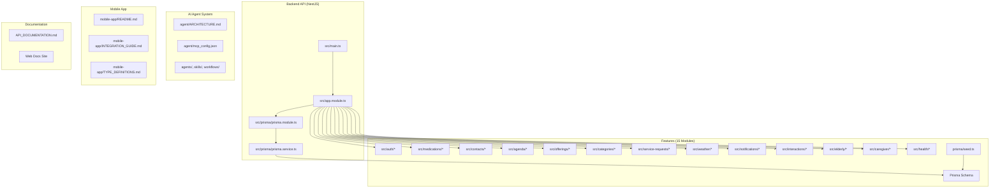
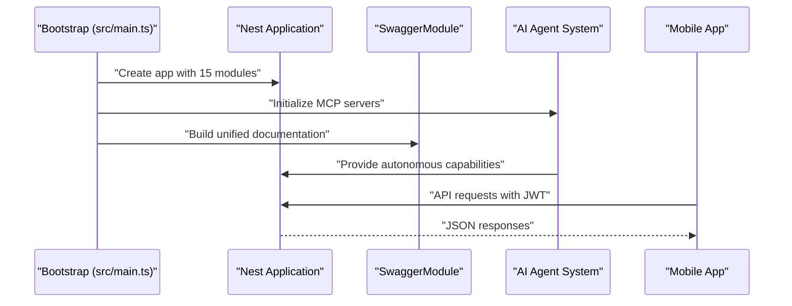
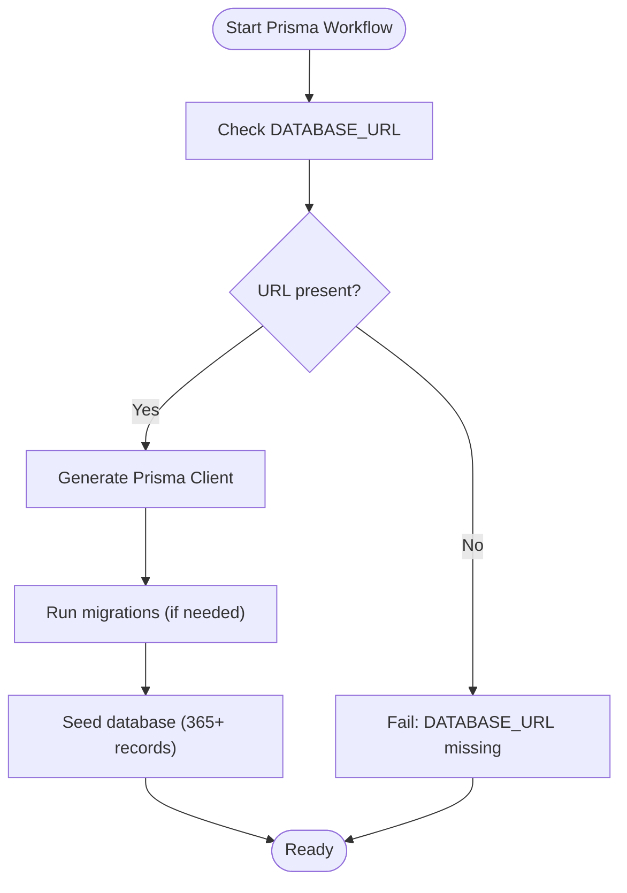
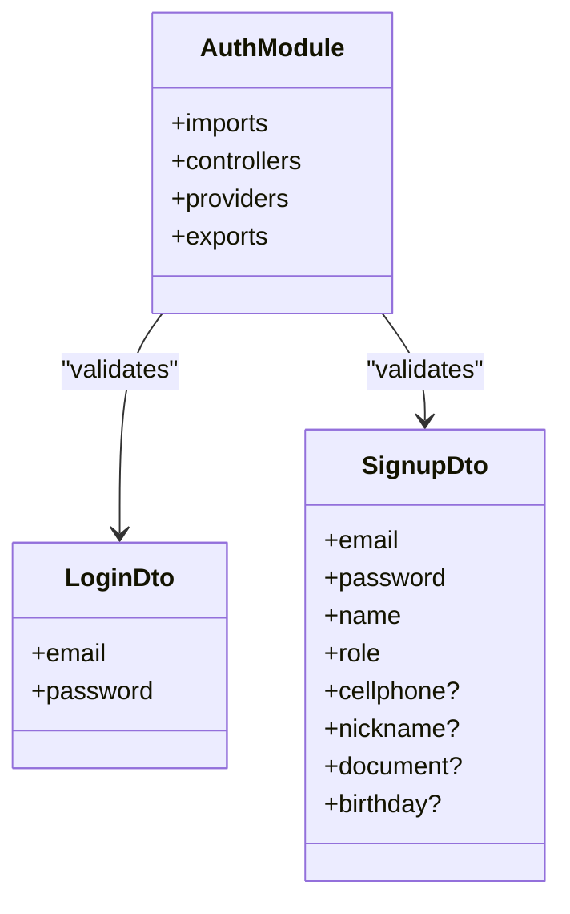
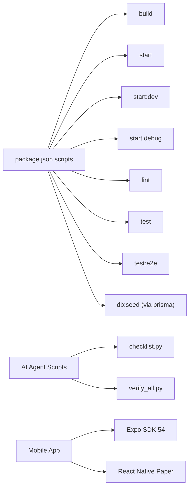

# Getting Started

<cite>
**Referenced Files in This Document**
- [README.md](file://README.md)
- [package.json](file://package.json)
- [nest-cli.json](file://nest-cli.json)
- [src/main.ts](file://src/main.ts)
- [src/app.module.ts](file://src/app.module.ts)
- [src/prisma/prisma.module.ts](file://src/prisma/prisma.module.ts)
- [src/prisma/prisma.service.ts](file://src/prisma/prisma.service.ts)
- [prisma/schema.prisma](file://prisma/schema.prisma)
- [prisma.config.ts](file://prisma.config.ts)
- [prisma/seed.ts](file://prisma/seed.ts)
- [src/auth/auth.module.ts](file://src/auth/auth.module.ts)
- [src/auth/dto/login.dto.ts](file://src/auth/dto/login.dto.ts)
- [src/auth/dto/signup.dto.ts](file://src/auth/dto/signup.dto.ts)
- [src/contacts/dto/create-contact.dto.ts](file://src/contacts/dto/create-contact.dto.ts)
- [src/medications/dto/create-medication.dto.ts](file://src/medications/dto/create-medication.dto.ts)
- [test/app.e2e-spec.ts](file://test/app.e2e-spec.ts)
- [.agent/ARCHITECTURE.md](file://.agent/ARCHITECTURE.md)
- [.agent/mcp_config.json](file://.agent/mcp_config.json)
- [mobile-app/README.md](file://mobile-app/README.md)
- [mobile-app/README_FRONTEND.md](file://mobile-app/README_FRONTEND.md)
- [mobile-app/API_CONTRACTS.md](file://mobile-app/API_CONTRACTS.md)
- [mobile-app/INTEGRATION_GUIDE.md](file://mobile-app/INTEGRATION_GUIDE.md)
- [mobile-app/TYPE_DEFINITIONS.md](file://mobile-app/TYPE_DEFINITIONS.md)
- [API_DOCUMENTATION.md](file://API_DOCUMENTATION.md)
</cite>

## Update Summary
**Changes Made**
- Added comprehensive AI agent system documentation with 20 specialist agents, 36 skills, and 11 workflows
- Integrated mobile app development environment with React Native and Expo
- Documented web documentation site architecture and API contracts
- Expanded API architecture coverage to include 15 comprehensive modules
- Added detailed mobile app integration guide and type definitions
- Enhanced troubleshooting with AI agent system and mobile app considerations

## Table of Contents
1. [Introduction](#introduction)
2. [Project Structure](#project-structure)
3. [Core Components](#core-components)
4. [Architecture Overview](#architecture-overview)
5. [Detailed Component Analysis](#detailed-component-analysis)
6. [AI Agent System](#ai-agent-system)
7. [Mobile App Development Environment](#mobile-app-development-environment)
8. [Web Documentation Site](#web-documentation-site)
9. [Comprehensive API Architecture](#comprehensive-api-architecture)
10. [Dependency Analysis](#dependency-analysis)
11. [Performance Considerations](#performance-considerations)
12. [Troubleshooting Guide](#troubleshooting-guide)
13. [Conclusion](#conclusion)
14. [Appendices](#appendices)

## Introduction
This guide helps you set up and run the 99-Pai API locally, configure the database, seed initial data, and explore the API via Swagger. The project now features a comprehensive AI agent system with 20 specialist agents, a mobile app development environment using React Native and Expo, and a web documentation site. The API has evolved to a 15-module architecture covering elderly care, medications, agendas, offerings, marketplace services, and advanced AI capabilities.

## Project Structure
The repository now encompasses three major development environments under a single comprehensive project:
- **Backend API**: NestJS application with 15 feature modules and Prisma ORM
- **AI Agent System**: Modular AI toolkit with 20 agents, 36 skills, and 11 workflows
- **Mobile App**: React Native application with Expo for elderly care management
- **Web Documentation**: Unified API documentation and integration guides

**Diagram sources**
- [src/main.ts:1-52](file://src/main.ts#L1-L52)
- [src/app.module.ts:1-46](file://src/app.module.ts#L1-L46)
- [.agent/ARCHITECTURE.md:1-289](file://.agent/ARCHITECTURE.md#L1-L289)
- [mobile-app/README.md:1-105](file://mobile-app/README.md#L1-L105)
- [API_DOCUMENTATION.md:1-363](file://API_DOCUMENTATION.md#L1-L363)

**Section sources**
- [README.md:24-99](file://README.md#L24-L99)
- [nest-cli.json:1-9](file://nest-cli.json#L1-L9)
- [src/app.module.ts:1-46](file://src/app.module.ts#L1-L46)

## Core Components
The system now consists of three interconnected layers:

### Backend API Layer
- **Application bootstrap and middleware**: Global prefix, CORS, validation pipe, and Swagger setup
- **Prisma integration**: Global PrismaModule with database access across 15 modules
- **Authentication**: JWT-based system with role-based access control
- **Security**: Helmet integration and throttling protection

### AI Agent System Layer
- **20 Specialist Agents**: Role-based AI personas for different domains
- **36 Skills**: Modular knowledge domains for on-demand loading
- **11 Workflows**: Slash command procedures for automated tasks
- **Model Context Protocol (MCP)**: Integration with external AI services

### Mobile App Layer
- **React Native + Expo**: Cross-platform mobile application
- **Role-based dashboards**: Elderly, caregiver, provider, and admin interfaces
- **JWT Authentication**: Secure token-based authentication
- **Real-time integration**: Direct API connectivity with backend

**Section sources**
- [src/main.ts:6-52](file://src/main.ts#L6-L52)
- [src/app.module.ts:17-46](file://src/app.module.ts#L17-L46)
- [.agent/ARCHITECTURE.md:31-57](file://.agent/ARCHITECTURE.md#L31-L57)
- [mobile-app/README_FRONTEND.md:13-216](file://mobile-app/README_FRONTEND.md#L13-L216)

## Architecture Overview
The comprehensive system operates through three coordinated layers:

### Backend API Runtime Flow
- Bootstrap initializes Nest application with global prefix, CORS, validation pipe, and Swagger
- AppModule aggregates all 15 feature modules plus PrismaModule
- Feature modules depend on PrismaService for database operations
- AI agent system provides autonomous capabilities through MCP integration

### AI Agent System Flow
- User requests trigger skill-based agent responses
- Agents load specialized skills on-demand
- Workflows coordinate complex multi-step processes
- Results integrate back into the main application

### Mobile App Integration Flow
- Expo application connects to backend API
- JWT tokens handle authentication and authorization
- Real-time data synchronization with backend services
- Role-based interface adaptation

**Diagram sources**
- [src/main.ts:6-52](file://src/main.ts#L6-L52)
- [.agent/mcp_config.json:1-25](file://.agent/mcp_config.json#L1-L25)
- [mobile-app/README_FRONTEND.md:13-216](file://mobile-app/README_FRONTEND.md#L13-L216)

**Section sources**
- [src/main.ts:6-52](file://src/main.ts#L6-L52)
- [src/app.module.ts:17-46](file://src/app.module.ts#L17-L46)

## Detailed Component Analysis

### Prisma Setup and Seed
The database layer supports the comprehensive 15-module architecture with robust schema design:

- **Schema**: PostgreSQL datasource with enums and models for users, elderly profiles, caregivers, medications, contacts, agendas, categories, offerings, and service requests
- **Configuration**: Classic engine with environment-based datasource URL resolution
- **Seed**: Comprehensive test data including hierarchical categories, marketplace offerings, and elderly care scenarios

**Diagram sources**
- [prisma/schema.prisma:8-11](file://prisma/schema.prisma#L8-L11)
- [prisma.config.ts:7-16](file://prisma.config.ts#L7-L16)
- [prisma/seed.ts:16-365](file://prisma/seed.ts#L16-L365)

**Section sources**
- [prisma/schema.prisma:1-286](file://prisma/schema.prisma#L1-L286)
- [prisma.config.ts:1-17](file://prisma.config.ts#L1-L17)
- [prisma/seed.ts:1-365](file://prisma/seed.ts#L1-L365)

### Authentication and DTOs
The authentication system supports four distinct user roles with comprehensive validation:

- **AuthModule**: JWT configuration with secret resolution from configuration
- **DTOs**: Strict validation rules for login and signup with Swagger annotations
- **Role-based access**: Decorators and guards for permission enforcement

**Diagram sources**
- [src/auth/auth.module.ts:1-28](file://src/auth/auth.module.ts#L1-L28)
- [src/auth/dto/login.dto.ts:1-13](file://src/auth/dto/login.dto.ts#L1-L13)
- [src/auth/dto/signup.dto.ts:1-53](file://src/auth/dto/signup.dto.ts#L1-L53)

**Section sources**
- [src/auth/auth.module.ts:1-28](file://src/auth/auth.module.ts#L1-L28)
- [src/auth/dto/login.dto.ts:1-13](file://src/auth/dto/login.dto.ts#L1-L13)
- [src/auth/dto/signup.dto.ts:1-53](file://src/auth/dto/signup.dto.ts#L1-L53)

### Example DTOs for API Contracts
Comprehensive API contracts for all 15 modules:

- **CreateContactDto**: Validates contact creation inputs with threshold days
- **CreateMedicationDto**: Validates medication creation with timing and dosage
- **CreateAgendaDto**: Validates event scheduling with reminders
- **CreateOfferingDto**: Validates marketplace service listings

**Section sources**
- [src/contacts/dto/create-contact.dto.ts:1-19](file://src/contacts/dto/create-contact.dto.ts#L1-L19)
- [src/medications/dto/create-medication.dto.ts:1-17](file://src/medications/dto/create-medication.dto.ts#L1-L17)

## AI Agent System
The AI agent system provides comprehensive autonomous capabilities through a modular architecture:

### Agent Architecture
- **20 Specialist Agents**: Role-based AI personas for different domains
- **36 Skills**: Modular knowledge domains loaded on-demand
- **11 Workflows**: Slash command procedures for automated tasks
- **MCP Integration**: Model Context Protocol for external AI services

### Skill Loading Protocol
Agents dynamically load skills based on task context:
1. User request triggers skill description matching
2. Relevant SKILL.md files are loaded
3. Reference materials and scripts are processed
4. Results are synthesized into actionable responses

### Master Validation Scripts
- **checklist.py**: Core development validation (security, code quality, schema)
- **verify_all.py**: Comprehensive pre-deployment verification (Lighthouse, E2E, bundle analysis)

**Section sources**
- [.agent/ARCHITECTURE.md:31-57](file://.agent/ARCHITECTURE.md#L31-L57)
- [.agent/ARCHITECTURE.md:60-168](file://.agent/ARCHITECTURE.md#L60-L168)
- [.agent/ARCHITECTURE.md:171-188](file://.agent/ARCHITECTURE.md#L171-L188)
- [.agent/ARCHITECTURE.md:220-262](file://.agent/ARCHITECTURE.md#L220-L262)

## Mobile App Development Environment
The mobile application provides comprehensive elderly care management:

### Technology Stack
- **React Native + Expo SDK 54**: Cross-platform development
- **TypeScript**: Type safety across the application
- **Expo Router**: Modern navigation system
- **React Native Paper**: Material Design components
- **Speech APIs**: Voice-enabled interactions

### Role-Based Dashboards
- **Elderly Mode**: Voice-first interface with medication reminders and contact management
- **Caregiver Mode**: Elderly management with CRUD operations
- **Provider/Admin Modes**: Marketplaces and administrative functions

### API Integration
- **21+ Endpoints**: Complete integration with backend services
- **JWT Authentication**: Secure token-based access
- **Real-time Sync**: Live data updates from backend

**Section sources**
- [mobile-app/README.md:25-54](file://mobile-app/README.md#L25-L54)
- [mobile-app/README_FRONTEND.md:71-120](file://mobile-app/README_FRONTEND.md#L71-L120)
- [mobile-app/API_CONTRACTS.md:1-520](file://mobile-app/API_CONTRACTS.md#L1-L520)

## Web Documentation Site
The documentation system provides comprehensive API and integration guidance:

### Documentation Architecture
- **Unified API Documentation**: Centralized endpoint specifications
- **Integration Guides**: Mobile app and frontend integration
- **Type Definitions**: Complete TypeScript interface documentation
- **Contract Specifications**: Detailed response shape definitions

### Key Documentation Areas
- **API Documentation**: Complete endpoint coverage with examples
- **Integration Guide**: Mobile app setup and testing procedures
- **Type Definitions**: Frontend type safety documentation
- **Contract Specifications**: Response format validation

**Section sources**
- [API_DOCUMENTATION.md:1-363](file://API_DOCUMENTATION.md#L1-L363)
- [mobile-app/INTEGRATION_GUIDE.md:1-262](file://mobile-app/INTEGRATION_GUIDE.md#L1-L262)
- [mobile-app/TYPE_DEFINITIONS.md:1-369](file://mobile-app/TYPE_DEFINITIONS.md#L1-L369)

## Comprehensive API Architecture
The backend now implements a 15-module architecture supporting comprehensive elderly care:

### Core Modules
- **Auth Module**: User authentication and authorization
- **Elderly Module**: Profile management and care coordination
- **Caregiver Module**: Elderly linkage and management
- **Medications Module**: Prescription tracking and adherence
- **Contacts Module**: Emergency contact management
- **Agenda Module**: Appointment and event scheduling
- **Weather Module**: Climate-aware recommendations
- **Notifications Module**: Push notification management
- **Interactions Module**: User interaction logging
- **Categories Module**: Service classification
- **Offerings Module**: Marketplace service listings
- **Service Requests Module**: Care service requests
- **Health Module**: System health monitoring
- **Prisma Module**: Database abstraction layer

### Advanced Features
- **Role-based Access Control**: Fine-grained permission systems
- **Real-time Capabilities**: WebSocket and notification support
- **Marketplace Integration**: Provider-customer relationship management
- **Voice-enabled Interfaces**: Speech recognition and synthesis

**Section sources**
- [src/app.module.ts:21-46](file://src/app.module.ts#L21-L46)
- [API_DOCUMENTATION.md:41-336](file://API_DOCUMENTATION.md#L41-L336)

## Dependency Analysis
The project maintains comprehensive dependency management across all three environments:

### Backend Dependencies
- **NestJS Core**: Framework foundation with 11.x versions
- **Prisma**: Database ORM with 6.19.2
- **Swagger**: API documentation with 11.2.6
- **Security**: Helmet for security headers
- **Validation**: Class-validator for DTO validation

### AI Agent Dependencies
- **MCP Servers**: Model Context Protocol integration
- **Python Scripts**: Validation and verification automation
- **Skill Libraries**: Domain-specific knowledge modules

### Mobile App Dependencies
- **Expo SDK 54**: Cross-platform development
- **React Native Paper**: UI component library
- **Speech APIs**: Voice interaction capabilities
- **Axios**: HTTP client for API communication

**Diagram sources**
- [package.json:8-21](file://package.json#L8-L21)
- [.agent/ARCHITECTURE.md:233-239](file://.agent/ARCHITECTURE.md#L233-L239)
- [mobile-app/README.md:27-35](file://mobile-app/README.md#L27-L35)

**Section sources**
- [package.json:22-67](file://package.json#L22-L67)
- [package.json:8-21](file://package.json#L8-L21)
- [package.json:68-70](file://package.json#L68-L70)

## Performance Considerations
Enhanced performance strategies for the comprehensive system:

### Backend Optimization
- **DTO Validation**: Strict input validation reduces downstream errors
- **Pagination**: List endpoints implement pagination for scalability
- **Database Indexing**: Prisma schema defines optimal indexes
- **Connection Pooling**: Configurable Prisma client settings

### AI Agent Performance
- **Skill Loading**: On-demand skill loading minimizes memory footprint
- **Workflow Optimization**: Parallel processing for multi-agent workflows
- **Cache Strategies**: Intelligent caching for frequently accessed data

### Mobile App Optimization
- **Offline Support**: Local caching for reduced API dependency
- **Lazy Loading**: Dynamic component loading for improved performance
- **Voice Processing**: Efficient speech recognition and synthesis

## Troubleshooting Guide
Comprehensive troubleshooting for all three system components:

### Backend API Issues
- **Missing DATABASE_URL**: Ensure PostgreSQL connection string is configured
- **Prisma Client Generation**: Run client generation and migrations before startup
- **Seed Failures**: Verify database connectivity and migration status
- **Swagger Access**: Confirm global prefix and route configuration

### AI Agent System Issues
- **MCP Server Configuration**: Verify MCP server setup in mcp_config.json
- **Skill Loading**: Check skill file structure and references
- **Validation Scripts**: Ensure Python dependencies are installed
- **Agent Communication**: Verify MCP server connectivity

### Mobile App Issues
- **API Connectivity**: Test backend health endpoint connectivity
- **Token Management**: Verify JWT token storage and injection
- **Voice Features**: Check microphone permissions and speech API availability
- **Platform-specific Issues**: Address iOS/Android differences

### Cross-System Issues
- **CORS Configuration**: Ensure proper origin allowance for all clients
- **Authentication Flow**: Verify JWT token lifecycle management
- **Data Synchronization**: Monitor real-time data consistency
- **Error Handling**: Implement comprehensive error reporting

**Section sources**
- [prisma/schema.prisma:8-11](file://prisma/schema.prisma#L8-L11)
- [.agent/mcp_config.json:1-25](file://.agent/mcp_config.json#L1-L25)
- [mobile-app/INTEGRATION_GUIDE.md:223-262](file://mobile-app/INTEGRATION_GUIDE.md#L223-L262)

## Conclusion
The 99-Pai system now provides a comprehensive elderly care solution with three integrated development environments. The backend API supports 15 modules with advanced AI capabilities, the mobile app delivers voice-enabled care management, and the AI agent system provides autonomous problem-solving. Use the provided scripts, environment variables, and comprehensive documentation to explore all system capabilities effectively.

## Appendices

### Prerequisites
- **Node.js and npm**: Recent LTS version for all environments
- **PostgreSQL**: Database server for backend API
- **Prisma CLI**: Database migration and client generation
- **Expo CLI**: Mobile app development and testing
- **Python**: For AI agent validation scripts
- **MCP Servers**: For AI agent external integrations

**Section sources**
- [package.json:58-58](file://package.json#L58-L58)
- [prisma/schema.prisma:8-11](file://prisma/schema.prisma#L8-L11)
- [.agent/ARCHITECTURE.md:233-239](file://.agent/ARCHITECTURE.md#L233-L239)

### Step-by-Step Installation
1. **Backend API Setup**:
   - Install dependencies: `npm install`
   - Configure environment variables
   - Generate Prisma client and apply migrations
   - Seed database with initial data

2. **AI Agent System Setup**:
   - Configure MCP servers in mcp_config.json
   - Install Python dependencies for validation scripts
   - Test agent system connectivity

3. **Mobile App Setup**:
   - Navigate to mobile-app directory
   - Install dependencies: `yarn install`
   - Configure API URL in .env.local
   - Start development server

4. **Documentation Site Setup**:
   - Access API documentation at /docs
   - Review integration guides for mobile app
   - Test API contracts and type definitions

**Section sources**
- [README.md:28-45](file://README.md#L28-L45)
- [.agent/ARCHITECTURE.md:233-239](file://.agent/ARCHITECTURE.md#L233-L239)
- [mobile-app/README.md:37-54](file://mobile-app/README.md#L37-L54)

### Environment Configuration
- **Backend Variables**:
  - DATABASE_URL: PostgreSQL connection string
  - JWT_SECRET: JWT token signing secret
  - CORS_ORIGINS: Allowed origins for mobile app
  - NODE_ENV: Environment mode (development/production)

- **AI Agent Variables**:
  - MCP server configurations in mcp_config.json
  - API keys for external AI services
  - Skill loading preferences

- **Mobile App Variables**:
  - EXPO_PUBLIC_API_URL: Backend API endpoint
  - EXPO_PUBLIC_EXAMPLE: Mobile app configuration

**Section sources**
- [prisma/schema.prisma:8-11](file://prisma/schema.prisma#L8-L11)
- [.agent/mcp_config.json:1-25](file://.agent/mcp_config.json#L1-L25)
- [mobile-app/README_FRONTEND.md:28-32](file://mobile-app/README_FRONTEND.md#L28-L32)

### Development Workflow
- **Backend Development**:
  - Build: `npm run build`
  - Development: `npm run start:dev`
  - Debug: `npm run start:debug`
  - Tests: `npm run test` and `npm run test:e2e`

- **AI Agent Development**:
  - Validation: `python .agent/scripts/checklist.py .`
  - Verification: `python .agent/scripts/verify_all.py .`
  - Skill Testing: Individual skill validation

- **Mobile App Development**:
  - Development: `yarn start`
  - Web Preview: `yarn web`
  - Platform Testing: `yarn android` / `yarn ios`
  - Testing: `yarn test` and `yarn type-check`

**Section sources**
- [package.json:8-21](file://package.json#L8-L21)
- [.agent/ARCHITECTURE.md:233-239](file://.agent/ARCHITECTURE.md#L233-L239)
- [mobile-app/README.md:37-54](file://mobile-app/README.md#L37-L54)

### Accessing Documentation and APIs
- **Backend API Documentation**: Swagger UI at `/docs`
- **Mobile App Integration Guide**: Comprehensive setup documentation
- **AI Agent System Documentation**: Architecture and usage guides
- **API Contracts**: Detailed endpoint specifications

**Section sources**
- [src/main.ts:27-35](file://src/main.ts#L27-L35)
- [API_DOCUMENTATION.md:10-11](file://API_DOCUMENTATION.md#L10-L11)
- [mobile-app/README_FRONTEND.md:40-48](file://mobile-app/README_FRONTEND.md#L40-L48)

### Initial API Testing Examples
Test all system capabilities with comprehensive examples:

#### Backend API Testing
- **Authentication**: Use seeded test accounts for all roles
- **Endpoints**: Test all 15 modules with proper JWT headers
- **Swagger**: Explore interactive documentation and examples

#### Mobile App Testing
- **Authentication Flow**: Test all four user roles
- **Feature Integration**: Verify all 21+ API endpoints
- **Voice Features**: Test speech recognition and synthesis
- **Offline Mode**: Verify local caching functionality

#### AI Agent Testing
- **Agent Capabilities**: Test all 20 specialist agents
- **Skill Loading**: Verify on-demand skill activation
- **Workflow Execution**: Test slash command procedures
- **MCP Integration**: Verify external AI service connectivity

**Section sources**
- [prisma/seed.ts:349-355](file://prisma/seed.ts#L349-L355)
- [mobile-app/INTEGRATION_GUIDE.md:80-101](file://mobile-app/INTEGRATION_GUIDE.md#L80-L101)
- [.agent/ARCHITECTURE.md:31-57](file://.agent/ARCHITECTURE.md#L31-L57)