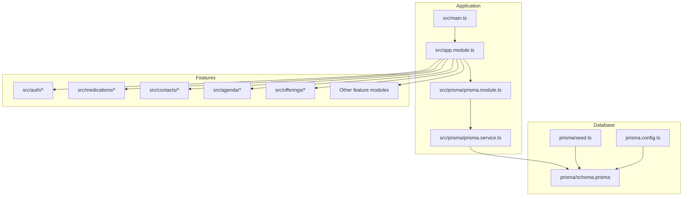
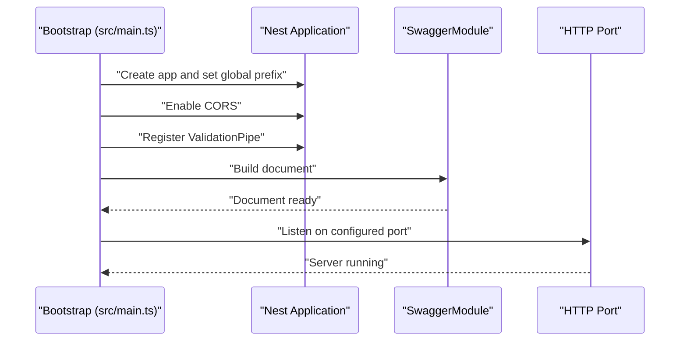
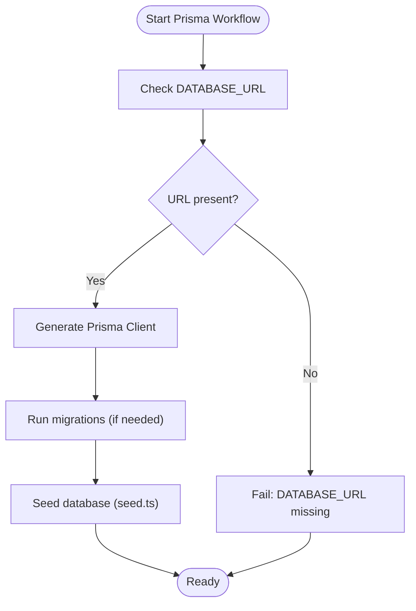
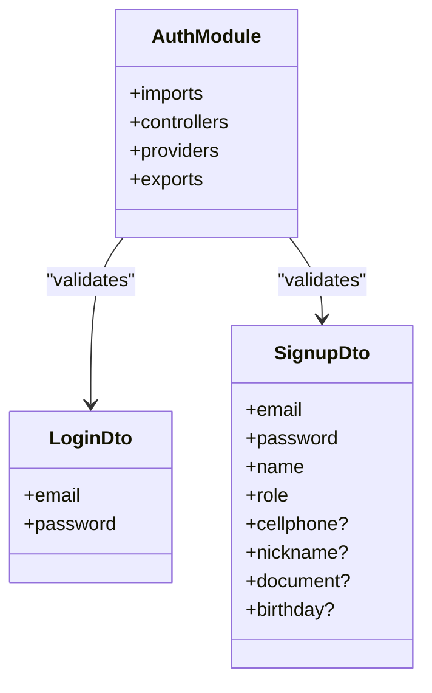
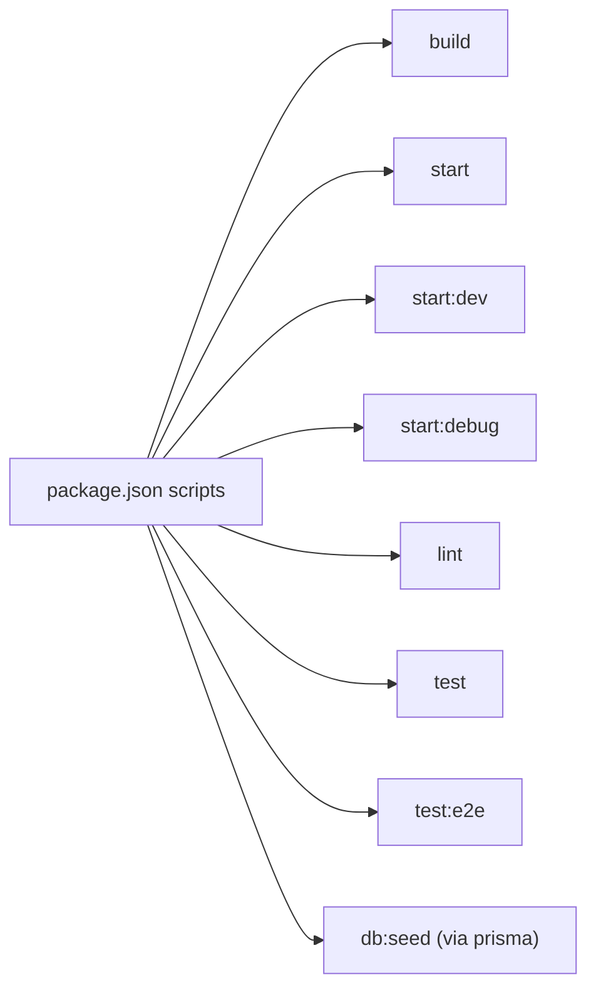

# Getting Started

<cite>
**Referenced Files in This Document**
- [README.md](file://README.md)
- [package.json](file://package.json)
- [nest-cli.json](file://nest-cli.json)
- [src/main.ts](file://src/main.ts)
- [src/app.module.ts](file://src/app.module.ts)
- [src/prisma/prisma.module.ts](file://src/prisma/prisma.module.ts)
- [src/prisma/prisma.service.ts](file://src/prisma/prisma.service.ts)
- [prisma/schema.prisma](file://prisma/schema.prisma)
- [prisma.config.ts](file://prisma.config.ts)
- [prisma/seed.ts](file://prisma/seed.ts)
- [src/auth/auth.module.ts](file://src/auth/auth.module.ts)
- [src/auth/dto/login.dto.ts](file://src/auth/dto/login.dto.ts)
- [src/auth/dto/signup.dto.ts](file://src/auth/dto/signup.dto.ts)
- [src/contacts/dto/create-contact.dto.ts](file://src/contacts/dto/create-contact.dto.ts)
- [src/medications/dto/create-medication.dto.ts](file://src/medications/dto/create-medication.dto.ts)
- [test/app.e2e-spec.ts](file://test/app.e2e-spec.ts)
</cite>

## Table of Contents
1. [Introduction](#introduction)
2. [Project Structure](#project-structure)
3. [Core Components](#core-components)
4. [Architecture Overview](#architecture-overview)
5. [Detailed Component Analysis](#detailed-component-analysis)
6. [Dependency Analysis](#dependency-analysis)
7. [Performance Considerations](#performance-considerations)
8. [Troubleshooting Guide](#troubleshooting-guide)
9. [Conclusion](#conclusion)
10. [Appendices](#appendices)

## Introduction
This guide helps you set up and run the 99-Pai API locally, configure the database, seed initial data, and explore the API via Swagger. The project is a NestJS application with Prisma ORM, Swagger/OpenAPI documentation, JWT authentication, and modular feature areas (elderly care, medications, agendas, offerings, etc.).

## Project Structure
The repository follows a NestJS monorepo-like layout under a single package with:
- Application entry and configuration in src/
- Feature modules under src/*/ (auth, elderly, medications, etc.)
- Prisma schema and seed under prisma/
- Build and test configuration in package.json and nest-cli.json
- End-to-end tests under test/

**Diagram sources**
- [src/main.ts:1-43](file://src/main.ts#L1-L43)
- [src/app.module.ts:1-36](file://src/app.module.ts#L1-L36)
- [src/prisma/prisma.module.ts:1-10](file://src/prisma/prisma.module.ts#L1-L10)
- [src/prisma/prisma.service.ts:1-17](file://src/prisma/prisma.service.ts#L1-L17)
- [prisma/schema.prisma:1-286](file://prisma/schema.prisma#L1-L286)
- [prisma/seed.ts:1-365](file://prisma/seed.ts#L1-L365)
- [prisma.config.ts:1-17](file://prisma.config.ts#L1-L17)

**Section sources**
- [README.md:24-99](file://README.md#L24-L99)
- [nest-cli.json:1-9](file://nest-cli.json#L1-L9)
- [src/app.module.ts:1-36](file://src/app.module.ts#L1-L36)

## Core Components
- Application bootstrap and middleware:
  - Global prefix, CORS, validation pipe, and Swagger setup are configured in the application entry.
- Prisma integration:
  - A global PrismaModule exposes PrismaService for database access across modules.
- Authentication:
  - AuthModule integrates Passport, JWT, and PrismaService; JWT secret is resolved from configuration.
- Feature modules:
  - Modularized by domain (e.g., auth, elderly, medications, contacts, agenda, offerings, etc.), imported into AppModule.

Key configuration highlights:
- Swagger endpoint path is exposed at docs.
- Global prefix is api.
- ValidationPipe enforces DTOs and transforms inputs.

**Section sources**
- [src/main.ts:6-41](file://src/main.ts#L6-L41)
- [src/app.module.ts:17-35](file://src/app.module.ts#L17-L35)
- [src/prisma/prisma.module.ts:1-10](file://src/prisma/prisma.module.ts#L1-L10)
- [src/prisma/prisma.service.ts:1-17](file://src/prisma/prisma.service.ts#L1-L17)
- [src/auth/auth.module.ts:1-28](file://src/auth/auth.module.ts#L1-L28)

## Architecture Overview
High-level runtime flow:
- Bootstrap initializes Nest application, sets global prefix, enables CORS, registers ValidationPipe, builds Swagger document, and starts listening on the configured port.
- AppModule aggregates all feature modules and PrismaModule.
- Feature modules depend on PrismaService for database operations.

**Diagram sources**
- [src/main.ts:6-41](file://src/main.ts#L6-L41)

**Section sources**
- [src/main.ts:6-41](file://src/main.ts#L6-L41)
- [src/app.module.ts:17-35](file://src/app.module.ts#L17-L35)

## Detailed Component Analysis

### Prisma Setup and Seed
- Schema defines PostgreSQL datasource via DATABASE_URL and includes enums and models for users, elderly profiles, caregivers, medications, contacts, agendas, categories, offerings, and service requests.
- Prisma configuration uses classic engine and reads datasource URL from environment.
- Seed script creates test users (elderly, caregiver, provider, admin), links them, seeds hierarchical categories, sample offerings, medications, and agenda events.

**Diagram sources**
- [prisma/schema.prisma:8-11](file://prisma/schema.prisma#L8-L11)
- [prisma.config.ts:7-16](file://prisma.config.ts#L7-L16)
- [prisma/seed.ts:16-365](file://prisma/seed.ts#L16-L365)

**Section sources**
- [prisma/schema.prisma:1-286](file://prisma/schema.prisma#L1-L286)
- [prisma.config.ts:1-17](file://prisma.config.ts#L1-L17)
- [prisma/seed.ts:1-365](file://prisma/seed.ts#L1-L365)

### Authentication and DTOs
- AuthModule configures JWT using a secret from configuration and Passport strategies.
- DTOs define request contracts for login and signup, including validation rules and Swagger annotations.

**Diagram sources**
- [src/auth/auth.module.ts:1-28](file://src/auth/auth.module.ts#L1-L28)
- [src/auth/dto/login.dto.ts:1-13](file://src/auth/dto/login.dto.ts#L1-L13)
- [src/auth/dto/signup.dto.ts:1-53](file://src/auth/dto/signup.dto.ts#L1-L53)

**Section sources**
- [src/auth/auth.module.ts:1-28](file://src/auth/auth.module.ts#L1-L28)
- [src/auth/dto/login.dto.ts:1-13](file://src/auth/dto/login.dto.ts#L1-L13)
- [src/auth/dto/signup.dto.ts:1-53](file://src/auth/dto/signup.dto.ts#L1-L53)

### Example DTOs for API Contracts
- CreateContactDto validates contact creation inputs.
- CreateMedicationDto validates medication creation inputs.

These DTOs inform API consumers about payload expectations and constraints.

**Section sources**
- [src/contacts/dto/create-contact.dto.ts:1-19](file://src/contacts/dto/create-contact.dto.ts#L1-L19)
- [src/medications/dto/create-medication.dto.ts:1-17](file://src/medications/dto/create-medication.dto.ts#L1-L17)

## Dependency Analysis
- Runtime dependencies include Nest core modules, Swagger, Prisma client, JWT, Passport, validation libraries, and date utilities.
- Development dependencies include Nest CLI, Jest, ESLint/Prettier, Prisma, TypeScript, and related tooling.
- Scripts cover build, dev/watch, debug, lint, test, and E2E testing.

**Diagram sources**
- [package.json:8-21](file://package.json#L8-L21)
- [package.json:68-70](file://package.json#L68-L70)

**Section sources**
- [package.json:22-67](file://package.json#L22-L67)
- [package.json:8-21](file://package.json#L8-L21)
- [package.json:68-70](file://package.json#L68-L70)

## Performance Considerations
- Keep DTO validation strict to reduce downstream errors.
- Use pagination for list endpoints where appropriate.
- Leverage Prisma’s indexing (as defined in schema) for frequent queries.
- Monitor database connection pooling and adjust Prisma client settings if scaling.

## Troubleshooting Guide
Common setup issues and resolutions:
- Missing DATABASE_URL:
  - Ensure DATABASE_URL is set in your environment. The schema expects a PostgreSQL URL.
  - Reference: [prisma/schema.prisma:8-11](file://prisma/schema.prisma#L8-L11)
- Prisma client generation errors:
  - Run Prisma client generation and migrations before starting the app.
  - Reference: [prisma.config.ts:7-16](file://prisma.config.ts#L7-L16)
- Seed fails:
  - Confirm database connectivity and that migrations have been applied.
  - Reference: [prisma/seed.ts:16-365](file://prisma/seed.ts#L16-L365)
- Swagger not found:
  - Swagger is mounted at docs; ensure the server is running and global prefix is applied.
  - Reference: [src/main.ts:27-35](file://src/main.ts#L27-L35)
- CORS blocked requests:
  - CORS is enabled with origin true; verify client origin matches.
  - Reference: [src/main.ts:12-16](file://src/main.ts#L12-L16)
- JWT secret not found:
  - JWT secret must be provided via configuration; otherwise, AuthModule registration will fail.
  - Reference: [src/auth/auth.module.ts:14-21](file://src/auth/auth.module.ts#L14-L21)

Verification steps:
- Start the app in watch mode and confirm logs show Swagger path and port.
  - Reference: [README.md:34-45](file://README.md#L34-L45)
- Run E2E tests to validate basic routing.
  - Reference: [test/app.e2e-spec.ts:19-24](file://test/app.e2e-spec.ts#L19-L24)

**Section sources**
- [prisma/schema.prisma:8-11](file://prisma/schema.prisma#L8-L11)
- [prisma.config.ts:7-16](file://prisma.config.ts#L7-L16)
- [prisma/seed.ts:16-365](file://prisma/seed.ts#L16-L365)
- [src/main.ts:12-41](file://src/main.ts#L12-L41)
- [src/auth/auth.module.ts:14-21](file://src/auth/auth.module.ts#L14-L21)
- [README.md:34-45](file://README.md#L34-L45)
- [test/app.e2e-spec.ts:19-24](file://test/app.e2e-spec.ts#L19-L24)

## Conclusion
You now have the essentials to install, configure, and run the 99-Pai API locally. Use the provided scripts, environment variables, and seed data to explore endpoints via Swagger. Expand from there by adding new modules and integrating additional services.

## Appendices

### Prerequisites
- Node.js and npm: Install a recent LTS version compatible with the project’s dependencies.
- PostgreSQL: Ensure a PostgreSQL server is available and reachable.
- Prisma CLI: Installed globally or via dev dependencies to manage migrations and client generation.

**Section sources**
- [package.json:58-58](file://package.json#L58-L58)
- [prisma/schema.prisma:8-11](file://prisma/schema.prisma#L8-L11)

### Step-by-Step Installation
1. Install dependencies:
   - Run the standard install command.
   - Reference: [README.md:30-32](file://README.md#L30-L32)
2. Set environment variables:
   - DATABASE_URL must point to your PostgreSQL instance.
   - JWT_SECRET must be configured for AuthModule.
   - Reference: [prisma/schema.prisma:8-11](file://prisma/schema.prisma#L8-L11), [src/auth/auth.module.ts:14-21](file://src/auth/auth.module.ts#L14-L21)
3. Generate Prisma client and apply migrations:
   - Use Prisma CLI to generate client and migrate.
   - Reference: [prisma.config.ts:7-16](file://prisma.config.ts#L7-L16)
4. Seed the database:
   - Execute the seed script to populate initial data.
   - Reference: [prisma/seed.ts:16-365](file://prisma/seed.ts#L16-L365)
5. Start the application:
   - Development watch mode or production mode.
   - Reference: [README.md:34-45](file://README.md#L34-L45)

**Section sources**
- [README.md:28-45](file://README.md#L28-L45)
- [prisma.config.ts:7-16](file://prisma.config.ts#L7-L16)
- [prisma/seed.ts:16-365](file://prisma/seed.ts#L16-L365)
- [src/auth/auth.module.ts:14-21](file://src/auth/auth.module.ts#L14-L21)

### Environment Configuration
- Required variables:
  - DATABASE_URL: PostgreSQL connection string.
  - JWT_SECRET: Secret used to sign JWT tokens.
- Optional variables:
  - PORT: Override default application port.
- References:
  - [prisma/schema.prisma:8-11](file://prisma/schema.prisma#L8-L11)
  - [src/main.ts:37-40](file://src/main.ts#L37-L40)
  - [src/auth/auth.module.ts:16-18](file://src/auth/auth.module.ts#L16-L18)

**Section sources**
- [prisma/schema.prisma:8-11](file://prisma/schema.prisma#L8-L11)
- [src/main.ts:37-40](file://src/main.ts#L37-L40)
- [src/auth/auth.module.ts:16-18](file://src/auth/auth.module.ts#L16-L18)

### Development Workflow
- Build:
  - Reference: [package.json:9-9](file://package.json#L9-L9)
- Run in development (watch mode):
  - Reference: [package.json:12-12](file://package.json#L12-L12)
- Debug:
  - Reference: [package.json:13-13](file://package.json#L13-L13)
- Lint and format:
  - Reference: [package.json:15-15](file://package.json#L15-L15)
- Tests:
  - Unit tests: [package.json:16-16](file://package.json#L16-L16)
  - E2E tests: [package.json:20-20](file://package.json#L20-L20), [test/app.e2e-spec.ts:1-26](file://test/app.e2e-spec.ts#L1-L26)

**Section sources**
- [package.json:8-21](file://package.json#L8-L21)
- [test/app.e2e-spec.ts:1-26](file://test/app.e2e-spec.ts#L1-L26)

### Accessing Swagger Documentation
- Swagger UI is mounted at docs and uses a global prefix of api.
- Verify the Swagger URL after startup.
- Reference: [src/main.ts:27-35](file://src/main.ts#L27-L35)

**Section sources**
- [src/main.ts:27-35](file://src/main.ts#L27-L35)

### Initial API Testing Examples
- Use the seeded test accounts to authenticate and explore endpoints:
  - elderly@test.com / 123456
  - caregiver@test.com / 123456
  - provider@test.com / 123456
  - admin@test.com / 123456
- Endpoints are prefixed with api; Swagger docs describe available routes and schemas.
- References:
  - [prisma/seed.ts:349-355](file://prisma/seed.ts#L349-L355)
  - [src/main.ts:10-10](file://src/main.ts#L10-L10)
  - [src/auth/dto/login.dto.ts:1-13](file://src/auth/dto/login.dto.ts#L1-L13)
  - [src/auth/dto/signup.dto.ts:1-53](file://src/auth/dto/signup.dto.ts#L1-L53)

**Section sources**
- [prisma/seed.ts:349-355](file://prisma/seed.ts#L349-L355)
- [src/main.ts:10-10](file://src/main.ts#L10-L10)
- [src/auth/dto/login.dto.ts:1-13](file://src/auth/dto/login.dto.ts#L1-L13)
- [src/auth/dto/signup.dto.ts:1-53](file://src/auth/dto/signup.dto.ts#L1-L53)