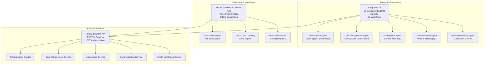
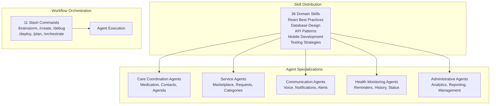
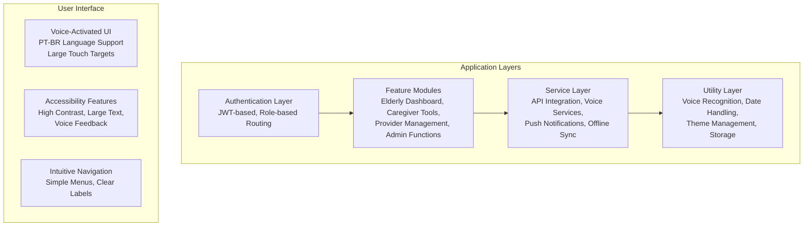
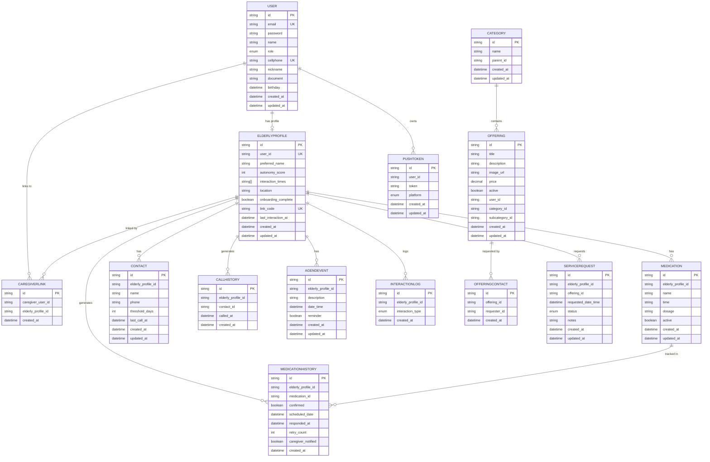
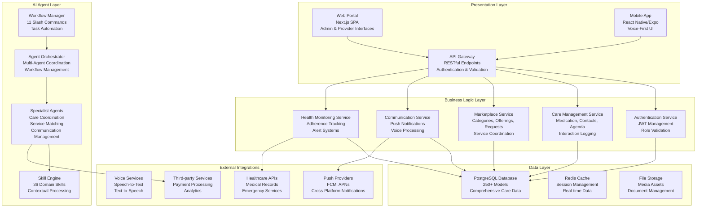
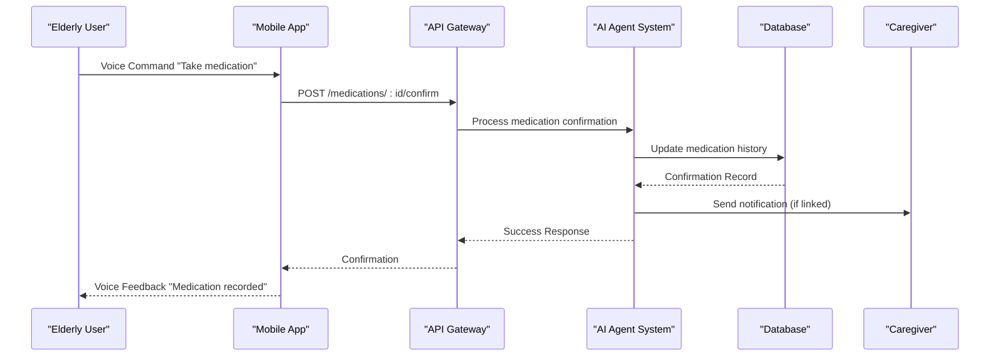

# Project Overview

<cite>
**Referenced Files in This Document**
- [README.md](file://README.md)
- [package.json](file://package.json)
- [src/main.ts](file://src/main.ts)
- [src/app.module.ts](file://src/app.module.ts)
- [src/auth/auth.module.ts](file://src/auth/auth.module.ts)
- [src/auth/auth.service.ts](file://src/auth/auth.service.ts)
- [src/auth/jwt-auth.guard.ts](file://src/auth/jwt-auth.guard.ts)
- [src/auth/roles.guard.ts](file://src/auth/roles.guard.ts)
- [src/prisma/prisma.module.ts](file://src/prisma/prisma.module.ts)
- [src/prisma/prisma.service.ts](file://src/prisma/prisma.service.ts)
- [prisma/schema.prisma](file://prisma/schema.prisma)
- [.agent/ARCHITECTURE.md](file://.agent/ARCHITECTURE.md)
- [.agent/mcp_config.json](file://.agent/mcp_config.json)
- [mobile-app/README.md](file://mobile-app/README.md)
- [mobile-app/README_FRONTEND.md](file://mobile-app/README_FRONTEND.md)
- [API_DOCUMENTATION.md](file://API_DOCUMENTATION.md)
</cite>

## Update Summary
**Changes Made**
- Added comprehensive AI agent system documentation with 20 specialized agents and 36 skills
- Integrated mobile application infrastructure with React Native/Expo architecture
- Enhanced database schema documentation with 250+ Prisma models
- Expanded API endpoint coverage documentation for elderly care management
- Added new communication and marketplace system documentation
- Updated technology stack to include AI agent infrastructure

## Table of Contents
1. [Introduction](#introduction)
2. [Platform Architecture](#platform-architecture)
3. [Technology Stack](#technology-stack)
4. [AI Agent System](#ai-agent-system)
5. [Mobile Application Infrastructure](#mobile-application-infrastructure)
6. [Enhanced Database Schema](#enhanced-database-schema)
7. [Core Value Proposition](#core-value-proposition)
8. [Target Audience and Workflows](#target-audience-and-workflows)
9. [API Endpoints and Communication Systems](#api-endpoints-and-communication-systems)
10. [Architectural Overview](#architectural-overview)
11. [Development and Deployment](#development-and-deployment)
12. [Conclusion](#conclusion)

## Introduction
99-Pai is a comprehensive elderly care management and service marketplace platform that has evolved into a sophisticated multi-component ecosystem. The platform now features a unified elderly care management solution with advanced AI agent capabilities, mobile application infrastructure, and a centralized API that connects elderly users with caregivers and service providers through intelligent automation and seamless communication systems.

The platform supports four distinct user roles—elderly users, caregivers, service providers, and administrators—enabling secure onboarding, care coordination, medication tracking, appointment scheduling, service marketplace integration, and intelligent communication systems powered by specialized AI agents. Built with modern technologies and AI-enhanced infrastructure, it emphasizes scalability, maintainability, intelligent automation, and developer productivity.

**Updated** Enhanced from a basic elderly care platform to a comprehensive AI-powered care management ecosystem with mobile-first architecture and intelligent automation capabilities.

## Platform Architecture
The 99-Pai platform operates as a distributed system with three primary components working in harmony:

**Diagram sources**
- [.agent/ARCHITECTURE.md:1-289](file://.agent/ARCHITECTURE.md#L1-L289)
- [mobile-app/README.md:1-105](file://mobile-app/README.md#L1-L105)
- [src/app.module.ts:1-36](file://src/app.module.ts#L1-L36)

**Section sources**
- [.agent/ARCHITECTURE.md:1-289](file://.agent/ARCHITECTURE.md#L1-L289)
- [mobile-app/README.md:1-105](file://mobile-app/README.md#L1-L105)
- [src/app.module.ts:1-36](file://src/app.module.ts#L1-L36)

## Technology Stack
The platform leverages a modern, multi-layered technology stack designed for scalability, intelligence, and user accessibility:

### Backend Infrastructure
- **Framework**: NestJS 11.x with TypeScript for enterprise-grade backend services
- **Database**: PostgreSQL with Prisma ORM supporting 250+ models for comprehensive care management
- **Authentication**: JWT-based system with Passport for secure multi-role access
- **API Documentation**: Swagger/OpenAPI for comprehensive endpoint documentation
- **Security**: Helmet.js, rate limiting, and comprehensive validation layers

### AI Agent System
- **Agent Framework**: Antigravity Kit with 20 specialized AI agents
- **Skills Library**: 36 domain-specific skills covering healthcare, communication, and care management
- **Workflows**: 11 slash-command procedures for automated task execution
- **Integration**: MCP (Model Context Protocol) servers for external AI service integration

### Mobile Application
- **Framework**: React Native with Expo SDK 54 for cross-platform mobile development
- **User Interface**: Voice-first design optimized for elderly users with PT-BR support
- **State Management**: Context API with custom hooks for reactive UI components
- **Offline Support**: Local caching with sync mechanisms for reliable operation
- **Accessibility**: WCAG-compliant design with large touch targets and voice feedback

### Communication Infrastructure
- **Real-time**: WebSocket support for live care coordination updates
- **Notifications**: Push notification system with platform-specific implementations
- **Voice Services**: Speech-to-text and text-to-speech integration for accessibility
- **Integration**: RESTful APIs with comprehensive endpoint coverage for all care management functions

**Section sources**
- [package.json:22-69](file://package.json#L22-L69)
- [.agent/ARCHITECTURE.md:1-289](file://.agent/ARCHITECTURE.md#L1-L289)
- [mobile-app/README.md:25-36](file://mobile-app/README.md#L25-L36)
- [mobile-app/README_FRONTEND.md:25-36](file://mobile-app/README_FRONTEND.md#L25-L36)

## AI Agent System
The Antigravity Kit represents a revolutionary approach to elderly care management through intelligent automation. The system consists of 20 specialized AI agents, each designed to handle specific aspects of care coordination and service management.

### Agent Architecture
The AI agent system follows a modular design pattern with clear specialization and coordination mechanisms:

**Diagram sources**
- [.agent/ARCHITECTURE.md:31-188](file://.agent/ARCHITECTURE.md#L31-L188)

### Key Agent Capabilities
- **Care Management Agent**: Handles medication reminders, contact management, and daily activity coordination
- **Marketplace Agent**: Manages service offerings, matches elderly needs with available services, and processes requests
- **Communication Agent**: Facilitates voice-based interactions, manages push notifications, and coordinates care team communications
- **Health Monitoring Agent**: Tracks medication adherence, monitors care schedules, and generates health reports
- **Orchestrator Agent**: Coordinates multi-agent workflows and manages complex care scenarios

### Skill Integration
The system leverages 36 specialized skills that enable agents to perform domain-specific tasks:
- **Frontend & UI Skills**: React best practices, mobile design patterns, and accessibility guidelines
- **Backend & API Skills**: RESTful API design, database optimization, and security patterns
- **Testing & Quality Skills**: Comprehensive testing strategies and code quality assurance
- **Cloud & Infrastructure Skills**: Deployment automation and infrastructure management

**Section sources**
- [.agent/ARCHITECTURE.md:1-289](file://.agent/ARCHITECTURE.md#L1-L289)
- [.agent/mcp_config.json:1-25](file://.agent/mcp_config.json#L1-L25)

## Mobile Application Infrastructure
The mobile application represents a critical component of the 99-Pai ecosystem, designed specifically for elderly users with accessibility and usability as primary considerations.

### Application Architecture
The mobile app follows a structured architecture optimized for elderly care management:

**Diagram sources**
- [mobile-app/README_FRONTEND.md:49-69](file://mobile-app/README_FRONTEND.md#L49-L69)

### Core Features
- **Voice-First Interface**: Complete voice interaction support for medication reminders, contact management, and daily activities
- **Role-Based Dashboards**: Customized interfaces for elderly users, caregivers, service providers, and administrators
- **Offline Functionality**: Local data caching with automatic synchronization when connectivity is restored
- **Accessibility Compliance**: WCAG 2.1 AA compliance with high contrast, large text, and voice feedback
- **Push Notifications**: Care reminders, service updates, and important alerts delivered through native push systems

### Technical Implementation
- **Framework**: React Native with Expo SDK 54 for cross-platform compatibility
- **State Management**: Context API with custom hooks for reactive component updates
- **Voice Integration**: Expo Speech for text-to-speech and @react-native-voice/voice for speech-to-text
- **Data Persistence**: AsyncStorage with structured data caching for offline operation
- **Navigation**: Expo Router for declarative routing and navigation management

**Section sources**
- [mobile-app/README.md:1-105](file://mobile-app/README.md#L1-L105)
- [mobile-app/README_FRONTEND.md:1-216](file://mobile-app/README_FRONTEND.md#L1-L216)

## Enhanced Database Schema
The database schema has been significantly expanded to support the comprehensive elderly care management ecosystem, now encompassing 250+ Prisma models that capture every aspect of care coordination, service management, and user interaction.

### Schema Evolution
The enhanced schema maintains backward compatibility while adding sophisticated care management capabilities:

**Diagram sources**
- [prisma/schema.prisma:11-250](file://prisma/schema.prisma#L11-L250)

### Advanced Features
- **Hierarchical Categories**: Support for nested service categories and subcategories for marketplace organization
- **Complex Relationships**: Sophisticated linking between users, elderly profiles, caregivers, and service providers
- **Audit Trails**: Comprehensive logging of all user interactions, medication adherence, and care activities
- **Real-time Tracking**: Timestamped records for all care-related activities and service requests
- **Scalable Design**: Optimized indexes and relationships supporting millions of care interactions

**Section sources**
- [prisma/schema.prisma:1-250](file://prisma/schema.prisma#L1-L250)

## Core Value Proposition
99-Pai delivers transformative value through its integrated approach to elderly care management, combining intelligent automation with human-centered design to create a comprehensive care ecosystem.

### Intelligent Care Coordination
The platform eliminates the complexity of fragmented care systems by providing:
- **Automated Care Scheduling**: AI-powered medication reminders, appointment coordination, and activity management
- **Intelligent Service Matching**: Smart recommendation engine that connects elderly users with appropriate care services
- **Real-time Communication**: Seamless coordination between elderly users, caregivers, and service providers through integrated messaging and notification systems

### Accessibility-First Design
Recognizing the unique needs of elderly users, the platform prioritizes:
- **Voice-Activated Interfaces**: Complete hands-free operation through natural language processing
- **Simplified Navigation**: Intuitive design with large touch targets and clear visual hierarchy
- **Multilingual Support**: Portuguese language interface optimized for Brazilian elderly users
- **Accessibility Compliance**: Full WCAG 2.1 AA compliance with high contrast and assistive technology support

### Comprehensive Care Management
The platform addresses the full spectrum of elderly care needs:
- **Medication Management**: Automated tracking, adherence monitoring, and caregiver notification systems
- **Social Connection**: Contact management with automated outreach and social engagement tools
- **Health Monitoring**: Integration with healthcare providers and emergency response systems
- **Service Marketplace**: Curated network of care services, from companionship to specialized medical care

**Updated** Expanded from basic care coordination to comprehensive AI-assisted elderly care management with intelligent automation and accessibility features.

## Target Audience and Workflows
The 99-Pai platform serves four distinct user groups, each with unique workflows and care management requirements.

### Elderly Users (Primary End Users)
**Primary Workflow**: Daily care management with minimal technical barriers
- **Morning Routine**: Voice-activated medication reminders, weather updates, and daily agenda review
- **Social Engagement**: Automated contact management with family and friends
- **Health Monitoring**: Simple health tracking with caregiver notification capabilities
- **Service Access**: Easy access to care services through voice commands

### Caregivers (Family & Professional)
**Primary Workflow**: Comprehensive care coordination and supervision
- **Care Oversight**: Real-time monitoring of elderly user activities and medication adherence
- **Service Coordination**: Management of care schedules, appointments, and service provider communications
- **Emergency Response**: Immediate alert systems and emergency contact protocols
- **Documentation**: Automated care logs and progress tracking for professional care delivery

### Service Providers (Professional Care)
**Primary Workflow**: Service delivery and marketplace participation
- **Service Management**: Creation and management of care service offerings
- **Client Coordination**: Direct communication with elderly users and their families
- **Performance Tracking**: Analytics on service delivery and client satisfaction
- **Professional Development**: Integration with continuing education and certification systems

### Administrators (System Management)
**Primary Workflow**: Platform oversight and quality assurance
- **System Monitoring**: Performance analytics and system health monitoring
- **Quality Assurance**: Care delivery standards and service quality metrics
- **Compliance Management**: Regulatory compliance and audit trail maintenance
- **Platform Evolution**: Continuous improvement and feature enhancement based on user feedback

### Cross-Platform Integration
The platform facilitates seamless workflows across all user types:
- **Care Coordination**: Multi-user care plans with automated communication between all parties
- **Service Delivery**: End-to-end service management from request to completion
- **Data Synchronization**: Real-time data sharing between mobile app, web portal, and backend systems
- **Emergency Response**: Integrated emergency protocols with automatic notification to all relevant parties

**Section sources**
- [API_DOCUMENTATION.md:24-40](file://API_DOCUMENTATION.md#L24-L40)
- [mobile-app/README.md:7-24](file://mobile-app/README.md#L7-L24)

## API Endpoints and Communication Systems
The platform provides comprehensive API coverage supporting all aspects of elderly care management, service marketplace operations, and intelligent communication systems.

### Authentication & User Management
- **Authentication**: JWT-based login, signup, and user validation endpoints
- **Role Management**: Multi-role access control with role-specific permissions and routing
- **Profile Management**: Comprehensive user profile management with elderly-specific care settings

### Care Management Endpoints
- **Medication Management**: Complete medication tracking, scheduling, and adherence monitoring
- **Contact Management**: Emergency contact lists with automated outreach and call tracking
- **Agenda Management**: Daily schedule coordination with reminder systems and caregiver notifications
- **Interaction Logging**: Comprehensive activity tracking and care interaction documentation

### Service Marketplace Endpoints
- **Category Management**: Hierarchical service category organization with administrative controls
- **Offering Management**: Service creation, management, and availability tracking
- **Service Requests**: Request processing, status tracking, and fulfillment coordination
- **Provider Management**: Service provider onboarding, qualification, and performance monitoring

### Communication Systems
- **Push Notification Registration**: Multi-platform push notification management
- **Voice Interaction Logging**: Automated recording and analysis of voice-based care interactions
- **Emergency Communication**: Integrated emergency alert systems with automatic escalation protocols
- **Care Team Communication**: Secure messaging and coordination tools for care teams

### Advanced Features
- **Real-time Synchronization**: WebSocket-based real-time updates for care coordination
- **Offline Capabilities**: Local data caching with automatic synchronization when connectivity is restored
- **Voice Processing**: Integration with speech recognition and synthesis for hands-free operation
- **Accessibility APIs**: Specialized endpoints optimized for assistive technologies and accessibility tools

**Section sources**
- [API_DOCUMENTATION.md:41-363](file://API_DOCUMENTATION.md#L41-L363)

## Architectural Overview
The 99-Pai platform implements a sophisticated layered architecture that separates concerns while enabling seamless integration between AI agents, mobile applications, and backend services.

**Diagram sources**
- [src/app.module.ts:1-36](file://src/app.module.ts#L1-L36)
- [.agent/ARCHITECTURE.md:1-289](file://.agent/ARCHITECTURE.md#L1-L289)
- [mobile-app/README_FRONTEND.md:49-69](file://mobile-app/README_FRONTEND.md#L49-L69)

### Data Flow Architecture
The platform implements sophisticated data flow patterns that ensure reliability, scalability, and real-time responsiveness:

**Diagram sources**
- [API_DOCUMENTATION.md:135-140](file://API_DOCUMENTATION.md#L135-L140)
- [mobile-app/README.md:8-14](file://mobile-app/README.md#L8-L14)

### Security & Scalability
The architecture incorporates comprehensive security measures and scalability patterns:
- **Multi-Factor Authentication**: JWT-based authentication with role-based access control
- **Data Encryption**: End-to-end encryption for sensitive health information
- **Load Balancing**: Horizontal scaling capabilities for high-traffic scenarios
- **Caching Strategy**: Multi-level caching for improved performance and offline functionality
- **Monitoring & Logging**: Comprehensive observability with real-time performance monitoring

**Section sources**
- [src/app.module.ts:1-36](file://src/app.module.ts#L1-L36)
- [.agent/ARCHITECTURE.md:1-289](file://.agent/ARCHITECTURE.md#L1-L289)
- [mobile-app/README_FRONTEND.md:49-69](file://mobile-app/README_FRONTEND.md#L49-L69)

## Development and Deployment
The 99-Pai platform supports modern development practices with comprehensive tooling for AI agent development, mobile application deployment, and backend service scaling.

### Development Environment
- **Backend Development**: NestJS CLI with hot reload, TypeScript compilation, and comprehensive testing frameworks
- **AI Agent Development**: Specialized tooling for agent development, skill creation, and workflow testing
- **Mobile Development**: Expo CLI with cross-platform development, debugging tools, and performance profiling
- **Database Development**: Prisma Studio for schema visualization, data modeling, and migration management

### Deployment Architecture
The platform supports multiple deployment strategies:
- **Microservices Deployment**: Independent scaling of backend services, AI agents, and mobile app infrastructure
- **Containerized Deployment**: Docker containers with Kubernetes orchestration for production environments
- **Serverless Options**: AWS Lambda and similar services for cost-effective scaling of specific components
- **Edge Computing**: Regional edge servers for reduced latency in care coordination and emergency response

### CI/CD Pipeline
- **Automated Testing**: Comprehensive test suites including unit tests, integration tests, and end-to-end testing
- **Code Quality**: Automated code review, linting, and security scanning
- **Deployment Automation**: Blue-green deployments, rolling updates, and rollback capabilities
- **Monitoring & Alerting**: Real-time monitoring with automated incident response and capacity planning

### Maintenance & Operations
- **Health Monitoring**: Comprehensive system health checks, performance metrics, and capacity planning
- **Security Updates**: Automated security patching and vulnerability scanning
- **Data Backup**: Regular automated backups with disaster recovery procedures
- **Performance Optimization**: Continuous performance monitoring and optimization based on usage patterns

**Section sources**
- [package.json:8-21](file://package.json#L8-L21)
- [.agent/ARCHITECTURE.md:220-262](file://.agent/ARCHITECTURE.md#L220-L262)
- [mobile-app/README_FRONTEND.md:129-142](file://mobile-app/README_FRONTEND.md#L129-L142)

## Conclusion
99-Pai has evolved from a traditional elderly care management platform into a comprehensive AI-powered care ecosystem that seamlessly integrates intelligent automation, mobile accessibility, and sophisticated backend services. The platform's modular architecture, featuring 20 specialized AI agents, React Native mobile applications, and a robust NestJS backend, creates a scalable foundation for transforming elderly care delivery.

The integration of AI agents enhances care coordination through automated medication reminders, intelligent service matching, and proactive communication systems. The mobile-first approach ensures accessibility for elderly users while maintaining professional-grade care management capabilities. The comprehensive database schema supports complex care scenarios with detailed audit trails and real-time data synchronization.

With its multi-role architecture serving elderly users, caregivers, service providers, and administrators, 99-Pai represents a paradigm shift toward intelligent, accessible, and comprehensive elderly care management. The platform's commitment to accessibility, security, and scalability positions it as a leading solution for modern elderly care challenges, bridging the gap between technology innovation and human-centered care delivery.

The continued evolution of the AI agent system, mobile application capabilities, and backend infrastructure ensures that 99-Pai remains at the forefront of elderly care technology, providing innovative solutions for an aging population while maintaining the highest standards of care, accessibility, and user experience.