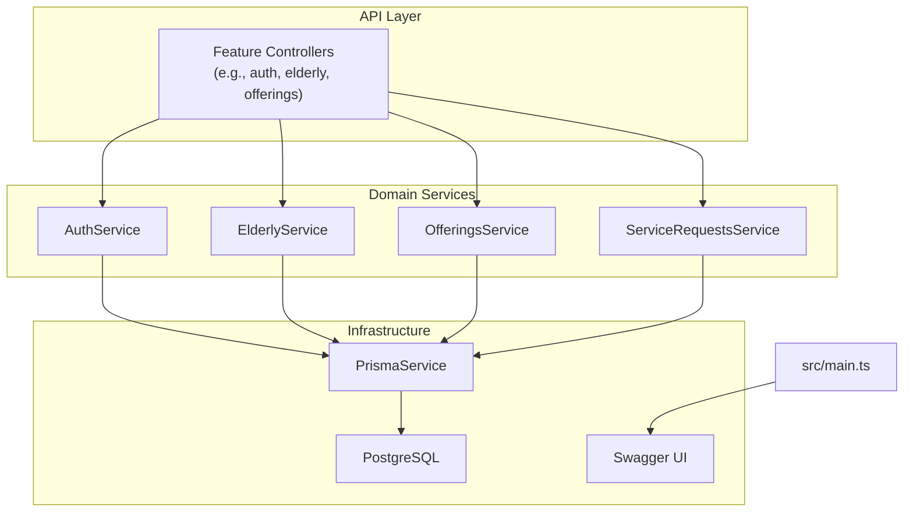
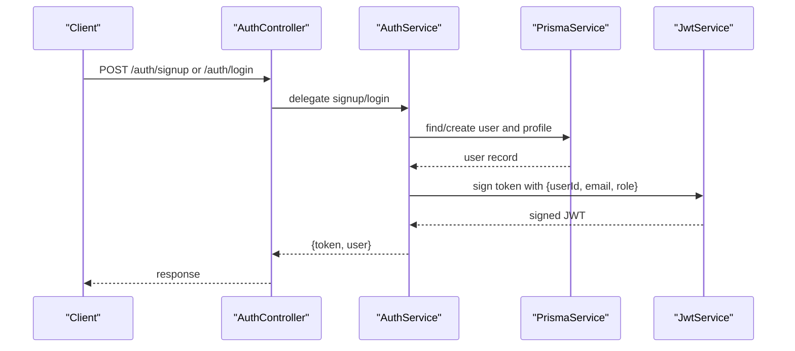
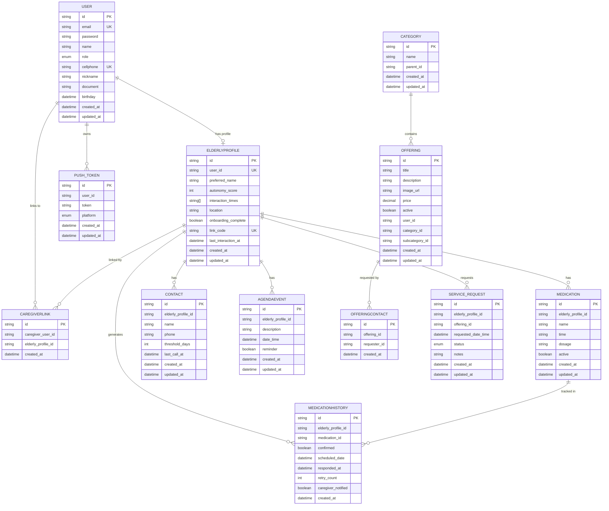
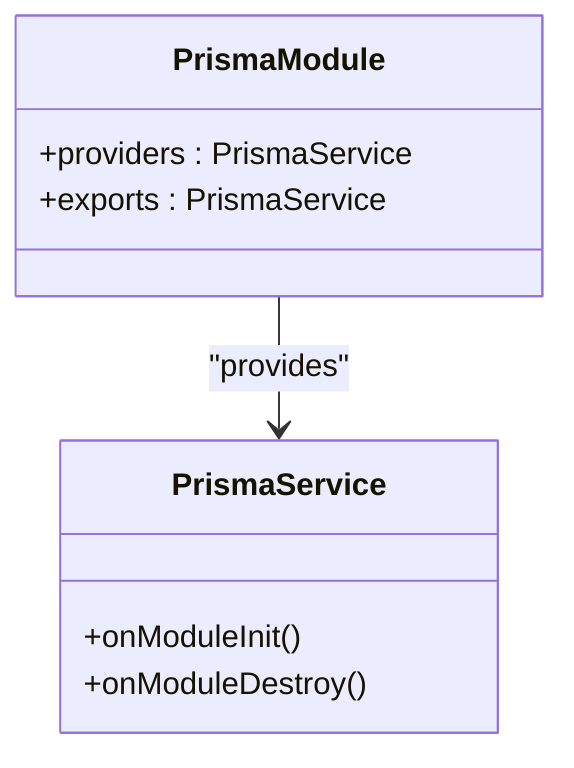
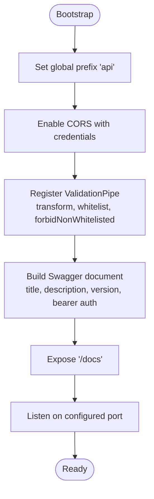
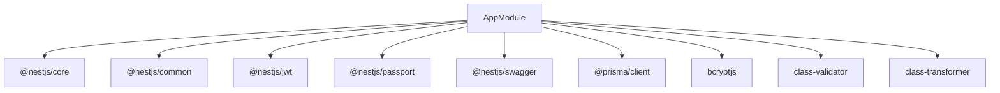

# Project Overview

<cite>
**Referenced Files in This Document**
- [README.md](file://README.md)
- [package.json](file://package.json)
- [src/main.ts](file://src/main.ts)
- [src/app.module.ts](file://src/app.module.ts)
- [src/auth/auth.module.ts](file://src/auth/auth.module.ts)
- [src/auth/auth.service.ts](file://src/auth/auth.service.ts)
- [src/auth/jwt-auth.guard.ts](file://src/auth/jwt-auth.guard.ts)
- [src/auth/roles.guard.ts](file://src/auth/roles.guard.ts)
- [src/prisma/prisma.module.ts](file://src/prisma/prisma.module.ts)
- [src/prisma/prisma.service.ts](file://src/prisma/prisma.service.ts)
- [prisma/schema.prisma](file://prisma/schema.prisma)
</cite>

## Table of Contents
1. [Introduction](#introduction)
2. [Project Structure](#project-structure)
3. [Core Components](#core-components)
4. [Architecture Overview](#architecture-overview)
5. [Detailed Component Analysis](#detailed-component-analysis)
6. [Dependency Analysis](#dependency-analysis)
7. [Performance Considerations](#performance-considerations)
8. [Troubleshooting Guide](#troubleshooting-guide)
9. [Conclusion](#conclusion)

## Introduction
99-Pai is a unified elderly care management and service marketplace platform designed to connect elderly users with caregivers and service providers through a centralized API. The platform supports multiple user roles—elderly users, caregivers, service providers, and administrators—enabling secure onboarding, care coordination, medication tracking, appointment scheduling, service offerings, and request management. Built with modern technologies, it emphasizes scalability, maintainability, and developer productivity.

Key capabilities include:
- Role-based authentication and authorization
- Centralized user and profile management
- Care-related workflows such as medication tracking and interaction logging
- Service marketplace with categories, offerings, and requests
- Notification support via push tokens
- Swagger-powered API documentation

## Project Structure
The backend follows a NestJS modular architecture with domain-focused feature modules. The application bootstraps a global prefix, enables CORS, applies validation globally, and exposes Swagger documentation. The central AppModule aggregates all feature modules, ensuring a clean separation of concerns.

```mermaid
graph TB
Main["src/main.ts<br/>Bootstrap and configuration"] --> AppModule["src/app.module.ts<br/>Root module"]
AppModule --> AuthModule["src/auth/auth.module.ts<br/>Authentication"]
AppModule --> ElderlyModule["src/elderly/elderly.module.ts<br/>Elderly profiles"]
AppModule --> CaregiverModule["src/caregiver/caregiver.module.ts<br/>Caregiver links"]
AppModule --> MedicationsModule["src/medications/medications.module.ts<br/>Medications"]
AppModule --> ContactsModule["src/contacts/contacts.module.ts<br/>Emergency contacts"]
AppModule --> AgendaModule["src/agenda/agenda.module.ts<br/>Agenda events"]
AppModule --> NotificationsModule["src/notifications/notifications.module.ts<br/>Push tokens"]
AppModule --> InteractionsModule["src/interactions/interactions.module.ts<br/>Interaction logs"]
AppModule --> WeatherModule["src/weather/weather.module.ts<br/>Weather info"]
AppModule --> CategoriesModule["src/categories/categories.module.ts<br/>Offering categories"]
AppModule --> OfferingsModule["src/offerings/offerings.module.ts<br/>Service offerings"]
AppModule --> ServiceRequestsModule["src/service-requests/service-requests.module.ts<br/>Service requests"]
AppModule --> PrismaModule["src/prisma/prisma.module.ts<br/>Prisma service"]
```

**Diagram sources**
- [src/main.ts:1-43](file://src/main.ts#L1-L43)
- [src/app.module.ts:1-36](file://src/app.module.ts#L1-L36)
- [src/auth/auth.module.ts:1-28](file://src/auth/auth.module.ts#L1-L28)
- [src/prisma/prisma.module.ts:1-10](file://src/prisma/prisma.module.ts#L1-L10)

**Section sources**
- [src/main.ts:1-43](file://src/main.ts#L1-L43)
- [src/app.module.ts:1-36](file://src/app.module.ts#L1-L36)

## Core Components
- Technology Stack
  - Backend framework: NestJS
  - Language: TypeScript
  - Persistence: Prisma ORM with PostgreSQL
  - Authentication: JWT via Passport
  - Validation: Global ValidationPipe
  - API documentation: Swagger
- Modular Design
  - Feature modules encapsulate domain logic (e.g., elderly, caregiver, medications, offerings, service requests)
  - Shared Prisma service provides database connectivity across modules
- Authentication and Authorization
  - JWT-based authentication with Passport
  - Role-based guard restricts access to protected routes
  - User roles include elderly, caregiver, provider, and admin

**Section sources**
- [package.json:22-39](file://package.json#L22-L39)
- [prisma/schema.prisma:1-286](file://prisma/schema.prisma#L1-L286)
- [src/auth/auth.module.ts:1-28](file://src/auth/auth.module.ts#L1-L28)
- [src/auth/auth.service.ts:1-173](file://src/auth/auth.service.ts#L1-L173)
- [src/auth/jwt-auth.guard.ts:1-6](file://src/auth/jwt-auth.guard.ts#L1-L6)
- [src/auth/roles.guard.ts:1-22](file://src/auth/roles.guard.ts#L1-L22)
- [src/prisma/prisma.module.ts:1-10](file://src/prisma/prisma.module.ts#L1-L10)
- [src/prisma/prisma.service.ts:1-17](file://src/prisma/prisma.service.ts#L1-L17)

## Architecture Overview
The system architecture centers around a modular NestJS application with a shared Prisma service for data access. Authentication is enforced via JWT guards, and Swagger provides interactive API documentation. The data model integrates two legacy domains (99por1 and PAI) into a unified schema with enums for roles, platforms, interaction types, and service request statuses.

**Diagram sources**
- [src/main.ts:1-43](file://src/main.ts#L1-L43)
- [src/auth/auth.service.ts:1-173](file://src/auth/auth.service.ts#L1-L173)
- [src/prisma/prisma.service.ts:1-17](file://src/prisma/prisma.service.ts#L1-L17)
- [prisma/schema.prisma:1-286](file://prisma/schema.prisma#L1-L286)

## Detailed Component Analysis

### Authentication and Authorization
The authentication system uses JWT with Passport. The AuthModule configures JWT signing with a secret from environment variables and registers strategies. The AuthService handles user registration, login, and retrieval of authenticated user details. Guards enforce JWT validation and role-based access control.

**Diagram sources**
- [src/auth/auth.module.ts:1-28](file://src/auth/auth.module.ts#L1-L28)
- [src/auth/auth.service.ts:1-173](file://src/auth/auth.service.ts#L1-L173)
- [src/auth/jwt-auth.guard.ts:1-6](file://src/auth/jwt-auth.guard.ts#L1-L6)
- [src/auth/roles.guard.ts:1-22](file://src/auth/roles.guard.ts#L1-L22)

**Section sources**
- [src/auth/auth.module.ts:1-28](file://src/auth/auth.module.ts#L1-L28)
- [src/auth/auth.service.ts:1-173](file://src/auth/auth.service.ts#L1-L173)
- [src/auth/jwt-auth.guard.ts:1-6](file://src/auth/jwt-auth.guard.ts#L1-L6)
- [src/auth/roles.guard.ts:1-22](file://src/auth/roles.guard.ts#L1-L22)

### Data Model and Relationships
The Prisma schema defines core entities and relationships:
- User with role enumeration
- Elderly profile linked to user with onboarding and link code
- Caregiver links between users and elderly profiles
- Medications and history for care coordination
- Contacts and call history
- Agenda events
- Push tokens for notifications
- Categories and offerings for the marketplace
- Service requests linking elderly profiles to offerings

**Diagram sources**
- [prisma/schema.prisma:1-286](file://prisma/schema.prisma#L1-L286)

**Section sources**
- [prisma/schema.prisma:1-286](file://prisma/schema.prisma#L1-L286)

### Data Access Layer
The PrismaModule provides a globally available PrismaService that connects to PostgreSQL. Modules import PrismaModule to gain access to the service, enabling consistent data operations across the application.

**Diagram sources**
- [src/prisma/prisma.module.ts:1-10](file://src/prisma/prisma.module.ts#L1-L10)
- [src/prisma/prisma.service.ts:1-17](file://src/prisma/prisma.service.ts#L1-L17)

**Section sources**
- [src/prisma/prisma.module.ts:1-10](file://src/prisma/prisma.module.ts#L1-L10)
- [src/prisma/prisma.service.ts:1-17](file://src/prisma/prisma.service.ts#L1-L17)

### API Bootstrapping and Documentation
The application sets a global API prefix, enables CORS, applies a global validation pipe, and mounts Swagger documentation. Environment variables configure ports and database connections.

**Diagram sources**
- [src/main.ts:1-43](file://src/main.ts#L1-L43)

**Section sources**
- [src/main.ts:1-43](file://src/main.ts#L1-L43)

## Dependency Analysis
The application’s runtime dependencies include NestJS core modules, Prisma client, JWT and Passport for authentication, validation libraries, and Swagger for API docs. Development dependencies include Jest for testing, Prettier for formatting, and Prisma CLI for schema management and seeding.

**Diagram sources**
- [package.json:22-39](file://package.json#L22-L39)

**Section sources**
- [package.json:22-39](file://package.json#L22-L39)

## Performance Considerations
- Use pagination for listing endpoints to avoid large payloads.
- Index frequently queried fields in the database (e.g., user email, elderly profile ID, offering category).
- Cache infrequent or static data (e.g., categories) at the application level.
- Monitor JWT token expiration and refresh strategies to reduce re-authentication overhead.
- Keep DTOs minimal and leverage class-validator to prevent unnecessary data transfer.

## Troubleshooting Guide
- Authentication failures
  - Ensure JWT secret is configured and environment variables are loaded.
  - Verify user credentials and hashed passwords stored in the database.
- Validation errors
  - Review global ValidationPipe configuration and DTO constraints.
- Database connectivity
  - Confirm DATABASE_URL is set and PrismaService connects during module initialization.
- API documentation
  - Access Swagger at the configured docs endpoint after startup.

**Section sources**
- [src/auth/auth.service.ts:102-135](file://src/auth/auth.service.ts#L102-L135)
- [src/main.ts:18-25](file://src/main.ts#L18-L25)
- [src/prisma/prisma.service.ts:9-15](file://src/prisma/prisma.service.ts#L9-L15)

## Conclusion
99-Pai delivers a robust, modular backend tailored for elderly care management and service marketplaces. Its NestJS foundation, TypeScript rigor, Prisma ORM, and PostgreSQL persistence provide a scalable and maintainable architecture. With JWT-based authentication, role-aware access control, and a well-defined data model, the platform supports diverse user workflows—from independent elderly users to caregivers and service providers—through a single, unified API.