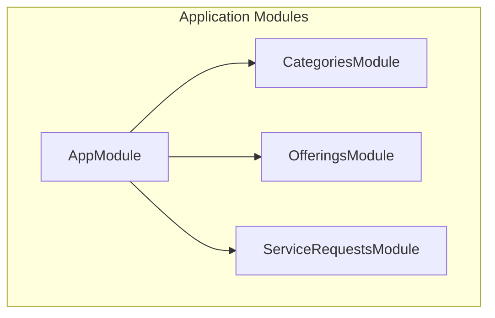
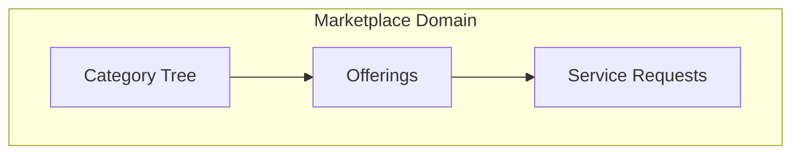
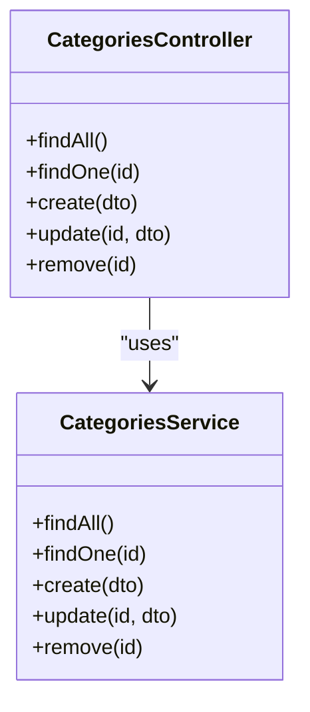
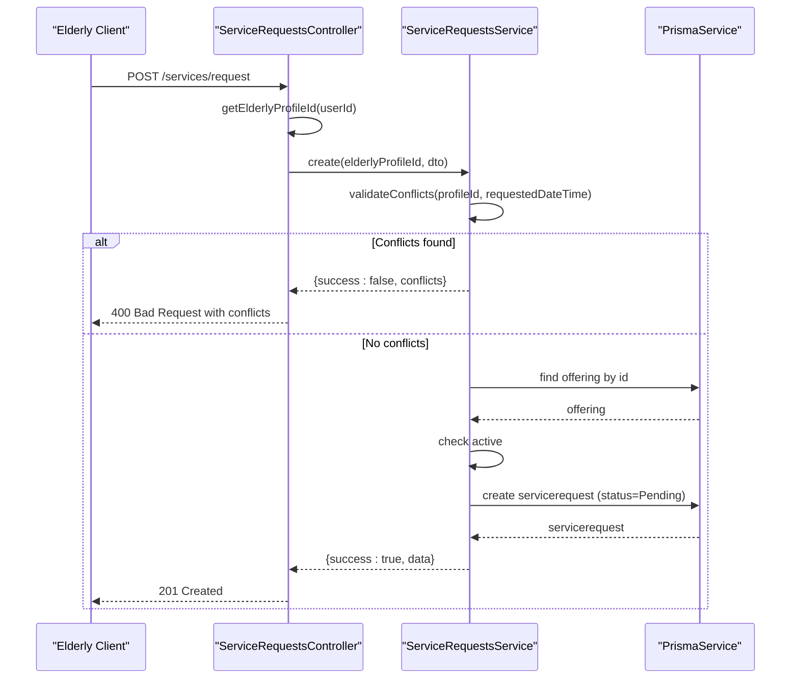
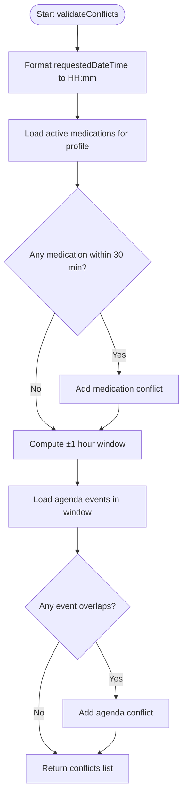
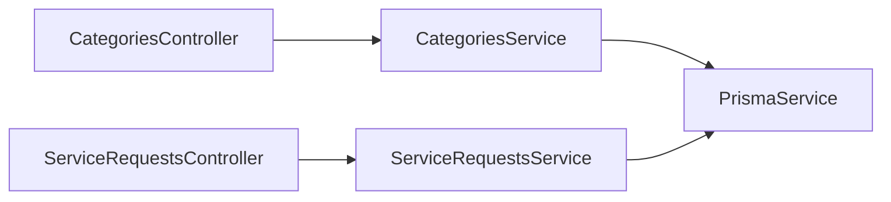
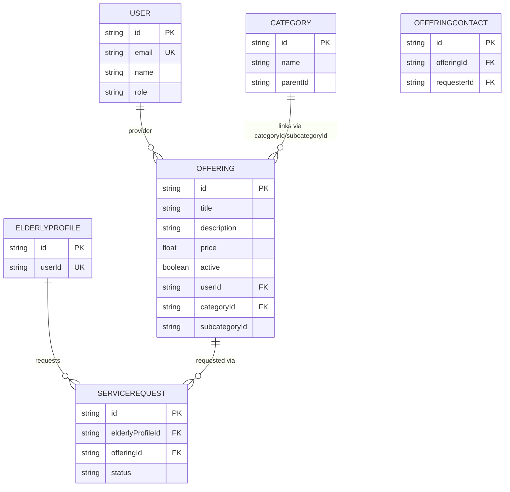

# Service Marketplace

<cite>
**Referenced Files in This Document**
- [app.module.ts](file://src/app.module.ts)
- [schema.prisma](file://prisma/schema.prisma)
- [categories.controller.ts](file://src/categories/categories.controller.ts)
- [categories.service.ts](file://src/categories/categories.service.ts)
- [create-category.dto.ts](file://src/categories/dto/create-category.dto.ts)
- [category-response.dto.ts](file://src/categories/dto/category-response.dto.ts)
- [service-requests.controller.ts](file://src/service-requests/service-requests.controller.ts)
- [service-requests.service.ts](file://src/service-requests/service-requests.service.ts)
- [create-service-request.dto.ts](file://src/service-requests/dto/create-service-request.dto.ts)
</cite>

## Table of Contents
1. [Introduction](#introduction)
2. [Project Structure](#project-structure)
3. [Core Components](#core-components)
4. [Architecture Overview](#architecture-overview)
5. [Detailed Component Analysis](#detailed-component-analysis)
6. [Dependency Analysis](#dependency-analysis)
7. [Performance Considerations](#performance-considerations)
8. [Troubleshooting Guide](#troubleshooting-guide)
9. [Conclusion](#conclusion)
10. [Appendices](#appendices)

## Introduction
This document describes the service marketplace system implemented in the backend. It focuses on three core areas:
- Category management with hierarchical relationships
- Service offerings with provider management
- Service requests with status tracking

It also documents the marketplace architecture, provider–client relationship dynamics, pricing systems, communication patterns, and APIs for marketplace operations, search and filtering, and transaction management. Administrative features and marketplace analytics are addressed conceptually.

## Project Structure
The application is organized as a NestJS monorepo with modularized features. The marketplace-related modules are:
- Categories: hierarchical taxonomy for services
- Offerings: provider-managed service listings
- Service Requests: client requests against offerings with status tracking

**Diagram sources**
- [app.module.ts:17-34](file://src/app.module.ts#L17-L34)

**Section sources**
- [app.module.ts:17-34](file://src/app.module.ts#L17-L34)

## Core Components
- Categories: manage a tree of categories and subcategories, admin-only create/update/delete
- Offerings: provider-owned service listings linked to categories/subcategories, with pricing and activity flag
- Service Requests: client requests against offerings, validated for conflicts and tracked via statuses

Key data model relationships:
- Category ↔ Category (hierarchical parent/child)
- Category → Offering (root category linkage)
- Category → Offering (subcategory linkage)
- User → Offering (provider)
- Offering → ServiceRequest (via offeringId)
- ElderlyProfile → ServiceRequest (via elderlyProfileId)

**Section sources**
- [schema.prisma:218-285](file://prisma/schema.prisma#L218-L285)

## Architecture Overview
The marketplace architecture centers around:
- Category navigation: root categories with nested subcategories
- Offering creation and management: providers create offerings linked to categories/subcategories, set pricing, and mark active/inactive
- Request processing: clients submit requests against offerings, validated for conflicts with medications and agenda events, then tracked with lifecycle statuses

**Diagram sources**
- [schema.prisma:218-285](file://prisma/schema.prisma#L218-L285)

## Detailed Component Analysis

### Category Management
- Responsibilities:
  - List root categories with nested subcategories
  - Retrieve a category by ID with parent and children
  - Create categories with optional parent
  - Update category name or parent
  - Delete categories after validating no subcategories or offerings reference them
- Validation and constraints:
  - Prevent circular parent references
  - Enforce existence of parent when provided
  - Block deletion if subcategories or offerings exist under the category

**Diagram sources**
- [categories.controller.ts:32-114](file://src/categories/categories.controller.ts#L32-L114)
- [categories.service.ts:14-179](file://src/categories/categories.service.ts#L14-L179)

**Section sources**
- [categories.controller.ts:35-114](file://src/categories/categories.controller.ts#L35-L114)
- [categories.service.ts:22-178](file://src/categories/categories.service.ts#L22-L178)
- [create-category.dto.ts:4-34](file://src/categories/dto/create-category.dto.ts#L4-L34)
- [category-response.dto.ts:3-40](file://src/categories/dto/category-response.dto.ts#L3-L40)

### Service Offerings
- Provider management:
  - Offerings belong to Users (providers) and are linked to Category and optional Subcategory
  - Offerings include title, description, image, price, and active flag
- Pricing system:
  - Price is stored as a decimal value per offering
- Activity control:
  - Offerings can be activated/deactivated; requests require active offerings

Note: The current codebase does not expose explicit CRUD endpoints for offerings. The OfferingsModule exists but lacks controller/service files in the provided context. The data model supports provider–offering relationships and pricing.

**Section sources**
- [schema.prisma:231-252](file://prisma/schema.prisma#L231-L252)

### Service Requests
- Lifecycle and statuses:
  - Pending, Accepted, Rejected, Completed, Cancelled
- Conflict validation:
  - Validates against medication schedules (30-minute window)
  - Validates against agenda events (±1 hour window)
- Request creation:
  - Requires a valid, active offering
  - Optionally accepts a preferred date/time
  - Notes field supported
- Access control:
  - Only elderly users can create/list/cancel requests
  - Cancellation restricted to pending status and ownership

**Diagram sources**
- [service-requests.controller.ts:51-66](file://src/service-requests/service-requests.controller.ts#L51-L66)
- [service-requests.service.ts:117-178](file://src/service-requests/service-requests.service.ts#L117-L178)

**Section sources**
- [service-requests.controller.ts:51-94](file://src/service-requests/service-requests.controller.ts#L51-L94)
- [service-requests.service.ts:63-230](file://src/service-requests/service-requests.service.ts#L63-L230)
- [create-service-request.dto.ts:4-18](file://src/service-requests/dto/create-service-request.dto.ts#L4-L18)

### Conflict Validation Logic

**Diagram sources**
- [service-requests.service.ts:63-112](file://src/service-requests/service-requests.service.ts#L63-L112)

## Dependency Analysis
- AppModule aggregates all modules, including Categories, Offerings, and Service Requests
- CategoriesService depends on PrismaService for database operations
- ServiceRequestsService depends on PrismaService for reading offerings, medications, and agenda events, and for creating requests
- DTOs define request/response shapes for Swagger/OpenAPI documentation

**Diagram sources**
- [app.module.ts:17-34](file://src/app.module.ts#L17-L34)
- [categories.controller.ts:32-33](file://src/categories/categories.controller.ts#L32-L33)
- [service-requests.controller.ts:30-34](file://src/service-requests/service-requests.controller.ts#L30-L34)
- [categories.service.ts:17](file://src/categories/categories.service.ts#L17)
- [service-requests.service.ts:27](file://src/service-requests/service-requests.service.ts#L27)

**Section sources**
- [app.module.ts:17-34](file://src/app.module.ts#L17-L34)

## Performance Considerations
- Category retrieval uses ordered queries and nested includes; consider pagination for deep hierarchies
- Conflict checks scan active medications and agenda events within windows; ensure appropriate indexes are present
- Service request creation validates offering existence and activity; caching may reduce repeated lookups if needed
- Use database indexes on frequently queried fields (e.g., category indices, offering indices, service request status index)

## Troubleshooting Guide
- Category deletion fails:
  - Cause: Category has subcategories or offerings referencing it
  - Resolution: Remove or reassign subcategories and offerings before deletion
- Category update fails:
  - Cause: Parent category not found or circular reference detected
  - Resolution: Ensure parent exists and avoid setting a category as its own parent
- Service request creation fails:
  - Cause: Offering not found or inactive
  - Resolution: Verify offering exists and is active
- Conflict errors during request creation:
  - Cause: Overlap with medication or agenda event
  - Resolution: Adjust requested time or reschedule conflicting items
- Cancellation errors:
  - Cause: Not pending or not owned by the requesting elderly profile
  - Resolution: Only cancel pending requests owned by the user

**Section sources**
- [categories.service.ts:157-171](file://src/categories/categories.service.ts#L157-L171)
- [categories.service.ts:108-122](file://src/categories/categories.service.ts#L108-L122)
- [service-requests.service.ts:149-157](file://src/service-requests/service-requests.service.ts#L149-L157)
- [service-requests.service.ts:133-142](file://src/service-requests/service-requests.service.ts#L133-L142)
- [service-requests.controller.ts:90-93](file://src/service-requests/service-requests.controller.ts#L90-L93)

## Conclusion
The marketplace system provides a structured foundation for category-driven service discovery, provider-managed offerings with pricing, and robust request lifecycle management with conflict-aware validation. While the OfferingsModule exists in the schema and module graph, the current codebase snapshot does not include its controller/service files. Administrators can manage categories, while providers and elderly users interact with offerings and requests respectively.

## Appendices

### API Reference: Categories
- List root categories with nested subcategories
  - Method: GET
  - Path: /categories
  - Auth: None
  - Responses: 200 OK with array of categories
- Get a category by ID (includes parent and children)
  - Method: GET
  - Path: /categories/{id}
  - Auth: None
  - Responses: 200 OK or 404 Not Found
- Create a category (admin only)
  - Method: POST
  - Path: /categories
  - Auth: JWT + admin role
  - Body: CreateCategoryDto
  - Responses: 201 Created or 400/401/403/404
- Update a category (admin only)
  - Method: PATCH
  - Path: /categories/{id}
  - Auth: JWT + admin role
  - Body: UpdateCategoryDto
  - Responses: 200 OK or 400/401/403/404
- Delete a category (admin only)
  - Method: DELETE
  - Path: /categories/{id}
  - Auth: JWT + admin role
  - Responses: 200 OK or 400/401/403/404

**Section sources**
- [categories.controller.ts:35-114](file://src/categories/categories.controller.ts#L35-L114)
- [create-category.dto.ts:4-34](file://src/categories/dto/create-category.dto.ts#L4-L34)
- [category-response.dto.ts:3-40](file://src/categories/dto/category-response.dto.ts#L3-L40)

### API Reference: Service Requests
- Create a service request
  - Method: POST
  - Path: /services/request
  - Auth: JWT + elderly role
  - Body: CreateServiceRequestDto
  - Responses: 201 Created with request or 400/404
- List my service requests
  - Method: GET
  - Path: /services/my-requests
  - Auth: JWT + elderly role
  - Responses: 200 OK with items
- Cancel a service request
  - Method: PATCH
  - Path: /services/requests/{id}/cancel
  - Auth: JWT + elderly role
  - Responses: 200 OK or 400/403/404

**Section sources**
- [service-requests.controller.ts:51-94](file://src/service-requests/service-requests.controller.ts#L51-L94)
- [create-service-request.dto.ts:4-18](file://src/service-requests/dto/create-service-request.dto.ts#L4-L18)

### Data Model Overview

**Diagram sources**
- [schema.prisma:47-65](file://prisma/schema.prisma#L47-L65)
- [schema.prisma:71-96](file://prisma/schema.prisma#L71-L96)
- [schema.prisma:218-229](file://prisma/schema.prisma#L218-L229)
- [schema.prisma:231-252](file://prisma/schema.prisma#L231-L252)
- [schema.prisma:254-265](file://prisma/schema.prisma#L254-L265)
- [schema.prisma:271-285](file://prisma/schema.prisma#L271-L285)