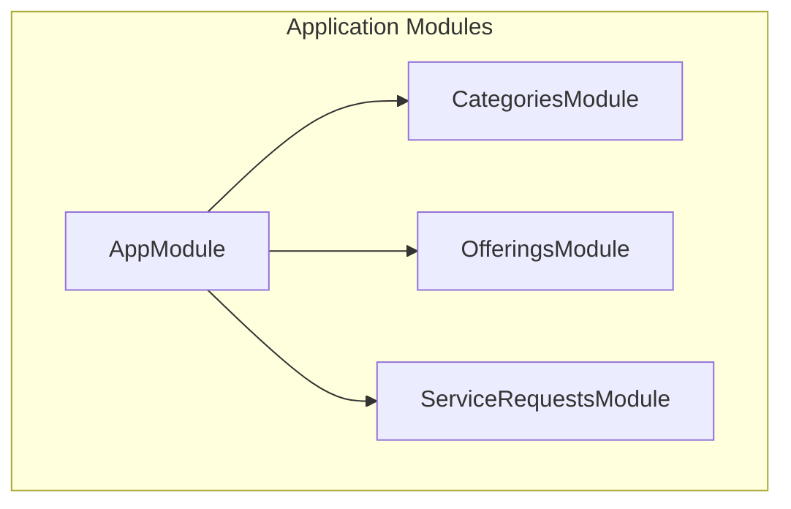
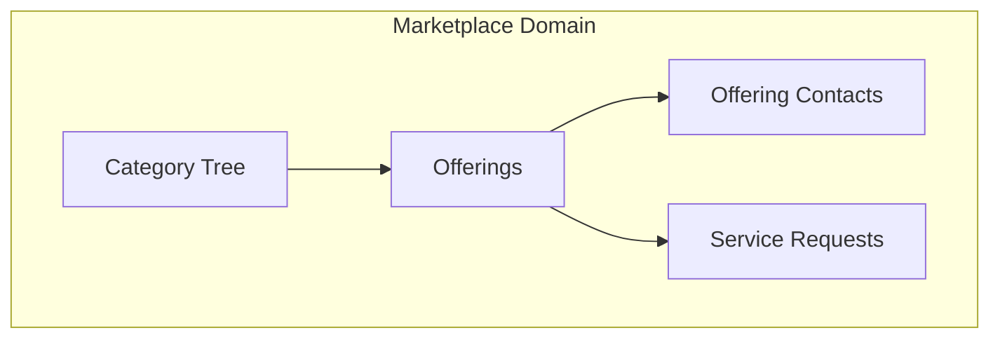
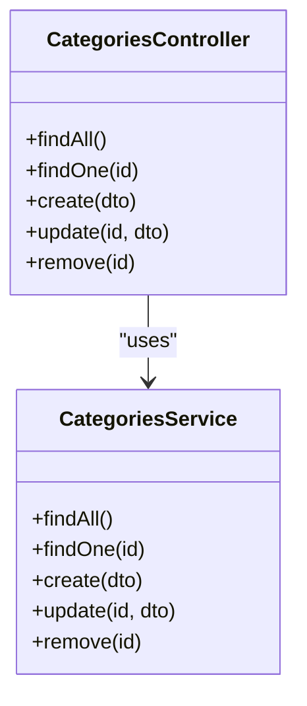
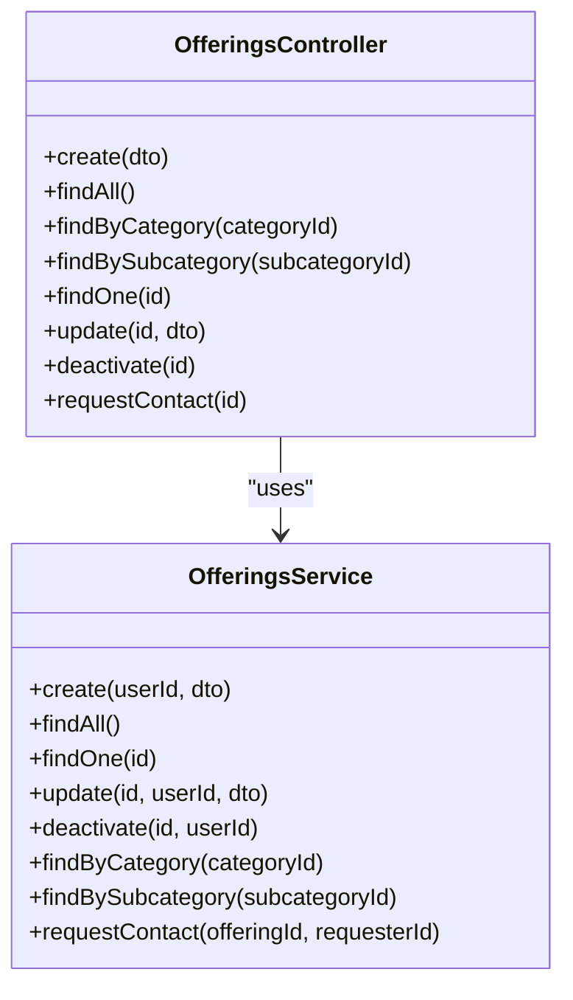
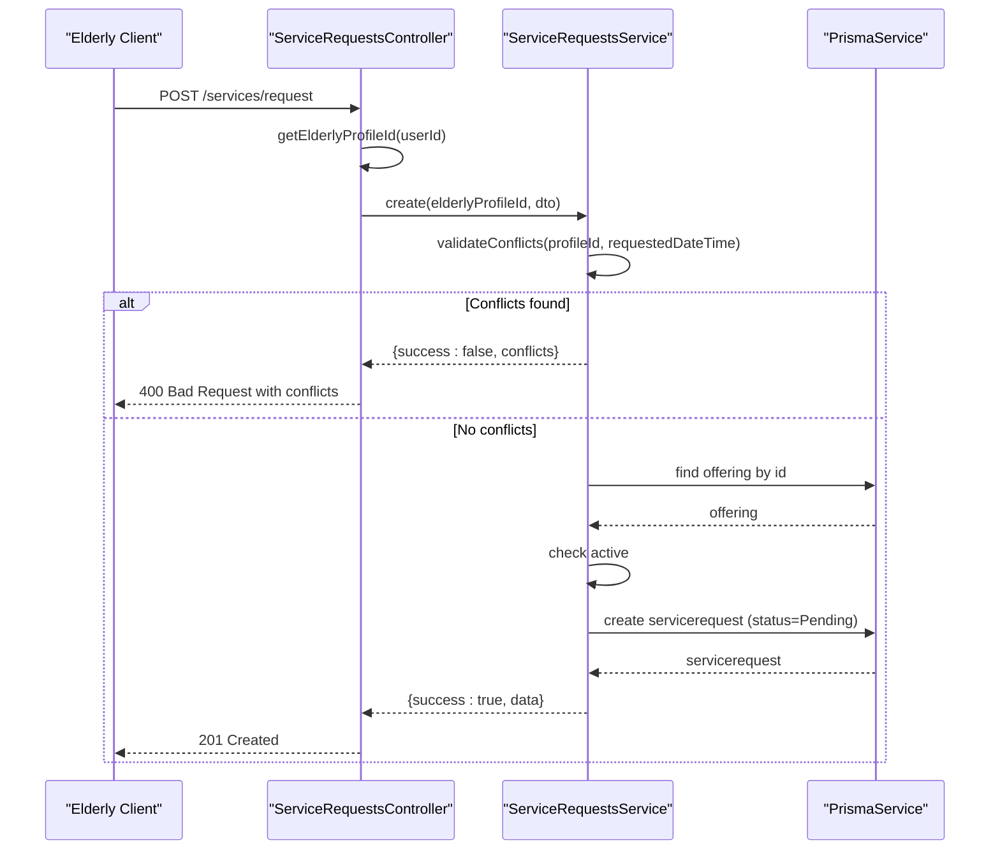
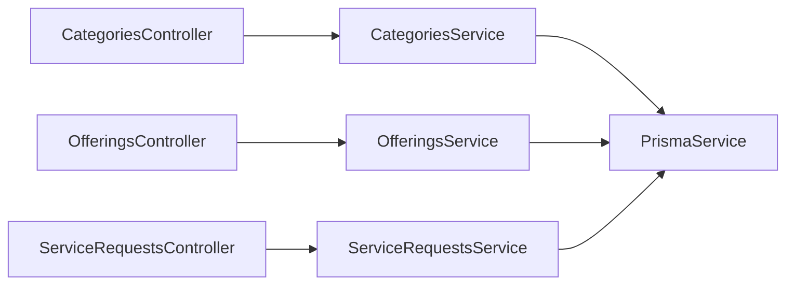
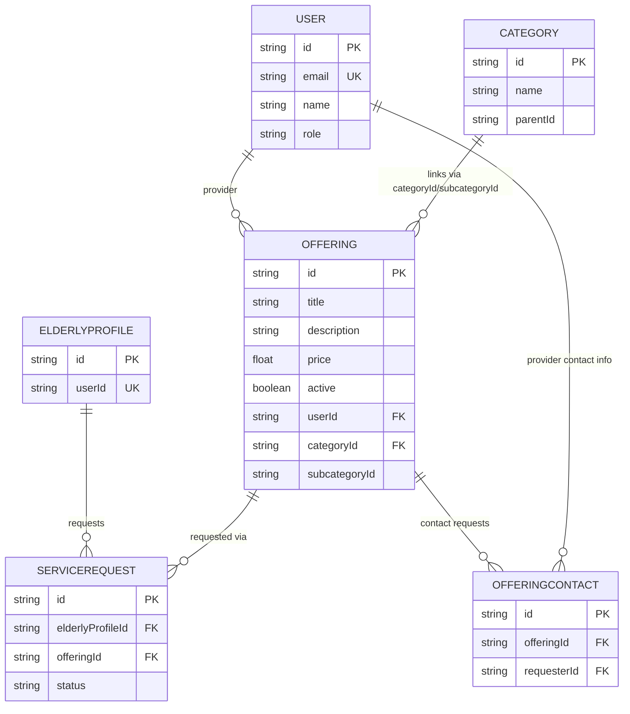

# Service Marketplace

<cite>
**Referenced Files in This Document**
- [app.module.ts](file://src/app.module.ts)
- [schema.prisma](file://prisma/schema.prisma)
- [categories.controller.ts](file://src/categories/categories.controller.ts)
- [categories.service.ts](file://src/categories/categories.service.ts)
- [create-category.dto.ts](file://src/categories/dto/create-category.dto.ts)
- [category-response.dto.ts](file://src/categories/dto/category-response.dto.ts)
- [offerings.controller.ts](file://src/offerings/offerings.controller.ts)
- [offerings.service.ts](file://src/offerings/offerings.service.ts)
- [create-offering.dto.ts](file://src/offerings/dto/create-offering.dto.ts)
- [offering-response.dto.ts](file://src/offerings/dto/offering-response.dto.ts)
- [offering-contact-response.dto.ts](file://src/offerings/dto/offering-contact-response.dto.ts)
- [service-requests.controller.ts](file://src/service-requests/service-requests.controller.ts)
- [service-requests.service.ts](file://src/service-requests/service-requests.service.ts)
- [create-service-request.dto.ts](file://src/service-requests/dto/create-service-request.dto.ts)
</cite>

## Update Summary
**Changes Made**
- Added comprehensive documentation for the Offerings module with provider management capabilities
- Enhanced Service Requests documentation with detailed conflict validation logic
- Updated API reference sections with complete endpoint coverage
- Expanded data model documentation to include provider-offering relationships
- Added provider-client relationship dynamics and pricing system explanations
- Included administrative features and marketplace analytics concepts

## Table of Contents
1. [Introduction](#introduction)
2. [Project Structure](#project-structure)
3. [Core Components](#core-components)
4. [Architecture Overview](#architecture-overview)
5. [Detailed Component Analysis](#detailed-component-analysis)
6. [Dependency Analysis](#dependency-analysis)
7. [Performance Considerations](#performance-considerations)
8. [Troubleshooting Guide](#troubleshooting-guide)
9. [Conclusion](#conclusion)
10. [Appendices](#appendices)

## Introduction
This document describes the service marketplace system implemented in the backend. It focuses on four core areas:
- Category management with hierarchical relationships
- Service offerings with provider management and contact sharing
- Service requests with status tracking and conflict validation
- Provider-client relationship dynamics with pricing systems

The marketplace architecture supports category-driven service discovery, provider-managed offerings with pricing, robust request lifecycle management with conflict-aware validation, and administrative oversight capabilities.

## Project Structure
The application is organized as a NestJS monorepo with modularized features. The marketplace-related modules are:
- Categories: hierarchical taxonomy for services
- Offerings: provider-managed service listings with contact sharing
- Service Requests: client requests against offerings with status tracking and conflict validation

**Diagram sources**
- [app.module.ts:21-39](file://src/app.module.ts#L21-L39)

**Section sources**
- [app.module.ts:21-39](file://src/app.module.ts#L21-L39)

## Core Components
- Categories: manage a tree of categories and subcategories, admin-only create/update/delete
- Offerings: provider-owned service listings linked to categories/subcategories, with pricing, activity flag, and contact sharing
- Service Requests: client requests against offerings, validated for conflicts and tracked via statuses
- Provider-Client Relationships: structured interactions through offering contact requests and service lifecycle

Key data model relationships:
- Category ↔ Category (hierarchical parent/child)
- Category → Offering (root category linkage)
- Category → Offering (subcategory linkage)
- User → Offering (provider relationship)
- Offering → OfferingContact (contact sharing mechanism)
- Offering → ServiceRequest (via offeringId)
- ElderlyProfile → ServiceRequest (via elderlyProfileId)

**Section sources**
- [schema.prisma:164-223](file://prisma/schema.prisma#L164-L223)

## Architecture Overview
The marketplace architecture centers around:
- Category navigation: root categories with nested subcategories for service discovery
- Offering creation and management: providers create offerings linked to categories/subcategories, set pricing, and manage activity status
- Contact sharing: secure provider-client communication through controlled contact requests
- Request processing: clients submit requests against offerings, validated for conflicts with medications and agenda events, then tracked with lifecycle statuses

**Diagram sources**
- [schema.prisma:164-223](file://prisma/schema.prisma#L164-L223)

## Detailed Component Analysis

### Category Management
- Responsibilities:
  - List root categories with nested subcategories
  - Retrieve a category by ID with parent and children
  - Create categories with optional parent
  - Update category name or parent
  - Delete categories after validating no subcategories or offerings reference them
- Validation and constraints:
  - Prevent circular parent references
  - Enforce existence of parent when provided
  - Block deletion if subcategories or offerings exist under the category

**Diagram sources**
- [categories.controller.ts:32-114](file://src/categories/categories.controller.ts#L32-L114)
- [categories.service.ts:14-179](file://src/categories/categories.service.ts#L14-L179)

**Section sources**
- [categories.controller.ts:35-114](file://src/categories/categories.controller.ts#L35-L114)
- [categories.service.ts:22-178](file://src/categories/categories.service.ts#L22-L178)
- [create-category.dto.ts:4-34](file://src/categories/dto/create-category.dto.ts#L4-L34)
- [category-response.dto.ts:3-40](file://src/categories/dto/category-response.dto.ts#L3-L40)

### Service Offerings
- Provider management:
  - Offerings belong to Users (providers) and are linked to Category and optional Subcategory
  - Offerings include title, description, image, price, and active flag
  - Providers can create, update, and deactivate their own offerings
- Pricing system:
  - Price is stored as a decimal value per offering and converted to number for responses
- Activity control:
  - Offerings can be activated/deactivated; requests require active offerings
- Contact sharing:
  - Clients can request provider contact information through controlled contact requests
  - Providers receive notifications for contact requests
  - Contact requests prevent self-contact scenarios

**Diagram sources**
- [offerings.controller.ts:31-172](file://src/offerings/offerings.controller.ts#L31-L172)
- [offerings.service.ts:62-516](file://src/offerings/offerings.service.ts#L62-L516)

**Section sources**
- [offerings.controller.ts:35-172](file://src/offerings/offerings.controller.ts#L35-L172)
- [offerings.service.ts:70-516](file://src/offerings/offerings.service.ts#L70-L516)
- [create-offering.dto.ts:4-31](file://src/offerings/dto/create-offering.dto.ts#L4-L31)
- [offering-response.dto.ts:25-58](file://src/offerings/dto/offering-response.dto.ts#L25-L58)
- [offering-contact-response.dto.ts:34-46](file://src/offerings/dto/offering-contact-response.dto.ts#L34-L46)

### Service Requests
- Lifecycle and statuses:
  - Pending, Accepted, Rejected, Completed, Cancelled
- Conflict validation:
  - Validates against medication schedules (30-minute window)
  - Validates against agenda events (±1 hour window)
  - Returns detailed conflict information for client feedback
- Request creation:
  - Requires a valid, active offering
  - Optionally accepts a preferred date/time
  - Notes field supported
- Access control:
  - Only elderly users can create/list/cancel requests
  - Cancellation restricted to pending status and ownership

**Diagram sources**
- [service-requests.controller.ts:51-66](file://src/service-requests/service-requests.controller.ts#L51-L66)
- [service-requests.service.ts:117-178](file://src/service-requests/service-requests.service.ts#L117-L178)

**Section sources**
- [service-requests.controller.ts:51-94](file://src/service-requests/service-requests.controller.ts#L51-L94)
- [service-requests.service.ts:63-232](file://src/service-requests/service-requests.service.ts#L63-L232)
- [create-service-request.dto.ts:4-18](file://src/service-requests/dto/create-service-request.dto.ts#L4-L18)

### Conflict Validation Logic

**Diagram sources**
- [service-requests.service.ts:63-112](file://src/service-requests/service-requests.service.ts#L63-L112)

## Dependency Analysis
- AppModule aggregates all modules, including Categories, Offerings, and Service Requests
- CategoriesService depends on PrismaService for database operations
- OfferingsService depends on PrismaService for offering, category, and contact operations
- ServiceRequestsService depends on PrismaService for reading offerings, medications, and agenda events, and for creating requests
- DTOs define request/response shapes for Swagger/OpenAPI documentation across all modules

**Diagram sources**
- [app.module.ts:21-39](file://src/app.module.ts#L21-L39)
- [categories.controller.ts:32-33](file://src/categories/categories.controller.ts#L32-L33)
- [offerings.controller.ts:31-33](file://src/offerings/offerings.controller.ts#L31-L33)
- [service-requests.controller.ts:30-34](file://src/service-requests/service-requests.controller.ts#L30-L34)
- [categories.service.ts:17](file://src/categories/categories.service.ts#L17)
- [offerings.service.ts:65](file://src/offerings/offerings.service.ts#L65)
- [service-requests.service.ts:27](file://src/service-requests/service-requests.service.ts#L27)

**Section sources**
- [app.module.ts:21-39](file://src/app.module.ts#L21-L39)

## Performance Considerations
- Category retrieval uses ordered queries and nested includes; consider pagination for deep hierarchies
- Offering queries include user and category relations; ensure appropriate indexes are present
- Conflict checks scan active medications and agenda events within windows; ensure proper indexing
- Service request creation validates offering existence and activity; caching may reduce repeated lookups
- Contact request operations should be optimized with proper indexing on offeringId and requesterId
- Use database indexes on frequently queried fields (category indices, offering indices, service request status index)

## Troubleshooting Guide
- Category deletion fails:
  - Cause: Category has subcategories or offerings referencing it
  - Resolution: Remove or reassign subcategories and offerings before deletion
- Category update fails:
  - Cause: Parent category not found or circular reference detected
  - Resolution: Ensure parent exists and avoid setting a category as its own parent
- Offering creation fails:
  - Cause: Invalid category/subcategory IDs or mismatched parent-child relationships
  - Resolution: Verify category hierarchy and ensure subcategory belongs to specified category
- Offering update fails:
  - Cause: Non-owner attempting to update or invalid category/subcategory changes
  - Resolution: Ensure ownership and proper category relationships
- Contact request fails:
  - Cause: Inactive offering, self-contact attempt, or non-existent offering
  - Resolution: Verify offering is active and requester is different from provider
- Service request creation fails:
  - Cause: Offering not found or inactive, or conflicts with medications/agenda
  - Resolution: Verify offering exists and is active, adjust timing to avoid conflicts
- Cancellation errors:
  - Cause: Not pending or not owned by the requesting elderly profile
  - Resolution: Only cancel pending requests owned by the user

**Section sources**
- [categories.service.ts:157-171](file://src/categories/categories.service.ts#L157-L171)
- [categories.service.ts:108-122](file://src/categories/categories.service.ts#L108-L122)
- [offerings.service.ts:87-104](file://src/offerings/offerings.service.ts#L87-L104)
- [offerings.service.ts:239-241](file://src/offerings/offerings.service.ts#L239-L241)
- [offerings.service.ts:459-463](file://src/offerings/offerings.service.ts#L459-L463)
- [service-requests.service.ts:149-157](file://src/service-requests/service-requests.service.ts#L149-L157)
- [service-requests.service.ts:133-142](file://src/service-requests/service-requests.service.ts#L133-L142)
- [service-requests.controller.ts:90-93](file://src/service-requests/service-requests.controller.ts#L90-L93)

## Conclusion
The marketplace system provides a comprehensive foundation for category-driven service discovery, provider-managed offerings with pricing and contact sharing, robust request lifecycle management with conflict-aware validation, and structured provider-client relationship dynamics. The system supports administrative oversight through category management and comprehensive analytics through service request tracking and contact sharing metrics.

## Appendices

### API Reference: Categories
- List root categories with nested subcategories
  - Method: GET
  - Path: /categories
  - Auth: None
  - Responses: 200 OK with array of categories
- Get a category by ID (includes parent and children)
  - Method: GET
  - Path: /categories/{id}
  - Auth: None
  - Responses: 200 OK or 404 Not Found
- Create a category (admin only)
  - Method: POST
  - Path: /categories
  - Auth: JWT + admin role
  - Body: CreateCategoryDto
  - Responses: 201 Created or 400/401/403/404
- Update a category (admin only)
  - Method: PATCH
  - Path: /categories/{id}
  - Auth: JWT + admin role
  - Body: UpdateCategoryDto
  - Responses: 200 OK or 400/401/403/404
- Delete a category (admin only)
  - Method: DELETE
  - Path: /categories/{id}
  - Auth: JWT + admin role
  - Responses: 200 OK or 400/401/403/404

**Section sources**
- [categories.controller.ts:35-114](file://src/categories/categories.controller.ts#L35-L114)
- [create-category.dto.ts:4-34](file://src/categories/dto/create-category.dto.ts#L4-L34)
- [category-response.dto.ts:3-40](file://src/categories/dto/category-response.dto.ts#L3-L40)

### API Reference: Offerings
- Create a new offering (provider or admin only)
  - Method: POST
  - Path: /offerings
  - Auth: JWT + provider/admin role
  - Body: CreateOfferingDto
  - Responses: 201 Created or 400/401/403/404
- List all active offerings (public)
  - Method: GET
  - Path: /offerings
  - Auth: None
  - Responses: 200 OK with array of offerings
- List offerings by category (public)
  - Method: GET
  - Path: /offerings/category/{categoryId}
  - Auth: None
  - Responses: 200 OK with array of offerings
- List offerings by subcategory (public)
  - Method: GET
  - Path: /offerings/subcategory/{subcategoryId}
  - Auth: None
  - Responses: 200 OK with array of offerings
- Get offering details (public)
  - Method: GET
  - Path: /offerings/{id}
  - Auth: None
  - Responses: 200 OK or 404 Not Found
- Update an offering (owner only)
  - Method: PATCH
  - Path: /offerings/{id}
  - Auth: JWT
  - Body: UpdateOfferingDto
  - Responses: 200 OK or 400/401/403/404
- Deactivate an offering (owner only)
  - Method: DELETE
  - Path: /offerings/{id}
  - Auth: JWT
  - Responses: 200 OK or 400/401/403/404
- Request contact information for an offering
  - Method: POST
  - Path: /offerings/{id}/contact-data
  - Auth: JWT
  - Responses: 201 Created or 400/401/404

**Section sources**
- [offerings.controller.ts:35-172](file://src/offerings/offerings.controller.ts#L35-L172)
- [create-offering.dto.ts:4-31](file://src/offerings/dto/create-offering.dto.ts#L4-L31)
- [offering-response.dto.ts:25-58](file://src/offerings/dto/offering-response.dto.ts#L25-L58)
- [offering-contact-response.dto.ts:34-46](file://src/offerings/dto/offering-contact-response.dto.ts#L34-L46)

### API Reference: Service Requests
- Create a service request
  - Method: POST
  - Path: /services/request
  - Auth: JWT + elderly role
  - Body: CreateServiceRequestDto
  - Responses: 201 Created with request or 400/404
- List my service requests
  - Method: GET
  - Path: /services/my-requests
  - Auth: JWT + elderly role
  - Responses: 200 OK with items
- Cancel a service request
  - Method: PATCH
  - Path: /services/requests/{id}/cancel
  - Auth: JWT + elderly role
  - Responses: 200 OK or 400/403/404

**Section sources**
- [service-requests.controller.ts:51-94](file://src/service-requests/service-requests.controller.ts#L51-L94)
- [create-service-request.dto.ts:4-18](file://src/service-requests/dto/create-service-request.dto.ts#L4-L18)

### Data Model Overview

**Diagram sources**
- [schema.prisma:11-28](file://prisma/schema.prisma#L11-L28)
- [schema.prisma:30-54](file://prisma/schema.prisma#L30-L54)
- [schema.prisma:164-174](file://prisma/schema.prisma#L164-L174)
- [schema.prisma:176-196](file://prisma/schema.prisma#L176-L196)
- [schema.prisma:198-208](file://prisma/schema.prisma#L198-L208)
- [schema.prisma:210-223](file://prisma/schema.prisma#L210-L223)