# Testing & Deployment

<cite>
**Referenced Files in This Document**
- [package.json](file://package.json)
- [jest-e2e.json](file://test/jest-e2e.json)
- [auth-health.e2e-spec.ts](file://test/auth-health.e2e-spec.ts)
- [elderly-caregiver.e2e-spec.ts](file://test/elderly-caregiver.e2e-spec.ts)
- [app.e2e-spec.ts](file://test/app.e2e-spec.ts)
- [main.ts](file://src/main.ts)
- [app.module.ts](file://src/app.module.ts)
- [health.controller.ts](file://src/health/health.controller.ts)
- [prisma.health.ts](file://src/health/prisma.health.ts)
- [health.module.ts](file://src/health/health.module.ts)
- [request-id.interceptor.ts](file://src/common/interceptors/request-id.interceptor.ts)
- [auth.service.ts](file://src/auth/auth.service.ts)
- [schema.prisma](file://prisma/schema.prisma)
- [seed.ts](file://prisma/seed.ts)
- [auth.module.ts](file://src/auth/auth.module.ts)
- [auth.service.ts](file://src/auth/auth.service.ts)
- [prisma.module.ts](file://src/prisma/prisma.module.ts)
- [prisma.service.ts](file://src/prisma/prisma.service.ts)
- [login.dto.ts](file://src/auth/dto/login.dto.ts)
- [README.md](file://README.md)
- [eslint.config.mjs](file://eslint.config.mjs)
- [tsconfig.build.json](file://tsconfig.build.json)
- [API_CONTRACTS.md](file://mobile-app/API_CONTRACTS.md)
- [COMPLETION_CHECKLIST.md](file://mobile-app/COMPLETION_CHECKLIST.md)
- [INTEGRATION_GUIDE.md](file://mobile-app/INTEGRATION_GUIDE.md)
- [FINAL_SUMMARY.md](file://mobile-app/FINAL_SUMMARY.md)
- [NAVIGATION_MAP.md](file://mobile-app/NAVIGATION_MAP.md)
- [TYPE_DEFINITIONS.md](file://mobile-app/TYPE_DEFINITIONS.md)
- [auth.test.tsx](file://mobile-app/__tests__/auth.test.tsx)
- [api.ts](file://mobile-app/src/services/api.ts)
- [authStorage.ts](file://mobile-app/src/lib/authStorage.ts)
- [AuthContext.tsx](file://mobile-app/src/contexts/AuthContext.tsx)
- [tsconfig.json](file://mobile-app/tsconfig.json)
- [app/_layout.tsx](file://mobile-app/app/_layout.tsx)
- [app/index.tsx](file://mobile-app/app/index.tsx)
- [SUPABASE_EXECUTION_PLAN.md](file://SUPABASE_EXECUTION_PLAN.md)
</cite>

## Update Summary
**Changes Made**
- Added comprehensive E2E test suites covering authentication flows, health checks, elderly care management, and caregiver integration
- Documented infrastructure improvements with completed SUPABASE execution plan tasks including security hardening and system security enhancements
- Enhanced testing strategy with role-based access patterns and comprehensive endpoint validation
- Updated security measures including rate limiting, helmet protection, and structured logging
- Integrated health check monitoring and request correlation capabilities

## Table of Contents
1. [Introduction](#introduction)
2. [Project Structure](#project-structure)
3. [Core Components](#core-components)
4. [Architecture Overview](#architecture-overview)
5. [Detailed Component Analysis](#detailed-component-analysis)
6. [Enhanced E2E Testing Infrastructure](#enhanced-e2e-testing-infrastructure)
7. [Mobile App Testing Infrastructure](#mobile-app-testing-infrastructure)
8. [API Contract Testing](#api-contract-testing)
9. [Completion and Verification](#completion-and-verification)
10. [Deployment Procedures](#deployment-procedures)
11. [Infrastructure Security Hardening](#infrastructure-security-hardening)
12. [Dependency Analysis](#dependency-analysis)
13. [Performance Considerations](#performance-considerations)
14. [Troubleshooting Guide](#troubleshooting-guide)
15. [Conclusion](#conclusion)
16. [Appendices](#appendices)

## Introduction
This document provides comprehensive testing and deployment guidance for the 99-Pai platform, encompassing both the NestJS backend and the React Native mobile application. The platform now features enhanced security infrastructure, comprehensive E2E test suites, and robust monitoring capabilities. It covers unit testing with Jest, integration and end-to-end testing strategies, mobile app testing infrastructure, API contract validation, completion verification procedures, environment setup, database seeding and migrations, containerization options, production readiness, CI/CD considerations, monitoring and logging, troubleshooting, security, and backup/recovery procedures.

## Project Structure
The project follows a dual-platform architecture with a NestJS modular backend and a React Native mobile application built with Expo. Testing is organized across both platforms with Jest configuration for unit and e2e tests, comprehensive API contract documentation, and mobile-specific testing infrastructure. The backend now includes enhanced security measures including rate limiting, helmet protection, structured logging, and health monitoring.

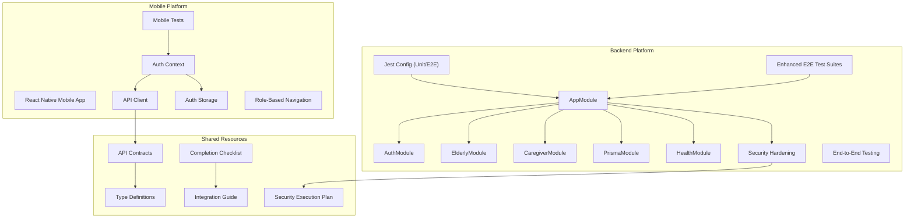

**Diagram sources**
- [app.module.ts:17-46](file://src/app.module.ts#L17-L46)
- [auth.module.ts:10-27](file://src/auth/auth.module.ts#L10-L27)
- [health.module.ts:1-13](file://src/health/health.module.ts#L1-L13)
- [prisma.module.ts:4-9](file://src/prisma/prisma.module.ts#L4-L9)
- [package.json:71-87](file://package.json#L71-L87)
- [auth-health.e2e-spec.ts:11-327](file://test/auth-health.e2e-spec.ts#L11-L327)
- [elderly-caregiver.e2e-spec.ts:11-334](file://test/elderly-caregiver.e2e-spec.ts#L11-L334)
- [SUPABASE_EXECUTION_PLAN.md:9-24](file://SUPABASE_EXECUTION_PLAN.md#L9-L24)
- [AuthContext.tsx:29-177](file://mobile-app/src/contexts/AuthContext.tsx#L29-L177)
- [api.ts:11-44](file://mobile-app/src/services/api.ts#L11-L44)
- [authStorage.ts:7-45](file://mobile-app/src/lib/authStorage.ts#L7-L45)
- [API_CONTRACTS.md:1-520](file://mobile-app/API_CONTRACTS.md#L1-L520)
- [TYPE_DEFINITIONS.md:1-369](file://mobile-app/TYPE_DEFINITIONS.md#L1-L369)
- [COMPLETION_CHECKLIST.md:1-244](file://mobile-app/COMPLETION_CHECKLIST.md#L1-L244)
- [INTEGRATION_GUIDE.md:1-262](file://mobile-app/INTEGRATION_GUIDE.md#L1-L262)

**Section sources**
- [app.module.ts:17-46](file://src/app.module.ts#L17-L46)
- [package.json:71-87](file://package.json#L71-L87)
- [auth-health.e2e-spec.ts:11-327](file://test/auth-health.e2e-spec.ts#L11-L327)
- [elderly-caregiver.e2e-spec.ts:11-334](file://test/elderly-caregiver.e2e-spec.ts#L11-L334)
- [schema.prisma:1-286](file://prisma/schema.prisma#L1-L286)
- [seed.ts:16-365](file://prisma/seed.ts#L16-L365)
- [AuthContext.tsx:29-177](file://mobile-app/src/contexts/AuthContext.tsx#L29-L177)
- [api.ts:11-44](file://mobile-app/src/services/api.ts#L11-L44)
- [authStorage.ts:7-45](file://mobile-app/src/lib/authStorage.ts#L7-L45)
- [API_CONTRACTS.md:1-520](file://mobile-app/API_CONTRACTS.md#L1-L520)
- [TYPE_DEFINITIONS.md:1-369](file://mobile-app/TYPE_DEFINITIONS.md#L1-L369)
- [COMPLETION_CHECKLIST.md:1-244](file://mobile-app/COMPLETION_CHECKLIST.md#L1-L244)
- [INTEGRATION_GUIDE.md:1-262](file://mobile-app/INTEGRATION_GUIDE.md#L1-L262)
- [SUPABASE_EXECUTION_PLAN.md:9-24](file://SUPABASE_EXECUTION_PLAN.md#L9-L24)

## Core Components
- **Backend**: Application bootstrap initializes global prefix, CORS, validation pipes, Swagger documentation, and enhanced security measures including helmet protection and rate limiting. Central AppModule aggregates all domain modules, the Prisma module, and the Health module.
- **Mobile App**: React Native application with Expo Router for navigation, JWT-based authentication, and role-specific dashboards.
- **Testing Infrastructure**: Jest configuration for both backend and mobile app, comprehensive API contract validation, and enhanced E2E test suites covering authentication flows, health checks, elderly care management, and caregiver integration.
- **Security Infrastructure**: Rate limiting via @nestjs/throttler, helmet protection, structured logging with request correlation, and comprehensive health monitoring.
- **API Layer**: RESTful API with JWT authentication, role-based access control, comprehensive endpoint documentation, and health check monitoring.

Key behaviors:
- Backend: Global prefix: api, CORS enabled with credentials, ValidationPipe configured with transformation and whitelisting, Swagger UI exposed at docs, helmet protection enabled, rate limiting configured (60 requests per minute)
- Mobile: Auth context manages JWT token lifecycle, AsyncStorage handles session persistence, role-based navigation with automatic redirection
- Testing: Comprehensive coverage for both platforms, API contract validation, completion verification, and extensive E2E test suites
- Security: Structured logging via NestJS Logger, request correlation with x-request-id, crypto-safe link code generation, database health monitoring

**Section sources**
- [main.ts:6-56](file://src/main.ts#L6-L56)
- [app.module.ts:17-46](file://src/app.module.ts#L17-L46)
- [AuthContext.tsx:29-177](file://mobile-app/src/contexts/AuthContext.tsx#L29-L177)
- [api.ts:11-44](file://mobile-app/src/services/api.ts#L11-L44)
- [authStorage.ts:7-45](file://mobile-app/src/lib/authStorage.ts#L7-L45)
- [app/_layout.tsx:12-61](file://mobile-app/app/_layout.tsx#L12-L61)
- [app/index.tsx:5-33](file://mobile-app/app/index.tsx#L5-L33)
- [health.controller.ts:1-20](file://src/health/health.controller.ts#L1-L20)
- [request-id.interceptor.ts:1-59](file://src/common/interceptors/request-id.interceptor.ts#L1-L59)
- [auth.service.ts:165-173](file://src/auth/auth.service.ts#L165-L173)

## Architecture Overview
The testing and deployment architecture centers around dual-platform testing with enhanced security infrastructure, comprehensive E2E test suites, and mobile app testing infrastructure.

```mermaid
graph TB
subgraph "Backend Runtime"
Bootstrap["Bootstrap (main.ts)"]
Swagger["Swagger Setup"]
CORS["CORS Enabled"]
Pipe["Validation Pipe"]
Helmet["Helmet Protection"]
Throttler["Rate Limiting"]
RequestId["Request ID Interceptor"]
end
subgraph "Backend Modules"
Auth["AuthModule"]
Elderly["ElderlyModule"]
Caregiver["CaregiverModule"]
Prisma["PrismaModule"]
Health["HealthModule"]
end
subgraph "Backend Tests"
Unit["Jest Unit Tests"]
E2E["Enhanced Jest E2E Tests"]
AuthHealthSuite["Auth & Health E2E Suite"]
ElderlyCaregiverSuite["Elderly & Caregiver E2E Suite"]
APIValidation["API Contract Tests"]
end
subgraph "Mobile Runtime"
MobileBootstrap["Mobile Bootstrap"]
AuthProvider["Auth Context"]
Navigation["Role-Based Navigation"]
end
subgraph "Mobile Tests"
MobileUnit["Mobile Unit Tests"]
MobileIntegration["Mobile Integration Tests"]
AuthTests["Authentication Tests"]
NavigationTests["Navigation Tests"]
end
subgraph "Security Infrastructure"
SecurityHardening["Security Hardening"]
HealthMonitoring["Health Monitoring"]
Logging["Structured Logging"]
SecurityPlan["Supabase Security Plan"]
end
Bootstrap --> Swagger
Bootstrap --> CORS
Bootstrap --> Pipe
Bootstrap --> Helmet
Bootstrap --> Throttler
Bootstrap --> RequestId
Bootstrap --> Auth
Bootstrap --> Elderly
Bootstrap --> Caregiver
Bootstrap --> Prisma
Bootstrap --> Health
SecurityHardening --> SecurityPlan
Unit --> Auth
Unit --> Elderly
Unit --> Caregiver
Unit --> Prisma
Unit --> Health
E2E --> Bootstrap
AuthHealthSuite --> Auth
AuthHealthSuite --> Health
ElderlyCaregiverSuite --> Elderly
ElderlyCaregiverSuite --> Caregiver
ElderlyCaregiverSuite --> Auth
APIValidation --> APIContracts
AuthProvider --> AuthTests
Navigation --> NavigationTests
MobileUnit --> AuthProvider
MobileIntegration --> AuthProvider
AuthTests --> AuthProvider
NavigationTests --> Navigation
APIContracts --> TypeDefs
SecurityPlan --> SecurityHardening
```

**Diagram sources**
- [main.ts:6-56](file://src/main.ts#L6-L56)
- [auth.module.ts:10-27](file://src/auth/auth.module.ts#L10-L27)
- [elderly.module.ts:6-12](file://src/elderly/elderly.module.ts#L6-L12)
- [caregiver.module.ts:6-12](file://src/caregiver/caregiver.module.ts#L6-L12)
- [prisma.module.ts:4-9](file://src/prisma/prisma.module.ts#L4-L9)
- [health.module.ts:1-13](file://src/health/health.module.ts#L1-L13)
- [package.json:71-87](file://package.json#L71-L87)
- [auth-health.e2e-spec.ts:11-327](file://test/auth-health.e2e-spec.ts#L11-L327)
- [elderly-caregiver.e2e-spec.ts:11-334](file://test/elderly-caregiver.e2e-spec.ts#L11-L334)
- [AuthContext.tsx:29-177](file://mobile-app/src/contexts/AuthContext.tsx#L29-L177)
- [api.ts:11-44](file://mobile-app/src/services/api.ts#L11-L44)
- [authStorage.ts:7-45](file://mobile-app/src/lib/authStorage.ts#L7-L45)
- [app/_layout.tsx:12-61](file://mobile-app/app/_layout.tsx#L12-L61)
- [API_CONTRACTS.md:1-520](file://mobile-app/API_CONTRACTS.md#L1-L520)
- [TYPE_DEFINITIONS.md:1-369](file://mobile-app/TYPE_DEFINITIONS.md#L1-L369)
- [COMPLETION_CHECKLIST.md:1-244](file://mobile-app/COMPLETION_CHECKLIST.md#L1-L244)
- [SUPABASE_EXECUTION_PLAN.md:9-24](file://SUPABASE_EXECUTION_PLAN.md#L9-L24)

## Detailed Component Analysis

### Enhanced Backend Testing Strategy and Configuration
- **Unit tests**: Jest configured to transform TypeScript files, collect coverage across all ts files, and target spec files under src.
- **E2E tests**: Enhanced Jest configuration with dedicated test suites for authentication, health checks, elderly care, and caregiver integration, executed via dedicated scripts.
- **Coverage**: Enabled via a dedicated script; default Jest configuration collects coverage from all ts files.
- **Linting**: ESLint with TypeScript and Prettier recommended rules; includes Jest globals.

**Updated** Enhanced E2E test suites now cover comprehensive authentication flows, health checks, elderly care management, and caregiver integration patterns.

Recommended practices:
- Add unit tests for services and controllers with isolated PrismaService mocks.
- Use Nest TestingModule to compile minimal application for e2e tests.
- Leverage DTO validation in unit tests to assert class-validator constraints.
- Maintain separate test databases or use Prisma transactions to avoid cross-test contamination.
- Implement comprehensive E2E test suites for all major feature areas.

**Section sources**
- [package.json:71-87](file://package.json#L71-L87)
- [jest-e2e.json:1-10](file://test/jest-e2e.json#L1-L10)
- [eslint.config.mjs:14-35](file://eslint.config.mjs#L14-L35)
- [tsconfig.build.json:1-4](file://tsconfig.build.json#L1-L4)
- [auth-health.e2e-spec.ts:11-327](file://test/auth-health.e2e-spec.ts#L11-L327)
- [elderly-caregiver.e2e-spec.ts:11-334](file://test/elderly-caregiver.e2e-spec.ts#L11-L334)

### Authentication Service Testing Patterns
The authentication service orchestrates user creation, credential verification, and JWT issuance. Recommended testing patterns:
- Mock PrismaService to simulate user existence and password hashing.
- Validate error paths: duplicate email, duplicate phone, invalid credentials.
- Verify JWT payload composition and token generation.
- Confirm role-specific profile creation behavior.
- Test crypto-safe link code generation for elderly profiles.

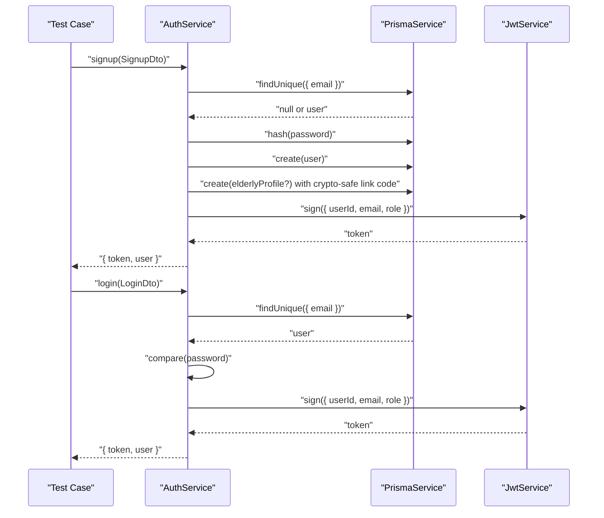

**Diagram sources**
- [auth.service.ts:23-100](file://src/auth/auth.service.ts#L23-L100)
- [auth.service.ts:102-135](file://src/auth/auth.service.ts#L102-L135)
- [auth.service.ts:165-173](file://src/auth/auth.service.ts#L165-L173)
- [login.dto.ts:4-12](file://src/auth/dto/login.dto.ts#L4-L12)

**Section sources**
- [auth.service.ts:14-175](file://src/auth/auth.service.ts#L14-L175)
- [login.dto.ts:4-12](file://src/auth/dto/login.dto.ts#L4-L12)

### Enhanced E2E Testing Approach
The platform now features comprehensive E2E test suites covering multiple domains:

**Auth & Health E2E Suite (327 lines)**: Tests authentication flows, health checks, public endpoints, and rate limiting verification.
**Elderly & Caregiver E2E Suite (334 lines)**: Tests elderly profile management, caregiver-elderly linking, medications, contacts, agenda, and role-specific endpoints.

Recommended enhancements:
- Add controller-level e2e tests for protected routes using JWT tokens.
- Integrate a test database and seed data per suite to ensure deterministic outcomes.
- Validate DTO transformations and validation errors.
- Include comprehensive health checks and swagger accessibility tests.
- Test rate limiting functionality with realistic request patterns.

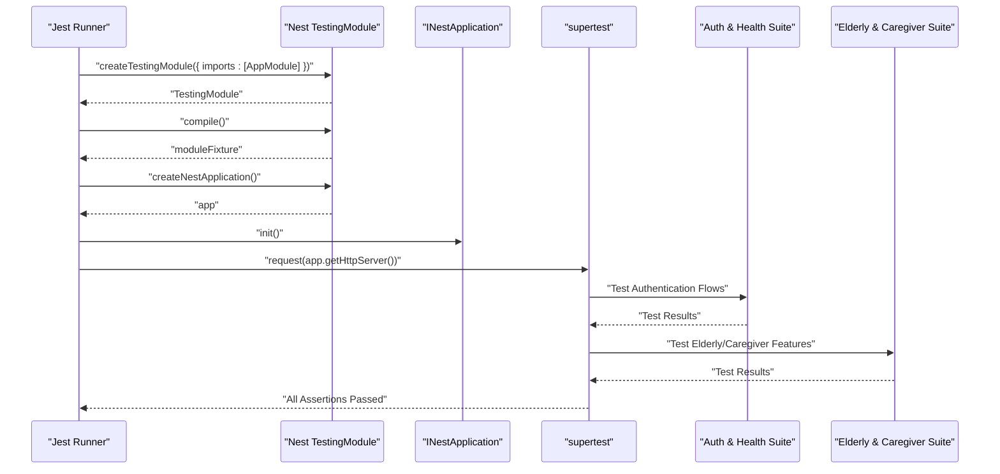

**Diagram sources**
- [auth-health.e2e-spec.ts:19-84](file://test/auth-health.e2e-spec.ts#L19-L84)
- [elderly-caregiver.e2e-spec.ts:17-58](file://test/elderly-caregiver.e2e-spec.ts#L17-L58)

**Section sources**
- [auth-health.e2e-spec.ts:11-327](file://test/auth-health.e2e-spec.ts#L11-L327)
- [elderly-caregiver.e2e-spec.ts:11-334](file://test/elderly-caregiver.e2e-spec.ts#L11-L334)

### Database Seeding and Migration Strategy
- **Seeding**: A seed script creates users, categories, offerings, medications, and agenda events for local development and testing.
- **Migration**: The Prisma schema defines the data model and datasource. Use Prisma CLI to generate and apply migrations during development.

**Diagram sources**
- [seed.ts:16-365](file://prisma/seed.ts#L16-L365)

**Section sources**
- [schema.prisma:1-286](file://prisma/schema.prisma#L1-L286)
- [seed.ts:16-365](file://prisma/seed.ts#L16-L365)

### Environment Configuration and Secrets
- **Backend**: JWT secret is loaded via ConfigService from environment variables.
- **Mobile**: API base URL configured via environment variables, JWT token stored in AsyncStorage.
- **Database**: DATABASE_URL sourced from environment for Prisma with SSL and connection pooling.
- **CORS and global prefix**: Configured at backend bootstrap with allowlist origins.
- **Security**: Rate limiting, helmet protection, and structured logging configured globally.

Recommendations:
- Define environment variables for JWT_SECRET and DATABASE_URL in CI/CD and production.
- Use a secrets manager for production deployments.
- Validate required environment variables at startup.
- Mobile: Configure EXPO_PUBLIC_API_URL for different environments.
- Implement SSL connections for all database communications.

**Section sources**
- [auth.module.ts:16-18](file://src/auth/auth.module.ts#L16-L18)
- [schema.prisma:8-11](file://prisma/schema.prisma#L8-L11)
- [main.ts:13-16](file://src/main.ts#L13-L16)
- [main.ts:37-40](file://src/main.ts#L37-L40)
- [api.ts:3-9](file://mobile-app/src/services/api.ts#L3-L9)

## Enhanced E2E Testing Infrastructure

### Comprehensive Test Suite Architecture
The platform now features two comprehensive E2E test suites designed to validate critical functionality:

**Auth & Health E2E Suite**: Covers authentication flows, health checks, public endpoints, and rate limiting verification.
**Elderly & Caregiver E2E Suite**: Validates elderly profile management, caregiver-elderly linking, and integrated care workflows.

```mermaid
graph TB
subgraph "Auth & Health E2E Suite (327 lines)"
AuthLogin["Authentication Login Tests"]
AuthMe["User Profile Retrieval"]
HealthChecks["Health Check Endpoint"]
Categories["Public Categories"]
Offerings["Public Offerings"]
RateLimiting["Rate Limiting Tests"]
KnownIssues["Known Issues Documentation"]
end
subgraph "Elderly & Caregiver E2E Suite (334 lines)"
ElderlyProfile["Elderly Profile Management"]
CaregiverLinking["Caregiver-Elderly Linking"]
Medications["Medication Management"]
Contacts["Contact Management"]
Agenda["Agenda Management"]
ElderlyEndpoints["Elderly-Specific Endpoints"]
end
subgraph "Test Infrastructure"
JestConfig["Enhanced Jest Configuration"]
GlobalSetup["Global Test Setup"]
TokenManagement["JWT Token Management"]
DataValidation["Data Validation"]
TestIsolation["Test Isolation"]
end
AuthLogin --> GlobalSetup
AuthMe --> GlobalSetup
HealthChecks --> GlobalSetup
Categories --> GlobalSetup
Offerings --> GlobalSetup
RateLimiting --> GlobalSetup
ElderlyProfile --> GlobalSetup
CaregiverLinking --> GlobalSetup
Medications --> GlobalSetup
Contacts --> GlobalSetup
Agenda --> GlobalSetup
ElderlyEndpoints --> GlobalSetup
```

**Diagram sources**
- [auth-health.e2e-spec.ts:11-327](file://test/auth-health.e2e-spec.ts#L11-L327)
- [elderly-caregiver.e2e-spec.ts:11-334](file://test/elderly-caregiver.e2e-spec.ts#L11-L334)
- [jest-e2e.json:1-10](file://test/jest-e2e.json#L1-L10)

### Auth & Health E2E Test Suite
The authentication and health test suite validates critical security and availability aspects:

**Authentication Testing**: Tests login flows for all user roles (elderly, caregiver, provider, admin) with proper JWT token generation and validation.
**Health Monitoring**: Validates the health check endpoint returns proper database connectivity status.
**Public Endpoints**: Tests accessible endpoints like categories and offerings without authentication.
**Rate Limiting**: Verifies rate limiting functionality with configurable thresholds.

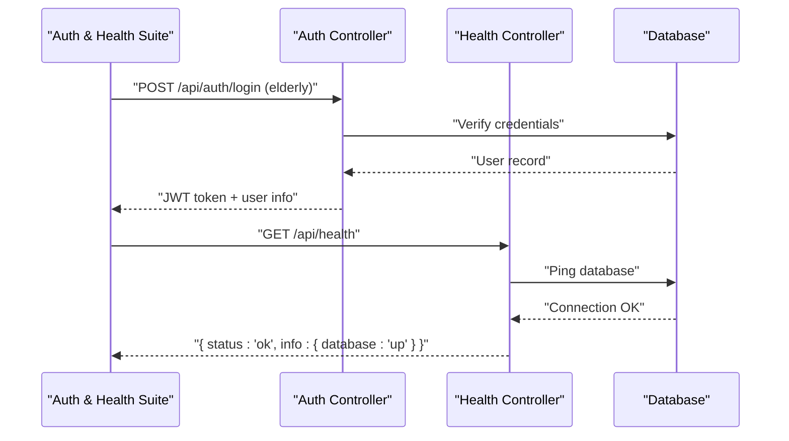

**Diagram sources**
- [auth-health.e2e-spec.ts:114-222](file://test/auth-health.e2e-spec.ts#L114-L222)
- [health.controller.ts:12-19](file://src/health/health.controller.ts#L12-L19)

### Elderly & Caregiver E2E Test Suite
The elderly and caregiver test suite validates integrated care workflows:

**Profile Management**: Tests elderly profile CRUD operations and preferred name updates.
**Caregiver Integration**: Validates caregiver access to linked elderly profiles and associated data.
**Medication Management**: Tests medication CRUD operations from both elderly and caregiver perspectives.
**Contact Management**: Validates contact CRUD operations for elderly profiles.
**Agenda Management**: Tests event scheduling and management for elderly profiles.
**Role-Specific Endpoints**: Validates endpoints accessible only to specific user roles.

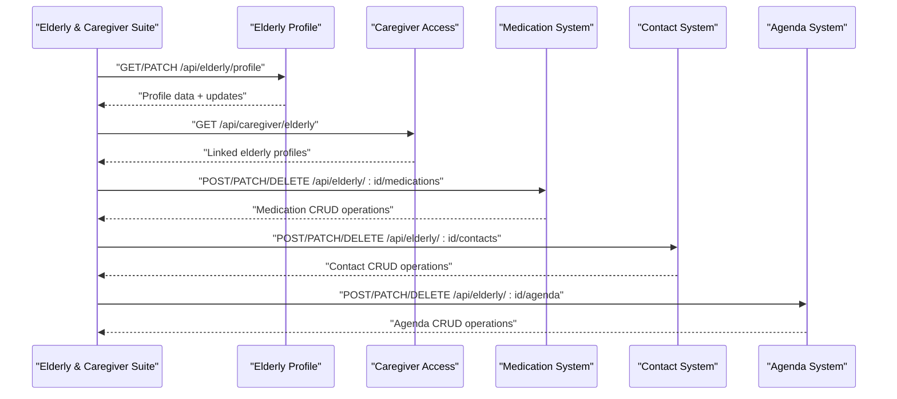

**Diagram sources**
- [elderly-caregiver.e2e-spec.ts:63-332](file://test/elderly-caregiver.e2e-spec.ts#L63-L332)

**Section sources**
- [auth-health.e2e-spec.ts:11-327](file://test/auth-health.e2e-spec.ts#L11-L327)
- [elderly-caregiver.e2e-spec.ts:11-334](file://test/elderly-caregiver.e2e-spec.ts#L11-L334)
- [jest-e2e.json:1-10](file://test/jest-e2e.json#L1-L10)

## Mobile App Testing Infrastructure

### Mobile Testing Architecture
The React Native mobile application implements a comprehensive testing infrastructure using React Native Testing Library and Jest. The testing architecture focuses on three main areas: authentication testing, navigation testing, and API integration testing.

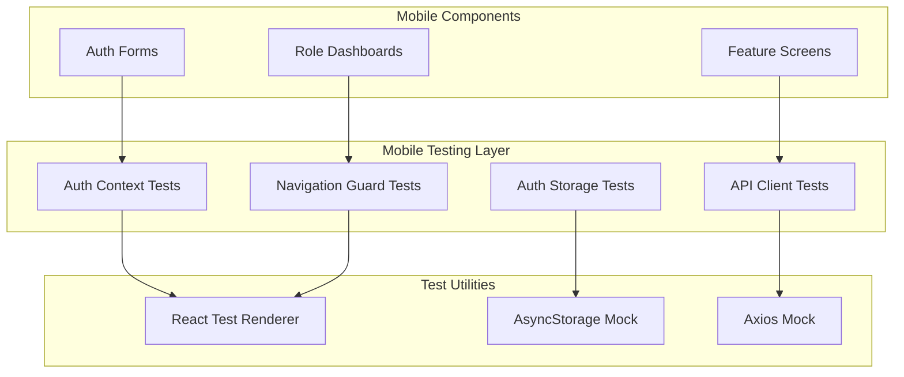

**Diagram sources**
- [auth.test.tsx:5-15](file://mobile-app/__tests__/auth.test.tsx#L5-L15)
- [AuthContext.tsx:29-177](file://mobile-app/src/contexts/AuthContext.tsx#L29-L177)
- [api.ts:11-44](file://mobile-app/src/services/api.ts#L11-L44)
- [authStorage.ts:7-45](file://mobile-app/src/lib/authStorage.ts#L7-L45)

### Authentication Testing Patterns
The mobile app implements comprehensive authentication testing covering login, signup, token persistence, and session restoration. The testing pattern ensures JWT token lifecycle management and error handling.

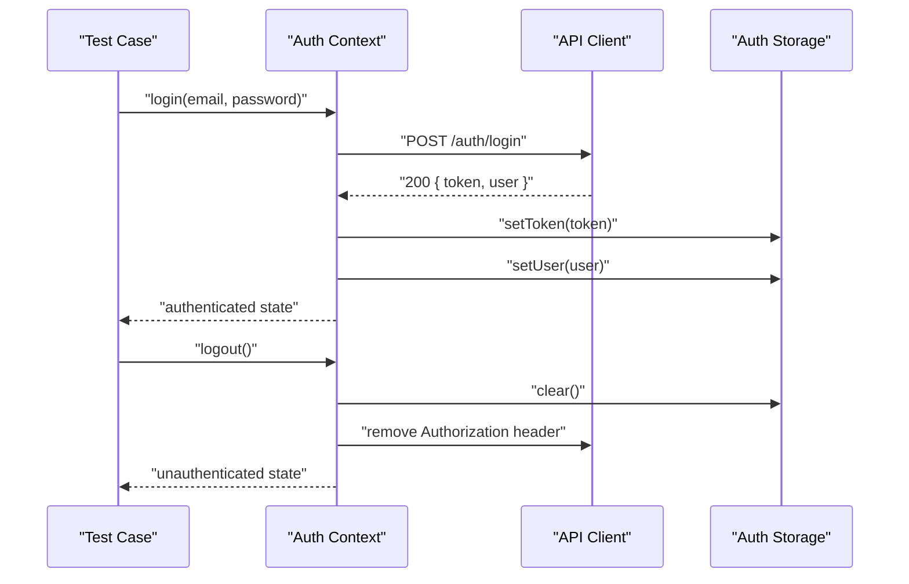

**Diagram sources**
- [AuthContext.tsx:85-140](file://mobile-app/src/contexts/AuthContext.tsx#L85-L140)
- [api.ts:16-22](file://mobile-app/src/services/api.ts#L16-L22)
- [authStorage.ts:41-44](file://mobile-app/src/lib/authStorage.ts#L41-L44)

### Navigation Testing Strategy
Role-based navigation testing ensures proper route protection and automatic redirection based on user roles. The testing strategy covers authentication guards, role-specific routing, and session restoration.

**Diagram sources**
- [app/_layout.tsx:20-40](file://mobile-app/app/_layout.tsx#L20-L40)
- [app/index.tsx:12-32](file://mobile-app/app/index.tsx#L12-L32)
- [AuthContext.tsx:49-83](file://mobile-app/src/contexts/AuthContext.tsx#L49-L83)

### API Client Testing
The API client testing focuses on base URL configuration, token injection, error handling, and request/response validation. The testing ensures proper API integration and error translation.

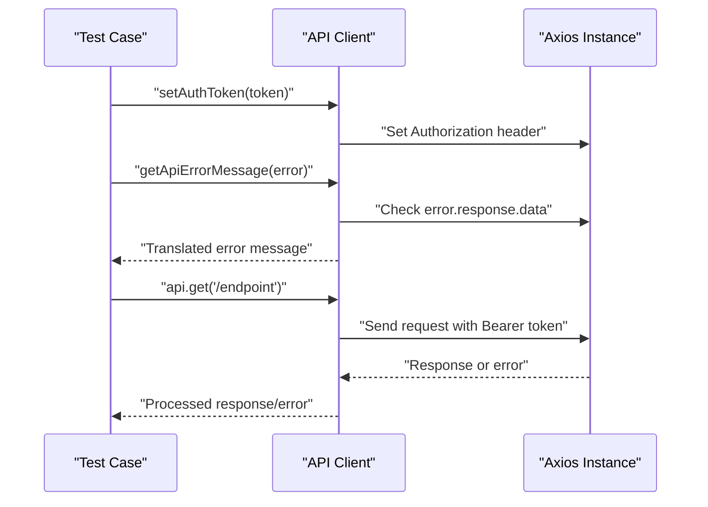

**Diagram sources**
- [api.ts:16-44](file://mobile-app/src/services/api.ts#L16-L44)

### Storage Layer Testing
Auth storage testing ensures proper token and user persistence across app sessions. The testing covers AsyncStorage operations, JSON serialization, and error handling.

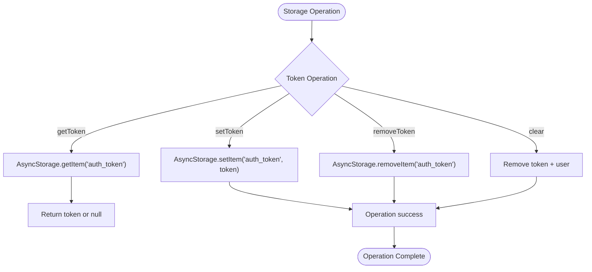

**Diagram sources**
- [authStorage.ts:8-44](file://mobile-app/src/lib/authStorage.ts#L8-L44)

**Section sources**
- [auth.test.tsx:5-15](file://mobile-app/__tests__/auth.test.tsx#L5-L15)
- [AuthContext.tsx:29-177](file://mobile-app/src/contexts/AuthContext.tsx#L29-L177)
- [api.ts:11-44](file://mobile-app/src/services/api.ts#L11-L44)
- [authStorage.ts:7-45](file://mobile-app/src/lib/authStorage.ts#L7-L45)
- [app/_layout.tsx:12-61](file://mobile-app/app/_layout.tsx#L12-L61)
- [app/index.tsx:5-33](file://mobile-app/app/index.tsx#L5-L33)

## API Contract Testing

### API Contract Validation Framework
The API contract testing framework ensures backend implementation matches frontend expectations. The validation covers request/response schemas, authentication flows, and error handling patterns.

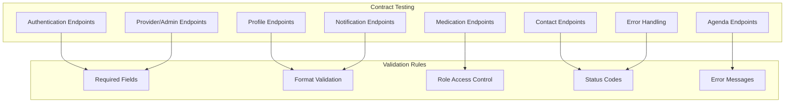

**Diagram sources**
- [API_CONTRACTS.md:5-520](file://mobile-app/API_CONTRACTS.md#L5-L520)
- [TYPE_DEFINITIONS.md:15-369](file://mobile-app/TYPE_DEFINITIONS.md#L15-L369)

### Authentication Flow Testing
Comprehensive testing of authentication endpoints including signup, login, and profile retrieval. The testing ensures JWT token generation, user object validation, and proper error handling.

### Role-Based Access Control Testing
Testing of role-specific endpoints ensuring proper authorization and data access patterns. The testing covers elderly, caregiver, provider, and admin role permissions.

### Data Validation Testing
Testing of request/response data validation including field formats, data types, and business rule enforcement. The testing ensures API contract compliance and error prevention.

**Section sources**
- [API_CONTRACTS.md:1-520](file://mobile-app/API_CONTRACTS.md#L1-L520)
- [TYPE_DEFINITIONS.md:1-369](file://mobile-app/TYPE_DEFINITIONS.md#L1-L369)

## Completion and Verification

### Implementation Completion Checklist
The completion checklist provides comprehensive verification of frontend-backend integration, covering all major implementation phases and verification criteria.

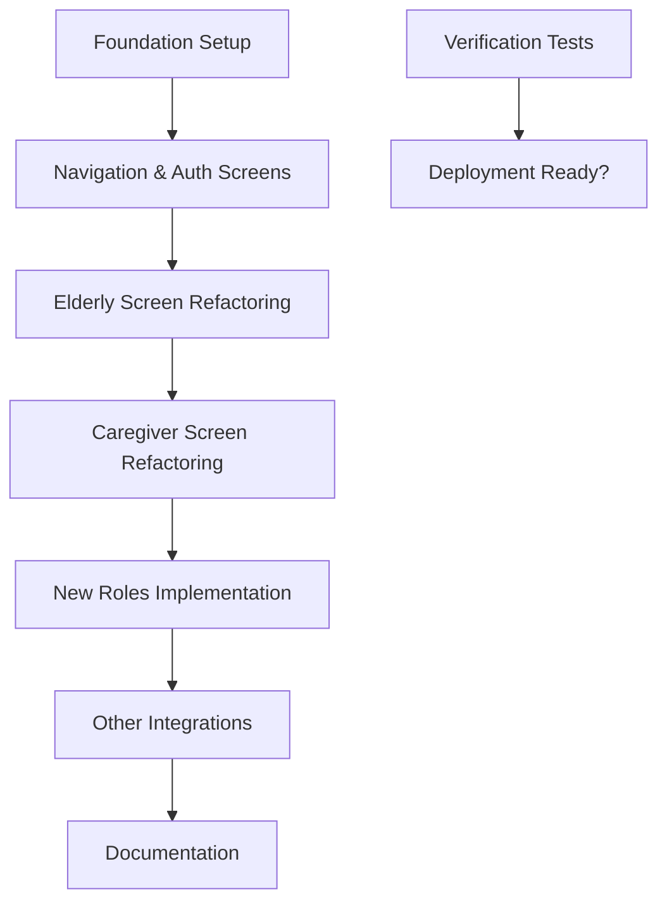

**Diagram sources**
- [COMPLETION_CHECKLIST.md:3-244](file://mobile-app/COMPLETION_CHECKLIST.md#L3-L244)

### Verification Testing Matrix
The verification testing matrix ensures comprehensive coverage of all integration points, API endpoints, and role-based functionality.

### Documentation Integration Testing
Testing of all documentation pages including navigation maps, integration guides, API contracts, and type definitions to ensure accuracy and completeness.

**Section sources**
- [COMPLETION_CHECKLIST.md:1-244](file://mobile-app/COMPLETION_CHECKLIST.md#L1-L244)
- [INTEGRATION_GUIDE.md:208-262](file://mobile-app/INTEGRATION_GUIDE.md#L208-L262)
- [FINAL_SUMMARY.md:115-149](file://mobile-app/FINAL_SUMMARY.md#L115-L149)

## Deployment Procedures

### Backend Deployment Strategy
The backend deployment strategy follows standard NestJS production practices with enhanced security infrastructure, environment configuration, database migrations, and process management.

### Mobile App Deployment Strategy
The mobile app deployment utilizes Expo Application Services (EAS) for building and distributing applications across iOS and Android platforms.

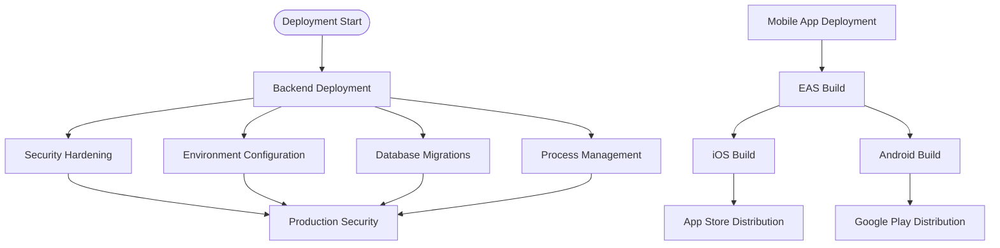

**Diagram sources**
- [INTEGRATION_GUIDE.md:65-69](file://mobile-app/INTEGRATION_GUIDE.md#L65-L69)
- [FINAL_SUMMARY.md:150-174](file://mobile-app/FINAL_SUMMARY.md#L150-L174)
- [SUPABASE_EXECUTION_PLAN.md:9-24](file://SUPABASE_EXECUTION_PLAN.md#L9-L24)

### Environment Configuration
- **Backend**: NODE_ENV=production, JWT_SECRET, DATABASE_URL with SSL and connection pooling, CORS configuration with allowlist, rate limiting enabled, helmet protection active
- **Mobile**: EXPO_PUBLIC_API_URL, environment-specific configurations

### CI/CD Pipeline Considerations
- **Backend**: Install dependencies, lint, build, run unit tests with coverage, run enhanced E2E test suites, database migrations, security validation
- **Mobile**: Install dependencies, build for iOS/Android, run mobile tests, generate production builds

**Section sources**
- [package.json:8-21](file://package.json#L8-L21)
- [README.md:60-72](file://README.md#L60-L72)
- [INTEGRATION_GUIDE.md:37-50](file://mobile-app/INTEGRATION_GUIDE.md#L37-L50)
- [FINAL_SUMMARY.md:150-174](file://mobile-app/FINAL_SUMMARY.md#L150-L174)

## Infrastructure Security Hardening

### Completed Security Improvements
The SUPABASE execution plan demonstrates comprehensive security hardening across multiple infrastructure layers:

**Task Completion Status**: All 9 tasks completed successfully, including git initialization with secure credential management, SSL configuration, baseline migrations, security hardening, rate limiting, helmet protection, structured logging, and comprehensive E2E testing.

**Security Measures Implemented**:
- **Rate Limiting**: @nestjs/throttler configured with 60 requests per minute limit
- **Helmet Protection**: Security headers enabled via helmet middleware
- **Structured Logging**: NestJS Logger replacing console.log statements
- **Request Correlation**: X-Request-ID interceptor for distributed tracing
- **Crypto-Safe Randomness**: randomBytes() replacing Math.random() for link codes
- **Health Monitoring**: Custom health check endpoint with database connectivity verification
- **CORS Allowlist**: Environment-based origin validation instead of wildcard

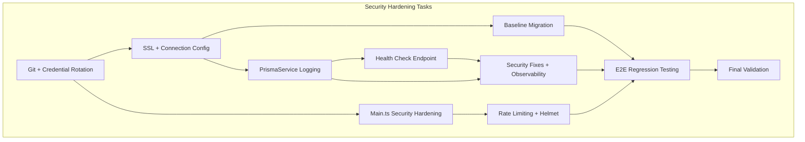

**Diagram sources**
- [SUPABASE_EXECUTION_PLAN.md:9-24](file://SUPABASE_EXECUTION_PLAN.md#L9-L24)
- [main.ts:32-32](file://src/main.ts#L32-L32)
- [app.module.ts:24-42](file://src/app.module.ts#L24-L42)
- [request-id.interceptor.ts:18-57](file://src/common/interceptors/request-id.interceptor.ts#L18-L57)
- [auth.service.ts:7-7](file://src/auth/auth.service.ts#L7-L7)
- [health.controller.ts:12-19](file://src/health/health.controller.ts#L12-L19)

### Security Implementation Details
- **Rate Limiting Configuration**: 60 requests per 60 seconds with ThrottlerGuard applied globally
- **Helmet Protection**: Security headers including XSS protection, content type sniffing prevention, and frame guard
- **Structured Logging**: Centralized logging via NestJS Logger with request correlation
- **Health Monitoring**: Database connectivity verification with custom PrismaHealthIndicator
- **Request Tracing**: X-Request-ID propagation for debugging distributed systems

**Section sources**
- [SUPABASE_EXECUTION_PLAN.md:9-24](file://SUPABASE_EXECUTION_PLAN.md#L9-L24)
- [main.ts:32-32](file://src/main.ts#L32-L32)
- [app.module.ts:24-42](file://src/app.module.ts#L24-L42)
- [request-id.interceptor.ts:18-57](file://src/common/interceptors/request-id.interceptor.ts#L18-L57)
- [auth.service.ts:7-7](file://src/auth/auth.service.ts#L7-L7)
- [health.controller.ts:12-19](file://src/health/health.controller.ts#L12-L19)
- [prisma.health.ts:15-28](file://src/health/prisma.health.ts#L15-L28)

## Dependency Analysis
The application's module dependencies form a cohesive tree rooted at AppModule. AuthModule depends on PrismaModule and configuration for JWT. PrismaModule exports PrismaService for use across services. The mobile app depends on the backend API for all functionality. The enhanced security infrastructure adds HealthModule and RequestIdInterceptor as core dependencies.

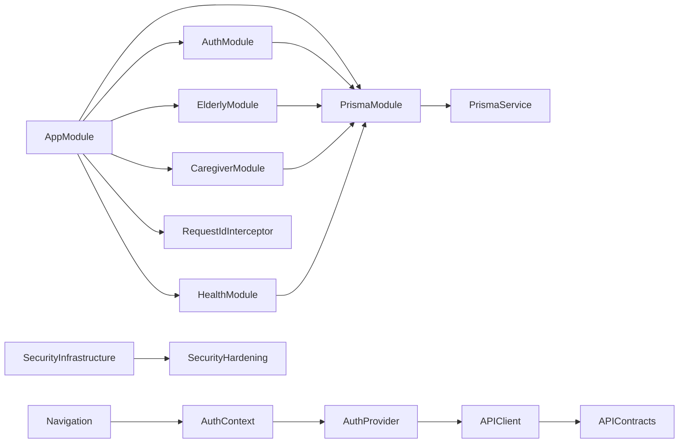

**Diagram sources**
- [app.module.ts:17-46](file://src/app.module.ts#L17-L46)
- [auth.module.ts:10-27](file://src/auth/auth.module.ts#L10-L27)
- [elderly.module.ts:6-12](file://src/elderly/elderly.module.ts#L6-L12)
- [caregiver.module.ts:6-12](file://src/caregiver/caregiver.module.ts#L6-L12)
- [prisma.module.ts:4-9](file://src/prisma/prisma.module.ts#L4-L9)
- [health.module.ts:1-13](file://src/health/health.module.ts#L1-L13)
- [AuthContext.tsx:29-177](file://mobile-app/src/contexts/AuthContext.tsx#L29-L177)
- [api.ts:11-44](file://mobile-app/src/services/api.ts#L11-L44)
- [API_CONTRACTS.md:1-520](file://mobile-app/API_CONTRACTS.md#L1-L520)

**Section sources**
- [app.module.ts:17-46](file://src/app.module.ts#L17-L46)
- [auth.module.ts:10-27](file://src/auth/auth.module.ts#L10-L27)
- [prisma.module.ts:4-9](file://src/prisma/prisma.module.ts#L4-L9)
- [AuthContext.tsx:29-177](file://mobile-app/src/contexts/AuthContext.tsx#L29-L177)
- [api.ts:11-44](file://mobile-app/src/services/api.ts#L11-L44)

## Performance Considerations
- **Backend**: Use ValidationPipe to prevent unnecessary work on invalid inputs, optimize database queries with Prisma indexing, implement rate limiting to prevent abuse, leverage helmet protection for security overhead reduction.
- **Mobile**: Implement efficient API calls with proper caching, minimize re-renders with React.memo, optimize navigation transitions, utilize request correlation for performance monitoring.
- **Both Platforms**: Use environment-specific configurations, implement proper error boundaries, monitor performance metrics, leverage health check endpoints for system monitoring.

## Troubleshooting Guide
Common issues and resolutions:
- **Backend**: Port conflicts, CORS errors, JWT signature errors, database connection failures, E2E test flakiness, rate limiting violations, health check failures.
- **Mobile**: API connection failures, token expiration, authentication errors, navigation issues, AsyncStorage problems.
- **Integration**: API contract mismatches, role-based access issues, session persistence problems, security configuration errors.
- **Security**: Rate limiting bypass attempts, helmet header issues, request correlation problems, health check failures.

**Section sources**
- [main.ts:37-40](file://src/main.ts#L37-L40)
- [auth.module.ts:16-18](file://src/auth/auth.module.ts#L16-L18)
- [schema.prisma:8-11](file://prisma/schema.prisma#L8-L11)
- [app.e2e-spec.ts:10-17](file://test/app.e2e-spec.ts#L10-L17)
- [INTEGRATION_GUIDE.md:223-243](file://mobile-app/INTEGRATION_GUIDE.md#L223-L243)
- [SUPABASE_EXECUTION_PLAN.md:709-722](file://SUPABASE_EXECUTION_PLAN.md#L709-L722)

## Conclusion
The 99-Pai platform provides a comprehensive testing and deployment framework with enhanced security infrastructure, dual-platform support for both NestJS backend and React Native mobile application, and extensive E2E test coverage. The integration of comprehensive E2E test suites, security hardening measures, API contract validation, and completion verification procedures ensures reliable operation across all components. The completed SUPABASE execution plan demonstrates successful implementation of security measures including rate limiting, helmet protection, structured logging, and health monitoring. By leveraging the documented testing strategies, deployment procedures, and troubleshooting guides, teams can effectively maintain and scale the platform with confidence in its security and reliability.

## Appendices
- Additional resources and links are available in the project README for deployment and community support.
- Mobile app documentation includes comprehensive integration guides, API contracts, and testing procedures.
- Backend documentation provides detailed API documentation, security hardening guidelines, and deployment instructions.
- SUPABASE execution plan provides detailed security implementation documentation and validation results.

**Section sources**
- [README.md:73-84](file://README.md#L73-L84)
- [INTEGRATION_GUIDE.md:1-262](file://mobile-app/INTEGRATION_GUIDE.md#L1-L262)
- [API_CONTRACTS.md:1-520](file://mobile-app/API_CONTRACTS.md#L1-L520)
- [COMPLETION_CHECKLIST.md:1-244](file://mobile-app/COMPLETION_CHECKLIST.md#L1-L244)
- [SUPABASE_EXECUTION_PLAN.md:1-722](file://SUPABASE_EXECUTION_PLAN.md#L1-L722)