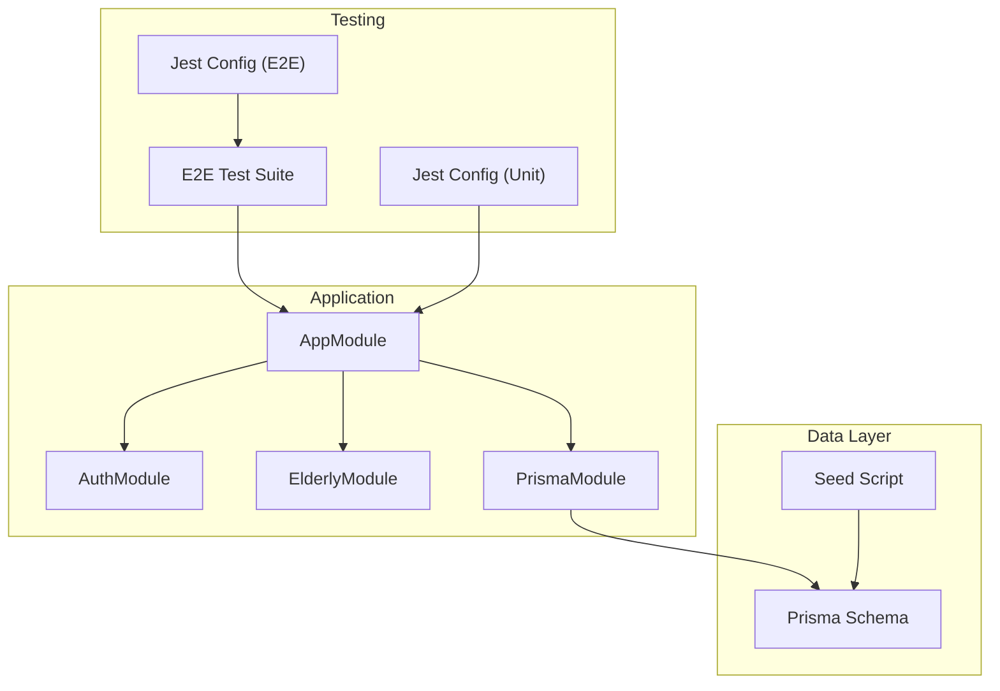
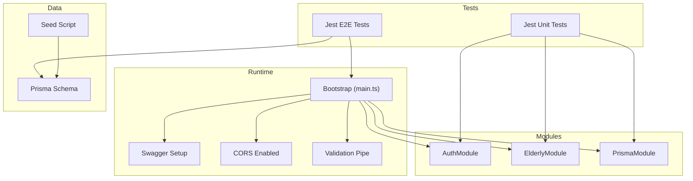
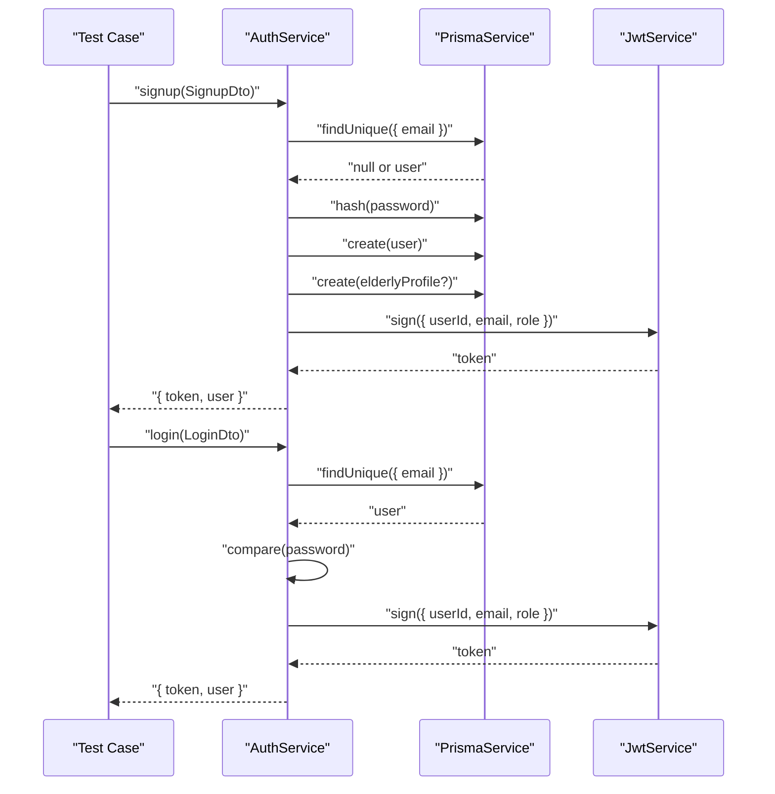
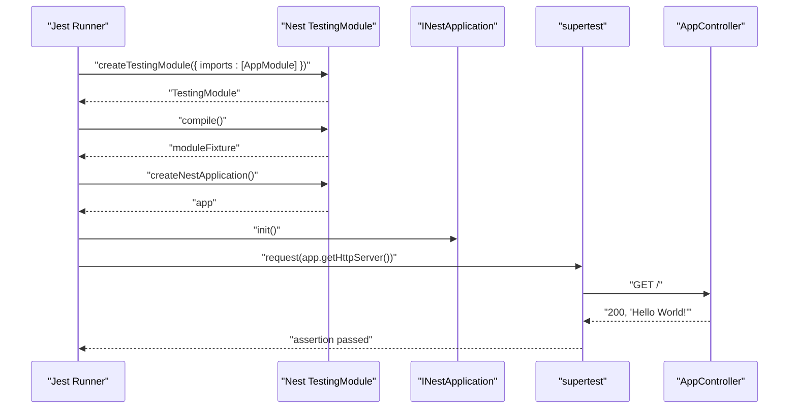
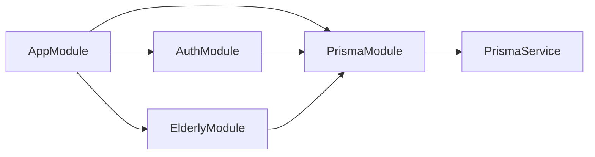

# Testing & Deployment

<cite>
**Referenced Files in This Document**
- [package.json](file://package.json)
- [jest-e2e.json](file://test/jest-e2e.json)
- [app.e2e-spec.ts](file://test/app.e2e-spec.ts)
- [main.ts](file://src/main.ts)
- [app.module.ts](file://src/app.module.ts)
- [schema.prisma](file://prisma/schema.prisma)
- [seed.ts](file://prisma/seed.ts)
- [auth.module.ts](file://src/auth/auth.module.ts)
- [auth.service.ts](file://src/auth/auth.service.ts)
- [prisma.module.ts](file://src/prisma/prisma.module.ts)
- [prisma.service.ts](file://src/prisma/prisma.service.ts)
- [login.dto.ts](file://src/auth/dto/login.dto.ts)
- [README.md](file://README.md)
- [eslint.config.mjs](file://eslint.config.mjs)
- [tsconfig.build.json](file://tsconfig.build.json)
</cite>

## Table of Contents
1. [Introduction](#introduction)
2. [Project Structure](#project-structure)
3. [Core Components](#core-components)
4. [Architecture Overview](#architecture-overview)
5. [Detailed Component Analysis](#detailed-component-analysis)
6. [Dependency Analysis](#dependency-analysis)
7. [Performance Considerations](#performance-considerations)
8. [Troubleshooting Guide](#troubleshooting-guide)
9. [Conclusion](#conclusion)
10. [Appendices](#appendices)

## Introduction
This document provides comprehensive testing and deployment guidance for the 99-Pai platform. It covers unit testing with Jest, integration and end-to-end testing strategies, test configuration and coverage, environment setup, database seeding and migrations, containerization options, production readiness, CI/CD considerations, monitoring and logging, troubleshooting, security, and backup/recovery procedures.

## Project Structure
The project follows a NestJS modular architecture with a central application module importing feature modules. Testing is organized under the test directory with Jest configuration for unit and e2e tests. Prisma defines the data model and seeding script for local development and testing.

**Diagram sources**
- [app.module.ts:17-35](file://src/app.module.ts#L17-L35)
- [auth.module.ts:10-27](file://src/auth/auth.module.ts#L10-L27)
- [elderly.module.ts:6-12](file://src/elderly/elderly.module.ts#L6-L12)
- [prisma.module.ts:4-9](file://src/prisma/prisma.module.ts#L4-L9)
- [package.json:71-87](file://package.json#L71-L87)
- [jest-e2e.json:1-10](file://test/jest-e2e.json#L1-L10)
- [app.e2e-spec.ts:7-25](file://test/app.e2e-spec.ts#L7-L25)
- [schema.prisma:1-286](file://prisma/schema.prisma#L1-L286)
- [seed.ts:16-365](file://prisma/seed.ts#L16-L365)

**Section sources**
- [app.module.ts:17-35](file://src/app.module.ts#L17-L35)
- [package.json:71-87](file://package.json#L71-L87)
- [jest-e2e.json:1-10](file://test/jest-e2e.json#L1-L10)
- [app.e2e-spec.ts:7-25](file://test/app.e2e-spec.ts#L7-L25)
- [schema.prisma:1-286](file://prisma/schema.prisma#L1-L286)
- [seed.ts:16-365](file://prisma/seed.ts#L16-L365)

## Core Components
- Application bootstrap initializes global prefix, CORS, validation pipes, and Swagger documentation.
- Central AppModule aggregates all domain modules and the Prisma module.
- PrismaModule provides a globally scoped PrismaService for database operations.
- AuthModule integrates JWT and Passport, sourcing secrets from configuration.
- E2E test suite validates basic endpoint behavior using supertest against the in-memory Nest application.

Key behaviors:
- Global prefix: api
- CORS enabled with credentials
- ValidationPipe configured with transformation and whitelisting
- Swagger UI exposed at docs
- AuthModule reads JWT_SECRET from environment via ConfigService

**Section sources**
- [main.ts:6-42](file://src/main.ts#L6-L42)
- [app.module.ts:17-35](file://src/app.module.ts#L17-L35)
- [prisma.module.ts:4-9](file://src/prisma/prisma.module.ts#L4-L9)
- [prisma.service.ts:4-16](file://src/prisma/prisma.service.ts#L4-L16)
- [auth.module.ts:14-21](file://src/auth/auth.module.ts#L14-L21)
- [app.e2e-spec.ts:10-24](file://test/app.e2e-spec.ts#L10-L24)

## Architecture Overview
The testing and deployment architecture centers around Jest for unit/e2e tests, Prisma for schema and seeding, and NestJS application bootstrapping for runtime behavior.

**Diagram sources**
- [main.ts:6-42](file://src/main.ts#L6-L42)
- [auth.module.ts:10-27](file://src/auth/auth.module.ts#L10-L27)
- [elderly.module.ts:6-12](file://src/elderly/elderly.module.ts#L6-L12)
- [prisma.module.ts:4-9](file://src/prisma/prisma.module.ts#L4-L9)
- [package.json:71-87](file://package.json#L71-L87)
- [jest-e2e.json:1-10](file://test/jest-e2e.json#L1-L10)
- [schema.prisma:1-286](file://prisma/schema.prisma#L1-L286)
- [seed.ts:16-365](file://prisma/seed.ts#L16-L365)

## Detailed Component Analysis

### Testing Strategy and Configuration
- Unit tests: Jest configured to transform TypeScript files, collect coverage across all ts files, and target spec files under src.
- E2E tests: Jest configuration tailored for e2e specs, executed via a dedicated script.
- Coverage: Enabled via a dedicated script; default Jest configuration collects coverage from all ts files.
- Linting: ESLint with TypeScript and Prettier recommended rules; includes Jest globals.

Recommended practices:
- Add unit tests for services and controllers with isolated PrismaService mocks.
- Use Nest TestingModule to compile minimal application for e2e tests.
- Leverage DTO validation in unit tests to assert class-validator constraints.
- Maintain separate test databases or use Prisma transactions to avoid cross-test contamination.

**Section sources**
- [package.json:71-87](file://package.json#L71-L87)
- [jest-e2e.json:1-10](file://test/jest-e2e.json#L1-L10)
- [eslint.config.mjs:14-35](file://eslint.config.mjs#L14-L35)
- [tsconfig.build.json:1-4](file://tsconfig.build.json#L1-L4)

### Authentication Service Testing Patterns
The authentication service orchestrates user creation, credential verification, and JWT issuance. Recommended testing patterns:
- Mock PrismaService to simulate user existence and password hashing.
- Validate error paths: duplicate email, duplicate phone, invalid credentials.
- Verify JWT payload composition and token generation.
- Confirm role-specific profile creation behavior.

**Diagram sources**
- [auth.service.ts:23-100](file://src/auth/auth.service.ts#L23-L100)
- [auth.service.ts:102-135](file://src/auth/auth.service.ts#L102-L135)
- [login.dto.ts:4-12](file://src/auth/dto/login.dto.ts#L4-L12)

**Section sources**
- [auth.service.ts:14-173](file://src/auth/auth.service.ts#L14-L173)
- [login.dto.ts:4-12](file://src/auth/dto/login.dto.ts#L4-L12)

### E2E Testing Approach
The current e2e test initializes the full application module and asserts a GET response. Recommended enhancements:
- Add controller-level e2e tests for protected routes using JWT tokens.
- Integrate a test database and seed data per suite to ensure deterministic outcomes.
- Validate DTO transformations and validation errors.
- Include health checks and swagger accessibility tests.

**Diagram sources**
- [app.e2e-spec.ts:10-24](file://test/app.e2e-spec.ts#L10-L24)

**Section sources**
- [app.e2e-spec.ts:7-25](file://test/app.e2e-spec.ts#L7-L25)

### Database Seeding and Migration Strategy
- Seeding: A seed script creates users, categories, offerings, medications, and agenda events for local development and testing.
- Migration: The Prisma schema defines the data model and datasource. Use Prisma CLI to generate and apply migrations during development.

**Diagram sources**
- [seed.ts:16-365](file://prisma/seed.ts#L16-L365)

**Section sources**
- [schema.prisma:1-286](file://prisma/schema.prisma#L1-L286)
- [seed.ts:16-365](file://prisma/seed.ts#L16-L365)

### Environment Configuration and Secrets
- JWT secret is loaded via ConfigService from environment variables.
- DATABASE_URL is sourced from environment for Prisma.
- CORS and global prefix are configured at bootstrap.

Recommendations:
- Define environment variables for JWT_SECRET and DATABASE_URL in CI/CD and production.
- Use a secrets manager for production deployments.
- Validate required environment variables at startup.

**Section sources**
- [auth.module.ts:16-18](file://src/auth/auth.module.ts#L16-L18)
- [schema.prisma:8-11](file://prisma/schema.prisma#L8-L11)
- [main.ts:13-16](file://src/main.ts#L13-L16)
- [main.ts:37-40](file://src/main.ts#L37-L40)

### Deployment Options and Production Readiness
- Build and run scripts are provided for development, watch mode, and production.
- README references official deployment documentation and a managed deployment tool.
- For containerized deployment, use a multi-stage Dockerfile to build and run the application.

Production readiness checklist:
- Set NODE_ENV=production.
- Configure reverse proxy and SSL termination.
- Enable process managers (e.g., PM2) for process supervision.
- Secure environment variables and secrets.
- Set up health checks and readiness probes.
- Configure logging and structured logs for observability.

**Section sources**
- [package.json:8-21](file://package.json#L8-L21)
- [README.md:60-72](file://README.md#L60-L72)

### CI/CD Pipeline Considerations
- Install dependencies, lint, build, run unit tests with coverage, and run e2e tests.
- Use matrix builds for different Node versions if desired.
- Cache dependencies and build artifacts.
- Publish coverage reports to a service if applicable.
- Run Prisma migrations in CI before deploying.

**Section sources**
- [package.json:15-20](file://package.json#L15-L20)
- [eslint.config.mjs:14-35](file://eslint.config.mjs#L14-L35)

### Monitoring and Logging
- NestJS supports structured logging; integrate with centralized logging systems.
- Expose metrics endpoints if needed.
- Monitor application logs, error rates, and response times.
- Use APM tools for tracing and performance insights.

[No sources needed since this section provides general guidance]

### Security Considerations
- Enforce HTTPS/TLS in production.
- Rotate JWT_SECRET regularly and manage keys securely.
- Validate and sanitize all inputs; rely on ValidationPipe.
- Apply least privilege for database connections.
- Regularly audit dependencies and apply security patches.

**Section sources**
- [main.ts:19-25](file://src/main.ts#L19-L25)
- [auth.module.ts:16-18](file://src/auth/auth.module.ts#L16-L18)

### Backup and Recovery Procedures
- Back up PostgreSQL database regularly.
- Store backups offsite or in secure cloud storage.
- Test restore procedures periodically.
- Automate and monitor backup jobs.

[No sources needed since this section provides general guidance]

## Dependency Analysis
The application’s module dependencies form a cohesive tree rooted at AppModule. AuthModule depends on PrismaModule and configuration for JWT. PrismaModule exports PrismaService for use across services.

**Diagram sources**
- [app.module.ts:17-35](file://src/app.module.ts#L17-L35)
- [auth.module.ts:10-27](file://src/auth/auth.module.ts#L10-L27)
- [elderly.module.ts:6-12](file://src/elderly/elderly.module.ts#L6-L12)
- [prisma.module.ts:4-9](file://src/prisma/prisma.module.ts#L4-L9)

**Section sources**
- [app.module.ts:17-35](file://src/app.module.ts#L17-L35)
- [auth.module.ts:10-27](file://src/auth/auth.module.ts#L10-L27)
- [prisma.module.ts:4-9](file://src/prisma/prisma.module.ts#L4-L9)

## Performance Considerations
- Use ValidationPipe to prevent unnecessary work on invalid inputs.
- Optimize database queries and leverage Prisma indexing as defined in the schema.
- Implement caching for static or infrequently changing data.
- Scale horizontally with load balancers and multiple instances.

[No sources needed since this section provides general guidance]

## Troubleshooting Guide
Common issues and resolutions:
- Port conflicts: Change PORT environment variable.
- CORS errors: Verify allowed origins and credentials configuration.
- JWT signature errors: Ensure JWT_SECRET is set and consistent.
- Database connection failures: Confirm DATABASE_URL and network access.
- E2E test flakiness: Use isolated test databases or transactions; initialize app properly in beforeEach.

**Section sources**
- [main.ts:37-40](file://src/main.ts#L37-L40)
- [auth.module.ts:16-18](file://src/auth/auth.module.ts#L16-L18)
- [schema.prisma:8-11](file://prisma/schema.prisma#L8-L11)
- [app.e2e-spec.ts:10-17](file://test/app.e2e-spec.ts#L10-L17)

## Conclusion
The 99-Pai platform provides a solid foundation for testing and deployment with Jest, Prisma, and NestJS. By extending unit and e2e coverage, enforcing environment-driven configuration, and adopting production-grade practices for security, monitoring, and CI/CD, teams can reliably operate the platform at scale.

[No sources needed since this section summarizes without analyzing specific files]

## Appendices
- Additional resources and links are available in the project README for deployment and community support.

**Section sources**
- [README.md:73-84](file://README.md#L73-L84)