# Testing & Deployment

<cite>
**Referenced Files in This Document**
- [package.json](file://package.json)
- [jest-e2e.json](file://test/jest-e2e.json)
- [app.e2e-spec.ts](file://test/app.e2e-spec.ts)
- [main.ts](file://src/main.ts)
- [app.module.ts](file://src/app.module.ts)
- [schema.prisma](file://prisma/schema.prisma)
- [seed.ts](file://prisma/seed.ts)
- [auth.module.ts](file://src/auth/auth.module.ts)
- [auth.service.ts](file://src/auth/auth.service.ts)
- [prisma.module.ts](file://src/prisma/prisma.module.ts)
- [prisma.service.ts](file://src/prisma/prisma.service.ts)
- [login.dto.ts](file://src/auth/dto/login.dto.ts)
- [README.md](file://README.md)
- [eslint.config.mjs](file://eslint.config.mjs)
- [tsconfig.build.json](file://tsconfig.build.json)
- [API_CONTRACTS.md](file://mobile-app/API_CONTRACTS.md)
- [COMPLETION_CHECKLIST.md](file://mobile-app/COMPLETION_CHECKLIST.md)
- [INTEGRATION_GUIDE.md](file://mobile-app/INTEGRATION_GUIDE.md)
- [FINAL_SUMMARY.md](file://mobile-app/FINAL_SUMMARY.md)
- [NAVIGATION_MAP.md](file://mobile-app/NAVIGATION_MAP.md)
- [TYPE_DEFINITIONS.md](file://mobile-app/TYPE_DEFINITIONS.md)
- [auth.test.tsx](file://mobile-app/__tests__/auth.test.tsx)
- [api.ts](file://mobile-app/src/services/api.ts)
- [authStorage.ts](file://mobile-app/src/lib/authStorage.ts)
- [AuthContext.tsx](file://mobile-app/src/contexts/AuthContext.tsx)
- [tsconfig.json](file://mobile-app/tsconfig.json)
- [app/_layout.tsx](file://mobile-app/app/_layout.tsx)
- [app/index.tsx](file://mobile-app/app/index.tsx)
</cite>

## Update Summary
**Changes Made**
- Added comprehensive mobile app testing infrastructure documentation
- Integrated API contract testing and validation procedures
- Documented completion checklist for frontend-backend integration
- Added mobile app deployment procedures and environment configuration
- Enhanced testing strategy with mobile-specific authentication and navigation testing
- Included mobile app architecture diagrams and testing patterns

## Table of Contents
1. [Introduction](#introduction)
2. [Project Structure](#project-structure)
3. [Core Components](#core-components)
4. [Architecture Overview](#architecture-overview)
5. [Detailed Component Analysis](#detailed-component-analysis)
6. [Mobile App Testing Infrastructure](#mobile-app-testing-infrastructure)
7. [API Contract Testing](#api-contract-testing)
8. [Completion and Verification](#completion-and-verification)
9. [Deployment Procedures](#deployment-procedures)
10. [Dependency Analysis](#dependency-analysis)
11. [Performance Considerations](#performance-considerations)
12. [Troubleshooting Guide](#troubleshooting-guide)
13. [Conclusion](#conclusion)
14. [Appendices](#appendices)

## Introduction
This document provides comprehensive testing and deployment guidance for the 99-Pai platform, encompassing both the NestJS backend and the React Native mobile application. It covers unit testing with Jest, integration and end-to-end testing strategies, mobile app testing infrastructure, API contract validation, completion verification procedures, environment setup, database seeding and migrations, containerization options, production readiness, CI/CD considerations, monitoring and logging, troubleshooting, security, and backup/recovery procedures.

## Project Structure
The project follows a dual-platform architecture with a NestJS modular backend and a React Native mobile application built with Expo. Testing is organized across both platforms with Jest configuration for unit and e2e tests, comprehensive API contract documentation, and mobile-specific testing infrastructure.

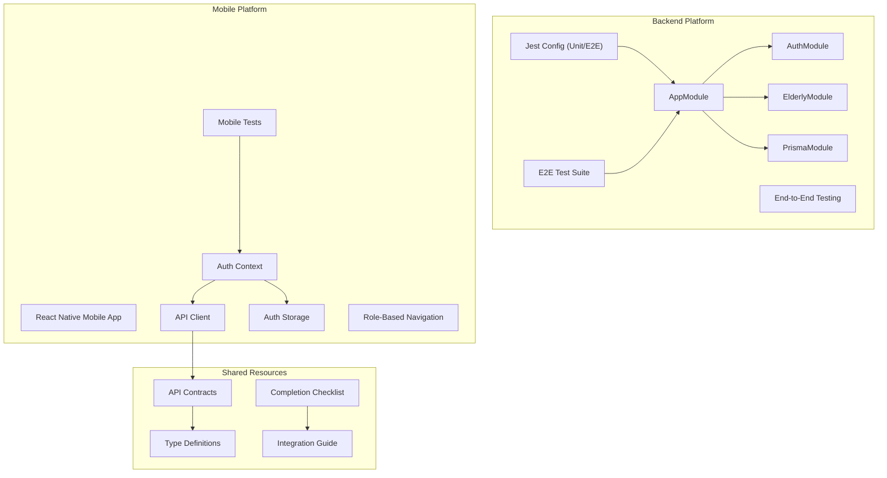

**Diagram sources**
- [app.module.ts:17-35](file://src/app.module.ts#L17-L35)
- [auth.module.ts:10-27](file://src/auth/auth.module.ts#L10-L27)
- [prisma.module.ts:4-9](file://src/prisma/prisma.module.ts#L4-L9)
- [package.json:71-87](file://package.json#L71-L87)
- [app.e2e-spec.ts:7-25](file://test/app.e2e-spec.ts#L7-L25)
- [AuthContext.tsx:29-177](file://mobile-app/src/contexts/AuthContext.tsx#L29-L177)
- [api.ts:11-44](file://mobile-app/src/services/api.ts#L11-L44)
- [authStorage.ts:7-45](file://mobile-app/src/lib/authStorage.ts#L7-L45)
- [API_CONTRACTS.md:1-520](file://mobile-app/API_CONTRACTS.md#L1-L520)
- [TYPE_DEFINITIONS.md:1-369](file://mobile-app/TYPE_DEFINITIONS.md#L1-L369)
- [COMPLETION_CHECKLIST.md:1-244](file://mobile-app/COMPLETION_CHECKLIST.md#L1-L244)
- [INTEGRATION_GUIDE.md:1-262](file://mobile-app/INTEGRATION_GUIDE.md#L1-L262)

**Section sources**
- [app.module.ts:17-35](file://src/app.module.ts#L17-L35)
- [package.json:71-87](file://package.json#L71-L87)
- [app.e2e-spec.ts:7-25](file://test/app.e2e-spec.ts#L7-L25)
- [schema.prisma:1-286](file://prisma/schema.prisma#L1-L286)
- [seed.ts:16-365](file://prisma/seed.ts#L16-L365)
- [AuthContext.tsx:29-177](file://mobile-app/src/contexts/AuthContext.tsx#L29-L177)
- [api.ts:11-44](file://mobile-app/src/services/api.ts#L11-L44)
- [authStorage.ts:7-45](file://mobile-app/src/lib/authStorage.ts#L7-L45)
- [API_CONTRACTS.md:1-520](file://mobile-app/API_CONTRACTS.md#L1-L520)
- [TYPE_DEFINITIONS.md:1-369](file://mobile-app/TYPE_DEFINITIONS.md#L1-L369)
- [COMPLETION_CHECKLIST.md:1-244](file://mobile-app/COMPLETION_CHECKLIST.md#L1-L244)
- [INTEGRATION_GUIDE.md:1-262](file://mobile-app/INTEGRATION_GUIDE.md#L1-L262)

## Core Components
- **Backend**: Application bootstrap initializes global prefix, CORS, validation pipes, and Swagger documentation. Central AppModule aggregates all domain modules and the Prisma module.
- **Mobile App**: React Native application with Expo Router for navigation, JWT-based authentication, and role-specific dashboards.
- **Testing Infrastructure**: Jest configuration for both backend and mobile app, comprehensive API contract validation, and completion verification procedures.
- **API Layer**: RESTful API with JWT authentication, role-based access control, and comprehensive endpoint documentation.

Key behaviors:
- Backend: Global prefix: api, CORS enabled with credentials, ValidationPipe configured with transformation and whitelisting, Swagger UI exposed at docs
- Mobile: Auth context manages JWT token lifecycle, AsyncStorage handles session persistence, role-based navigation with automatic redirection
- Testing: Comprehensive coverage for both platforms, API contract validation, and completion verification

**Section sources**
- [main.ts:6-42](file://src/main.ts#L6-L42)
- [app.module.ts:17-35](file://src/app.module.ts#L17-L35)
- [AuthContext.tsx:29-177](file://mobile-app/src/contexts/AuthContext.tsx#L29-L177)
- [api.ts:11-44](file://mobile-app/src/services/api.ts#L11-L44)
- [authStorage.ts:7-45](file://mobile-app/src/lib/authStorage.ts#L7-L45)
- [app/_layout.tsx:12-61](file://mobile-app/app/_layout.tsx#L12-L61)
- [app/index.tsx:5-33](file://mobile-app/app/index.tsx#L5-L33)

## Architecture Overview
The testing and deployment architecture centers around dual-platform testing with Jest, comprehensive API contract validation, and mobile app testing infrastructure.

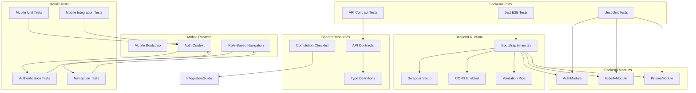

**Diagram sources**
- [main.ts:6-42](file://src/main.ts#L6-L42)
- [auth.module.ts:10-27](file://src/auth/auth.module.ts#L10-L27)
- [elderly.module.ts:6-12](file://src/elderly/elderly.module.ts#L6-L12)
- [prisma.module.ts:4-9](file://src/prisma/prisma.module.ts#L4-L9)
- [package.json:71-87](file://package.json#L71-L87)
- [AuthContext.tsx:29-177](file://mobile-app/src/contexts/AuthContext.tsx#L29-L177)
- [api.ts:11-44](file://mobile-app/src/services/api.ts#L11-L44)
- [authStorage.ts:7-45](file://mobile-app/src/lib/authStorage.ts#L7-L45)
- [app/_layout.tsx:12-61](file://mobile-app/app/_layout.tsx#L12-L61)
- [API_CONTRACTS.md:1-520](file://mobile-app/API_CONTRACTS.md#L1-L520)
- [TYPE_DEFINITIONS.md:1-369](file://mobile-app/TYPE_DEFINITIONS.md#L1-L369)
- [COMPLETION_CHECKLIST.md:1-244](file://mobile-app/COMPLETION_CHECKLIST.md#L1-L244)

## Detailed Component Analysis

### Backend Testing Strategy and Configuration
- **Unit tests**: Jest configured to transform TypeScript files, collect coverage across all ts files, and target spec files under src.
- **E2E tests**: Jest configuration tailored for e2e specs, executed via a dedicated script.
- **Coverage**: Enabled via a dedicated script; default Jest configuration collects coverage from all ts files.
- **Linting**: ESLint with TypeScript and Prettier recommended rules; includes Jest globals.

Recommended practices:
- Add unit tests for services and controllers with isolated PrismaService mocks.
- Use Nest TestingModule to compile minimal application for e2e tests.
- Leverage DTO validation in unit tests to assert class-validator constraints.
- Maintain separate test databases or use Prisma transactions to avoid cross-test contamination.

**Section sources**
- [package.json:71-87](file://package.json#L71-L87)
- [jest-e2e.json:1-10](file://test/jest-e2e.json#L1-L10)
- [eslint.config.mjs:14-35](file://eslint.config.mjs#L14-L35)
- [tsconfig.build.json:1-4](file://tsconfig.build.json#L1-L4)

### Authentication Service Testing Patterns
The authentication service orchestrates user creation, credential verification, and JWT issuance. Recommended testing patterns:
- Mock PrismaService to simulate user existence and password hashing.
- Validate error paths: duplicate email, duplicate phone, invalid credentials.
- Verify JWT payload composition and token generation.
- Confirm role-specific profile creation behavior.

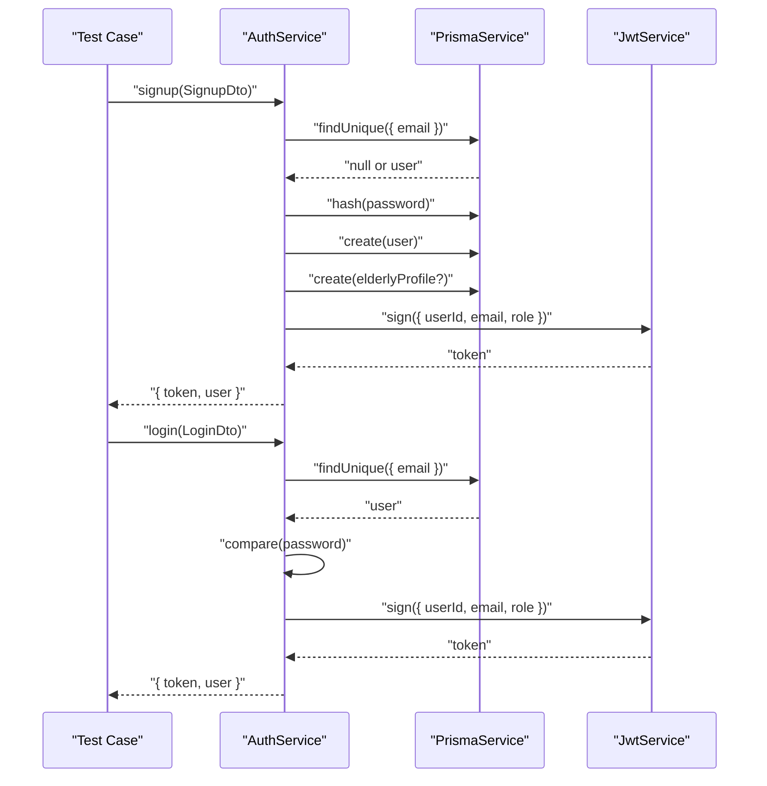

**Diagram sources**
- [auth.service.ts:23-100](file://src/auth/auth.service.ts#L23-L100)
- [auth.service.ts:102-135](file://src/auth/auth.service.ts#L102-L135)
- [login.dto.ts:4-12](file://src/auth/dto/login.dto.ts#L4-L12)

**Section sources**
- [auth.service.ts:14-173](file://src/auth/auth.service.ts#L14-L173)
- [login.dto.ts:4-12](file://src/auth/dto/login.dto.ts#L4-L12)

### E2E Testing Approach
The current e2e test initializes the full application module and asserts a GET response. Recommended enhancements:
- Add controller-level e2e tests for protected routes using JWT tokens.
- Integrate a test database and seed data per suite to ensure deterministic outcomes.
- Validate DTO transformations and validation errors.
- Include health checks and swagger accessibility tests.

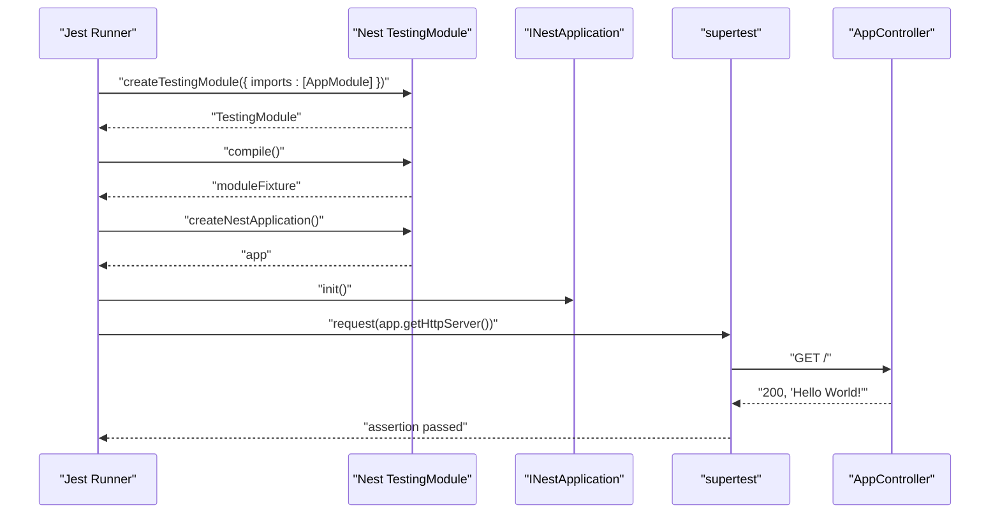

**Diagram sources**
- [app.e2e-spec.ts:10-24](file://test/app.e2e-spec.ts#L10-L24)

**Section sources**
- [app.e2e-spec.ts:7-25](file://test/app.e2e-spec.ts#L7-L25)

### Database Seeding and Migration Strategy
- **Seeding**: A seed script creates users, categories, offerings, medications, and agenda events for local development and testing.
- **Migration**: The Prisma schema defines the data model and datasource. Use Prisma CLI to generate and apply migrations during development.

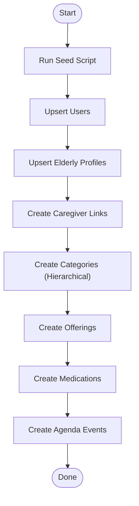

**Diagram sources**
- [seed.ts:16-365](file://prisma/seed.ts#L16-L365)

**Section sources**
- [schema.prisma:1-286](file://prisma/schema.prisma#L1-L286)
- [seed.ts:16-365](file://prisma/seed.ts#L16-L365)

### Environment Configuration and Secrets
- **Backend**: JWT secret is loaded via ConfigService from environment variables.
- **Mobile**: API base URL configured via environment variables, JWT token stored in AsyncStorage.
- **Database**: DATABASE_URL sourced from environment for Prisma.
- **CORS and global prefix**: Configured at backend bootstrap.

Recommendations:
- Define environment variables for JWT_SECRET and DATABASE_URL in CI/CD and production.
- Use a secrets manager for production deployments.
- Validate required environment variables at startup.
- Mobile: Configure EXPO_PUBLIC_API_URL for different environments.

**Section sources**
- [auth.module.ts:16-18](file://src/auth/auth.module.ts#L16-L18)
- [schema.prisma:8-11](file://prisma/schema.prisma#L8-L11)
- [main.ts:13-16](file://src/main.ts#L13-L16)
- [main.ts:37-40](file://src/main.ts#L37-L40)
- [api.ts:3-9](file://mobile-app/src/services/api.ts#L3-L9)

## Mobile App Testing Infrastructure

### Mobile Testing Architecture
The React Native mobile application implements a comprehensive testing infrastructure using React Native Testing Library and Jest. The testing architecture focuses on three main areas: authentication testing, navigation testing, and API integration testing.

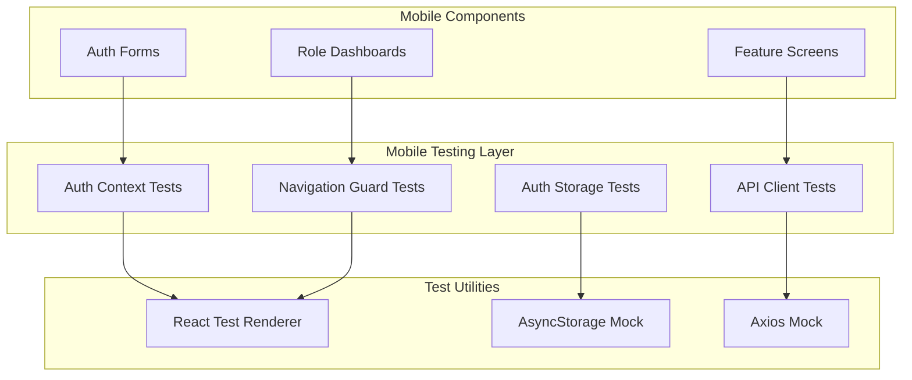

**Diagram sources**
- [auth.test.tsx:5-15](file://mobile-app/__tests__/auth.test.tsx#L5-L15)
- [AuthContext.tsx:29-177](file://mobile-app/src/contexts/AuthContext.tsx#L29-L177)
- [api.ts:11-44](file://mobile-app/src/services/api.ts#L11-L44)
- [authStorage.ts:7-45](file://mobile-app/src/lib/authStorage.ts#L7-L45)

### Authentication Testing Patterns
The mobile app implements comprehensive authentication testing covering login, signup, token persistence, and session restoration. The testing pattern ensures JWT token lifecycle management and error handling.

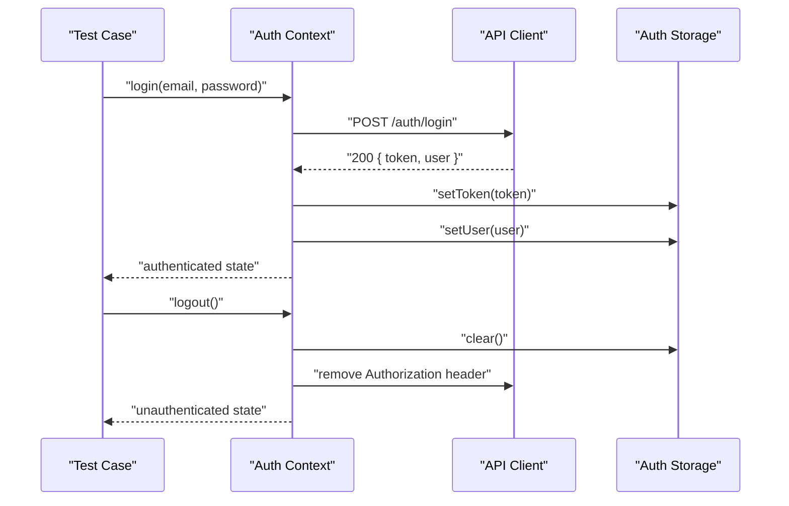

**Diagram sources**
- [AuthContext.tsx:85-140](file://mobile-app/src/contexts/AuthContext.tsx#L85-L140)
- [api.ts:16-22](file://mobile-app/src/services/api.ts#L16-L22)
- [authStorage.ts:41-44](file://mobile-app/src/lib/authStorage.ts#L41-L44)

### Navigation Testing Strategy
Role-based navigation testing ensures proper route protection and automatic redirection based on user roles. The testing strategy covers authentication guards, role-specific routing, and session restoration.

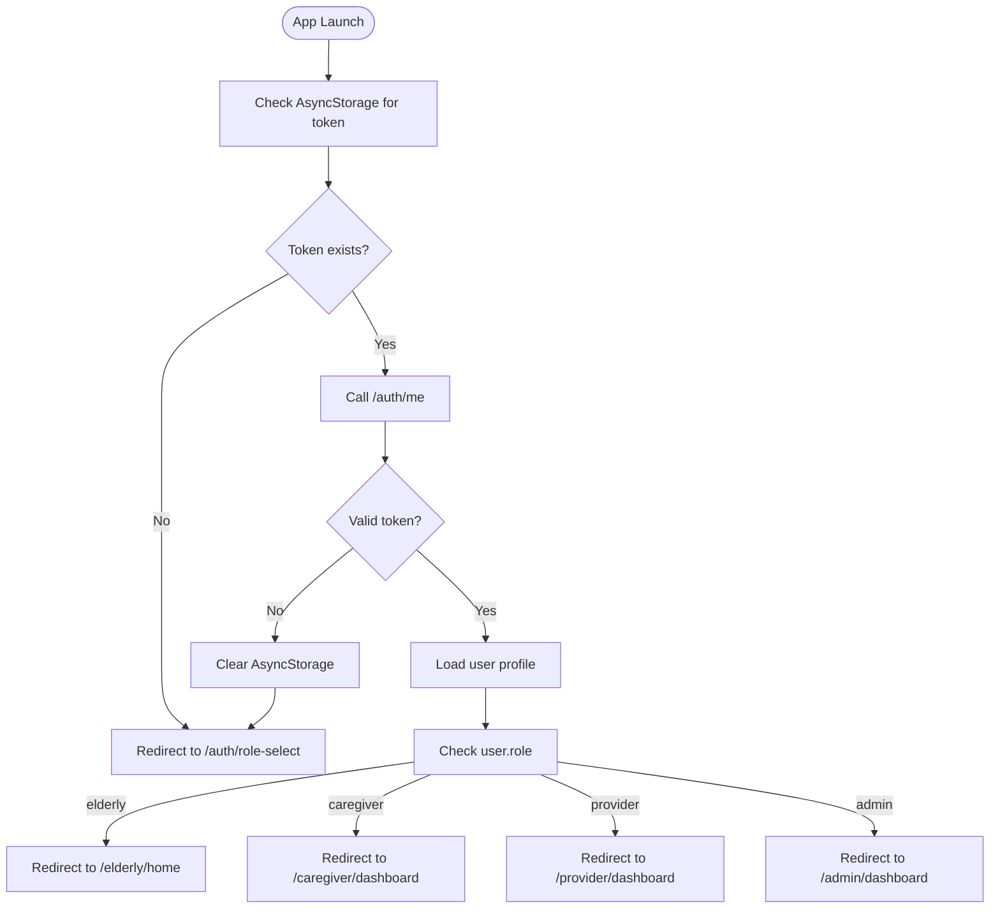

**Diagram sources**
- [app/_layout.tsx:20-40](file://mobile-app/app/_layout.tsx#L20-L40)
- [app/index.tsx:12-32](file://mobile-app/app/index.tsx#L12-L32)
- [AuthContext.tsx:49-83](file://mobile-app/src/contexts/AuthContext.tsx#L49-L83)

### API Client Testing
The API client testing focuses on base URL configuration, token injection, error handling, and request/response validation. The testing ensures proper API integration and error translation.

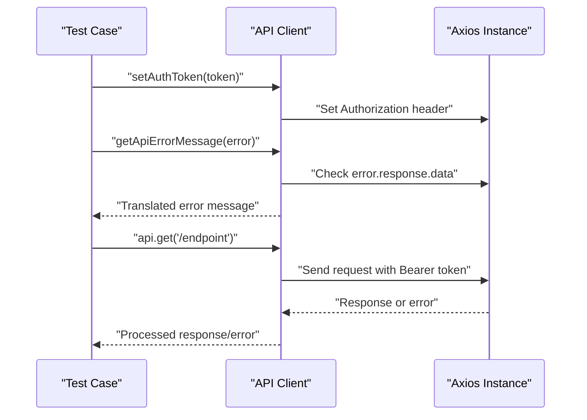

**Diagram sources**
- [api.ts:16-44](file://mobile-app/src/services/api.ts#L16-L44)

### Storage Layer Testing
Auth storage testing ensures proper token and user persistence across app sessions. The testing covers AsyncStorage operations, JSON serialization, and error handling.

**Diagram sources**
- [authStorage.ts:8-44](file://mobile-app/src/lib/authStorage.ts#L8-L44)

**Section sources**
- [auth.test.tsx:5-15](file://mobile-app/__tests__/auth.test.tsx#L5-L15)
- [AuthContext.tsx:29-177](file://mobile-app/src/contexts/AuthContext.tsx#L29-L177)
- [api.ts:11-44](file://mobile-app/src/services/api.ts#L11-L44)
- [authStorage.ts:7-45](file://mobile-app/src/lib/authStorage.ts#L7-L45)
- [app/_layout.tsx:12-61](file://mobile-app/app/_layout.tsx#L12-L61)
- [app/index.tsx:5-33](file://mobile-app/app/index.tsx#L5-L33)

## API Contract Testing

### API Contract Validation Framework
The API contract testing framework ensures backend implementation matches frontend expectations. The validation covers request/response schemas, authentication flows, and error handling patterns.

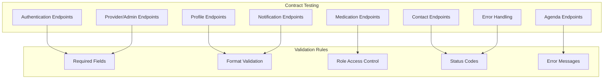

**Diagram sources**
- [API_CONTRACTS.md:5-520](file://mobile-app/API_CONTRACTS.md#L5-L520)
- [TYPE_DEFINITIONS.md:15-369](file://mobile-app/TYPE_DEFINITIONS.md#L15-L369)

### Authentication Flow Testing
Comprehensive testing of authentication endpoints including signup, login, and profile retrieval. The testing ensures JWT token generation, user object validation, and proper error handling.

### Role-Based Access Control Testing
Testing of role-specific endpoints ensuring proper authorization and data access patterns. The testing covers elderly, caregiver, provider, and admin role permissions.

### Data Validation Testing
Testing of request/response data validation including field formats, data types, and business rule enforcement. The testing ensures API contract compliance and error prevention.

**Section sources**
- [API_CONTRACTS.md:1-520](file://mobile-app/API_CONTRACTS.md#L1-L520)
- [TYPE_DEFINITIONS.md:1-369](file://mobile-app/TYPE_DEFINITIONS.md#L1-L369)

## Completion and Verification

### Implementation Completion Checklist
The completion checklist provides comprehensive verification of frontend-backend integration, covering all major implementation phases and verification criteria.

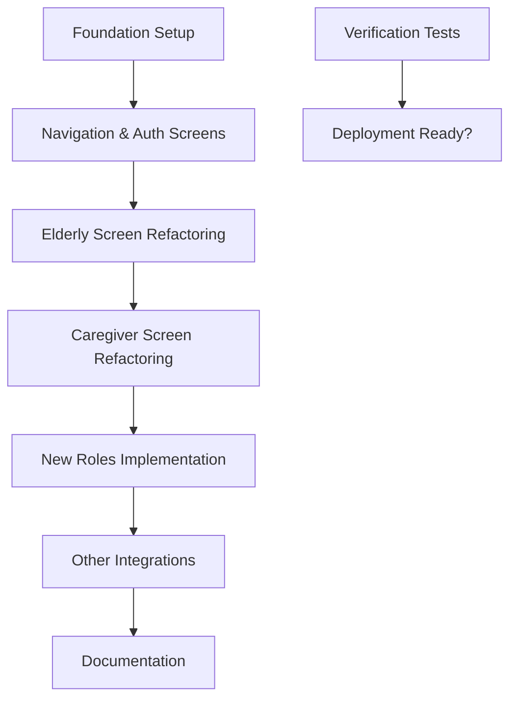

**Diagram sources**
- [COMPLETION_CHECKLIST.md:3-244](file://mobile-app/COMPLETION_CHECKLIST.md#L3-L244)

### Verification Testing Matrix
The verification testing matrix ensures comprehensive coverage of all integration points, API endpoints, and role-based functionality.

### Documentation Integration Testing
Testing of all documentation pages including navigation maps, integration guides, API contracts, and type definitions to ensure accuracy and completeness.

**Section sources**
- [COMPLETION_CHECKLIST.md:1-244](file://mobile-app/COMPLETION_CHECKLIST.md#L1-L244)
- [INTEGRATION_GUIDE.md:208-262](file://mobile-app/INTEGRATION_GUIDE.md#L208-L262)
- [FINAL_SUMMARY.md:115-149](file://mobile-app/FINAL_SUMMARY.md#L115-L149)

## Deployment Procedures

### Backend Deployment Strategy
The backend deployment strategy follows standard NestJS production practices with environment configuration, database migrations, and process management.

### Mobile App Deployment Strategy
The mobile app deployment utilizes Expo Application Services (EAS) for building and distributing applications across iOS and Android platforms.

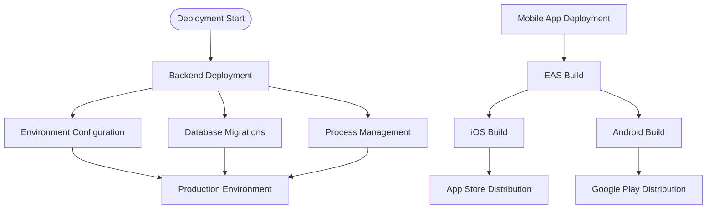

**Diagram sources**
- [INTEGRATION_GUIDE.md:65-69](file://mobile-app/INTEGRATION_GUIDE.md#L65-L69)
- [FINAL_SUMMARY.md:150-174](file://mobile-app/FINAL_SUMMARY.md#L150-L174)

### Environment Configuration
- **Backend**: NODE_ENV=production, JWT_SECRET, DATABASE_URL, CORS configuration
- **Mobile**: EXPO_PUBLIC_API_URL, environment-specific configurations

### CI/CD Pipeline Considerations
- **Backend**: Install dependencies, lint, build, run unit tests with coverage, run e2e tests, database migrations
- **Mobile**: Install dependencies, build for iOS/Android, run mobile tests, generate production builds

**Section sources**
- [package.json:8-21](file://package.json#L8-L21)
- [README.md:60-72](file://README.md#L60-L72)
- [INTEGRATION_GUIDE.md:37-50](file://mobile-app/INTEGRATION_GUIDE.md#L37-L50)
- [FINAL_SUMMARY.md:150-174](file://mobile-app/FINAL_SUMMARY.md#L150-L174)

## Dependency Analysis
The application's module dependencies form a cohesive tree rooted at AppModule. AuthModule depends on PrismaModule and configuration for JWT. PrismaModule exports PrismaService for use across services. The mobile app depends on the backend API for all functionality.

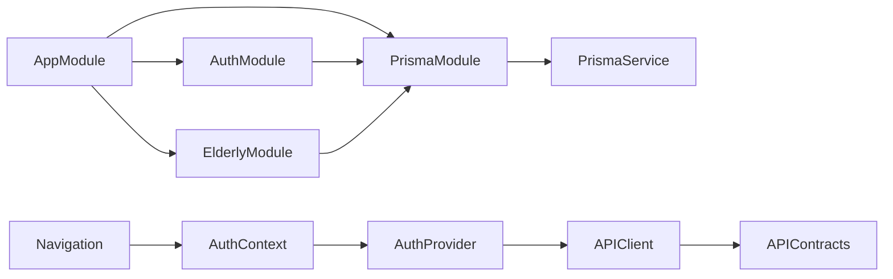

**Diagram sources**
- [app.module.ts:17-35](file://src/app.module.ts#L17-L35)
- [auth.module.ts:10-27](file://src/auth/auth.module.ts#L10-L27)
- [elderly.module.ts:6-12](file://src/elderly/elderly.module.ts#L6-L12)
- [prisma.module.ts:4-9](file://src/prisma/prisma.module.ts#L4-L9)
- [AuthContext.tsx:29-177](file://mobile-app/src/contexts/AuthContext.tsx#L29-L177)
- [api.ts:11-44](file://mobile-app/src/services/api.ts#L11-L44)
- [API_CONTRACTS.md:1-520](file://mobile-app/API_CONTRACTS.md#L1-L520)

**Section sources**
- [app.module.ts:17-35](file://src/app.module.ts#L17-L35)
- [auth.module.ts:10-27](file://src/auth/auth.module.ts#L10-L27)
- [prisma.module.ts:4-9](file://src/prisma/prisma.module.ts#L4-L9)
- [AuthContext.tsx:29-177](file://mobile-app/src/contexts/AuthContext.tsx#L29-L177)
- [api.ts:11-44](file://mobile-app/src/services/api.ts#L11-L44)

## Performance Considerations
- **Backend**: Use ValidationPipe to prevent unnecessary work on invalid inputs, optimize database queries with Prisma indexing.
- **Mobile**: Implement efficient API calls with proper caching, minimize re-renders with React.memo, optimize navigation transitions.
- **Both Platforms**: Use environment-specific configurations, implement proper error boundaries, and monitor performance metrics.

## Troubleshooting Guide
Common issues and resolutions:
- **Backend**: Port conflicts, CORS errors, JWT signature errors, database connection failures, E2E test flakiness.
- **Mobile**: API connection failures, token expiration, authentication errors, navigation issues, AsyncStorage problems.
- **Integration**: API contract mismatches, role-based access issues, session persistence problems.

**Section sources**
- [main.ts:37-40](file://src/main.ts#L37-L40)
- [auth.module.ts:16-18](file://src/auth/auth.module.ts#L16-L18)
- [schema.prisma:8-11](file://prisma/schema.prisma#L8-L11)
- [app.e2e-spec.ts:10-17](file://test/app.e2e-spec.ts#L10-L17)
- [INTEGRATION_GUIDE.md:223-243](file://mobile-app/INTEGRATION_GUIDE.md#L223-L243)

## Conclusion
The 99-Pai platform provides a comprehensive testing and deployment framework with dual-platform support for both NestJS backend and React Native mobile application. The integration of mobile app testing infrastructure, API contract validation, and completion verification procedures ensures reliable operation across all components. By leveraging the documented testing strategies, deployment procedures, and troubleshooting guides, teams can effectively maintain and scale the platform.

## Appendices
- Additional resources and links are available in the project README for deployment and community support.
- Mobile app documentation includes comprehensive integration guides, API contracts, and testing procedures.
- Backend documentation provides detailed API documentation and deployment instructions.

**Section sources**
- [README.md:73-84](file://README.md#L73-L84)
- [INTEGRATION_GUIDE.md:1-262](file://mobile-app/INTEGRATION_GUIDE.md#L1-L262)
- [API_CONTRACTS.md:1-520](file://mobile-app/API_CONTRACTS.md#L1-L520)
- [COMPLETION_CHECKLIST.md:1-244](file://mobile-app/COMPLETION_CHECKLIST.md#L1-L244)