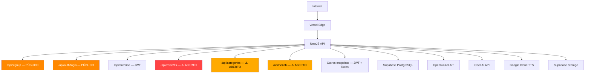

# 🛡️ Relatório de Auditoria de Segurança — 99-Pai

**Data:** 2026-04-24  
**Escopo:** Monorepo completo (`packages/backend`, `packages/mobile`, `supabase/`)  
**Metodologia:** OWASP Top 10:2025 + Supply Chain + Cloud Security  
**Auditor:** Security Auditor Agent (vulnerability-scanner skill)

---

## 📊 Resumo Executivo

| Severidade | Quantidade | Status |
|------------|-----------|--------|
| 🔴 **CRITICAL** | 3 | Ação imediata necessária |
| 🟠 **HIGH** | 6 | Corrigir antes do próximo deploy |
| 🟡 **MEDIUM** | 7 | Planejar para sprint atual |
| 🟢 **LOW** | 5 | Melhorias de hardening |
| **Total** | **21** | |

---

## 🔴 CRITICAL — Ação Imediata

### C1. Segredos Expostos no `.env` — Risco de Comprometimento Total

> [!CAUTION]
> O arquivo `.env` na raiz contém **TODAS** as chaves sensíveis em texto plano. Embora esteja no `.gitignore`, qualquer acesso ao workspace compromete o sistema inteiro.

**Onde:** [.env](file:///d:/VS%20Code/99-Pai/.env)  
**O que foi encontrado:**
- `DATABASE_URL` com senha do PostgreSQL em texto plano (linha 1)
- `JWT_SECRET` em texto plano (linha 3)
- `SUPABASE_SERVICE_ROLE_KEY` — chave que bypassa RLS completamente (linha 12)
- `SUPABASE_ACCESS_TOKEN` — acesso ao painel Supabase (linha 7)
- `OPENROUTER_API_KEY` (linha 18)
- `OPENAI_API_KEY` (linha 25)

**Impacto:** Comprometimento total do banco de dados, bypass de toda segurança RLS, acesso a APIs de terceiros com custo financeiro.

**Remediação:**
1. **Rotacionar IMEDIATAMENTE** todas as chaves que já foram commitadas em algum ponto
2. Usar variáveis de ambiente do Vercel (já parcialmente feito) — nunca ter o `.env` root com chaves de produção
3. Verificar histórico git: `git log --all -p -- .env` para confirmar que nunca foi commitado
4. Considerar Supabase Vault ou um gerenciador de segredos para produção

---

### C2. `SUPABASE_SERVICE_ROLE_KEY` Usado no Backend — Bypass Total de RLS

> [!CAUTION]
> O backend usa `SERVICE_ROLE_KEY` para todas as operações, o que bypassa completamente todas as políticas RLS.

**Onde:** [supabase.service.ts](file:///d:/VS%20Code/99-Pai/packages/backend/src/supabase/supabase.service.ts#L11)

```typescript
const key = process.env.SUPABASE_SERVICE_ROLE_KEY; // L11
this.client = createClient<Database>(url, key, { ... }); // L17
```

**Por quê é perigoso:** Se qualquer endpoint do backend tiver uma falha de autorização, o atacante tem acesso irrestrito a TODAS as tabelas, ignorando RLS. Isso transforma cada bug de autorização em um comprometimento total.

**Impacto:** Vulnerabilidade de design — uma única falha de autorização expõe todos os dados.

**Remediação:**
1. Para queries que precisam de contexto de usuário, usar o `anon key` + JWT do Supabase Auth (Row Level Security efetivo)
2. Reservar `SERVICE_ROLE_KEY` APENAS para operações administrativas em Edge Functions
3. Implementar middleware que injeta o contexto do usuário nas queries

---

### C3. Endpoint `/api/voice/tts` Totalmente Aberto — Sem Autenticação

> [!CAUTION]
> O endpoint TTS não tem `@UseGuards(JwtAuthGuard)`, permitindo que QUALQUER pessoa na internet gere áudio consumindo suas APIs OpenRouter/OpenAI pagas.

**Onde:** [voice.controller.ts](file:///d:/VS%20Code/99-Pai/packages/backend/src/voice/voice.controller.ts#L12)

```typescript
@Get('tts') // SEM @UseGuards — ABERTO!
async tts(@Query() query: TtsQueryDto, @Res() response: Response) {
```

**Impacto:**
- **Financeiro direto:** Um atacante pode enviar milhares de requests, consumindo créditos OpenRouter ($), OpenAI ($), e Google Cloud TTS ($)
- **DDoS amplificado:** Cada request gera uma chamada externa pesada
- **Abuso de storage:** TTS cache enche o Supabase Storage sem controle

**Remediação:**
```typescript
@UseGuards(JwtAuthGuard)
@Get('tts')
async tts(@Query() query: TtsQueryDto, @Res() response: Response) {
```

---

## 🟠 HIGH — Corrigir Antes do Próximo Deploy

### H1. Custo de Hash de Senha Insuficiente (bcrypt cost = 10)

**Onde:** [auth.service.ts:79](file:///d:/VS%20Code/99-Pai/packages/backend/src/auth/auth.service.ts#L79)

```typescript
const hashedPassword = await bcrypt.hash(password, 10);
```

**Por quê:** O OWASP recomenda um cost factor **mínimo de 12** para bcrypt em 2025. Com hardware moderno (GPUs), cost 10 é quebrável em tempo razoável para senhas fracas.

**Remediação:** Aumentar para `12` ou superior:
```typescript
const hashedPassword = await bcrypt.hash(password, 12);
```

---

### H2. JWT Token com Validade de 7 Dias — Sem Refresh Token

**Onde:** [auth.module.ts:18](file:///d:/VS%20Code/99-Pai/packages/backend/src/auth/auth.module.ts#L18)

```typescript
signOptions: { expiresIn: '7d' },
```

**Por quê:** Um token roubado (XSS, man-in-the-middle) dá acesso por 7 dias inteiros. Não existe mecanismo de revogação ou refresh.

**Remediação:**
1. Reduzir `expiresIn` para `15m` (15 minutos)
2. Implementar refresh token com validade de 7d armazenado em httpOnly cookie
3. Endpoint `/auth/refresh` para renovar o access token
4. Blacklist de tokens revogados (ou usar versioning no JWT payload)

---

### H3. Endpoint de Categorias GET Sem Autenticação

**Onde:** [categories.controller.ts:35-44](file:///d:/VS%20Code/99-Pai/packages/backend/src/categories/categories.controller.ts#L35-L44)

```typescript
@Get()       // SEM GUARD
async findAll() { ... }

@Get(':id')  // SEM GUARD
async findOne(@Param('id', ParseUUIDPipe) id: string) { ... }
```

**Por quê:** Embora categorias possam ser semi-públicas por design, a ausência de guard é intencional? Se sim, documentar explicitamente. Caso contrário, adicionar autenticação.

**Remediação:** Se intencional, adicionar rate limiting extra para endpoints públicos. Se não, adicionar `@UseGuards(JwtAuthGuard)`.

---

### H4. Endpoint `/api/health` Sem Autenticação — Expõe Status Interno

**Onde:** [health.controller.ts](file:///d:/VS%20Code/99-Pai/packages/backend/src/health/health.controller.ts)

**Por quê:** O health check expõe status do Supabase/database. Atacantes podem usar para reconhecimento (saber se o DB está UP/DOWN, tecnologias usadas).

**Remediação:** Considerar limitar health check completo a IPs internos ou tokens especiais. Manter um `/health/ping` público que retorna apenas `200 OK`.

---

### H5. Password Policy Muito Fraca — Apenas `MinLength(6)`

**Onde:** [signup.dto.ts:18](file:///d:/VS%20Code/99-Pai/packages/backend/src/auth/dto/signup.dto.ts#L18)

```typescript
@MinLength(6) // Muito fraco!
password!: string;
```

**Impacto:** Senhas como `123456` ou `aaaaaa` são aceitas, vulneráveis a ataques de dicionário.

**Remediação:**
```typescript
@MinLength(8)
@MaxLength(128)
@Matches(/^(?=.*[a-z])(?=.*[A-Z])(?=.*\d)/, {
  message: 'Senha deve conter ao menos uma letra maiúscula, uma minúscula e um número',
})
password!: string;
```

---

### H6. Login Sem Proteção Contra Brute Force — Apenas ThrottlerGuard Global

**Onde:** [auth.controller.ts:27-32](file:///d:/VS%20Code/99-Pai/packages/backend/src/auth/auth.controller.ts#L27-L32)

**Por quê:** O ThrottlerGuard global (60 req/min) é por IP, não por conta. Um atacante pode distribuir requests por múltiplos IPs. Não há lockout de conta após N tentativas falhas.

**Remediação:**
1. Implementar lockout de conta (15 min após 5 tentativas)
2. Adicionar delay exponencial nas respostas
3. Considerar CAPTCHA após 3 tentativas falhas
4. Rate limit específico no login (ex: 5 req/min por IP+email)

---

## 🟡 MEDIUM — Planejar para Sprint Atual

### M1. CORS Permite Requests Sem Origin (origin = undefined)

**Onde:** [bootstrap-config.ts:33-35](file:///d:/VS%20Code/99-Pai/packages/backend/src/bootstrap-config.ts#L33-L35)

```typescript
if (!origin) {
  callback(null, true); // Permite TODAS requests sem origin
  return;
}
```

**Por quê:** Requests server-to-server, cURL, e Postman não enviam origin header. Isso permite que qualquer server-side script acesse a API sem restrições CORS.

**Impacto:** Baixo se a API já requer JWT, mas perigoso para endpoints sem auth (TTS, categories, health).

---

### M2. Regex CORS Muito Permissivo para Preview Deployments

**Onde:** [bootstrap-config.ts:39-41](file:///d:/VS%20Code/99-Pai/packages/backend/src/bootstrap-config.ts#L39-L41)

```typescript
const isWebPreview = /^https:\/\/99pai-[a-z0-9-]+-jairosouza67-5313s-projects\.vercel\.app$/.test(
  normalizedOrigin,
);
```

**Por quê:** Qualquer subdomain matching `99pai-*-jairosouza67-5313s-projects.vercel.app` é aceito. Se um atacante conseguir criar um deployment com esse padrão (pouco provável, mas possível), teria acesso CORS completo.

---

### M3. Helmet Configurado com `crossOriginResourcePolicy: 'cross-origin'`

**Onde:** [bootstrap-config.ts:62-64](file:///d:/VS%20Code/99-Pai/packages/backend/src/bootstrap-config.ts#L62-L64)

**Por quê:** Isso relaxa a proteção padrão do Helmet para permitir carregamento cross-origin de recursos. Pode ser necessário para o TTS, mas deve ser aplicado apenas nas rotas que precisam.

---

### M4. Tokens OIDC do Vercel Commitados em Arquivos `.env.local` e `.env.production`

**Onde:**
- [packages/backend/.env.local](file:///d:/VS%20Code/99-Pai/packages/backend/.env.local)
- [packages/backend/.env.production](file:///d:/VS%20Code/99-Pai/packages/backend/.env.production)
- [packages/mobile/.env.local](file:///d:/VS%20Code/99-Pai/packages/mobile/.env.local)

**Por quê:** Esses arquivos contêm `VERCEL_OIDC_TOKEN` em texto plano. Embora sejam de curta duração, o `.gitignore` não os ignora adequadamente (`.env.local` está ignorado, mas `.env.production` NÃO está explicitamente listado).

**Remediação:** Adicionar `.env.production` ao `.gitignore`:
```gitignore
.env.production
```

---

### M5. Vulnerabilidades Conhecidas em Dependências (npm audit)

**Descoberta:** `npm audit` retornou vulnerabilidades de severidade **moderate** em:
- `@angular-devkit/core` (via `ajv`, `picomatch`)
- `@nestjs/cli` (transitivo)

**Remediação:**
```bash
npm audit fix
```

---

### M6. Dados de Login Logados com Email — Sem Mascaramento

**Onde:** [auth.service.ts:120](file:///d:/VS%20Code/99-Pai/packages/backend/src/auth/auth.service.ts#L120) e [auth.service.ts:163](file:///d:/VS%20Code/99-Pai/packages/backend/src/auth/auth.service.ts#L163)

```typescript
this.logger.log(`User signed up: ${email} (${role})`);
this.logger.log(`User logged in: ${email}`);
```

**Por quê:** Emails são PII (dados pessoais). Logs de produção no Vercel podem ser acessados por qualquer membro do time, e emails em plain text violam LGPD.

**Remediação:** Mascarar email nos logs:
```typescript
const maskedEmail = email.replace(/(.{2})(.*)(@.*)/, '$1***$3');
this.logger.log(`User logged in: ${maskedEmail}`);
```

---

### M7. `nestjs-core-11.0.1.tgz` — Arquivo de Pacote Local na Raiz

**Onde:** [nestjs-core-11.0.1.tgz](file:///d:/VS%20Code/99-Pai/nestjs-core-11.0.1.tgz) (116KB)

**Por quê:** Arquivo `.tgz` de pacote npm na raiz do projeto. Pode conter versão modificada/maliciosa do NestJS core. Não deveria existir no repositório.

**Remediação:** Remover e usar o pacote do npm registry:
```bash
rm nestjs-core-11.0.1.tgz
```

---

## 🟢 LOW — Melhorias de Hardening

### L1. Swagger Docs Disponíveis em Desenvolvimento — Verificar Produção

**Onde:** [bootstrap-config.ts:67-79](file:///d:/VS%20Code/99-Pai/packages/backend/src/bootstrap-config.ts#L67-L79)

**Análise:** ✅ Já está protegido com `if (process.env.NODE_ENV !== 'production')`. Verifique que `NODE_ENV=production` está configurado no Vercel.

---

### L2. `ConfigModule.envFilePath` Aponta para Path Relativo

**Onde:** [app.module.ts:27](file:///d:/VS%20Code/99-Pai/packages/backend/src/app.module.ts#L27)

```typescript
envFilePath: join(__dirname, '../../../.env'),
```

**Por quê:** Depende da estrutura de diretórios. Em serverless (Vercel), isso pode não funcionar como esperado. Usar variáveis de ambiente do runtime é mais confiável.

---

### L3. `@User() user: any` — Tipo Não Tipado no Controller

**Onde:** [auth.controller.ts:40](file:///d:/VS%20Code/99-Pai/packages/backend/src/auth/auth.controller.ts#L40)

**Por quê:** `any` bypassa TypeScript. Se o payload JWT mudar, não há proteção de compilação. Criar uma interface `JwtPayload`.

---

### L4. Request ID Aceita Header Externo Sem Validação

**Onde:** [request-id.interceptor.ts:25-33](file:///d:/VS%20Code/99-Pai/packages/backend/src/common/interceptors/request-id.interceptor.ts#L25-L33)

**Por quê:** O `x-request-id` é aceito do cliente sem validação de formato. Um atacante poderia injetar valores maliciosos que acabam nos logs (log injection).

**Remediação:** Validar formato UUID:
```typescript
const isValidUuid = /^[0-9a-f]{8}-[0-9a-f]{4}-[0-9a-f]{4}-[0-9a-f]{4}-[0-9a-f]{12}$/i;
const requestId = (typeof incomingId === 'string' && isValidUuid.test(incomingId))
  ? incomingId
  : randomUUID();
```

---

### L5. TTS Cache Sem Limite de Tamanho Total

**Onde:** [voice.service.ts](file:///d:/VS%20Code/99-Pai/packages/backend/src/voice/voice.service.ts)

**Por quê:** Cada texto único gera um arquivo MP3 no Supabase Storage. Sem limpeza periódica, o bucket pode crescer indefinidamente. Combinado com C3 (TTS sem auth), isso é um vetor de storage abuse.

---

## ✅ Pontos Positivos Encontrados

| Item | Detalhes |
|------|----------|
| ✅ RLS habilitado em todas as tabelas | Migration `0002_enable_rls.sql` cobre todas as 13 tabelas |
| ✅ Helmet ativado | Headers de segurança configurados globalmente |
| ✅ ValidationPipe com `whitelist` e `forbidNonWhitelisted` | Rejeita campos não declarados nos DTOs |
| ✅ ThrottlerGuard global | Rate limiting de 60 req/min |
| ✅ Role-based access control | Guards implementados em controllers sensíveis |
| ✅ Password hashing com bcrypt | Nunca armazena senhas em texto plano |
| ✅ JWT com `ignoreExpiration: false` | Tokens expirados são rejeitados |
| ✅ Defense against privileged role signup | `AuthService` bloqueia signup com role `admin` |
| ✅ CORS configurado (não `*`) | Origins explícitas, não wildcard |
| ✅ Request ID para rastreamento | Interceptor adiciona UUID em cada request |
| ✅ TTS input validation | `MaxLength(600)` + sanitização de whitespace |
| ✅ Supabase Storage policies | TTS bucket com policies para read público e write restrito |
| ✅ Link code hardening | Expiração, lock e contagem de tentativas |
| ✅ `console.log` ausente no backend src | Zero ocorrências — usando Logger do NestJS |

---

## 🗺️ Mapa de Superfície de Ataque



---

## 📋 Prioridade de Correção

| Prioridade | ID | Ação | Esforço |
|-----------|-----|------|---------|
| 1️⃣ | C3 | Adicionar `@UseGuards(JwtAuthGuard)` no VoiceController | 5 min |
| 2️⃣ | C1 | Rotacionar todas as chaves expostas | 30 min |
| 3️⃣ | H1 | Aumentar bcrypt cost para 12 | 2 min |
| 4️⃣ | H5 | Fortalecer password policy | 10 min |
| 5️⃣ | H6 | Implementar brute force protection no login | 1-2h |
| 6️⃣ | H2 | Implementar refresh token | 4-6h |
| 7️⃣ | M4 | Adicionar `.env.production` ao `.gitignore` | 1 min |
| 8️⃣ | M7 | Remover `nestjs-core-11.0.1.tgz` | 1 min |
| 9️⃣ | M6 | Mascarar emails nos logs | 10 min |
| 🔟 | L4 | Validar formato do request ID | 5 min |

---

> **Lembre-se:** Este relatório é um snapshot. Segurança é contínua. Recomendo rodar esta auditoria a cada sprint e antes de cada deploy de produção.
