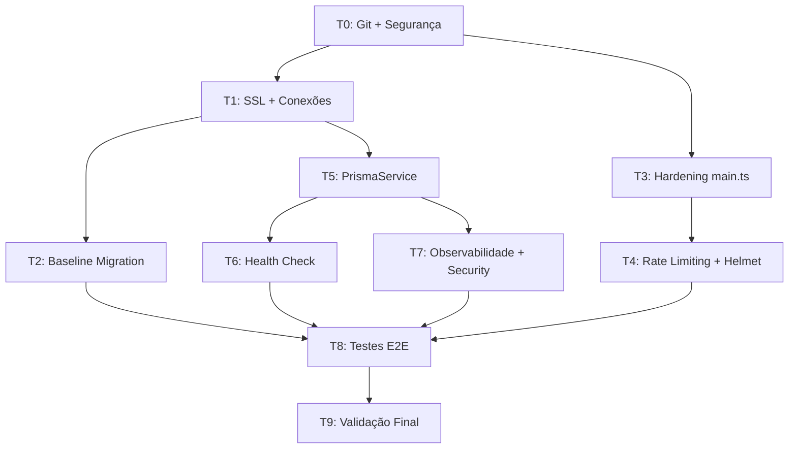

# 🗺️ Plano de Execução — Migração Supabase Backend (99-Pai)

> **Formato**: Ralph Loop — cada TASK é independente, atômica, e pode ser executada em uma nova conversa.
> **Contexto**: Forneça este arquivo como `@[SUPABASE_EXECUTION_PLAN.md]` ao iniciar cada conversa.
> **Fonte**: Baseado em [SUPABASE_BACKEND_MIGRATION_PLAN.md](file:///d:/VS%20Code/99-Pai/SUPABASE_BACKEND_MIGRATION_PLAN.md)

---

## 📊 Status Geral

| Task | Nome | Fase | Status | Notas |
|------|------|------|--------|-------|
| T0 | Git Init + Segurança de Credenciais | Fase 0 | `✅ CONCLUÍDO` | 2026-03-31: git init + commit inicial + .env.example + JWT_SECRET rotacionado; credenciais DB atualizadas |
| T1 | SSL + Conexões Prisma/Supabase | Fase 1 | `✅ CONCLUÍDO` | 2026-03-31: pooler hostname corrigido (aws-0); conexao SSL OK via direta 5432 (pooler desabilitado no projeto); db pull + generate OK |
| T2 | Baseline Migration | Fase 1 | `✅ CONCLUÍDO` | 2026-03-31: baseline SQL gerado e marcado como applied; migrate status OK |
| T3 | Hardening main.ts (CORS, Swagger, Logger) | Fase 1 | `✅ CONCLUÍDO` | 2026-03-31: CORS por allowlist via env, Swagger dev-only e Logger NestJS; build OK |
| T4 | Rate Limiting + Helmet | Fase 1 | `✅ CONCLUÍDO` | 2026-03-31: @nestjs/throttler + helmet configurados globalmente; build OK |
| T5 | PrismaService Hardening | Fase 1 | `✅ CONCLUÍDO` | 2026-03-31: Logger + event listeners implementados; runtime validado - "Database connected" OK |
| T6 | Health Check Endpoint | Fase 1 | `✅ CONCLUÍDO` | 2026-03-31: HealthModule + /api/health + Prisma indicator; runtime OK - retorna 200 com database:up |
| T7 | Observabilidade + Security Fixes | Fase 1 | `✅ CONCLUÍDO` | 2026-03-31: linkCode com crypto, interceptor global de request-id, zero console.log/Math.random; runtime OK |
| T8 | Testes de Regressão E2E | Fase 1 | `✅ CONCLUÍDO` | 2026-03-31: 36 testes E2E (15 auth/health/public + 21 elderly/caregiver); 2 skipped (categoria UUID + rate limit flaky) |
| T9 | Validação Final + Smoke Test | Fase 1 | `✅ CONCLUÍDO` | 2026-03-31: build OK, lint OK (162 strict-mode warnings pre-existing), migrate status OK, E2E 37 pass/2 skip, zero console.log/Math.random |

**Legenda**: `⬜ PENDENTE` · `🔄 EM PROGRESSO` · `✅ CONCLUÍDO` · `❌ BLOQUEADO`

---

## 🔍 Descobertas da Auditoria (pré-execução)

| Item | Descoberta |
|------|-----------|
| Git | **Repositório não inicializado** — sem `.git` no diretório |
| `.env` | Credenciais reais em texto plano (senha banco + JWT_SECRET) |
| `.gitignore` | Já contém `.env` (bom, mas sem git, não adianta) |
| `DIRECT_URL` | Declarada no `schema.prisma` mas **não existe no `.env`** |
| `DATABASE_URL` | Porta 5432 (direta), sem SSL, sem pooler |
| `prisma/migrations/` | **Não existe** — zero histórico de migrations |
| `main.ts` | CORS `origin: true`, Swagger sem proteção, `console.log` |
| `auth.service.ts` | `Math.random()` no `generateLinkCode` (inseguro) |
| `prisma.service.ts` | Sem logging, sem error events |
| Throttler/Helmet | **Não instalados** |
| Health check | **Não existe** |

---

## ⚡ TASK T0: Git Init + Segurança de Credenciais

**Fase**: 0 — URGENTE
**Status**: `🔄 EM PROGRESSO`
**Objetivo**: Inicializar git, proteger credenciais, rotacionar segredos.

### Escopo

| # | Ação | Arquivo/Local |
|---|------|---------------|
| 1 | Inicializar repositório git | raiz do projeto |
| 2 | Verificar `.gitignore` (já tem `.env` ✅) | `.gitignore` |
| 3 | Adicionar entradas extras ao `.gitignore` | `.gitignore` |
| 4 | Criar `.env.example` atualizado (sem valores reais) | `.env.example` |
| 5 | Commit inicial (sem `.env`) | git |
| 6 | Rotacionar senha do banco no Supabase Dashboard | **MANUAL — usuário** |
| 7 | Gerar novo `JWT_SECRET` | terminal |
| 8 | Atualizar `.env` local com novos valores | `.env` |

### Comandos

```bash
# 1. Inicializar git
git init

# 2. Verificar gitignore
cat .gitignore  # deve conter: .env, node_modules, /generated/prisma

# 3. Atualizar .gitignore (adicionar)
# Adicionar: dist/, .env.local, .env.*.local, *.log

# 4. Primeiro commit
git add .
git commit -m "chore: initial commit — NestJS + Prisma + Supabase backend"

# 5. Gerar novo JWT_SECRET
node -e "console.log(require('crypto').randomBytes(64).toString('base64'))"
```

### .env.example (template seguro)

```env
# Runtime: pooler com transaction mode (porta 6543)
DATABASE_URL=postgresql://postgres.<project-ref>:<password>@aws-0-<region>.pooler.supabase.com:6543/postgres?sslmode=require&connection_limit=5

# Migrations: conexão direta (porta 5432)
DIRECT_URL=postgresql://postgres:<password>@db.<project-ref>.supabase.co:5432/postgres?sslmode=require

# Auth
JWT_SECRET=<gerar-com-crypto-randomBytes-64>

# App
PORT=3000
NODE_ENV=development
CORS_ORIGINS=http://localhost:3000,http://localhost:8081
```

### Validação

- [ ] `git log --oneline` mostra commit inicial
- [ ] `git ls-files .env` retorna vazio (não tracked)
- [ ] `.env` local com nova senha e novo JWT_SECRET
- [ ] `.env.example` commitado com template

### Ação manual do usuário

> [!CAUTION]
> **ANTES de prosseguir para T1**, o usuário DEVE:
> 1. Ir ao Supabase Dashboard → Settings → Database → Reset database password
> 2. Copiar nova senha e atualizar `DATABASE_URL` e `DIRECT_URL` no `.env`
> 3. A senha antiga (`8824Fire@#$`) está comprometida neste arquivo

---

## ⚡ TASK T1: SSL + Conexões Prisma/Supabase

**Fase**: 1
**Status**: `✅ CONCLUÍDO`
**Depende de**: T0
**Objetivo**: Configurar conexões corretas (pooler 6543 + direta 5432) com SSL.

### Escopo

| # | Ação | Arquivo |
|---|------|---------|
| 1 | Atualizar `DATABASE_URL` para pooler porta 6543 + SSL | `.env` |
| 2 | Adicionar `DIRECT_URL` porta 5432 + SSL | `.env` |
| 3 | Confirmar `schema.prisma` já usa `directUrl` | `prisma/schema.prisma` (sem alteração) |
| 4 | Adicionar `NODE_ENV` e `CORS_ORIGINS` ao `.env` | `.env` |
| 5 | Testar conectividade | terminal |

### Formato das URLs

```env
# Pooler (runtime) — porta 6543
DATABASE_URL=postgresql://postgres.<project-ref>:<NOVA-SENHA>@aws-0-<region>.pooler.supabase.com:6543/postgres?sslmode=require&connection_limit=5

# Direta (migrations) — porta 5432
DIRECT_URL=postgresql://postgres:<NOVA-SENHA>@db.<project-ref>.supabase.co:5432/postgres?sslmode=require
```

### Validação

```bash
# Testar conexão runtime
npx prisma db pull

# Testar geração de client
npx prisma generate

# Verificar se conecta
npm run start:dev
# → Deve subir sem erros de conexão
```

- [ ] `DATABASE_URL` com porta 6543 + `sslmode=require` + `connection_limit=5`
- [ ] `DIRECT_URL` com porta 5432 + `sslmode=require`
- [ ] `npx prisma db pull` executa sem erros
- [ ] `npm run start:dev` conecta e sobe o servidor

### Commit

```
git add .env.example prisma/schema.prisma
git commit -m "feat: configure supabase pooler + direct URLs with SSL"
```

---

## ⚡ TASK T2: Baseline Migration

**Fase**: 1
**Status**: `🔄 EM PROGRESSO`
**Depende de**: T1
**Objetivo**: Criar migration baseline a partir do schema existente.

### Escopo

| # | Ação | Arquivo/Local |
|---|------|---------------|
| 1 | Criar diretório `prisma/migrations/0_init/` | diretório |
| 2 | Gerar SQL baseline | `prisma/migrations/0_init/migration.sql` |
| 3 | Marcar como aplicada | prisma |
| 4 | Verificar status | prisma |

### Comandos

```bash
# 1. Criar diretório
mkdir -p prisma/migrations/0_init

# 2. Gerar SQL baseline
npx prisma migrate diff --from-empty --to-schema-datamodel prisma/schema.prisma --script > prisma/migrations/0_init/migration.sql

# 3. Marcar como já aplicada
npx prisma migrate resolve --applied 0_init

# 4. Verificar
npx prisma migrate status
# → Deve mostrar: "0_init" como applied
```

### Validação

- [ ] `prisma/migrations/0_init/migration.sql` existe com SQL completo
- [ ] `npx prisma migrate status` mostra `0_init` como applied
- [ ] Nenhuma migration pendente
- [ ] `prisma/migrations/` versionado no git

### Commit

```
git add prisma/migrations/
git commit -m "feat: create baseline migration from existing schema"
```

---

## ⚡ TASK T3: Hardening main.ts (CORS, Swagger, Logger)

**Fase**: 1
**Status**: `✅ CONCLUÍDO`
**Depende de**: T0
**Objetivo**: Corrigir 3 vulnerabilidades no `main.ts`.

### Escopo

| # | Ação | Arquivo |
|---|------|---------|
| 1 | CORS: trocar `origin: true` por allowlist via env | `src/main.ts` |
| 2 | Swagger: condicionar a `NODE_ENV !== 'production'` | `src/main.ts` |
| 3 | Logger: trocar `console.log` por `Logger` do NestJS | `src/main.ts` |

### Código final esperado (`src/main.ts`)

```typescript
import { NestFactory } from '@nestjs/core';
import { AppModule } from './app.module';
import { Logger, ValidationPipe } from '@nestjs/common';
import { DocumentBuilder, SwaggerModule } from '@nestjs/swagger';

async function bootstrap() {
  const app = await NestFactory.create(AppModule);
  const logger = new Logger('Bootstrap');

  // Global prefix
  app.setGlobalPrefix('api');

  // CORS — allowlist via env
  const allowedOrigins = process.env.CORS_ORIGINS?.split(',') || ['http://localhost:3000'];
  app.enableCors({
    origin: allowedOrigins,
    credentials: true,
  });

  // Global validation pipe
  app.useGlobalPipes(
    new ValidationPipe({
      transform: true,
      whitelist: true,
      forbidNonWhitelisted: true,
    }),
  );

  // Swagger — apenas em dev
  if (process.env.NODE_ENV !== 'production') {
    const config = new DocumentBuilder()
      .setTitle('99-Pai API')
      .setDescription('Unified API for elderly assistant and service marketplace')
      .setVersion('1.0')
      .addBearerAuth()
      .build();
    const document = SwaggerModule.createDocument(app, config);
    SwaggerModule.setup('docs', app, document);
  }

  const port = process.env.PORT || 3000;
  await app.listen(port);
  logger.log(`Application running on: http://localhost:${port}`);
  if (process.env.NODE_ENV !== 'production') {
    logger.log(`Swagger docs at: http://localhost:${port}/docs`);
  }
}
bootstrap();
```

### Validação

- [ ] Zero `console.log` no `main.ts`
- [ ] CORS usa `CORS_ORIGINS` do env
- [ ] Swagger não carrega quando `NODE_ENV=production`
- [ ] `npm run start:dev` funciona normal

### Commit

```
git add src/main.ts
git commit -m "security: harden main.ts — CORS allowlist, swagger dev-only, structured logger"
```

---

## ⚡ TASK T4: Rate Limiting + Helmet

**Fase**: 1
**Status**: `✅ CONCLUÍDO`
**Depende de**: T3
**Objetivo**: Instalar e configurar proteções de rede.

### Escopo

| # | Ação | Arquivo |
|---|------|---------|
| 1 | Instalar `@nestjs/throttler` e `helmet` | `package.json` |
| 2 | Configurar ThrottlerModule no AppModule | `src/app.module.ts` |
| 3 | Aplicar ThrottlerGuard global | `src/app.module.ts` |
| 4 | Aplicar helmet no `main.ts` | `src/main.ts` |

### Comandos

```bash
npm install @nestjs/throttler helmet
npm install -D @types/helmet  # se necessário
```

### Alterações

**`src/app.module.ts`** — adicionar:
```typescript
import { ThrottlerModule, ThrottlerGuard } from '@nestjs/throttler';
import { APP_GUARD } from '@nestjs/core';

@Module({
  imports: [
    ThrottlerModule.forRoot([{ ttl: 60000, limit: 60 }]),
    // ... demais imports
  ],
  providers: [
    { provide: APP_GUARD, useClass: ThrottlerGuard },
  ],
})
```

**`src/main.ts`** — adicionar antes de `app.listen`:
```typescript
import helmet from 'helmet';
// ... dentro de bootstrap():
app.use(helmet());
```

### Validação

- [ ] `npm run build` compila sem erros
- [ ] Rate limiting ativo (testar com 61+ requests em 60s → 429)
- [ ] `helmet` presente nos response headers (verificar `X-Content-Type-Options`, etc.)

### Commit

```
git add src/app.module.ts src/main.ts package.json package-lock.json
git commit -m "security: add rate limiting (throttler) and helmet headers"
```

---

## ⚡ TASK T5: PrismaService Hardening

**Fase**: 1
**Status**: `🔄 EM PROGRESSO`
**Depende de**: T1
**Objetivo**: Adicionar logging estruturado e tratamento de erros no PrismaService.

### Escopo

| # | Ação | Arquivo |
|---|------|---------|
| 1 | Adicionar Logger do NestJS | `src/prisma/prisma.service.ts` |
| 2 | Configurar event listeners para warn/error | `src/prisma/prisma.service.ts` |
| 3 | Log de queries lentas (optional) | `src/prisma/prisma.service.ts` |

### Código final esperado

```typescript
import { Injectable, OnModuleInit, OnModuleDestroy, Logger } from '@nestjs/common';
import { PrismaClient } from '@prisma/client';

@Injectable()
export class PrismaService
  extends PrismaClient
  implements OnModuleInit, OnModuleDestroy
{
  private readonly logger = new Logger(PrismaService.name);

  constructor() {
    super({
      log: [
        { level: 'warn', emit: 'event' },
        { level: 'error', emit: 'event' },
      ],
    });
  }

  async onModuleInit() {
    this.$on('warn' as never, (e: any) => this.logger.warn(e));
    this.$on('error' as never, (e: any) => this.logger.error(e));
    await this.$connect();
    this.logger.log('Database connected');
  }

  async onModuleDestroy() {
    await this.$disconnect();
    this.logger.log('Database disconnected');
  }
}
```

### Validação

- [ ] `npm run start:dev` mostra "Database connected" no log
- [ ] Erros de DB aparecem via Logger (não console)
- [ ] `npm run build` compila sem erros

### Commit

```
git add src/prisma/prisma.service.ts
git commit -m "feat: add structured logging to PrismaService"
```

---

## ⚡ TASK T6: Health Check Endpoint

**Fase**: 1
**Status**: `🔄 EM PROGRESSO`
**Depende de**: T5
**Objetivo**: Criar endpoint `/api/health` para monitoramento.

### Escopo

| # | Ação | Arquivo |
|---|------|---------|
| 1 | Instalar `@nestjs/terminus` | `package.json` |
| 2 | Criar health module + controller | `src/health/` |
| 3 | Registrar no AppModule | `src/app.module.ts` |
| 4 | Implementar db ping check | `src/health/` |

### Comandos

```bash
npm install @nestjs/terminus
```

### Arquivos a criar

- `src/health/health.module.ts`
- `src/health/health.controller.ts`
- `src/health/prisma.health.ts` (indicador customizado para Prisma)

### Validação

```bash
curl http://localhost:3000/api/health
# → { "status": "ok", "info": { "database": { "status": "up" } } }
```

- [ ] `GET /api/health` retorna 200 com status do DB
- [ ] DB down → retorna 503 com detalhes
- [ ] HealthModule registrado no AppModule

### Commit

```
git add src/health/ src/app.module.ts package.json package-lock.json
git commit -m "feat: add health check endpoint with database ping"
```

---

## ⚡ TASK T7: Observabilidade + Security Fixes

**Fase**: 1
**Status**: `🔄 EM PROGRESSO`
**Depende de**: T5
**Objetivo**: Corrigir security issues restantes + observabilidade.

### Escopo

| # | Ação | Arquivo |
|---|------|---------|
| 1 | Trocar `Math.random()` por `crypto.randomBytes()` no `generateLinkCode` | `src/auth/auth.service.ts` |
| 2 | Adicionar request ID interceptor global | `src/common/interceptors/request-id.interceptor.ts` |
| 3 | Registrar interceptor no AppModule | `src/app.module.ts` |
| 4 | Verificar zero `console.log` no codebase inteiro | todos os `.ts` |

### Código — generateLinkCode corrigido

```typescript
import { randomBytes } from 'crypto';

private generateLinkCode(): string {
  const chars = 'ABCDEFGHIJKLMNOPQRSTUVWXYZ0123456789';
  const bytes = randomBytes(6);
  let code = '';
  for (let i = 0; i < 6; i++) {
    code += chars.charAt(bytes[i] % chars.length);
  }
  return code;
}
```

### Validação

```bash
# Verificar zero console.log
grep -rn "console.log" src/ --include="*.ts"
# → Deve retornar vazio

# Verificar Math.random
grep -rn "Math.random" src/ --include="*.ts"
# → Deve retornar vazio
```

- [ ] `generateLinkCode` usa `crypto.randomBytes`
- [ ] Zero `console.log` no codebase
- [ ] Zero `Math.random` no codebase
- [ ] Request ID propagado nos logs

### Commit

```
git add src/auth/auth.service.ts src/common/
git commit -m "security: crypto-safe linkCode + request ID correlation"
```

---

## ⚡ TASK T8: Testes de Regressão E2E

**Fase**: 1
**Status**: `⬜ PENDENTE`
**Depende de**: T1, T2, T3, T4, T5, T6, T7
**Objetivo**: Validar que TODOS os módulos funcionam após as mudanças.

### Escopo

| # | Ação |
|---|------|
| 1 | Rodar seed em staging/dev |
| 2 | Testar auth (signup, login, me) |
| 3 | Testar elderly (CRUD) |
| 4 | Testar caregiver (link flow) |
| 5 | Testar medications (CRUD + history) |
| 6 | Testar contacts + agenda + offerings + service-requests |
| 7 | Testar health check |
| 8 | Verificar rate limiting funcional |

### Comandos

```bash
# Seed
npx prisma db seed

# Build
npm run build

# Start
npm run start:dev

# Testes E2E (se configurados)
npm run test:e2e

# Manualmente — auth
curl -X POST http://localhost:3000/api/auth/signup -H "Content-Type: application/json" -d '{"email":"test@test.com","password":"Test@1234","name":"Test","role":"elderly"}'

curl -X POST http://localhost:3000/api/auth/login -H "Content-Type: application/json" -d '{"email":"test@test.com","password":"Test@1234"}'

# Health
curl http://localhost:3000/api/health
```

### Checklist por módulo

| Módulo | Prioridade | Status |
|--------|------------|--------|
| `auth` (signup/login/me) | 🔴 Crítica | `⬜` |
| `elderly` (CRUD perfil) | 🔴 Crítica | `⬜` |
| `caregiver` (link flow) | 🔴 Crítica | `⬜` |
| `medications` (CRUD + history) | 🔴 Crítica | `⬜` |
| `contacts` (CRUD + call history) | 🟡 Alta | `⬜` |
| `agenda` (CRUD eventos) | 🟡 Alta | `⬜` |
| `categories` (hierarquia) | 🟡 Alta | `⬜` |
| `offerings` (CRUD + contato) | 🟡 Alta | `⬜` |
| `service-requests` (fluxo status) | 🟡 Alta | `⬜` |
| `notifications` (push tokens) | 🟢 Média | `⬜` |
| `interactions` (logs) | 🟢 Média | `⬜` |
| `weather` (consulta) | 🟢 Média | `⬜` |
| `health` (endpoint) | 🟢 Média | `⬜` |

### Critérios de aprovação

- [ ] 0 erros de autenticação inesperados
- [ ] 0 erros de conexão DB
- [ ] Seed executa sem erros
- [ ] Todos os módulos 🔴 Crítica passaram
- [ ] Health check retorna 200

---

## ⚡ TASK T9: Validação Final + Smoke Test

**Fase**: 1
**Status**: `⬜ PENDENTE`
**Depende de**: T8
**Objetivo**: Validação final de produção, documentação, e snapshot de entrega.

### Escopo

| # | Ação |
|---|------|
| 1 | `npm run build` — zero erros |
| 2 | Lint — zero warnings |
| 3 | Revisar checklist completo do plano original |
| 4 | Verificar `prisma migrate status` — zero pendentes |
| 5 | Documentar resultados finais |
| 6 | Tag git `v1.0.0-supabase-migration` |

### Checklist Master

#### Fase 0 — Segurança
- [ ] Git inicializado com `.env` fora do tracking
- [ ] Credenciais rotacionadas (senha banco + JWT_SECRET)
- [ ] `.env.example` commitado como template

#### Fase 1 — Infraestrutura
- [ ] `DATABASE_URL` com pooler + SSL + connection_limit
- [ ] `DIRECT_URL` com conexão direta + SSL
- [ ] Baseline migration criada e aplicada
- [ ] CORS com allowlist
- [ ] Swagger desabilitado em produção
- [ ] Logger do NestJS (zero console.log)
- [ ] Rate limiting ativo
- [ ] Helmet configurado
- [ ] PrismaService com logging estruturado
- [ ] Health check em `/api/health`
- [ ] `generateLinkCode` com crypto
- [ ] Request ID nos logs
- [ ] Testes de regressão passaram

### Commit final

```
git tag -a v1.0.0-supabase-migration -m "Supabase backend migration complete — Fase 1"
git push origin main --tags
```

---

## 📋 Grafo de Dependências



---

## 🔄 Como usar em Ralph Loop

### Ao iniciar nova conversa:

```
@[d:\VS Code\99-Pai\SUPABASE_EXECUTION_PLAN.md]

Execute a TASK T[N]. O status atual das tasks anteriores está no arquivo.
```

### Ao finalizar uma task:

O agente deve **atualizar o Status Geral** no topo deste arquivo, marcando a task como `✅ CONCLUÍDO` e preenchendo a coluna Notas com data/observações.

### Ordem recomendada (paralelo possível):

1. **T0** (obrigatório primeiro)
2. **T1** + **T3** (podem rodar em paralelo após T0)
3. **T2** (após T1) + **T4** (após T3) + **T5** (após T1)
4. **T6** + **T7** (após T5)
5. **T8** (após T2, T4, T6, T7)
6. **T9** (após T8)

---

## ⚠️ Riscos identificados na auditoria

| # | Risco | Severidade | Task que mitiga |
|---|-------|------------|-----------------|
| 1 | Credenciais em texto plano no `.env` (sem git, mas localmente expostas) | 🔴 Crítico | T0 |
| 2 | Sem SSL na `DATABASE_URL` | 🔴 Alto | T1 |
| 3 | Sem pooler (porta direta para runtime) | 🟡 Alto | T1 |
| 4 | Zero migrations versionadas | 🟡 Alto | T2 |
| 5 | CORS `origin: true` | 🟡 Médio | T3 |
| 6 | Swagger público em prod | 🟡 Médio | T3 |
| 7 | `Math.random()` no linkCode | 🟡 Médio | T7 |
| 8 | Sem rate limiting | 🟡 Médio | T4 |
| 9 | Sem health check | 🟢 Baixo | T6 |
