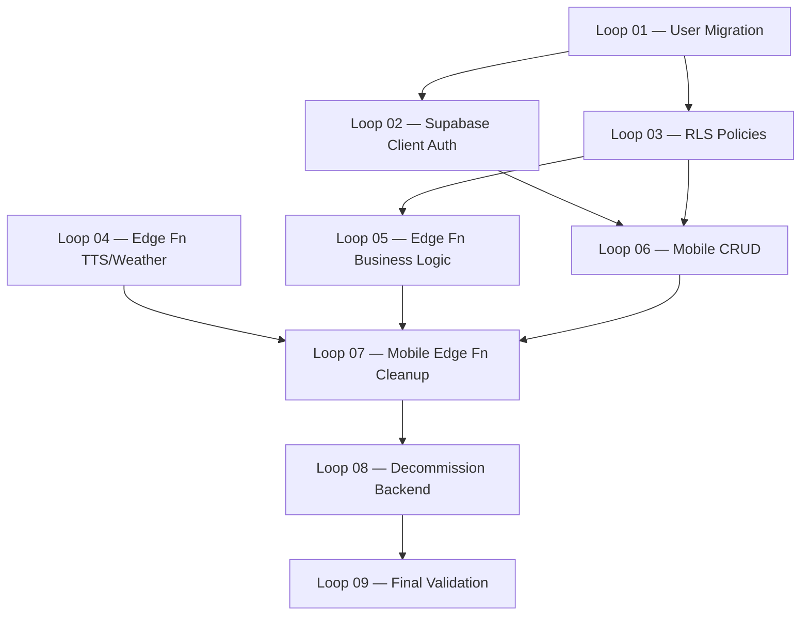

# 🚀 Plano de Migração Total: NestJS ➡️ Supabase Nativo

## ✅ MIGRAÇÃO CONCLUÍDA — 2026-04-25

Todos os 9 loops foram executados com sucesso. O backend NestJS foi completamente descomissionado. O mobile agora consome Supabase diretamente (Auth, DB+RLS, Storage, Edge Functions). Validação final confirmou zero regressões de segurança e build limpo.

---

Este plano detalha a estratégia para descomissionar completamente o backend em NestJS (`packages/backend`) e fazer a transição do app Mobile (`packages/mobile`) para consumir o **Supabase de forma direta e nativa**.

A nova arquitetura será: **Mobile (Expo) ↔ Supabase (Auth, Database RLS, Storage, Edge Functions)**.

---

## 📊 Status da Migração

| Campo | Valor |
|-------|-------|
| **Relatório de Análise** | [`Docs/Migration/00_MIGRATION_AUDIT.md`](./Migration/00_MIGRATION_AUDIT.md) |
| **Memória Ralph** | [`Docs/Migration/RALPH_MEMORY.md`](./Migration/RALPH_MEMORY.md) |
| **Total de Loops** | 9 |
| **Status Geral** | ✅ MIGRAÇÃO CONCLUÍDA — 2026-04-25 |

---

## 🔁 Loops de Execução

| Loop | Arquivo | Escopo | Esforço | Pré-Req |
|------|---------|--------|---------|---------|
| 01 | [`LOOP_01_user_migration.md`](./Migration/LOOP_01_user_migration.md) | Migração de utilizadores (bcrypt → auth.users) | 4-6h | Nenhum |
| 02 | [`LOOP_02_supabase_client_auth.md`](./Migration/LOOP_02_supabase_client_auth.md) | Supabase Client & Auth nativa no Mobile | 3-4h | Loop 01 |
| 03 | [`LOOP_03_rls_policies.md`](./Migration/LOOP_03_rls_policies.md) | RLS Policies (modelo cuidador/idoso) | 6-8h | Loop 01 |
| 04 | [`LOOP_04_edge_functions_tts_weather.md`](./Migration/LOOP_04_edge_functions_tts_weather.md) | Edge Functions: TTS (3 provedores) & Weather | 6-8h | Nenhum |
| 05 | [`LOOP_05_edge_functions_business_logic.md`](./Migration/LOOP_05_edge_functions_business_logic.md) | Edge Functions: Caregiver, Service Requests, Notifications | 4-6h | Loop 03 |
| 06 | [`LOOP_06_mobile_crud_refactor.md`](./Migration/LOOP_06_mobile_crud_refactor.md) | Refatoração Mobile: CRUD direto Supabase | 8-12h | Loops 02, 03 |
| 07 | [`LOOP_07_mobile_edge_functions_cleanup.md`](./Migration/LOOP_07_mobile_edge_functions_cleanup.md) | Mobile: Edge Functions & remover axios | 3-4h | Loops 04, 05, 06 |
| 08 | [`LOOP_08_decommission_backend.md`](./Migration/LOOP_08_decommission_backend.md) | Descomissionamento do Backend NestJS | 2-3h | Loop 07 |
| 09 | [`LOOP_09_final_validation.md`](./Migration/LOOP_09_final_validation.md) | Validação Final & Smoke Tests | 3-4h | Loop 08 |

**Total estimado:** ~40-55 horas

---

## 🗺️ Grafo de Dependências entre Loops



**Nota:** Loop 04 pode ser executado em paralelo com Loops 01-03.

---

## 🏗️ Arquitetura

**ANTES (Atual):**
```
Mobile (Expo) → axios → NestJS (Vercel) → SERVICE_ROLE_KEY → Supabase DB
```

**DEPOIS (Alvo):**
```
Mobile (Expo) → @supabase/supabase-js → Supabase Auth + DB (RLS) + Storage
Mobile (Expo) → supabase.functions.invoke() → Edge Functions (secrets protegidos)
```

---

## 📋 Mapeamento de Serviços — Destino Final

| Serviço Backend | Destino | Loop |
|-----------------|---------|------|
| `auth.service.ts` | Supabase Auth nativo | 01, 02 |
| `caregiver.service.ts` | Edge Function `caregiver-link` | 05 |
| `voice.service.ts` | Edge Function `voice-tts` | 04 |
| `weather.service.ts` | Edge Function `weather-get` | 04 |
| `notifications.service.ts` | Edge Function `notification-register` | 05 |
| `service-requests.service.ts` | Edge Function `service-request-validate` | 05 |
| `medications.service.ts` | Cliente direto + RLS | 03, 06 |
| `offerings.service.ts` | Cliente direto + RLS | 03, 06 |
| `contacts.service.ts` | Cliente direto + RLS | 03, 06 |
| `agenda.service.ts` | Cliente direto + RLS | 03, 06 |
| `elderly.service.ts` | Cliente direto + RLS | 03, 06 |
| `categories.service.ts` | Cliente direto + RLS (público) | 03, 06 |
| `interactions.service.ts` | Cliente direto + RLS | 03, 06 |
| `supabase.service.ts` | **Eliminado** | 08 |

---

## ⚖️ Prós e Contras da Migração

**Vantagens:**
- **Custos Reduzidos:** Edge functions cobram por execução e são extremamente baratas. Não precisa manter um servidor Node/Nest ligado 24/7.
- **Menos Código:** O boilerplate de controllers, modules, DTOs e services do NestJS é eliminado.
- **Segurança Nativa:** RLS no Postgres é mais robusto e performático do que validações de middleware.
- **Realtime / Offline Sync:** A SDK do Supabase já expõe websockets e cache de forma transparente, facilitando features futuras.

**Riscos Identificados:**
1. **Migração de Utilizadores (R1):** Hashes bcrypt precisam ser migrados para `auth.users`. Sem script, todos perdem acesso.
2. **RLS para Modelo Cuidador/Idoso (R2):** Policies precisam de JOINs na `caregiverlink`. Mais complexo que `auth.uid() = user_id`.
3. **Google Cloud TTS em Deno (R3):** SDK Node.js não funciona em Deno. Usar REST API diretamente.
4. **Lógica de Negócio Complexa:** Caregiver link (rate-limiting), service requests (conflitos) não podem ir para o cliente.
5. **Volume de Alterações Mobile:** Chamadas axios espalhadas por 20+ telas/componentes.

> Ver detalhes completos em [`00_MIGRATION_AUDIT.md`](./Migration/00_MIGRATION_AUDIT.md)
