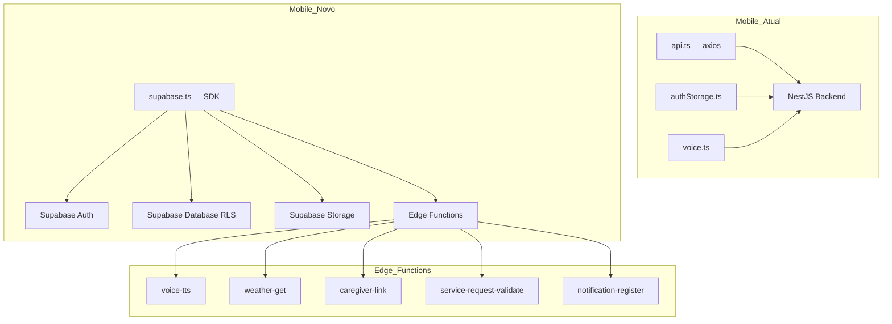

# 🚀 Relatório de Análise — Migração NestJS ➡️ Supabase Nativo

**Data:** 2026-04-25  
**Escopo:** Monorepo completo (`packages/backend`, `packages/mobile`, `supabase/`)  
**Metodologia:** Análise de viabilidade técnica + mapeamento de serviços + riscos  
**Auditor:** Migration Analyst Agent

---

## 📊 Resumo Executivo

| Campo | Valor |
|-------|-------|
| **Arquitetura Atual** | Mobile (Expo) → NestJS (Vercel) → Supabase (SERVICE_ROLE_KEY) |
| **Arquitetura Alvo** | Mobile (Expo) ↔ Supabase (Auth, RLS, Storage, Edge Functions) |
| **Backend Services** | 14 services, 14 controllers, 8 módulos |
| **Mobile Services** | 2 ficheiros (`api.ts`, `voice.ts`) + chamadas espalhadas em telas |
| **Tabelas com RLS** | 13 (já habilitado via migration 0002) |
| **Policies RLS** | 1 existente (categorias leitura pública) — faltam ~40+ |
| **Edge Functions Existentes** | 0 |
| **Loops Planejados** | 9 |

---

## 🔴 RISCO CRÍTICO — Migração de Utilizadores

### R1. Utilizadores Existentes Perdem Acesso

> [!CAUTION]
> O auth atual usa bcrypt com hashes armazenados na tabela `user` (NÃO em `auth.users` do Supabase). Migrar para Supabase Auth sem script de migração = **todos os utilizadores perdem acesso**.

**Onde:** [auth.service.ts](file:///d:/VS%20Code/99-Pai/packages/backend/src/auth/auth.service.ts)

```typescript
const hashedPassword = await bcrypt.hash(password, 12); // Armazenado em tabela "user"
const isPasswordValid = await bcrypt.compare(password, user.password); // Leitura da tabela "user"
```

**Impacto:** Perda total de acesso para todos os utilizadores existentes.

**Remediação:** Loop 01 — Script de migração usando a API Admin do Supabase para importar utilizadores com hashes bcrypt preservados.

---

### R2. Modelo Cuidador/Idoso Complexo para RLS

> [!CAUTION]
> Quase todos os services usam `CaregiverService.verifyAccess()` para validar se um cuidador tem permissão de acessar dados de um idoso. Isso é MUITO mais complexo que o simples `auth.uid() = user_id` mencionado no plano original.

**Onde:** [caregiver.service.ts](file:///d:/VS%20Code/99-Pai/packages/backend/src/caregiver/caregiver.service.ts)

**Serviços afetados:** medications, contacts, agenda, offerings, service-requests (todos dependem de `CaregiverService`).

**Remediação:** Loop 03 — RLS policies com JOINs na tabela `caregiverlink`.

---

### R3. Google Cloud TTS SDK Incompatível com Deno

> [!WARNING]
> O `@google-cloud/text-to-speech` é um SDK Node.js que **não funciona em Deno** (runtime das Edge Functions). A cadeia de fallback de 3 provedores precisa de adaptação.

**Onde:** [voice.service.ts](file:///d:/VS%20Code/99-Pai/packages/backend/src/voice/voice.service.ts) (341 linhas)

**Remediação:** Loop 04 — Substituir SDK Google Cloud por chamadas REST diretas na Edge Function.

---

## 📋 Mapeamento Completo de Serviços

| Serviço Backend | Linhas | Destino na Migração | Complexidade | Loop |
|-----------------|--------|---------------------|-------------|------|
| `auth.service.ts` | 229 | Supabase Auth nativo | 🔴 Alta | 01, 02 |
| `caregiver.service.ts` | 381 | Edge Function (rate-limiting, linkCode) | 🔴 Alta | 05 |
| `voice.service.ts` | 341 | Edge Function `voice-tts` | 🔴 Alta | 04 |
| `medications.service.ts` | 357 | Cliente direto + RLS | 🟠 Média | 03, 06 |
| `offerings.service.ts` | 411 | Cliente direto + RLS | 🟠 Média | 03, 06 |
| `contacts.service.ts` | 288 | Cliente direto + RLS | 🟠 Média | 03, 06 |
| `service-requests.service.ts` | 259 | Edge Function (validação conflitos) | 🟠 Média | 05 |
| `categories.service.ts` | 193 | Cliente direto + RLS (leitura pública) | 🟢 Baixa | 03, 06 |
| `agenda.service.ts` | 198 | Cliente direto + RLS | 🟠 Média | 03, 06 |
| `weather.service.ts` | 154 | Edge Function `weather-get` | 🟡 Média | 04 |
| `elderly.service.ts` | 148 | Cliente direto + RLS | 🟡 Média | 03, 06 |
| `interactions.service.ts` | 50 | Cliente direto + RLS | 🟢 Baixa | 03, 06 |
| `notifications.service.ts` | 70 | Edge Function (push tokens) | 🟡 Média | 05 |
| `supabase.service.ts` | 28 | **Eliminado** (substituído pelo cliente direto) | — | 08 |

---

## 🗺️ Mapa de Dependências — O Que Muda Onde



---

## 📦 Dependências a Instalar no Mobile

| Pacote | Status Atual | Ação |
|--------|-------------|------|
| `@supabase/supabase-js` | ❌ Não instalado | Instalar |
| `@react-native-async-storage/async-storage` | ✅ Já instalado (2.2.0) | Nenhuma |
| `axios` | ✅ Instalado (^1.13.6) | Remover no Loop 07 |

---

## 📊 Progresso Existente (Já Feito)

| Item | Status | Referência |
|------|--------|-----------|
| RLS habilitado em 13 tabelas | ✅ | `0002_enable_rls.sql` |
| Permissões service_role corrigidas | ✅ | `0003_fix_service_role_schema_permissions.sql` |
| LinkCode security (expiração, lock) | ✅ | `0004_harden_link_code_security.sql` |
| TTS storage bucket com policies | ✅ | `0005_tts_storage_bucket.sql` |
| Column defaults (gen_random_uuid, now()) | ✅ | `0006_add_column_defaults.sql` |
| Policy leitura pública categorias | ✅ | `0002_enable_rls.sql` |
| Security hardening Ralph (9 loops) | ✅ | `Docs/Ralph/` |

---

## ⚖️ Análise de Viabilidade

**Viável?** Sim, com ressalvas.

**Estimativa total:** ~40-60 horas de desenvolvimento

**Vantagens confirmadas:**
- Eliminação do backend NestJS (hosting, manutenção, cold starts na Vercel)
- Custo reduzido (Edge Functions cobram por execução)
- Segurança nativa com RLS (mais robusto que middleware)
- Simplificação do monorepo

**Riscos confirmados:**
1. Migração de utilizadores é a etapa mais crítica e arriscada
2. RLS para modelo cuidador/idoso requer SQL complexo com JOINs
3. Google Cloud TTS SDK não funciona em Deno — precisa de REST API
4. Lógica de negócio complexa (caregiver link, service requests) precisa de Edge Functions, não vai direto para o cliente
5. Chamadas axios podem estar espalhadas por mais de 20 telas/componentes no mobile

---

## 🔁 Plano de Loops

| Loop | Nome | Escopo | Esforço | Pré-Req |
|------|------|--------|---------|---------|
| 01 | Migração de Utilizadores para Supabase Auth | Script de migração bcrypt → auth.users | 4-6h | Nenhum |
| 02 | Supabase Client & Auth Nativa no Mobile | supabase.ts, auth flow, remover authStorage | 3-4h | Loop 01 |
| 03 | RLS Policies Completas | Policies para 13 tabelas (modelo cuidador/idoso) | 6-8h | Loop 01 |
| 04 | Edge Functions: TTS & Weather | voice-tts (3 provedores), weather-get | 6-8h | Nenhum |
| 05 | Edge Functions: Lógica de Negócio | caregiver-link, service-requests, notifications | 4-6h | Loop 03 |
| 06 | Refatoração Mobile: CRUD Direto | Substituir axios por supabase.from() em todas as telas | 8-12h | Loops 02, 03 |
| 07 | Refatoração Mobile: Edge Functions & Limpeza | Conectar mobile às Edge Functions, remover axios | 3-4h | Loops 04, 05, 06 |
| 08 | Descomissionamento do Backend NestJS | Deletar packages/backend, limpar scripts, Vercel | 2-3h | Loop 07 |
| 09 | Validação Final & Smoke Tests | Teste completo de todos os fluxos, regressão | 3-4h | Loop 08 |

**Total estimado:** ~40-55 horas
